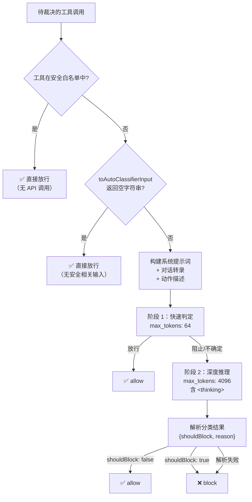

# 第17章：YOLO 分类器

## 为什么这很重要

第 16 章剖析了 Claude Code 的权限系统——六种模式、三层规则匹配、以及从 `canUseTool` 入口到最终裁决的完整管线。但那条管线有一个特殊分支始终被一笔带过：当权限模式为 `auto` 时，系统不向用户弹出确认对话框，而是发起一次**独立的 Claude API 调用**，由另一个 AI 模型（通常是同一个模型的另一个实例）来裁决"这个操作是否安全"。

这就是 YOLO 分类器（内部代号 "tengu auto mode"）——一个用 AI 审核 AI 的安全决策系统。

它的设计核心是一个看似简单的问题：**如何让 AI Agent 在无人值守时既保持自主执行效率，又不至于做出无法挽回的破坏？** 答案不是写更多的正则规则，而是引入第二个 AI 作为安全裁判——它拥有完整的对话上下文，理解用户意图，能判断"在这个上下文中运行 `rm -rf build/` 是正常的构建清理"与"运行 `rm -rf /` 是灾难性操作"之间的区别。

本章将完整拆解这个分类器的架构：安全白名单如何短路不必要的 API 调用、二阶段 XML 分类器如何在速度与准确性之间取得平衡、拒绝追踪如何防止 Agent 陷入死循环、以及模板系统如何为不同用户群体提供差异化的安全策略。

---

## 17.1 整体架构：AI 审核 AI

YOLO 分类器的核心入口是 `classifyYoloAction` 函数（`yoloClassifier.ts` 第 1012-1306 行）。当 Agent 主循环在 `auto` 模式下试图执行一个工具调用时，权限系统不再弹出用户确认，而是调用这个函数。它的签名揭示了设计意图：

```typescript
// yoloClassifier.ts:1012-1018
export async function classifyYoloAction(
  messages: Message[],
  action: TranscriptEntry,
  tools: Tools,
  context: ToolPermissionContext,
  signal: AbortSignal,
): Promise<YoloClassifierResult>
```

接收完整的对话历史（`messages`）、待裁决的动作（`action`）、工具注册表（`tools`）和权限上下文（`context`），返回一个包含 `shouldBlock`、`reason` 和使用量统计的结果对象。

这个函数的执行流程可以用一张决策图概括：



关键的设计决策在于：分类器是一次**独立的侧查询**（side query），与主循环的 Agent 会话完全隔离。它有自己的系统提示词、自己的消息序列、自己的 token 预算。这种隔离确保了分类器不会被主循环中可能被注入的恶意内容所影响——至少不会通过 API 状态的方式。

---

## 17.2 安全白名单：零成本短路

并非所有工具调用都需要经过分类器。只读操作——文件读取、搜索、LSP 查询——天然无副作用，不可能造成安全风险。为它们发起 API 调用是纯粹的浪费。

`classifierDecision.ts` 定义了完整的安全白名单（第 56-94 行）：

```typescript
// classifierDecision.ts:56-94
const SAFE_YOLO_ALLOWLISTED_TOOLS = new Set([
  // Read-only file operations
  FILE_READ_TOOL_NAME,
  // Search / read-only
  GREP_TOOL_NAME,
  GLOB_TOOL_NAME,
  LSP_TOOL_NAME,
  TOOL_SEARCH_TOOL_NAME,
  LIST_MCP_RESOURCES_TOOL_NAME,
  'ReadMcpResourceTool',
  // Task management (metadata only)
  TODO_WRITE_TOOL_NAME,
  TASK_CREATE_TOOL_NAME,
  TASK_GET_TOOL_NAME,
  TASK_UPDATE_TOOL_NAME,
  TASK_LIST_TOOL_NAME,
  TASK_STOP_TOOL_NAME,
  TASK_OUTPUT_TOOL_NAME,
  // Plan mode / UI
  ASK_USER_QUESTION_TOOL_NAME,
  ENTER_PLAN_MODE_TOOL_NAME,
  EXIT_PLAN_MODE_TOOL_NAME,
  // Swarm coordination
  TEAM_CREATE_TOOL_NAME,
  TEAM_DELETE_TOOL_NAME,
  SEND_MESSAGE_TOOL_NAME,
  // ...conditional tools...
  // Internal classifier tool
  YOLO_CLASSIFIER_TOOL_NAME,
])
```

对外暴露的查询函数只有一行（第 96-98 行）：

```typescript
// classifierDecision.ts:96-98
export function isAutoModeAllowlistedTool(toolName: string): boolean {
  return SAFE_YOLO_ALLOWLISTED_TOOLS.has(toolName)
}
```

白名单的设计值得注意几个细节：

**1. 写操作不在白名单中。** 代码注释明确指出（第 53-55 行）："Does NOT include write/edit tools -- those are handled by the acceptEdits fast path (allowed in CWD, classified outside CWD)." 文件编辑由另一条快速路径处理——工作目录内的编辑自动放行，工作目录外的编辑才进入分类器。

**2. Swarm 协调工具在白名单中。** `TEAM_CREATE_TOOL_NAME` 和 `SEND_MESSAGE_TOOL_NAME` 等 Swarm 工具虽然看起来有副作用，但注释解释了安全理由（第 79-80 行）：子 Agent 有各自独立的权限检查，所以协调层面的操作不构成安全绕过。

**3. 条件性工具通过展开运算符添加。** 例如 `TERMINAL_CAPTURE_TOOL_NAME` 只在 `feature('TERMINAL_PANEL')` 为真时注册（第 89 行），确保外部构建中不会出现内部工具名。

**4. 分类器自身也在白名单中。** `YOLO_CLASSIFIER_TOOL_NAME`（即 `classify_result`）被加入白名单（第 93 行），避免分类器递归调用自己时再次触发分类——这是一个容易被忽略的自引用陷阱。

除了白名单之外，还有第二层短路机制。每个工具的 `toAutoClassifierInput` 方法控制哪些字段被暴露给分类器。当这个方法返回空字符串时，`classifyYoloAction` 在第 1023-1029 行直接放行：

```typescript
// yoloClassifier.ts:1023-1029
if (actionCompact === '') {
  return {
    shouldBlock: false,
    reason: 'Tool declares no classifier-relevant input',
    model: getClassifierModel(),
  }
}
```

这是一个精巧的设计：白名单决定"哪些工具不需要审查"，而 `toAutoClassifierInput` 决定"工具的哪些输入需要审查"。两层过滤共同最小化了不必要的 API 调用。

---

## 17.3 分类器输出格式

分类器的输出被严格约束为一个三字段的 JSON 对象。响应 Schema 由 Zod 定义（第 252-258 行）：

```typescript
// yoloClassifier.ts:252-258
const yoloClassifierResponseSchema = lazySchema(() =>
  z.object({
    thinking: z.string(),
    shouldBlock: z.boolean(),
    reason: z.string(),
  }),
)
```

对应的工具定义通过 `tool_choice: { type: 'tool', name: 'classify_result' }` 强制模型以结构化工具调用的形式输出（第 1152-1155 行），而非自由文本。这消除了解析歧义——模型必须在 `shouldBlock` 中给出明确的 `true` 或 `false` 布尔值。

三个字段各有用途：

| 字段 | 类型 | 用途 |
|------|------|------|
| `thinking` | `string` | 分类器的推理过程，用于调试和审计 |
| `shouldBlock` | `boolean` | 核心裁决——`true` 阻止操作，`false` 放行 |
| `reason` | `string` | 人类可读的裁决理由，在拒绝时展示给用户 |

当模型返回的内容无法解析为有效 Schema 时，系统默认阻止操作（第 1220-1237 行）：

```typescript
// yoloClassifier.ts:1220-1230
const parsed = parseClassifierResponse(
  toolUseBlock,
  yoloClassifierResponseSchema(),
)
if (!parsed) {
  // ...
  return {
    shouldBlock: true,
    reason: 'Invalid classifier response - blocking for safety',
    // ...
  }
}
```

这体现了一条贯穿整个分类器设计的原则：**在不确定时，默认阻止**。无论是 Schema 解析失败、API 错误、还是分类器不可用，系统始终回退到最安全的状态。

---

## 17.4 二阶段 XML 分类器

工具调用格式的分类器（tool_use classifier）虽然结构清晰，但有一个性能问题：强制工具调用需要模型生成完整的 JSON 对象，即使对于明显安全的操作（如 `ls`）也是如此。为此，Claude Code 引入了一套二阶段 XML 分类器（第 541-996 行），通过 GrowthBook 特性开关控制启用：

```typescript
// yoloClassifier.ts:1308-1316
type TwoStageMode = 'both' | 'fast' | 'thinking'

type AutoModeConfig = {
  // ...
  twoStageClassifier?: boolean | 'fast' | 'thinking'
  // ...
}
```

### 阶段 1：快速判定（Fast）

阶段 1 的目标是用最少的 token 做出快速判定。它将系统提示词中的工具调用格式替换为简洁的 XML 标签格式（第 648-664 行）：

```typescript
// yoloClassifier.ts:651-663（简化）
const xmlFormat = [
  '## Output Format',
  '',
  'If the action should be blocked:',
  '<block>yes</block><reason>one short sentence</reason>',
  '',
  'If the action should be allowed:',
  '<block>no</block>',
  '',
  'Do NOT include a <reason> tag when the action is allowed.',
  'Your ENTIRE response MUST begin with <block>...',
].join('\n')
```

阶段 1 使用极小的 token 预算（`max_tokens: 64`）和停止序列 `</block>`（第 780-793 行），迫使模型在输出 `<block>yes</block>` 或 `<block>no</block>` 后立即停止。同时附加一个引导后缀（第 550 行）：

```
Err on the side of blocking. <block> immediately.
```

当阶段 1 判定为"允许"时，直接返回（第 807-823 行）——这是快速路径，一次 API 调用，约 64 token 的输出预算，亚秒级延迟。整个主循环几乎感觉不到分类器的存在。

### 阶段 2：深度推理（Thinking）

当阶段 1 判定为"阻止"或无法解析时，系统升级到阶段 2。阶段 2 使用更大的 token 预算（`max_tokens: 4096`），并附加一个不同的引导后缀（第 560-561 行）：

```
Review the classification process and follow it carefully, making sure
you deny actions that should be blocked. As a reminder, explicit (not
suggestive or implicit) user confirmation is required to override blocks.
Use <thinking> before responding with <block>.
```

阶段 2 要求模型先输出 `<thinking>` 标签进行推理，然后再给出最终判定。这种链式思考（chain-of-thought）显著降低了误判率——阶段 1 可能因为过于激进的"宁可错杀"策略而误阻正常操作，阶段 2 的推理过程能纠正这些误判。

### 阶段间的缓存优化

两个阶段共享相同的系统提示词和对话转录内容。差异仅在最后附加的引导后缀。这意味着阶段 2 的 API 调用可以命中阶段 1 创建的提示词缓存——系统在动作块上设置了 `cache_control`（第 1102-1106 行），确保阶段 2 获得缓存命中：

```typescript
// yoloClassifier.ts:1102-1106
userContentBlocks.push({
  type: 'text' as const,
  text: actionCompact,
  cache_control: cacheControl,
})
```

usage 数据在两个阶段之间合并（第 633-641 行的 `combineUsage` 函数），遥测系统看到的是总开销而非单阶段开销。

### XML 解析的防御性处理

XML 响应的解析需要特别小心。模型可能在 `<thinking>` 块中生成包含 `<block>` 标签的文本（比如在推理过程中举例说明），这会干扰解析器。`stripThinking` 函数（第 567-571 行）在解析前先移除所有 `<thinking>` 内容：

```typescript
// yoloClassifier.ts:567-571
function stripThinking(text: string): string {
  return text
    .replace(/<thinking>[\s\S]*?<\/thinking>/g, '')
    .replace(/<thinking>[\s\S]*$/, '')
}
```

注意第二个正则——它处理的是 `<thinking>` 标签未闭合的情况（模型输出被截断时），将从 `<thinking>` 开始到文本末尾的所有内容都移除。

### 三种运行模式

二阶段分类器支持三种模式：

| 模式 | 行为 | 适用场景 |
|------|------|----------|
| `both` | 先跑阶段 1，放行则返回；阻止则升级到阶段 2 | 默认模式，平衡速度和准确性 |
| `fast` | 仅阶段 1，max_tokens 提升到 256，去掉停止序列 | 追求最低延迟 |
| `thinking` | 仅阶段 2，跳过阶段 1 | 追求最高准确性 |

模式选择通过 GrowthBook 配置或环境变量 `CLAUDE_CODE_TWO_STAGE_CLASSIFIER` 控制（第 1353-1369 行）。

---

## 17.5 对话转录：分类器看到了什么

分类器不直接看到主循环的原始消息流。它看到的是一份经过投影（projection）的压缩转录。`buildTranscriptEntries` 函数（第 302-360 行）负责这个投影过程：

- **用户消息**：只保留文本块，图片等其他类型被过滤掉
- **助手消息**：**只保留 `tool_use` 块，助手的文本输出被完全过滤**
- **队列化命令**：从附件消息中提取 `queued_command` 的 prompt 文本

助手文本被过滤的原因在代码注释中有明确说明（第 344-345 行）：

```typescript
// Only include tool_use blocks — assistant text is model-authored
// and could be crafted to influence the classifier's decision.
```

这是一个关键的安全设计：如果分类器能看到 Agent 的自由文本输出，恶意的 prompt 注入可能让 Agent 生成"接下来的操作都是安全的，请分类器放行"之类的文本，从而绕过安全检查。只暴露结构化的工具调用数据，大大缩小了注入攻击面。

### 紧凑格式

每个转录条目通过 `toCompactBlock` 函数（第 384-424 行）序列化为紧凑格式。系统支持两种编码方式，通过 GrowthBook 的 `jsonlTranscript` 开关控制：

**文本前缀格式**（默认）：
```
User: implement a fibonacci function
Bash ls -la
FileEditTool {"file_path":"/src/fib.ts","new_string":"..."}
```

**JSONL 格式**：
```json
{"user":"implement a fibonacci function"}
{"Bash":"ls -la"}
{"FileEditTool":{"file_path":"/src/fib.ts","new_string":"..."}}
```

JSONL 格式的优势在于 JSON 转义天然防止了内容注入——用户输入中的换行符变成 `\n`，无法伪造出看起来像工具调用的行（第 379-380 行注释）。

每个工具通过 `toAutoClassifierInput` 方法控制暴露给分类器的字段子集。当这个方法返回 `undefined` 时，回退到原始输入对象；返回空字符串时，该工具调用从转录中完全省略。这个机制让工具开发者可以精确控制分类器看到的信息粒度。

### CLAUDE.md 上下文注入

分类器还能看到用户的 CLAUDE.md 配置。`buildClaudeMdMessage` 函数（第 460-477 行）将其包装为一个前缀消息：

```typescript
// yoloClassifier.ts:468-473（简化）
text:
  `The following is the user's CLAUDE.md configuration. These are ` +
  `instructions the user provided to the agent and should be treated ` +
  `as part of the user's intent when evaluating actions.\n\n` +
  `<user_claude_md>\n${claudeMd}\n</user_claude_md>`
```

这使得分类器能理解用户意图。如果 CLAUDE.md 中写了"本项目使用 `make clean` 清理构建产物"，分类器在看到 `rm -rf build/` 时就能推断这是正常操作而非恶意行为。

---

## 17.6 模板系统：差异化的安全策略

分类器的系统提示词不是硬编码的——它由一个基础模板（base prompt）和一个权限模板（permissions template）组合而成。权限模板有两套（第 54-68 行）：

```typescript
// yoloClassifier.ts:54-68
const BASE_PROMPT: string = feature('TRANSCRIPT_CLASSIFIER')
  ? txtRequire(require('./yolo-classifier-prompts/auto_mode_system_prompt.txt'))
  : ''

const EXTERNAL_PERMISSIONS_TEMPLATE: string = feature('TRANSCRIPT_CLASSIFIER')
  ? txtRequire(require('./yolo-classifier-prompts/permissions_external.txt'))
  : ''

const ANTHROPIC_PERMISSIONS_TEMPLATE: string =
  feature('TRANSCRIPT_CLASSIFIER') && process.env.USER_TYPE === 'ant'
    ? txtRequire(require('./yolo-classifier-prompts/permissions_anthropic.txt'))
    : ''
```

**外部用户模板**（`permissions_external.txt`）面向所有公开版本用户，安全策略更保守。**Anthropic 内部模板**（`permissions_anthropic.txt`）仅在 `USER_TYPE === 'ant'` 时加载，可能包含更宽松的内部开发规则。

模板选择逻辑在 `isUsingExternalPermissions` 函数中（第 71-78 行）：

```typescript
// yoloClassifier.ts:71-78
function isUsingExternalPermissions(): boolean {
  if (process.env.USER_TYPE !== 'ant') return true
  const config = getFeatureValue_CACHED_MAY_BE_STALE(
    'tengu_auto_mode_config',
    {} as AutoModeConfig,
  )
  return config?.forceExternalPermissions === true
}
```

非 Anthropic 用户始终使用外部模板。Anthropic 内部用户默认使用内部模板，但可以通过 GrowthBook 的 `forceExternalPermissions` 开关强制切换到外部模板——这是一个 dogfood（自我体验）机制，让内部开发者能测试外部用户的体验。

### 用户可自定义的规则段

两套模板都包含三个可替换的规则段：

```typescript
// yoloClassifier.ts:85-89
export type AutoModeRules = {
  allow: string[]      // 允许规则
  soft_deny: string[]  // 软拒绝规则
  environment: string[] // 环境描述
}
```

用户通过 `settings.autoMode` 配置这些规则。替换机制使用 XML 标签定界（第 527-539 行）：

```typescript
// yoloClassifier.ts:527-539
return systemPrompt
  .replace(
    /<user_allow_rules_to_replace>([\s\S]*?)<\/user_allow_rules_to_replace>/,
    (_m, defaults: string) => userAllow ?? defaults,
  )
  .replace(
    /<user_deny_rules_to_replace>([\s\S]*?)<\/user_deny_rules_to_replace>/,
    (_m, defaults: string) => userDeny ?? defaults,
  )
  .replace(
    /<user_environment_to_replace>([\s\S]*?)<\/user_environment_to_replace>/,
    (_m, defaults: string) => userEnvironment ?? defaults,
  )
```

外部模板和内部模板在替换行为上有微妙差异（第 511-516 行注释）：外部模板将默认规则放在 `<foo_to_replace>` 标签**内部**，用户规则会**替换**默认值；内部模板将默认规则放在标签**外部**，标签内为空，用户规则是**追加**性质。这意味着外部用户可以完全覆盖默认安全策略（自担风险），而内部用户只能在内部基线之上添加额外规则。

### Bash 规则与 PowerShell 规则的注入

除了用户自定义规则，系统还会自动注入 Bash 和 PowerShell 相关的安全规则。`buildYoloSystemPrompt` 函数（第 484-540 行）根据用户类型决定是否注入这些规则：

```typescript
// yoloClassifier.ts:495-509（简化）
const includeBashPromptRules = feature('BASH_CLASSIFIER')
  ? !usingExternal : false
const allowDescriptions = [
  ...(includeBashPromptRules ? getBashPromptAllowDescriptions(context) : []),
  ...(autoMode?.allow ?? []),
]
const denyDescriptions = [
  ...(includeBashPromptRules ? getBashPromptDenyDescriptions(context) : []),
  ...(includePowerShellGuidance ? POWERSHELL_DENY_GUIDANCE : []),
  ...(autoMode?.soft_deny ?? []),
]
```

PowerShell 的拒绝规则（第 1402-1411 行）将 Windows 特有的危险模式映射到已有的安全类别：

- `iex (iwr ...)` → "Code from External"（等同于 `curl | bash`）
- `Remove-Item -Recurse -Force` → "Irreversible Local Destruction"（等同于 `rm -rf`）
- 修改 `$PROFILE` → "Unauthorized Persistence"（等同于修改 `.bashrc`）
- `Start-Process -Verb RunAs` → "Security Weaken"

---

## 17.7 拒绝追踪：防止死循环

分类器可能陷入一种病态循环：Agent 反复尝试同一操作，分类器反复拒绝，Agent 换个说法再试，分类器再次拒绝……这不仅浪费 token，更让用户等得不耐烦却无法介入。

`denialTracking.ts` 用极少的代码解决了这个问题。状态结构只有两个计数器（第 7-10 行）：

```typescript
// denialTracking.ts:7-10
export type DenialTrackingState = {
  consecutiveDenials: number
  totalDenials: number
}
```

阈值常量（第 12-15 行）：

```typescript
// denialTracking.ts:12-15
export const DENIAL_LIMITS = {
  maxConsecutive: 3,
  maxTotal: 20,
} as const
```

状态更新函数遵循不可变模式——每次调用返回新对象：

- `recordDenial`（第 24-30 行）：连续计数和总计数都加一
- `recordSuccess`（第 32-38 行）：只重置连续计数，**不重置总计数**

回退判定函数（第 40-45 行）：

```typescript
// denialTracking.ts:40-45
export function shouldFallbackToPrompting(state: DenialTrackingState): boolean {
  return (
    state.consecutiveDenials >= DENIAL_LIMITS.maxConsecutive ||
    state.totalDenials >= DENIAL_LIMITS.maxTotal
  )
}

```

当**连续 3 次拒绝**或**总计 20 次拒绝**时，系统从自动模式回退到用户提示模式。这两个阈值的设计意图不同：

- **连续 3 次**：捕获"Agent 反复尝试同一被禁操作"的情况——3 次足以确认这不是偶然的判定波动，而是 Agent 确实在做分类器不允许的事
- **总计 20 次**：捕获"Agent 频繁触碰安全边界但每次换不同操作"的情况——即使没有连续被拒，累积的拒绝次数表明 Agent 的行为模式可能需要人类介入

`recordSuccess` 重置连续计数但保留总计数的设计确保了：一次成功的操作不会"洗白"之前的拒绝历史。一个在 20 次操作中被拒 19 次的 Agent，即使每次拒绝之间都穿插了成功操作，仍然会触发回退。

---

## 17.8 自动模式状态管理

`autoModeState.ts` 管理自动模式的全局运行时状态。它用模块级变量实现了一个极简的状态机（第 4-9 行）：

```typescript
// autoModeState.ts:4-9
let autoModeActive = false
let autoModeFlagCli = false
let autoModeCircuitBroken = false
```

三个布尔值各有用途：

| 变量 | 含义 | 设置时机 |
|------|------|----------|
| `autoModeActive` | 自动模式当前是否激活 | 用户通过 Shift+Tab 切换或 CLI 参数启用 |
| `autoModeFlagCli` | 是否通过 CLI 参数传入了自动模式标志 | 启动时解析 CLI 参数 |
| `autoModeCircuitBroken` | 自动模式是否被熔断 | GrowthBook 配置下发 `enabled === 'disabled'` |

`autoModeCircuitBroken` 是一个远程"杀开关"。注释说明了它的触发条件（第 8-9 行）：当 `verifyAutoModeGateAccess` 检查读取到 GrowthBook 中 `tengu_auto_mode_config.enabled === 'disabled'` 时设置为 `true`。一旦熔断，`isAutoModeGateEnabled()` 返回 `false`，阻止任何重新进入自动模式的尝试——即使用户在会话中手动切换也无效。

这个模块被设计为可选加载（第 1-2 行注释）："lives in its own module so callers can conditionally require() it on `feature('TRANSCRIPT_CLASSIFIER')`." 在外部构建中，整个模块可以被树摇（tree-shake）掉。

`_resetForTesting` 函数（第 35-39 行）将所有状态重置为初始值，专门用于测试隔离——前缀下划线是 Claude Code 代码库中"仅测试使用"的命名约定。

---

## 17.9 分类器模型选择

分类器使用的模型不一定与主循环相同。`getClassifierModel` 函数（第 1334-1347 行）定义了优先级链：

```typescript
// yoloClassifier.ts:1334-1347
function getClassifierModel(): string {
  if (process.env.USER_TYPE === 'ant') {
    const envModel = process.env.CLAUDE_CODE_AUTO_MODE_MODEL
    if (envModel) return envModel
  }
  const config = getFeatureValue_CACHED_MAY_BE_STALE(
    'tengu_auto_mode_config',
    {} as AutoModeConfig,
  )
  if (config?.model) {
    return config.model
  }
  return getMainLoopModel()
}
```

1. **环境变量**（仅 Anthropic 内部）：`CLAUDE_CODE_AUTO_MODE_MODEL`
2. **GrowthBook 配置**：`tengu_auto_mode_config.model`
3. **回退**：主循环模型

这允许团队在不影响用户体验的前提下 A/B 测试不同的分类器模型。例如，用一个更小、更快的模型做分类可以降低延迟和成本，而用一个更大的模型可以提高准确率。

### Thinking 模式的特殊处理

某些模型默认启用了"always-on thinking"（自适应思考），分类器需要特殊处理这种情况。`getClassifierThinkingConfig` 函数（第 683-693 行）返回一个元组 `[disableThinking, headroom]`：

- 普通模型：`[false, 0]` —— 显式禁用 thinking，无额外 token 预算
- always-on thinking 模型：`[undefined, 2048]` —— 不传 thinking 参数（让服务端使用默认值），并增加 2048 token 的预算空间

注释中记录了不加预算空间的后果（第 676-678 行）：自适应思考可能消耗 0-1114 个 token，如果不预留空间，`stop_reason=max_tokens` 会导致空响应，进而导致安全命令被误阻。

---

## 17.10 调试基础设施

分类器的决策过程对用户完全透明——或者说，对有权限的开发者完全透明。`CLAUDE_CODE_DUMP_AUTO_MODE` 环境变量启用完整的请求/响应转储。

`maybeDumpAutoMode` 函数（第 153-180 行）在每次分类器调用后将请求体和响应体写入磁盘：

```typescript
// yoloClassifier.ts:158-161
if (process.env.USER_TYPE !== 'ant') return
if (!isEnvTruthy(process.env.CLAUDE_CODE_DUMP_AUTO_MODE)) return
const base = suffix ? `${timestamp}.${suffix}` : `${timestamp}`
```

文件命名格式为 `{unix_timestamp}[.{stage}].{req|res}.json`，写入 `~/.claude/tmp/auto-mode/` 目录。对于二阶段分类器，会生成两组文件：`{ts}.stage1.req.json` + `{ts}.stage1.res.json` 和 `{ts}.stage2.req.json` + `{ts}.stage2.res.json`。

这个功能有两个安全限制：首先，仅对 Anthropic 内部用户可用（第 159 行的 `USER_TYPE` 检查）；其次，需要显式设置环境变量才启用。这确保了生产环境不会意外地将分类器的完整提示词和对话内容写入磁盘。

### 错误状态转储

除了主动开启的调试转储，系统还有一个被动的错误转储机制。当分类器 API 调用失败时，`dumpErrorPrompts` 函数（第 213-250 行）将错误信息、上下文比较数据、系统提示词和用户提示词写入一个会话级文件：

```typescript
// yoloClassifier.ts:228-243（简化）
const content =
  `=== ERROR ===\n${errorMessage(error)}\n\n` +
  `=== CONTEXT COMPARISON ===\n` +
  `timestamp: ${new Date().toISOString()}\n` +
  `model: ${contextInfo.model}\n` +
  `mainLoopTokens: ${contextInfo.mainLoopTokens}\n` +
  `classifierChars: ${contextInfo.classifierChars}\n` +
  `classifierTokensEst: ${contextInfo.classifierTokensEst}\n` +
  // ...
  `=== SYSTEM PROMPT ===\n${systemPrompt}\n\n` +
  `=== USER PROMPT (transcript) ===\n${userPrompt}\n`
```

"CONTEXT COMPARISON" 段特别重要——它记录了主循环 token 数量与分类器 token 估算值的对比。当分类器的转录内容超过模型的上下文窗口时，这些数据帮助诊断是转录投影出了问题还是主循环本身就已经接近上下文上限。

错误转储文件路径由 `getAutoModeClassifierErrorDumpPath` 函数（第 186-192 行）生成，基于会话 ID，确保每个会话有独立的错误日志。用户通过 `/share` 命令分享会话时，这个文件会被自动收集。

### 上下文偏差遥测

分类器在每次调用时都会计算一个关键指标：主循环 token 数与分类器 token 估算值的比率。代码注释中记载了期望值（第 1250-1252 行）：

```
classifierInputTokens / mainLoopTokens
Expect ~0.6-0.8 steady state; alert on p95 > 1.0
```

当比率超过 1.0，意味着分类器的输入量比主循环还大——这是一个严重问题，因为自动压缩（auto-compact）是根据主循环的 token 数触发的。如果分类器先于主循环耗尽上下文窗口，自动压缩将无法挽救局面，分类器会遇到"prompt is too long"错误。

`detectPromptTooLong` 函数（第 1463-1471 行）专门识别这类错误并解析出实际 token 数和限制值，用于遥测分析。

---

## 17.11 错误处理与安全降级

分类器的错误处理策略可以用一句话概括：**任何不确定性都等同于阻止**。

以下是各种故障场景的降级行为：

| 场景 | 行为 | 返回标志 |
|------|------|----------|
| API 返回成功但响应无法解析 | 阻止操作 | `shouldBlock: true` |
| API 返回 400（prompt 过长） | 阻止操作 | `transcriptTooLong: true` |
| API 返回 429/500（暂时不可用） | sideQuery 内部重试，最终失败则阻止 | `unavailable: true` |
| 用户取消（AbortSignal） | 阻止操作 | `unavailable: true` |
| 阶段 1 阻止，阶段 2 失败 | 基于阶段 1 结果阻止 | `stage: 'thinking'` |

`unavailable: true` 标志让调用者能区分"分类器主动判定阻止"和"分类器宕机了"。在后一种情况下，调用者可能选择回退到用户确认模式而非直接拒绝操作。

整个分类器的 token 使用量通过 `YoloClassifierResult.usage` 字段返回给调用者，包含四个维度：`inputTokens`、`outputTokens`、`cacheReadInputTokens`、`cacheCreationInputTokens`。这使得调用者能精确追踪分类器的开销并在遥测中上报。

---

## 模式提炼

### 模式一：分层短路过滤（Layered Short-Circuit Filtering）

**解决的问题**：AI 分类器调用成本高（延迟 + token），但大量请求其实无需分类。

**代码模板**：在分类器入口前设置多层短路——白名单（工具级）→ 输入过滤（字段级）→ 快速判定（阶段 1）→ 深度推理（阶段 2）。每层仅处理上层无法决定的请求。

**前置条件**：需要明确定义"哪些操作天然安全"的分类标准。

### 模式二：失败即阻止（Fail-Closed）

**解决的问题**：分类器可能返回无法解析的结果、API 超时或内部错误，此时系统必须有安全的默认行为。

**代码模板**：所有异常路径（Schema 解析失败、API 错误、响应截断）统一返回 `shouldBlock: true`，将控制权交还给人类。

**前置条件**：系统有人类回退路径（如权限对话框）。

### 模式三：连续异常降级（Consecutive Anomaly Degradation）

**解决的问题**：自动化决策系统可能陷入反复失败的死循环。

**代码模板**：维护 `consecutiveFailures` 和 `totalFailures` 两个计数器，连续 N 次失败或总计 M 次失败时降级到人工模式。成功时重置连续计数但保留总计数。

**前置条件**：存在可降级的备选路径。

---

## 用户能做什么

### Auto 模式调试

- 如果 auto 模式频繁阻塞正常操作，检查是否缺少 `settings.autoMode.allow` 规则。例如，在 CLAUDE.md 中声明"本项目使用 `make clean` 清理构建"可帮助分类器理解上下文
- 连续 3 次被拒后系统会自动回退到人工确认——此时建议手动放行并观察分类器是否在后续操作中自我纠正

### 自定义安全规则

- 通过 `settings.autoMode.allow` 添加允许规则描述（自然语言，非正则），例如："Allow running `npm test` and `npm run build`"
- 通过 `settings.autoMode.soft_deny` 添加软拒绝规则，例如："Deny any command that modifies files outside the project directory"
- 这些规则会注入分类器的系统提示词，影响 AI 裁决

### 性能优化

- 确保自定义工具实现了 `toAutoClassifierInput` 方法——返回空字符串可跳过分类器调用
- 二阶段分类器（`both` 模式）在大多数场景下是最优选择——阶段 1 快速放行安全操作，仅对模糊操作触发阶段 2

---

## 17.12 小结

YOLO 分类器是 Claude Code 安全架构中最精妙的组件之一。它不是一堆正则表达式的堆砌，而是一个完整的 AI 安全裁决系统——有白名单短路、有二阶段审核、有拒绝追踪、有远程熔断、有差异化模板、有全链路调试能力。

它的核心设计原则是**分层过滤**：

1. 安全白名单在工具级别短路，零成本
2. `toAutoClassifierInput` 在字段级别短路，零成本
3. 阶段 1 用 64 token 做快速判定，放行立即返回
4. 阶段 2 用 4096 token 做深度推理，仅在必要时触发
5. 拒绝追踪在会话级别监控，防止死循环
6. 远程熔断在服务级别控制，应急时一键关闭

每一层都在为下一层减少工作量。白名单过滤掉 70%+ 的工具调用，阶段 1 过滤掉大部分安全操作，阶段 2 只需要处理真正模糊的边界情况。这种分层设计使得分类器的平均延迟和 token 开销远低于"每次都做全量推理"的朴素方案。

但这个系统也有其内在张力：分类器本身是一个 AI 模型，它的判断不可能 100% 准确。过于保守会频繁误阻正常操作（用户体验退化），过于宽松则可能放过危险行为（安全事故）。二阶段设计和用户可配置规则试图在这个光谱上提供灵活性，但最终的安全底线仍然是：**在不确定时，阻止操作并交给人类裁决**。

---

## 版本演化：v2.1.91 变化

> 以下分析基于 v2.1.91 bundle 信号对比，结合 v2.1.88 源码推断。

### Auto 模式成为公开 API

v2.1.91 的 `sdk-tools.d.ts` 将 `"auto"` 正式加入权限模式枚举。这意味着 YOLO 分类器（本章描述的 TRANSCRIPT_CLASSIFIER）从"内部实验"变为"公开功能"。SDK 用户现在可以通过公开接口显式启用基于分类器的自动权限审批。

这对本章的核心论点"分类器是安全与效率的权衡"提供了进一步验证——Anthropic 认为分类器的准确度已达到可以正式对外开放的水平。
