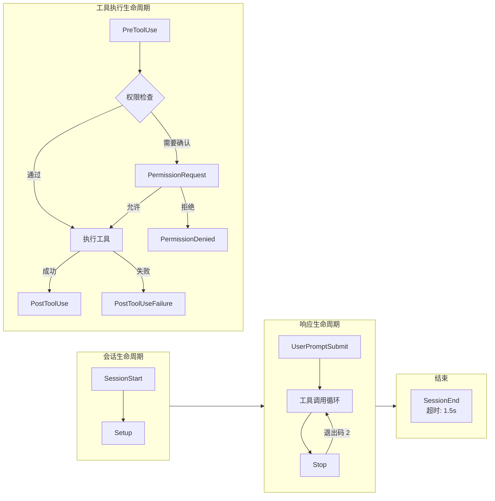

# 第18章：Hooks — 用户自定义拦截点

## 为什么这很重要

Claude Code 的权限系统（第16章）和 YOLO 分类器（第17章）提供了内置的安全防线，但它们都是"预设好的"——用户无法在工具执行流水线的关键节点插入自己的逻辑。Hooks 系统填补了这个空白：它允许用户在 AI Agent 生命周期的 26 个事件点注册自定义的 Shell 命令、LLM 提示词、HTTP 请求或 Agent 验证器，实现从"格式检查"到"自动部署"的任意工作流定制。

这不是一个简单的"回调函数"机制。Hooks 系统必须解决四个核心难题：信任——任意命令执行的安全边界在哪里？超时——Hook 挂死时如何防止阻塞整个 Agent 循环？语义——Hook 的退出码如何转化为"允许"或"阻塞"决策？以及配置隔离——多来源的 Hook 配置如何合并而不互相干扰？

本章将从源码层面完整剖析这套机制。

### Hook 事件生命周期总览



---

## 18.1 Hook 事件类型完整清单

Hooks 系统支持 26 种事件类型，定义在 `hooksConfigManager.ts` 的 `getHookEventMetadata` 函数中（第 28-264 行）。按生命周期阶段可分为五组：

### 工具执行生命周期

| 事件 | 触发时机 | matcher 字段 | 退出码 2 的行为 |
|------|----------|-------------|----------------|
| `PreToolUse` | 工具执行前 | `tool_name` | 阻塞工具调用，stderr 发送给模型 |
| `PostToolUse` | 工具执行成功后 | `tool_name` | stderr 立即发送给模型 |
| `PostToolUseFailure` | 工具执行失败后 | `tool_name` | stderr 立即发送给模型 |
| `PermissionRequest` | 权限对话框显示时 | `tool_name` | 使用 Hook 决策 |
| `PermissionDenied` | auto 模式分类器拒绝工具调用后 | `tool_name` | — |

`PreToolUse` 是最常用的 Hook 点。它的 `hookSpecificOutput` 支持三种权限决策（第 72-78 行，`types/hooks.ts`）：

```typescript
// types/hooks.ts:72-78
z.object({
  hookEventName: z.literal('PreToolUse'),
  permissionDecision: permissionBehaviorSchema().optional(),
  permissionDecisionReason: z.string().optional(),
  updatedInput: z.record(z.string(), z.unknown()).optional(),
  additionalContext: z.string().optional(),
})
```

注意 `updatedInput` 字段——Hook 不仅可以决定"是否允许"，还可以修改工具的输入参数。这使得"重写命令"成为可能：比如在所有 `git push` 前自动添加 `--no-verify`。

### 会话生命周期

| 事件 | 触发时机 | matcher 字段 | 特殊行为 |
|------|----------|-------------|----------|
| `SessionStart` | 新会话/恢复/清空/压缩时 | `source` (startup/resume/clear/compact) | stdout 发送给 Claude，阻塞错误被忽略 |
| `SessionEnd` | 会话结束时 | `reason` (clear/logout/prompt_input_exit/other) | 超时仅 1.5 秒 |
| `Setup` | 仓库初始化和维护时 | `trigger` (init/maintenance) | stdout 发送给 Claude |
| `Stop` | Claude 即将结束响应前 | — | 退出码 2 让对话继续 |
| `StopFailure` | API 错误导致回合结束时 | `error` (rate_limit/authentication_failed/...) | fire-and-forget |
| `UserPromptSubmit` | 用户提交提示词时 | — | 退出码 2 阻塞处理并擦除原始提示词 |

`SessionStart` Hook 有一个独特的能力：通过 `CLAUDE_ENV_FILE` 环境变量，Hook 可以将 bash export 语句写入指定文件，这些环境变量会在后续所有 BashTool 命令中生效（第 917-926 行，`hooks.ts`）：

```typescript
// hooks.ts:917-926
if (
  !isPowerShell &&
  (hookEvent === 'SessionStart' ||
    hookEvent === 'Setup' ||
    hookEvent === 'CwdChanged' ||
    hookEvent === 'FileChanged') &&
  hookIndex !== undefined
) {
  envVars.CLAUDE_ENV_FILE = await getHookEnvFilePath(hookEvent, hookIndex)
}
```

### 多 Agent 生命周期

| 事件 | 触发时机 | matcher 字段 |
|------|----------|-------------|
| `SubagentStart` | 子 Agent 启动时 | `agent_type` |
| `SubagentStop` | 子 Agent 即将结束响应前 | `agent_type` |
| `TeammateIdle` | 队友即将进入空闲状态 | — |
| `TaskCreated` | 任务创建时 | — |
| `TaskCompleted` | 任务完成时 | — |

### 文件与配置变更

| 事件 | 触发时机 | matcher 字段 |
|------|----------|-------------|
| `FileChanged` | 被监听文件变更时 | 文件名 (e.g. `.envrc\|.env`) |
| `CwdChanged` | 工作目录变更后 | — |
| `ConfigChange` | 配置文件在会话期间变更时 | `source` (user_settings/project_settings/...) |
| `InstructionsLoaded` | CLAUDE.md 或规则文件加载时 | `load_reason` (session_start/path_glob_match/...) |

### 压缩、MCP 交互与 Worktree

| 事件 | 触发时机 | matcher 字段 |
|------|----------|-------------|
| `PreCompact` | 对话压缩前 | `trigger` (manual/auto) |
| `PostCompact` | 对话压缩后 | `trigger` (manual/auto) |
| `Elicitation` | MCP 服务器请求用户输入时 | `mcp_server_name` |
| `ElicitationResult` | 用户响应 MCP elicitation 后 | `mcp_server_name` |
| `WorktreeCreate` | 创建隔离工作树时 | — |
| `WorktreeRemove` | 移除工作树时 | — |

---

## 18.2 四种 Hook 类型

Hooks 系统支持四种可持久化的 Hook 类型，加上两种运行时注册的内部类型。所有可持久化类型的 schema 定义在 `schemas/hooks.ts` 的 `buildHookSchemas` 函数中（第 31-163 行）。

### command 类型：Shell 命令

最基础也最常用的类型：

```typescript
// schemas/hooks.ts:32-65
const BashCommandHookSchema = z.object({
  type: z.literal('command'),
  command: z.string(),
  if: IfConditionSchema(),
  shell: z.enum(SHELL_TYPES).optional(),   // 'bash' | 'powershell'
  timeout: z.number().positive().optional(),
  statusMessage: z.string().optional(),
  once: z.boolean().optional(),            // 执行一次后移除
  async: z.boolean().optional(),           // 后台执行，不阻塞
  asyncRewake: z.boolean().optional(),     // 后台执行，退出码2时唤醒模型
})
```

`shell` 字段控制解释器选择（第 790-791 行，`hooks.ts`）——默认为 `bash`（实际使用 `$SHELL`，支持 bash/zsh/sh），`powershell` 使用 `pwsh`。两条执行路径完全分离：bash 路径会做 Windows Git Bash 路径转换（`C:\Users\foo` -> `/c/Users/foo`）、`.sh` 文件自动 `bash` 前缀、`CLAUDE_CODE_SHELL_PREFIX` 包装；PowerShell 路径则跳过所有这些，使用原生 Windows 路径。

`if` 字段提供了细粒度的条件过滤。它使用权限规则语法（如 `Bash(git *)`），在 Hook 匹配阶段而非 spawn 之后评估——避免为不匹配的命令启动无用进程（第 1390-1421 行，`hooks.ts`）：

```typescript
// hooks.ts:1390-1421
async function prepareIfConditionMatcher(
  hookInput: HookInput,
  tools: Tools | undefined,
): Promise<IfConditionMatcher | undefined> {
  if (
    hookInput.hook_event_name !== 'PreToolUse' &&
    hookInput.hook_event_name !== 'PostToolUse' &&
    hookInput.hook_event_name !== 'PostToolUseFailure' &&
    hookInput.hook_event_name !== 'PermissionRequest'
  ) {
    return undefined
  }
  // ...复用权限规则解析器和工具的 preparePermissionMatcher
}
```

### prompt 类型：LLM 评估

将 Hook 输入发送给一个轻量级 LLM 进行评估：

```typescript
// schemas/hooks.ts:67-95
const PromptHookSchema = z.object({
  type: z.literal('prompt'),
  prompt: z.string(),     // 使用 $ARGUMENTS 占位符注入 Hook 输入 JSON
  if: IfConditionSchema(),
  model: z.string().optional(),  // 默认使用小型快速模型
  statusMessage: z.string().optional(),
  once: z.boolean().optional(),
})
```

### agent 类型：Agent 验证器

比 prompt 更强大——它会启动一个完整的 Agent 循环来验证某个条件：

```typescript
// schemas/hooks.ts:128-163
const AgentHookSchema = z.object({
  type: z.literal('agent'),
  prompt: z.string(),     // "Verify that unit tests ran and passed."
  if: IfConditionSchema(),
  timeout: z.number().positive().optional(),  // 默认 60 秒
  model: z.string().optional(),  // 默认使用 Haiku
  statusMessage: z.string().optional(),
  once: z.boolean().optional(),
})
```

源码中有一条重要的设计注释（第 130-141 行）：`prompt` 字段曾被 `.transform()` 包装为函数，导致 `JSON.stringify` 时丢失——这个 Bug 被追踪为 gh-24920/CC-79，现已修复。

### http 类型：Webhook

将 Hook 输入 POST 到指定 URL：

```typescript
// schemas/hooks.ts:97-126
const HttpHookSchema = z.object({
  type: z.literal('http'),
  url: z.string().url(),
  if: IfConditionSchema(),
  timeout: z.number().positive().optional(),
  headers: z.record(z.string(), z.string()).optional(),
  allowedEnvVars: z.array(z.string()).optional(),
  statusMessage: z.string().optional(),
  once: z.boolean().optional(),
})
```

`headers` 支持环境变量插值（`$VAR_NAME` 或 `${VAR_NAME}`），但只有 `allowedEnvVars` 中列出的变量才会被解析——这是一个显式白名单机制，防止意外泄露敏感环境变量。

需要注意：HTTP Hook 不支持 `SessionStart` 和 `Setup` 事件（第 1853-1864 行，`hooks.ts`），因为在 headless 模式下 sandbox ask 回调会死锁。

### 内部类型：callback 和 function

这两种类型无法通过配置文件定义，仅供 SDK 和内部组件注册。`callback` 类型用于 attribution hooks、session file access hooks 等内部功能；`function` 类型由 Agent 前言（frontmatter）注册的结构化输出强制器使用。

---

## 18.3 执行模型

### 异步生成器架构

`executeHooks` 是整个系统的核心函数（第 1952-2098 行，`hooks.ts`），它被声明为 `async function*`——一个异步生成器：

```typescript
// hooks.ts:1952-1977
async function* executeHooks({
  hookInput,
  toolUseID,
  matchQuery,
  signal,
  timeoutMs = TOOL_HOOK_EXECUTION_TIMEOUT_MS,
  toolUseContext,
  messages,
  forceSyncExecution,
  requestPrompt,
  toolInputSummary,
}: { /* ... */ }): AsyncGenerator<AggregatedHookResult> {
```

这个设计允许调用者通过 `for await...of` 逐步接收 Hook 执行结果，实现流式处理。每个 Hook 在执行前先 yield 一个 progress 消息，执行完成后 yield 最终结果。

### 超时策略

超时策略根据事件类型分为两档：

**默认超时：10 分钟。** 定义在第 166 行：

```typescript
// hooks.ts:166
const TOOL_HOOK_EXECUTION_TIMEOUT_MS = 10 * 60 * 1000
```

这个较长的超时适用于大多数 Hook 事件——用户的 CI 脚本、测试套件、构建命令都可能需要数分钟。

**SessionEnd 超时：1.5 秒。** 定义在第 175-182 行：

```typescript
// hooks.ts:174-182
const SESSION_END_HOOK_TIMEOUT_MS_DEFAULT = 1500
export function getSessionEndHookTimeoutMs(): number {
  const raw = process.env.CLAUDE_CODE_SESSIONEND_HOOKS_TIMEOUT_MS
  const parsed = raw ? parseInt(raw, 10) : NaN
  return Number.isFinite(parsed) && parsed > 0
    ? parsed
    : SESSION_END_HOOK_TIMEOUT_MS_DEFAULT
}
```

SessionEnd Hook 在关闭/清空时运行，必须有极其紧凑的超时约束——否则用户按 Ctrl+C 后还要等 10 分钟才能退出。1.5 秒同时作为单个 Hook 的默认超时和整体 AbortSignal 上限（因为所有 Hook 并行执行）。用户可通过 `CLAUDE_CODE_SESSIONEND_HOOKS_TIMEOUT_MS` 环境变量覆盖。

每个 Hook 还可以通过 `timeout` 字段指定自己的超时时间（秒），它会覆盖默认值（第 877-879 行）：

```typescript
// hooks.ts:877-879
const hookTimeoutMs = hook.timeout
  ? hook.timeout * 1000
  : TOOL_HOOK_EXECUTION_TIMEOUT_MS
```

### 异步后台 Hook

Hook 可以通过两种方式进入后台执行：

1. **配置声明**：设置 `async: true` 或 `asyncRewake: true`（第 995-1029 行）
2. **运行时声明**：Hook 在第一行输出 `{"async": true}` JSON（第 1117-1164 行）

两者的关键区别在于 `asyncRewake`：当设置此标志时，后台 Hook 不注册到异步注册表，而是在完成后检查退出码——如果退出码为 2，它会通过 `enqueuePendingNotification` 将错误消息作为 `task-notification` 入队，唤醒模型继续处理（第 205-244 行）。

后台 Hook 执行时的一个微妙细节：必须在 backgrounding 之前写入 stdin，否则 bash 的 `read -r line` 会因 EOF 返回退出码 1——这个 Bug 被追踪为 gh-30509/CC-161（第 1001-1008 行的注释）。

### 提示词请求协议

command 类型 Hook 支持一种双向交互协议：Hook 进程可以向 stdout 写入 JSON 格式的提示词请求，Claude Code 将向用户显示选择对话框，并将用户选择通过 stdin 回传：

```typescript
// types/hooks.ts:28-40
export const promptRequestSchema = lazySchema(() =>
  z.object({
    prompt: z.string(),       // 请求 ID
    message: z.string(),      // 显示给用户的消息
    options: z.array(
      z.object({
        key: z.string(),
        label: z.string(),
        description: z.string().optional(),
      }),
    ),
  }),
)
```

这个协议是序列化的——多个提示词请求会按顺序处理（第 1064 行的 `promptChain`），确保响应不会乱序。

---

## 18.4 退出码语义

退出码是 Hook 与 Claude Code 之间的主要通信协议：

| 退出码 | 语义 | 行为 |
|--------|------|------|
| **0** | 成功/允许 | stdout/stderr 不显示（或仅在 transcript 模式显示） |
| **2** | 阻塞错误 | stderr 发送给模型，阻塞当前操作 |
| **其他** | 非阻塞错误 | stderr 仅显示给用户，操作继续 |

但不同事件类型对退出码的解释有所不同。以下是关键差异：

- **PreToolUse**：退出码 2 阻塞工具调用并将 stderr 发送给模型；退出码 0 的 stdout/stderr 不显示
- **Stop**：退出码 2 将 stderr 发送给模型并**继续对话**（而非结束）——这是"继续编码"模式的实现基础
- **UserPromptSubmit**：退出码 2 阻塞处理、**擦除原始提示词**、并仅向用户显示 stderr
- **SessionStart/Setup**：阻塞错误被忽略——这些事件不允许 Hook 阻塞启动流程
- **StopFailure**：fire-and-forget，所有输出和退出码都被忽略

### JSON 输出协议

除了退出码，Hook 还可以通过 stdout 输出 JSON 来传递结构化信息。`parseHookOutput` 函数（第 399-451 行）的逻辑是：如果 stdout 以 `{` 开头，尝试 JSON 解析并通过 Zod schema 验证；否则视为纯文本。

JSON 输出的完整 schema 定义在 `types/hooks.ts:50-176`。核心字段包括：

```typescript
// types/hooks.ts:50-66
export const syncHookResponseSchema = lazySchema(() =>
  z.object({
    continue: z.boolean().optional(),       // false = 停止执行
    suppressOutput: z.boolean().optional(), // true = 隐藏 stdout
    stopReason: z.string().optional(),      // continue=false 时的消息
    decision: z.enum(['approve', 'block']).optional(),
    reason: z.string().optional(),
    systemMessage: z.string().optional(),   // 显示给用户的警告
    hookSpecificOutput: z.union([/* 按事件类型的专有输出 */]).optional(),
  }),
)
```

`hookSpecificOutput` 是一个判别联合（discriminated union），每个事件类型都有自己的专有字段。例如 `PermissionRequest` 事件（第 121-133 行）支持 `allow`/`deny` 决策和权限更新：

```typescript
// types/hooks.ts:121-133
z.object({
  hookEventName: z.literal('PermissionRequest'),
  decision: z.union([
    z.object({
      behavior: z.literal('allow'),
      updatedInput: z.record(z.string(), z.unknown()).optional(),
      updatedPermissions: z.array(permissionUpdateSchema()).optional(),
    }),
    z.object({
      behavior: z.literal('deny'),
      message: z.string().optional(),
      interrupt: z.boolean().optional(),
    }),
  ]),
})
```

---

## 18.5 信任门控

Hooks 执行的安全门控由 `shouldSkipHookDueToTrust` 函数（第 286-296 行）实现：

```typescript
// hooks.ts:286-296
export function shouldSkipHookDueToTrust(): boolean {
  const isInteractive = !getIsNonInteractiveSession()
  if (!isInteractive) {
    return false  // SDK 模式下信任是隐含的
  }
  const hasTrust = checkHasTrustDialogAccepted()
  return !hasTrust
}
```

规则很简单但至关重要：

1. **非交互模式（SDK）**：信任是隐含的，所有 Hook 直接执行
2. **交互模式**：**所有** Hook 都需要信任对话框确认

代码注释（第 267-285 行）详细解释了"为什么是所有"：Hook 配置在 `captureHooksConfigSnapshot()` 阶段就被捕获，这发生在信任对话框显示之前。虽然大多数 Hook 通过正常程序流不会在信任确认前执行，但历史上存在两个漏洞——`SessionEnd` Hook 在用户拒绝信任时仍然执行，`SubagentStop` Hook 在子 Agent 在信任确认前完成时执行。纵深防御原则要求对所有 Hook 统一检查。

`executeHooks` 函数也在执行前进行集中检查（第 1993-1999 行）：

```typescript
// hooks.ts:1993-1999
if (shouldSkipHookDueToTrust()) {
  logForDebugging(
    `Skipping ${hookName} hook execution - workspace trust not accepted`,
  )
  return
}
```

此外，`disableAllHooks` 设置提供了更极端的控制（第 1978-1979 行）——如果在 policySettings 中设置，则禁用所有 Hook 包括 managed Hook；如果在非 managed 设置中设置，则仅禁用非 managed Hook（managed Hook 仍然运行）。

---

## 18.6 配置快照追踪

Hook 配置不是每次执行时实时读取，而是通过快照机制管理。`hooksConfigSnapshot.ts` 定义了这套系统：

### 快照捕获

`captureHooksConfigSnapshot()`（第 95-97 行）在应用启动时调用一次：

```typescript
// hooksConfigSnapshot.ts:95-97
export function captureHooksConfigSnapshot(): void {
  initialHooksConfig = getHooksFromAllowedSources()
}
```

### 来源过滤

`getHooksFromAllowedSources()`（第 18-53 行）实现了多层过滤逻辑：

1. 如果 policySettings 设置了 `disableAllHooks: true`，返回空配置
2. 如果 policySettings 设置了 `allowManagedHooksOnly: true`，仅返回 managed hooks
3. 如果启用了 `strictPluginOnlyCustomization` 策略，阻塞 user/project/local 设置中的 hooks
4. 如果非 managed 设置中设置了 `disableAllHooks`，仅 managed hooks 运行
5. 否则返回所有来源的合并配置

### 快照更新

当用户通过 `/hooks` 命令修改 Hook 配置时，`updateHooksConfigSnapshot()`（第 104-112 行）被调用：

```typescript
// hooksConfigSnapshot.ts:104-112
export function updateHooksConfigSnapshot(): void {
  resetSettingsCache()  // 确保从磁盘读取最新设置
  initialHooksConfig = getHooksFromAllowedSources()
}
```

注意 `resetSettingsCache()` 的调用——没有它，快照可能使用过期的缓存设置。这是因为文件监视器的稳定性阈值可能尚未触发（注释中提到了这一点）。

---

## 18.7 匹配与去重

### Matcher 模式

每个 Hook 配置可以指定一个 `matcher` 字段，用于精确筛选触发条件。`matchesPattern` 函数（第 1346-1381 行）支持三种模式：

1. **精确匹配**：`Write` 仅匹配工具名 `Write`
2. **管道分隔**：`Write|Edit` 匹配 `Write` 或 `Edit`
3. **正则表达式**：`^Write.*` 匹配所有以 `Write` 开头的工具名

判断依据是字符串内容：如果仅包含 `[a-zA-Z0-9_|]`，视为简单匹配；否则视为正则。

### 去重机制

同一命令可能在多个配置源（user/project/local）中定义，去重由 `hookDedupKey` 函数（第 1453-1455 行）实现：

```typescript
// hooks.ts:1453-1455
function hookDedupKey(m: MatchedHook, payload: string): string {
  return `${m.pluginRoot ?? m.skillRoot ?? ''}\0${payload}`
}
```

关键设计：去重键按来源上下文命名空间化——同一个 `echo hello` 命令在不同插件目录中不会被去重（因为展开 `${CLAUDE_PLUGIN_ROOT}` 后指向不同文件），但同一命令在 user/project/local 设置中会被合并为一个。

`callback` 和 `function` 类型 Hook 跳过去重——它们每个实例都是唯一的。当所有匹配的 Hook 都是 callback/function 类型时，还有一个快速路径（第 1723-1729 行），完全跳过 6 轮过滤和 Map 构建，微基准测试显示性能提升 44 倍。

---

## 18.8 实际配置示例

### 示例1：PreToolUse 格式检查

在每次 TypeScript 文件写入前自动运行格式检查：

```json
{
  "hooks": {
    "PreToolUse": [
      {
        "matcher": "Write|Edit",
        "hooks": [
          {
            "type": "command",
            "command": "FILE=$(echo $ARGUMENTS | jq -r '.file_path') && prettier --check \"$CLAUDE_PROJECT_DIR/$FILE\" 2>&1 || echo '{\"decision\":\"block\",\"reason\":\"File does not pass prettier formatting\"}'",
            "if": "Write(*.ts)",
            "statusMessage": "Checking formatting..."
          }
        ]
      }
    ]
  }
}
```

这个配置展示了几个关键能力：

- `matcher: "Write|Edit"` 使用管道分隔匹配两个工具
- `if: "Write(*.ts)"` 使用权限规则语法进一步过滤——在此示例中仅对 `.ts` 文件生效。`if` 字段支持任意权限规则模式，如 `"Bash(git *)"` 仅匹配 git 命令、`"Edit(src/**)"` 仅匹配 src 目录下的编辑、`"Read(*.py)"` 仅匹配 Python 文件读取
- `$CLAUDE_PROJECT_DIR` 环境变量自动设置为项目根目录（第 813-816 行）
- Hook 输入 JSON 通过 stdin 传入，Hook 可用 `$ARGUMENTS` 引用或直接从 stdin 读取
- JSON 输出协议中的 `decision: "block"` 阻止不合格的写入

### 示例2：SessionStart 环境初始化 + Stop 自动验证

结合 SessionStart 和 Stop Hook 实现"自动开发环境"：

```json
{
  "hooks": {
    "SessionStart": [
      {
        "matcher": "startup",
        "hooks": [
          {
            "type": "command",
            "command": "echo 'export NODE_ENV=development' >> $CLAUDE_ENV_FILE && echo '{\"hookSpecificOutput\":{\"hookEventName\":\"SessionStart\",\"additionalContext\":\"Dev environment configured. Node: '$(node -v)'\"}}'",
            "statusMessage": "Setting up dev environment..."
          }
        ]
      }
    ],
    "Stop": [
      {
        "hooks": [
          {
            "type": "agent",
            "prompt": "Check if there are uncommitted changes. If so, create an appropriate commit message and commit them. Verify the commit was successful.",
            "timeout": 120,
            "model": "claude-sonnet-4-6",
            "statusMessage": "Auto-committing changes..."
          }
        ]
      }
    ]
  }
}
```

这个示例展示了：

- SessionStart Hook 使用 `CLAUDE_ENV_FILE` 注入环境变量到后续 Bash 命令中
- `additionalContext` 将信息发送给 Claude 作为上下文
- Stop Hook 使用 `agent` 类型启动一个完整的验证 Agent
- `timeout: 120` 覆盖默认的 60 秒超时

---

## 18.9 Hook 来源层级与合并

`getHooksConfig` 函数（第 1492-1566 行）负责将来自不同来源的 Hook 配置合并为一个统一列表。来源按优先级从高到低排列：

1. **配置快照**（settings.json 合并结果）：通过 `getHooksConfigFromSnapshot()` 获取
2. **注册式 Hook**（SDK callback + 插件原生 Hook）：通过 `getRegisteredHooks()` 获取
3. **会话 Hook**（Agent frontmatter 注册的 Hook）：通过 `getSessionHooks()` 获取
4. **会话函数 Hook**（结构化输出强制器等）：通过 `getSessionFunctionHooks()` 获取

当 `allowManagedHooksOnly` 策略启用时，来源 2-4 中的非 managed Hook 被跳过。这个过滤发生在合并阶段，而非执行阶段——从根本上阻断了非 managed Hook 进入执行管线的可能性。

`hasHookForEvent` 函数（第 1582-1593 行）是一个轻量级的存在性检查——它不构建完整的合并列表，而是在找到第一个匹配后立即返回。这用于热路径上的短路优化（如 `InstructionsLoaded` 和 `WorktreeCreate` 事件），避免在没有任何 Hook 配置时执行不必要的 `createBaseHookInput` 和 `getMatchingHooks` 调用。

---

## 18.10 进程管理与 Shell 分支

Hook 的进程 spawn 逻辑（第 940-984 行）根据 Shell 类型分为两条完全独立的路径：

**Bash 路径：**
```typescript
// hooks.ts:976-983
const shell = isWindows ? findGitBashPath() : true
child = spawn(finalCommand, [], {
  env: envVars,
  cwd: safeCwd,
  shell,
  windowsHide: true,
})
```

在 Windows 上使用 Git Bash 而非 cmd.exe——这意味着所有路径都必须是 POSIX 格式。`windowsPathToPosixPath()` 是纯 JS 正则转换（有 LRU-500 缓存），不需要 shell-out 调用 cygpath。

**PowerShell 路径：**
```typescript
// hooks.ts:967-972
child = spawn(pwshPath, buildPowerShellArgs(finalCommand), {
  env: envVars,
  cwd: safeCwd,
  windowsHide: true,
})
```

使用 `-NoProfile -NonInteractive -Command` 参数——跳过用户 profile 脚本（更快、更确定），在需要输入时快速失败而非挂起。

一个微妙的安全检查：在 spawn 前验证 `getCwd()` 返回的目录是否存在（第 931-938 行）。当 Agent 工作树被移除时，AsyncLocalStorage 可能返回已删除的路径，此时回退到 `getOriginalCwd()`。

### 插件 Hook 的变量替换

当 Hook 来自插件时，命令字符串中的模板变量会在 spawn 前被替换（第 818-857 行）：

- `${CLAUDE_PLUGIN_ROOT}`：插件的安装目录
- `${CLAUDE_PLUGIN_DATA}`：插件的持久化数据目录
- `${user_config.X}`：用户通过 `/plugin` 配置的选项值

替换顺序很重要：插件变量先于用户配置变量——这防止用户配置值中包含 `${CLAUDE_PLUGIN_ROOT}` 字面量时被二次解析。如果插件目录不存在（可能因 GC 竞争或并发会话删除），代码会在 spawn 前抛出明确错误（第 831-836 行），而不是让命令在找不到脚本后以退出码 2 退出——后者会被误解为"有意阻塞"。

插件选项还会作为环境变量暴露（第 898-906 行），命名格式为 `CLAUDE_PLUGIN_OPTION_<KEY>`，KEY 被转为大写并用下划线替换非标识符字符。这允许 Hook 脚本通过环境变量读取配置，而不必在命令字符串中使用 `${user_config.X}` 模板。

---

## 模式提炼

### 模式一：退出码即协议（Exit Code as Protocol）

**解决的问题**：Shell 命令与宿主进程之间需要一种轻量级的语义通信机制。

**代码模板**：定义明确的退出码语义——`0` 表示成功/允许，`2` 表示阻塞错误（stderr 发送给模型），其他值表示非阻塞错误（仅显示给用户）。不同事件类型可以对相同退出码赋予不同语义（如 Stop 事件的退出码 2 表示"继续对话"）。

**前置条件**：Hook 开发者需要文档化的退出码契约。

### 模式二：配置快照隔离（Config Snapshot Isolation）

**解决的问题**：配置文件可能在运行时被修改，导致前后不一致的行为。

**代码模板**：在启动时捕获配置快照（`captureHooksConfigSnapshot`），运行时使用快照而非实时读取。仅在用户显式修改时更新快照（`updateHooksConfigSnapshot`），更新前重置设置缓存确保读取最新值。

**前置条件**：配置变更频率低于执行频率。

### 模式三：命名空间化去重（Namespaced Deduplication）

**解决的问题**：同一 Hook 命令可能出现在多个配置源中，需要去重但不能跨上下文合并。

**代码模板**：去重键包含来源上下文（如插件目录路径），同一命令在不同插件中保持独立，在同一来源的 user/project/local 层级中合并。

**前置条件**：Hook 有明确的来源标识。

---

## 小结

Hooks 系统的设计体现了几个工程权衡：

1. **灵活性 vs 安全性**：通过信任门控和退出码语义，在"允许任意命令执行"和"防止恶意利用"之间取得平衡
2. **同步 vs 异步**：异步生成器 + 后台 Hook + asyncRewake 三级策略，让用户选择阻塞程度
3. **简单 vs 强大**：从简单的 Shell 命令到完整的 Agent 验证器，四种类型覆盖不同复杂度需求
4. **隔离 vs 共享**：配置快照机制 + 命名空间化去重键，确保多来源配置不互相干扰

下一章我们将看到另一种用户自定义机制——CLAUDE.md 指令系统，它不是通过代码执行来影响行为，而是通过自然语言指令直接控制模型的输出。
