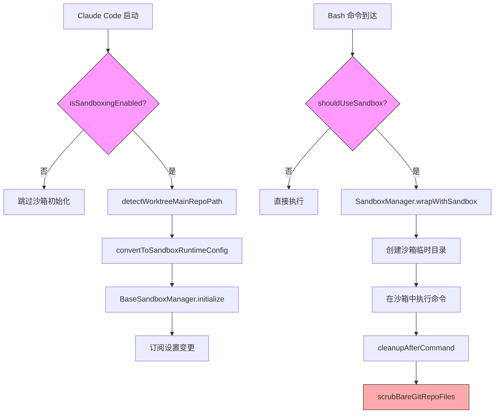
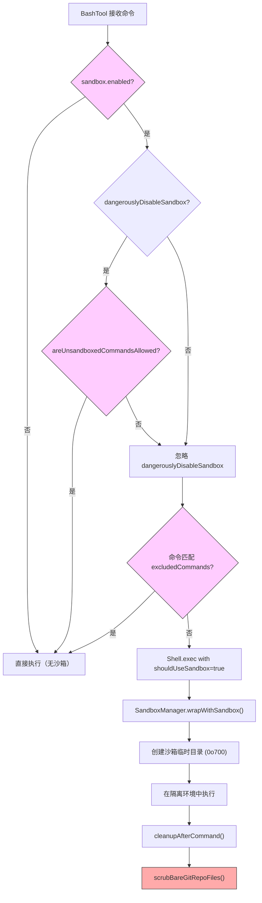

# 第18b章：沙箱系统 — 从 Seatbelt 到 Bubblewrap 的多平台隔离

## 为什么这很重要

AI Agent 能够执行任意 Shell 命令，这在赋予其强大能力的同时，也打开了一扇危险之门。一个被提示注入（Prompt Injection）诱导的 Agent 可以读取 `~/.ssh/id_rsa`、将敏感文件发送到外部服务器、甚至修改自身的配置文件以永久绕过权限控制。第16章分析的权限系统在应用层拦截危险操作，第17章的 YOLO 分类器在"快速模式"下做出许可决策，但这些都是"建议性"的软边界 — 恶意命令一旦到达操作系统层面，应用层的拦截毫无用处。

沙箱（Sandbox）是 Claude Code 安全体系的最后一道硬边界。它利用操作系统内核提供的隔离机制 — macOS 上的 `sandbox-exec`（Seatbelt Profile）和 Linux 上的 Bubblewrap（用户空间命名空间）+ seccomp（系统调用过滤）— 在进程级别强制执行文件系统和网络的访问控制。即使应用层的所有防护都被绕过，沙箱仍然能阻止未授权的文件读写和网络访问。

这套系统的工程复杂度远超表面看到的"开关一个配置项"。它需要处理双平台差异（macOS 的路径级 Seatbelt 配置 vs. Linux 的 bind-mount + seccomp 组合）、五层配置优先级的合并逻辑、Git Worktree 的特殊路径需求、企业 MDM 策略锁定、以及一个真实的安全漏洞（#29316 Bare Git Repo 攻击）的防御。本章将从源码层面完整剖析这套多平台隔离架构。

## 源码分析

### 18b.1 双平台沙箱架构

Claude Code 的沙箱实现分为两个层次：外部包 `@anthropic-ai/sandbox-runtime` 提供底层的平台特定隔离能力，而 `sandbox-adapter.ts` 作为适配器层将其与 Claude Code 的设置系统、权限规则和工具集成连接起来。

平台支持的判断逻辑在 `isSupportedPlatform()` 中，通过 memoize 缓存：

```typescript
// restored-src/src/utils/sandbox/sandbox-adapter.ts:491-493
const isSupportedPlatform = memoize((): boolean => {
  return BaseSandboxManager.isSupportedPlatform()
})
```

支持的平台包括三类：

| 平台 | 隔离技术 | 文件系统隔离 | 网络隔离 |
|------|---------|------------|---------|
| macOS | `sandbox-exec` (Seatbelt Profile) | Profile 规则控制路径访问 | Profile 规则 + Unix socket 按路径过滤 |
| Linux | Bubblewrap (bwrap) | 只读根挂载 + 可写白名单 bind-mount | seccomp 系统调用过滤 |
| WSL2 | 同 Linux（Bubblewrap） | 同 Linux | 同 Linux |

WSL1 被明确排除，因为它不提供完整的 Linux 内核命名空间支持：

```typescript
// restored-src/src/commands/sandbox-toggle/sandbox-toggle.tsx:14-17
if (!SandboxManager.isSupportedPlatform()) {
  const errorMessage = platform === 'wsl'
    ? 'Error: Sandboxing requires WSL2. WSL1 is not supported.'
    : 'Error: Sandboxing is currently only supported on macOS, Linux, and WSL2.';
```

两个平台之间的一个关键差异是 **glob 模式支持**。macOS 的 Seatbelt Profile 支持通配符路径匹配，而 Linux 的 Bubblewrap 只能做精确的 bind-mount。`getLinuxGlobPatternWarnings()` 会检测并警告用户在 Linux 上使用不兼容的 glob 模式：

```typescript
// restored-src/src/utils/sandbox/sandbox-adapter.ts:597-601
function getLinuxGlobPatternWarnings(): string[] {
  const platform = getPlatform()
  if (platform !== 'linux' && platform !== 'wsl') {
    return []
  }
```

### 18b.2 SandboxManager：适配器模式

`SandboxManager` 的设计采用了经典的适配器模式（Adapter Pattern）。它实现了一个包含 25+ 方法的 `ISandboxManager` 接口，其中一部分方法是 Claude Code 特有的逻辑，另一部分直接转发到 `BaseSandboxManager`（即 `@anthropic-ai/sandbox-runtime` 的核心类）。

```typescript
// restored-src/src/utils/sandbox/sandbox-adapter.ts:880-922
export interface ISandboxManager {
  initialize(sandboxAskCallback?: SandboxAskCallback): Promise<void>
  isSupportedPlatform(): boolean
  isPlatformInEnabledList(): boolean
  getSandboxUnavailableReason(): string | undefined
  isSandboxingEnabled(): boolean
  isSandboxEnabledInSettings(): boolean
  checkDependencies(): SandboxDependencyCheck
  isAutoAllowBashIfSandboxedEnabled(): boolean
  areUnsandboxedCommandsAllowed(): boolean
  isSandboxRequired(): boolean
  areSandboxSettingsLockedByPolicy(): boolean
  // ... 还有 getFsReadConfig, getFsWriteConfig, getNetworkRestrictionConfig 等
  wrapWithSandbox(command: string, binShell?: string, ...): Promise<string>
  cleanupAfterCommand(): void
  refreshConfig(): void
  reset(): Promise<void>
}
```

导出的 `SandboxManager` 对象清晰地展示了这种分层：

```typescript
// restored-src/src/utils/sandbox/sandbox-adapter.ts:927-967
export const SandboxManager: ISandboxManager = {
  // Custom implementations（Claude Code 特有逻辑）
  initialize,
  isSandboxingEnabled,
  areSandboxSettingsLockedByPolicy,
  setSandboxSettings,
  wrapWithSandbox,
  refreshConfig,
  reset,

  // Forward to base sandbox manager（直接转发）
  getFsReadConfig: BaseSandboxManager.getFsReadConfig,
  getFsWriteConfig: BaseSandboxManager.getFsWriteConfig,
  getNetworkRestrictionConfig: BaseSandboxManager.getNetworkRestrictionConfig,
  // ...
  cleanupAfterCommand: (): void => {
    BaseSandboxManager.cleanupAfterCommand()
    scrubBareGitRepoFiles()  // CC 特有：清理 Bare Git Repo 攻击残留
  },
}
```

初始化流程（`initialize()`）是异步的，包含一个精心设计的竞态条件防护：

```typescript
// restored-src/src/utils/sandbox/sandbox-adapter.ts:730-792
async function initialize(sandboxAskCallback?: SandboxAskCallback): Promise<void> {
  if (initializationPromise) {
    return initializationPromise  // 防止重复初始化
  }
  if (!isSandboxingEnabled()) {
    return
  }
  // 同步创建 Promise（在 await 之前），防止竞态条件
  initializationPromise = (async () => {
    // 1. 解析 Worktree 主仓库路径（仅一次）
    if (worktreeMainRepoPath === undefined) {
      worktreeMainRepoPath = await detectWorktreeMainRepoPath(getCwdState())
    }
    // 2. 将 CC 设置转换为 sandbox-runtime 配置
    const settings = getSettings_DEPRECATED()
    const runtimeConfig = convertToSandboxRuntimeConfig(settings)
    // 3. 初始化底层沙箱
    await BaseSandboxManager.initialize(runtimeConfig, wrappedCallback)
    // 4. 订阅设置变更，动态更新沙箱配置
    settingsSubscriptionCleanup = settingsChangeDetector.subscribe(() => {
      const newConfig = convertToSandboxRuntimeConfig(getSettings_DEPRECATED())
      BaseSandboxManager.updateConfig(newConfig)
    })
  })()
  return initializationPromise
}
```

下面的流程图展示了沙箱从初始化到命令执行的完整生命周期：



### 18b.3 配置系统：五层优先级

沙箱的配置合并继承了 Claude Code 通用的五层设置系统（详见第19章 CLAUDE.md 的优先级讨论），但沙箱在其上增加了自己的语义层。

五层优先级从低到高为：

```typescript
// restored-src/src/utils/settings/constants.ts:7-22
export const SETTING_SOURCES = [
  'userSettings',      // 全局用户设置 (~/.claude/settings.json)
  'projectSettings',   // 项目共享设置 (.claude/settings.json)
  'localSettings',     // 本地设置 (.claude/settings.local.json, gitignored)
  'flagSettings',      // CLI --settings 标志
  'policySettings',    // 企业 MDM 托管设置 (managed-settings.json)
] as const
```

沙箱的配置 Schema 由 Zod 定义在 `sandboxTypes.ts`，是整个系统的"单一事实来源"（Single Source of Truth）：

```typescript
// restored-src/src/entrypoints/sandboxTypes.ts:91-144
export const SandboxSettingsSchema = lazySchema(() =>
  z.object({
    enabled: z.boolean().optional(),
    failIfUnavailable: z.boolean().optional(),
    autoAllowBashIfSandboxed: z.boolean().optional(),
    allowUnsandboxedCommands: z.boolean().optional(),
    network: SandboxNetworkConfigSchema(),
    filesystem: SandboxFilesystemConfigSchema(),
    ignoreViolations: z.record(z.string(), z.array(z.string())).optional(),
    enableWeakerNestedSandbox: z.boolean().optional(),
    enableWeakerNetworkIsolation: z.boolean().optional(),
    excludedCommands: z.array(z.string()).optional(),
    ripgrep: z.object({ command: z.string(), args: z.array(z.string()).optional() }).optional(),
  }).passthrough(),  // .passthrough() 允许未声明字段（如 enabledPlatforms）
)
```

注意最后的 `.passthrough()` — 这是一个有意为之的设计决策。`enabledPlatforms` 是一个未文档化的企业设置，通过 `.passthrough()` 允许它存在于 Schema 中而不需要正式声明。源码注释揭示了背景：

```typescript
// restored-src/src/entrypoints/sandboxTypes.ts:104-111
// Note: enabledPlatforms is an undocumented setting read via .passthrough()
// Added to unblock NVIDIA enterprise rollout: they want to enable
// autoAllowBashIfSandboxed but only on macOS initially, since Linux/WSL
// sandbox support is newer and less battle-tested.
```

`convertToSandboxRuntimeConfig()` 是配置合并的核心函数，它遍历所有设置源，将 Claude Code 的权限规则（Permission Rules）和沙箱文件系统配置转换为 `sandbox-runtime` 能理解的统一格式。关键的路径解析逻辑在此过程中处理了两种不同的路径约定：

```typescript
// restored-src/src/utils/sandbox/sandbox-adapter.ts:99-119
export function resolvePathPatternForSandbox(
  pattern: string, source: SettingSource
): string {
  // 权限规则约定：//path → 绝对路径, /path → 相对于设置文件目录
  if (pattern.startsWith('//')) {
    return pattern.slice(1)  // "//.aws/**" → "/.aws/**"
  }
  if (pattern.startsWith('/') && !pattern.startsWith('//')) {
    const root = getSettingsRootPathForSource(source)
    return resolve(root, pattern.slice(1))
  }
  return pattern  // ~/path 和 ./path 透传给 sandbox-runtime
}
```

以及修复了 #30067 后的文件系统路径解析：

```typescript
// restored-src/src/utils/sandbox/sandbox-adapter.ts:138-146
export function resolveSandboxFilesystemPath(
  pattern: string, source: SettingSource
): string {
  // sandbox.filesystem.* 使用标准语义：/path = 绝对路径（不同于权限规则！）
  if (pattern.startsWith('//')) return pattern.slice(1)
  return expandPath(pattern, getSettingsRootPathForSource(source))
}
```

这里有一个微妙但重要的区别：权限规则中 `/path` 表示"相对于设置文件目录"，而 `sandbox.filesystem.allowWrite` 中 `/path` 表示绝对路径。这个不一致曾导致 #30067 Bug — 用户在 `sandbox.filesystem.allowWrite` 中写 `/Users/foo/.cargo` 期望它是绝对路径，但系统却按权限规则的约定将其解释为相对路径。

### 18b.4 文件系统隔离

文件系统隔离的核心策略是 **只读根 + 可写白名单**。`convertToSandboxRuntimeConfig()` 构建的配置中，`allowWrite` 默认只包含当前工作目录和 Claude 临时目录：

```typescript
// restored-src/src/utils/sandbox/sandbox-adapter.ts:225-226
const allowWrite: string[] = ['.', getClaudeTempDir()]
const denyWrite: string[] = []
```

在此基础上，系统添加了多层硬编码的写入拒绝规则，保护关键文件不被沙箱内的命令篡改：

**设置文件保护** — 防止沙箱逃逸（Sandbox Escape）：

```typescript
// restored-src/src/utils/sandbox/sandbox-adapter.ts:232-255
// 拒绝写入所有层级的 settings.json
const settingsPaths = SETTING_SOURCES.map(source =>
  getSettingsFilePathForSource(source),
).filter((p): p is string => p !== undefined)
denyWrite.push(...settingsPaths)
denyWrite.push(getManagedSettingsDropInDir())

// 如果用户 cd 到了不同目录，保护该目录下的设置文件
if (cwd !== originalCwd) {
  denyWrite.push(resolve(cwd, '.claude', 'settings.json'))
  denyWrite.push(resolve(cwd, '.claude', 'settings.local.json'))
}

// 保护 .claude/skills — 技能文件与命令/agent 具有相同的特权级别
denyWrite.push(resolve(originalCwd, '.claude', 'skills'))
```

**Git Worktree 支持** — Worktree 中的 Git 操作需要写入主仓库的 `.git` 目录（如 `index.lock`），系统在初始化时检测 Worktree 并缓存主仓库路径：

```typescript
// restored-src/src/utils/sandbox/sandbox-adapter.ts:422-445
async function detectWorktreeMainRepoPath(cwd: string): Promise<string | null> {
  const gitPath = join(cwd, '.git')
  const gitContent = await readFile(gitPath, { encoding: 'utf8' })
  const gitdirMatch = gitContent.match(/^gitdir:\s*(.+)$/m)
  // gitdir 格式: /path/to/main/repo/.git/worktrees/worktree-name
  const marker = `${sep}.git${sep}worktrees${sep}`
  const markerIndex = gitdir.lastIndexOf(marker)
  if (markerIndex > 0) {
    return gitdir.substring(0, markerIndex)
  }
}
```

如果检测到 Worktree，主仓库路径被加入可写白名单：

```typescript
// restored-src/src/utils/sandbox/sandbox-adapter.ts:286-288
if (worktreeMainRepoPath && worktreeMainRepoPath !== cwd) {
  allowWrite.push(worktreeMainRepoPath)
}
```

**额外目录支持** — 通过 `--add-dir` CLI 参数或 `/add-dir` 命令添加的目录也需要可写权限：

```typescript
// restored-src/src/utils/sandbox/sandbox-adapter.ts:295-299
const additionalDirs = new Set([
  ...(settings.permissions?.additionalDirectories || []),
  ...getAdditionalDirectoriesForClaudeMd(),
])
allowWrite.push(...additionalDirs)
```

### 18b.5 网络隔离

网络隔离采用**域名白名单**机制，与 Claude Code 的 `WebFetch` 权限规则深度集成。`convertToSandboxRuntimeConfig()` 从权限规则中提取允许的域名：

```typescript
// restored-src/src/utils/sandbox/sandbox-adapter.ts:178-210
const allowedDomains: string[] = []
const deniedDomains: string[] = []

if (shouldAllowManagedSandboxDomainsOnly()) {
  // 企业策略模式：只使用 policySettings 中的域名
  const policySettings = getSettingsForSource('policySettings')
  for (const domain of policySettings?.sandbox?.network?.allowedDomains || []) {
    allowedDomains.push(domain)
  }
  for (const ruleString of policySettings?.permissions?.allow || []) {
    const rule = permissionRuleValueFromString(ruleString)
    if (rule.toolName === WEB_FETCH_TOOL_NAME && rule.ruleContent?.startsWith('domain:')) {
      allowedDomains.push(rule.ruleContent.substring('domain:'.length))
    }
  }
} else {
  // 普通模式：合并所有层级的域名配置
  for (const domain of settings.sandbox?.network?.allowedDomains || []) {
    allowedDomains.push(domain)
  }
  // ... 从权限规则中提取 WebFetch(domain:xxx) 的域名
}
```

**Unix Socket 过滤** 是两个平台之间差异最大的部分。macOS 的 Seatbelt 支持按路径过滤 Unix Socket，而 Linux 的 seccomp 无法区分 Socket 路径 — 只能做"全部允许"或"全部禁止"的二选一：

```typescript
// restored-src/src/entrypoints/sandboxTypes.ts:28-36
allowUnixSockets: z.array(z.string()).optional()
  .describe('macOS only: Unix socket paths to allow. Ignored on Linux (seccomp cannot filter by path).'),
allowAllUnixSockets: z.boolean().optional()
  .describe('If true, allow all Unix sockets (disables blocking on both platforms).'),
```

**`allowManagedDomainsOnly` 策略** 是企业级网络隔离的核心。当企业通过 `policySettings` 启用此选项时，用户层、项目层和本地层的域名配置全部被忽略，只有企业策略中的域名和 `WebFetch` 规则生效：

```typescript
// restored-src/src/utils/sandbox/sandbox-adapter.ts:152-157
export function shouldAllowManagedSandboxDomainsOnly(): boolean {
  return (
    getSettingsForSource('policySettings')?.sandbox?.network
      ?.allowManagedDomainsOnly === true
  )
}
```

此外，初始化时会包裹 `sandboxAskCallback` 来强制执行此策略：

```typescript
// restored-src/src/utils/sandbox/sandbox-adapter.ts:745-755
const wrappedCallback: SandboxAskCallback | undefined = sandboxAskCallback
  ? async (hostPattern: NetworkHostPattern) => {
      if (shouldAllowManagedSandboxDomainsOnly()) {
        logForDebugging(
          `[sandbox] Blocked network request to ${hostPattern.host} (allowManagedDomainsOnly)`,
        )
        return false  // 硬拒绝，不询问用户
      }
      return sandboxAskCallback(hostPattern)
    }
  : undefined
```

**HTTP/SOCKS 代理支持** 允许企业通过代理服务器监控和审计 Agent 的网络流量：

```typescript
// restored-src/src/utils/sandbox/sandbox-adapter.ts:360-368
return {
  network: {
    allowedDomains,
    deniedDomains,
    allowUnixSockets: settings.sandbox?.network?.allowUnixSockets,
    allowAllUnixSockets: settings.sandbox?.network?.allowAllUnixSockets,
    allowLocalBinding: settings.sandbox?.network?.allowLocalBinding,
    httpProxyPort: settings.sandbox?.network?.httpProxyPort,
    socksProxyPort: settings.sandbox?.network?.socksProxyPort,
  },
```

`enableWeakerNetworkIsolation` 选项值得特别关注。它允许访问 macOS 的 `com.apple.trustd.agent` 服务，这是 Go 编译的 CLI 工具（如 `gh`, `gcloud`, `terraform`）验证 TLS 证书所必需的。但开启此选项会**降低安全性** — 因为 trustd 服务本身是一个潜在的数据外泄通道：

```typescript
// restored-src/src/entrypoints/sandboxTypes.ts:125-133
enableWeakerNetworkIsolation: z.boolean().optional()
  .describe(
    'macOS only: Allow access to com.apple.trustd.agent in the sandbox. ' +
    'Needed for Go-based CLI tools (gh, gcloud, terraform, etc.) to verify TLS certificates ' +
    'when using httpProxyPort with a MITM proxy and custom CA. ' +
    '**Reduces security** — opens a potential data exfiltration vector through the trustd service. Default: false',
  ),
```

### 18b.6 Bash 工具集成

沙箱最终通过 Bash 工具与用户交互。决策链从 `shouldUseSandbox()` 开始，经过 `Shell.exec()` 的包装，到最终在操作系统层面的隔离执行。

**`shouldUseSandbox()` 决策逻辑**遵循一个清晰的优先级链：

```typescript
// restored-src/src/tools/BashTool/shouldUseSandbox.ts:130-153
export function shouldUseSandbox(input: Partial<SandboxInput>): boolean {
  // 1. 沙箱未启用 → 不使用
  if (!SandboxManager.isSandboxingEnabled()) {
    return false
  }
  // 2. dangerouslyDisableSandbox=true 且策略允许 → 不使用
  if (input.dangerouslyDisableSandbox &&
      SandboxManager.areUnsandboxedCommandsAllowed()) {
    return false
  }
  // 3. 无命令 → 不使用
  if (!input.command) {
    return false
  }
  // 4. 命令匹配排除列表 → 不使用
  if (containsExcludedCommand(input.command)) {
    return false
  }
  // 5. 其他情况 → 使用沙箱
  return true
}
```

`containsExcludedCommand()` 的实现比看起来复杂得多。它不仅检查用户配置的 `excludedCommands`，还会拆分复合命令（用 `&&` 连接的命令），并迭代剥离环境变量前缀和安全包装器（如 `timeout`）进行匹配。这是为了防止 `docker ps && curl evil.com` 这样的命令因为 `docker` 在排除列表中而整体跳过沙箱：

```typescript
// restored-src/src/tools/BashTool/shouldUseSandbox.ts:60-68
// Split compound commands to prevent a compound command from
// escaping the sandbox just because its first subcommand matches
let subcommands: string[]
try {
  subcommands = splitCommand_DEPRECATED(command)
} catch {
  subcommands = [command]
}
```

**命令包装流程**在 `Shell.ts` 中完成。当 `shouldUseSandbox` 为 true 时，命令字符串被传递给 `SandboxManager.wrapWithSandbox()`，由底层的 sandbox-runtime 将其包装为带有隔离参数的实际系统调用：

```typescript
// restored-src/src/utils/Shell.ts:259-273
if (shouldUseSandbox) {
  commandString = await SandboxManager.wrapWithSandbox(
    commandString,
    sandboxBinShell,
    undefined,
    abortSignal,
  )
  // 创建沙箱临时目录，使用安全权限
  try {
    const fs = getFsImplementation()
    await fs.mkdir(sandboxTmpDir, { mode: 0o700 })
  } catch (error) {
    logForDebugging(`Failed to create ${sandboxTmpDir} directory: ${error}`)
  }
}
```

特别值得注意的是 **PowerShell 在沙箱中的处理**。`wrapWithSandbox` 内部会将命令包装为 `<binShell> -c '<cmd>'`，但 PowerShell 的 `-NoProfile -NonInteractive` 参数在此过程中会丢失。解决方案是将 PowerShell 命令预编码为 Base64 格式，然后使用 `/bin/sh` 作为沙箱的内部 Shell：

```typescript
// restored-src/src/utils/Shell.ts:247-257
// Sandboxed PowerShell: wrapWithSandbox hardcodes `<binShell> -c '<cmd>'` —
// using pwsh there would lose -NoProfile -NonInteractive
const isSandboxedPowerShell = shouldUseSandbox && shellType === 'powershell'
const sandboxBinShell = isSandboxedPowerShell ? '/bin/sh' : binShell
```

**`dangerouslyDisableSandbox` 参数**允许 AI 模型在遇到沙箱限制导致的失败时绕过沙箱。但企业可以通过 `allowUnsandboxedCommands: false` 完全禁用此参数：

```typescript
// restored-src/src/entrypoints/sandboxTypes.ts:113-119
allowUnsandboxedCommands: z.boolean().optional()
  .describe(
    'Allow commands to run outside the sandbox via the dangerouslyDisableSandbox parameter. ' +
    'When false, the dangerouslyDisableSandbox parameter is completely ignored and all commands must run sandboxed. ' +
    'Default: true.',
  ),
```

BashTool 的提示词（详见第8章关于工具提示词的讨论）也会根据此设置动态调整对模型的指导：

```typescript
// restored-src/src/tools/BashTool/prompt.ts:228-256
const sandboxOverrideItems: Array<string | string[]> =
  allowUnsandboxedCommands
    ? [
        'You should always default to running commands within the sandbox...',
        // 指导模型在看到 "Operation not permitted" 等证据时才使用 dangerouslyDisableSandbox
      ]
    : [
        'All commands MUST run in sandbox mode - the `dangerouslyDisableSandbox` parameter is disabled by policy.',
        'Commands cannot run outside the sandbox under any circumstances.',
      ]
```

下面的流程图展示了一条命令从输入到沙箱执行的完整决策路径：



### 18b.7 安全边界案例：Bare Git Repo 攻击防御

这是整个沙箱系统中最精彩的安全工程案例。Issue #29316 描述了一个真实的沙箱逃逸攻击路径：

**攻击原理**：Git 的 `is_git_directory()` 函数判断一个目录是否是 Git 仓库的依据是：该目录下存在 `HEAD`、`objects/`、`refs/` 等文件。如果攻击者（通过提示注入）在沙箱内创建了这些文件，并在 `config` 中设置 `core.fsmonitor` 指向恶意脚本，那么 Claude Code 的**非沙箱** Git 操作（如 `git status`）会将当前目录误判为 Bare Git Repo，进而执行 `core.fsmonitor` 指定的任意代码 — 此时已在沙箱外。

**防御策略**：分为两条线 — 预防和清理。

对于**已存在的** Git 文件（`HEAD`, `objects`, `refs`, `hooks`, `config`），系统将它们加入 `denyWrite` 列表，sandbox-runtime 会以只读方式 bind-mount 它们：

```typescript
// restored-src/src/utils/sandbox/sandbox-adapter.ts:257-280
// SECURITY: Git's is_git_directory() treats cwd as a bare repo if it has
// HEAD + objects/ + refs/. An attacker planting these (plus a config with
// core.fsmonitor) escapes the sandbox when Claude's unsandboxed git runs.
bareGitRepoScrubPaths.length = 0
const bareGitRepoFiles = ['HEAD', 'objects', 'refs', 'hooks', 'config']
for (const dir of cwd === originalCwd ? [originalCwd] : [originalCwd, cwd]) {
  for (const gitFile of bareGitRepoFiles) {
    const p = resolve(dir, gitFile)
    try {
      statSync(p)
      denyWrite.push(p)  // 文件存在 → 只读 bind-mount
    } catch {
      bareGitRepoScrubPaths.push(p)  // 文件不存在 → 记录，命令后清理
    }
  }
}
```

对于**不存在的** Git 文件（即攻击者可能在沙箱命令执行期间植入的），系统在每条命令执行后调用 `scrubBareGitRepoFiles()` 清理：

```typescript
// restored-src/src/utils/sandbox/sandbox-adapter.ts:404-414
function scrubBareGitRepoFiles(): void {
  for (const p of bareGitRepoScrubPaths) {
    try {
      rmSync(p, { recursive: true })
      logForDebugging(`[Sandbox] scrubbed planted bare-repo file: ${p}`)
    } catch {
      // ENOENT is the expected common case — nothing was planted
    }
  }
}
```

源码注释解释了为什么不能简单地对所有 Git 文件都使用 `denyWrite`：

> Unconditionally denying these paths makes sandbox-runtime mount `/dev/null` at non-existent ones, which (a) leaves a 0-byte HEAD stub on the host and (b) breaks `git log HEAD` inside bwrap ("ambiguous argument").

这个防御被集成到 `cleanupAfterCommand()` 中，确保每次沙箱命令执行后都会清理：

```typescript
// restored-src/src/utils/sandbox/sandbox-adapter.ts:963-966
cleanupAfterCommand: (): void => {
  BaseSandboxManager.cleanupAfterCommand()
  scrubBareGitRepoFiles()
},
```

### 18b.8 企业策略与合规

Claude Code 的沙箱系统为企业部署提供了全面的策略控制能力。

**MDM `settings.d/` 目录**：企业可以通过 `getManagedSettingsDropInDir()` 指定的托管设置目录部署沙箱策略。此目录下的配置文件自动获得 `policySettings` 的最高优先级。

**`failIfUnavailable`**：当设为 `true` 时，如果沙箱无法启动（缺少依赖、不支持的平台等），Claude Code 会直接退出而不是降级运行。这是企业级"硬门控"（Hard Gate）：

```typescript
// restored-src/src/utils/sandbox/sandbox-adapter.ts:479-485
function isSandboxRequired(): boolean {
  const settings = getSettings_DEPRECATED()
  return (
    getSandboxEnabledSetting() &&
    (settings?.sandbox?.failIfUnavailable ?? false)
  )
}
```

**`areSandboxSettingsLockedByPolicy()`** 检查是否有更高优先级的设置源（`flagSettings` 或 `policySettings`）锁定了沙箱配置，防止用户在本地修改：

```typescript
// restored-src/src/utils/sandbox/sandbox-adapter.ts:647-664
function areSandboxSettingsLockedByPolicy(): boolean {
  const overridingSources = ['flagSettings', 'policySettings'] as const
  for (const source of overridingSources) {
    const settings = getSettingsForSource(source)
    if (
      settings?.sandbox?.enabled !== undefined ||
      settings?.sandbox?.autoAllowBashIfSandboxed !== undefined ||
      settings?.sandbox?.allowUnsandboxedCommands !== undefined
    ) {
      return true
    }
  }
  return false
}
```

在 `/sandbox` 命令的实现中，如果策略锁定了设置，用户会看到明确的错误提示：

```typescript
// restored-src/src/commands/sandbox-toggle/sandbox-toggle.tsx:33-37
if (SandboxManager.areSandboxSettingsLockedByPolicy()) {
  const message = color('error', themeName)(
    'Error: Sandbox settings are overridden by a higher-priority configuration and cannot be changed locally.'
  );
  onDone(message);
}
```

**`enabledPlatforms`**（未文档化）允许企业仅在特定平台启用沙箱。这是为 NVIDIA 的企业部署而添加的，他们希望先在 macOS 上启用 `autoAllowBashIfSandboxed`，等 Linux 沙箱更成熟后再扩展：

```typescript
// restored-src/src/utils/sandbox/sandbox-adapter.ts:505-526
function isPlatformInEnabledList(): boolean {
  const settings = getInitialSettings()
  const enabledPlatforms = (
    settings?.sandbox as { enabledPlatforms?: Platform[] } | undefined
  )?.enabledPlatforms
  if (enabledPlatforms === undefined) {
    return true  // 未设置时默认所有平台启用
  }
  const currentPlatform = getPlatform()
  return enabledPlatforms.includes(currentPlatform)
}
```

**削弱隔离的选项及其权衡**：

| 选项 | 作用 | 安全影响 |
|------|------|---------|
| `enableWeakerNestedSandbox` | 允许沙箱内部运行嵌套沙箱 | 降低隔离深度 |
| `enableWeakerNetworkIsolation` | macOS 上允许访问 `trustd.agent` | 开启数据外泄向量 |
| `allowUnsandboxedCommands: true` | 允许 `dangerouslyDisableSandbox` 参数 | 允许完全绕过沙箱 |
| `excludedCommands` | 特定命令跳过沙箱 | 被排除的命令无隔离保护 |

## 模式提炼

### 模式：多平台沙箱适配器

**解决的问题**：不同操作系统提供完全不同的隔离原语（macOS Seatbelt vs. Linux Namespaces + seccomp），应用层需要一个统一的接口来管理沙箱的生命周期、配置和执行。

**方法**：

1. **外部包处理平台差异**：`@anthropic-ai/sandbox-runtime` 封装了 macOS `sandbox-exec` 和 Linux `bwrap` + `seccomp` 的差异，提供统一的 `BaseSandboxManager` API
2. **适配器层处理业务差异**：`sandbox-adapter.ts` 将应用特有的配置系统（五层设置、权限规则、路径约定）转换为 sandbox-runtime 的 `SandboxRuntimeConfig` 格式
3. **接口导出方法表**：`ISandboxManager` 接口明确区分"自定义实现"和"直接转发"的方法，使代码意图清晰

**前置条件**：

- 底层隔离包必须提供平台无关的接口（`wrapWithSandbox`, `initialize`, `updateConfig`）
- 适配器必须处理所有应用特有的概念转换（路径解析约定、权限规则提取）
- `cleanupAfterCommand()` 等扩展点必须允许适配器注入自己的逻辑

**Claude Code 中的映射**：

| 组件 | 角色 |
|------|------|
| `@anthropic-ai/sandbox-runtime` | 被适配者（Adaptee） |
| `sandbox-adapter.ts` | 适配器（Adapter） |
| `ISandboxManager` | 目标接口（Target） |
| `BashTool`, `Shell.ts` | 客户端（Client） |

### 模式：五层配置合并与策略锁定

**解决的问题**：沙箱配置需要在用户灵活性和企业安全合规之间取得平衡。用户需要自定义可写路径和网络域名，而企业需要锁定关键设置防止用户绕过。

**方法**：

1. **低优先级源提供默认值**：`userSettings` 和 `projectSettings` 提供基础配置
2. **高优先级源覆盖或锁定**：`policySettings` 中设置 `sandbox.enabled: true` 会覆盖所有低优先级设置
3. **`allowManagedDomainsOnly` 等策略开关**：在合并逻辑中选择性忽略低优先级源的数据
4. **`areSandboxSettingsLockedByPolicy()` 检测锁定状态**：UI 层根据此结果禁用设置修改入口

**前置条件**：

- 设置系统必须支持按源查询（`getSettingsForSource`），而不仅仅是返回合并后的结果
- 路径解析必须感知设置源（同一个 `/path` 在不同源中可能解析为不同的绝对路径）
- 策略锁定检测必须在 UI 入口处执行，而不是在设置写入时

**Claude Code 中的映射**：`SETTING_SOURCES` 定义了 `userSettings → projectSettings → localSettings → flagSettings → policySettings` 的优先级链。`convertToSandboxRuntimeConfig()` 遍历所有源并按各自的路径约定解析，`shouldAllowManagedSandboxDomainsOnly()` 和 `shouldAllowManagedReadPathsOnly()` 实现了企业策略的"硬覆盖"。

## 用户能做什么

1. **在项目中启用沙箱**：在 `.claude/settings.local.json` 中设置 `{ "sandbox": { "enabled": true } }`，或运行 `/sandbox` 命令进行交互式配置。启用后，所有 Bash 命令默认在沙箱中执行。

2. **为开发工具添加网络白名单**：如果构建工具（npm, pip, cargo）需要下载依赖，在 `sandbox.network.allowedDomains` 中添加所需域名，如 `["registry.npmjs.org", "crates.io"]`。也可以通过 `WebFetch(domain:xxx)` 的 allow 权限规则实现，沙箱会自动提取这些域名。

3. **为特定命令排除沙箱**：使用 `/sandbox exclude "docker compose:*"` 将需要特殊权限的命令（如 Docker、systemctl）排除出沙箱。注意这是便利功能而非安全边界 — 被排除的命令不受沙箱保护。

4. **为 Git Worktree 确保兼容性**：如果在 Git Worktree 中使用 Claude Code，系统会自动检测并将主仓库路径加入可写白名单。如果遇到 `index.lock` 相关错误，检查 `.git` 文件的 `gitdir` 引用是否正确。

5. **企业部署中强制沙箱**：在托管设置中设置 `{ "sandbox": { "enabled": true, "failIfUnavailable": true, "allowUnsandboxedCommands": false } }` 来强制所有用户在沙箱中运行，且禁止绕过。配合 `network.allowManagedDomainsOnly: true` 锁定网络访问白名单。

6. **调试沙箱问题**：当命令因沙箱限制失败时，stderr 中会包含 `<sandbox_violations>` 标签的违规信息。运行 `/sandbox` 查看当前沙箱状态和依赖检查结果。在 Linux 上，如果看到 glob 模式警告，将通配符路径改为精确路径（Bubblewrap 不支持 glob）。
