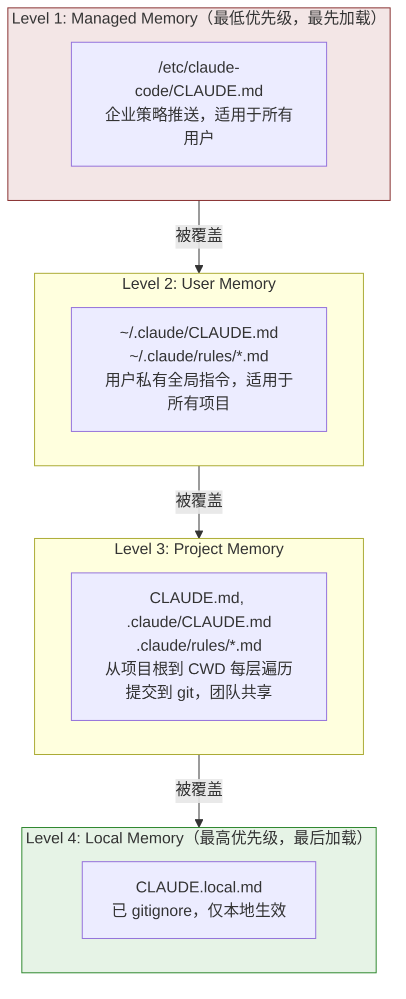

# 第19章：CLAUDE.md — 用户指令作为覆盖层

## 为什么这很重要

如果说 Hooks 系统（第18章）是用户通过**代码执行**来扩展 Agent 行为的通道，那么 CLAUDE.md 就是通过**自然语言指令**来控制模型输出的通道。这不是一个简单的"配置文件"——它是一套完整的指令注入系统，具有四级优先级层叠、传递性文件包含、路径范围限定、HTML 注释剥离、以及明确的覆盖语义声明。

CLAUDE.md 的设计哲学可以用一句话概括：**用户的指令覆盖模型的默认行为。** 这句话不是修辞——它被字面注入到系统提示词中：

```typescript
// claudemd.ts:89-91
const MEMORY_INSTRUCTION_PROMPT =
  'Codebase and user instructions are shown below. Be sure to adhere to these instructions. ' +
  'IMPORTANT: These instructions OVERRIDE any default behavior and you MUST follow them exactly as written.'
```

本章将从文件发现、内容处理、到最终注入提示词的完整链路，剖析这套系统的源码实现。

---

## 19.1 四级加载优先级

CLAUDE.md 系统采用四级优先级模型，在 `claudemd.ts` 文件头部的注释中有明确定义（第 1-26 行）。文件按**反向优先级顺序**加载——最后加载的优先级最高，因为模型对对话末尾的内容"关注度"更高：



### 加载实现

`getMemoryFiles` 函数（第 790-1075 行）实现了完整的加载逻辑。它是一个 `memoize` 包装的异步函数——在同一进程生命周期内，首次调用后结果被缓存：

**第一步：Managed Memory（第 803-823 行）**

```typescript
// claudemd.ts:804-822
const managedClaudeMd = getMemoryPath('Managed')
result.push(
  ...(await processMemoryFile(managedClaudeMd, 'Managed', processedPaths, includeExternal)),
)
const managedClaudeRulesDir = getManagedClaudeRulesDir()
result.push(
  ...(await processMdRules({
    rulesDir: managedClaudeRulesDir,
    type: 'Managed',
    processedPaths,
    includeExternal,
    conditionalRule: false,
  })),
)
```

Managed Memory 路径通常是 `/etc/claude-code/CLAUDE.md`——这是企业 IT 部门通过 MDM（Mobile Device Management）推送策略的标准位置。

**第二步：User Memory（第 826-847 行）**

仅在 `userSettings` 配置源启用时加载。User Memory 有一个特权：`includeExternal` 始终为 `true`（第 833 行），意味着用户级 CLAUDE.md 中的 `@include` 可以引用项目目录外的文件。

**第三步：Project Memory（第 849-920 行）**

这是最复杂的一步。代码从 CWD 向上遍历到文件系统根目录，收集沿途每一层的 `CLAUDE.md`、`.claude/CLAUDE.md` 和 `.claude/rules/*.md`：

```typescript
// claudemd.ts:851-857
const dirs: string[] = []
const originalCwd = getOriginalCwd()
let currentDir = originalCwd
while (currentDir !== parse(currentDir).root) {
  dirs.push(currentDir)
  currentDir = dirname(currentDir)
}
```

然后从根目录方向向 CWD 方向处理（第 878 行的 `dirs.reverse()`），确保离 CWD 更近的文件后加载、优先级更高。

一个有趣的边界情况处理：git worktree（第 859-884 行）。当从 worktree 内运行时（例如 `.claude/worktrees/<name>/`），向上遍历会同时经过 worktree 根目录和主仓库根目录。两者都包含 `CLAUDE.md`，导致内容重复加载。代码通过检测 `isNestedWorktree` 来跳过主仓库目录中的 Project 类型文件——但 `CLAUDE.local.md` 仍然加载，因为它是 gitignored 的、只存在于主仓库中。

**第四步：Local Memory（穿插在 Project 遍历中）**

在每个目录层级，`CLAUDE.local.md` 在 Project 文件之后加载（第 922-933 行），但前提是 `localSettings` 配置源启用。

**附加目录（`--add-dir`）支持（第 936-977 行）：**

通过 `CLAUDE_CODE_ADDITIONAL_DIRECTORIES_CLAUDE_MD` 环境变量启用后，`--add-dir` 参数指定的额外目录中的 CLAUDE.md 也会被加载。这些文件被标记为 `Project` 类型，加载逻辑与标准 Project Memory 完全一致（CLAUDE.md、.claude/CLAUDE.md、.claude/rules/*.md）。注意这里不检查 `isSettingSourceEnabled('projectSettings')`——因为 `--add-dir` 是用户的显式操作，SDK 默认的空 `settingSources` 不应阻止它。

**AutoMem 和 TeamMem（第 979-1007 行）：**

在四级标准 Memory 之后，还会尝试加载两种特殊类型——自动记忆（`MEMORY.md`）和团队记忆。这些类型有各自的 feature flag 控制，且有独立的截断策略（由 `truncateEntrypointContent` 处理行数和字节数上限）。

### 可控的配置源开关

每一级（除 Managed 外）的加载都受 `isSettingSourceEnabled()` 控制：

- `userSettings`：控制 User Memory
- `projectSettings`：控制 Project Memory（CLAUDE.md 和 rules）
- `localSettings`：控制 Local Memory

SDK 模式下默认将 `settingSources` 设为空数组，意味着除非显式启用，否则只有 Managed Memory 生效——这是 SDK 使用者最小权限原则的体现。

---

## 19.2 @include 指令

CLAUDE.md 支持 `@include` 语法来引用其他文件，实现模块化的指令组织。

### 语法格式

`@include` 使用 `@` 前缀加路径的简洁语法（第 19-24 行注释）：

| 语法 | 含义 |
|------|------|
| `@path` 或 `@./path` | 相对于当前文件目录的路径 |
| `@~/path` | 相对于用户 home 目录的路径 |
| `@/absolute/path` | 绝对路径 |
| `@path#section` | 带片段标识符（`#` 及之后被忽略） |
| `@path\ with\ spaces` | 反斜杠转义空格 |

### 路径提取

路径提取由 `extractIncludePathsFromTokens` 函数（第 451-535 行）实现。它接收 marked lexer 预处理过的 token 流，而非原始文本——这确保了以下规则：

1. **代码块中的 `@` 被忽略**：`code` 和 `codespan` 类型的 token 被跳过（第 496-498 行）
2. **HTML 注释中的 `@` 被忽略**：`html` 类型 token 中的注释部分被跳过，但注释后的残余文本中的 `@` 仍然被处理（第 502-514 行）
3. **仅处理文本节点**：递归进入 `tokens` 和 `items` 子结构（第 522-529 行）

路径提取的正则表达式（第 459 行）：

```typescript
// claudemd.ts:459
const includeRegex = /(?:^|\s)@((?:[^\s\\]|\\ )+)/g
```

这个正则匹配 `@` 后的非空白字符序列，同时支持 `\ ` 转义空格。

### 传递性包含与循环引用防护

`processMemoryFile` 函数（第 618-685 行）递归处理 `@include`。两个关键安全机制：

**循环引用防护**：通过 `processedPaths` Set 追踪已处理的文件路径（第 629-630 行）。路径在比较前经过 `normalizePathForComparison` 规范化，处理 Windows 盘符大小写差异（`C:\Users` vs `c:\Users`）：

```typescript
// claudemd.ts:629-630
const normalizedPath = normalizePathForComparison(filePath)
if (processedPaths.has(normalizedPath) || depth >= MAX_INCLUDE_DEPTH) {
  return []
}
```

**最大深度限制**：`MAX_INCLUDE_DEPTH = 5`（第 537 行），防止过深的嵌套。

**外部文件安全**：当 `@include` 指向项目目录外的文件时，默认不加载（第 667-669 行）。只有 User Memory 层级的文件或用户显式批准 `hasClaudeMdExternalIncludesApproved` 后才允许外部包含。如果发现未批准的外部包含，系统会显示警告（`shouldShowClaudeMdExternalIncludesWarning`，第 1420-1430 行）。

### 符号链接处理

每个文件在处理前都通过 `safeResolvePath` 解析符号链接（第 640-643 行）。如果文件是符号链接，解析后的真实路径也会被添加到 `processedPaths`——防止通过符号链接绕过循环引用检测。

---

## 19.3 frontmatter paths：范围限定

`.claude/rules/` 目录中的 `.md` 文件可以通过 YAML frontmatter 的 `paths` 字段限定其适用范围——只有当 Claude 操作的文件路径匹配这些 glob 模式时，规则才会被注入上下文。

### frontmatter 解析

`parseFrontmatterPaths` 函数（第 254-279 行）处理 frontmatter 中的 `paths` 字段：

```typescript
// claudemd.ts:254-279
function parseFrontmatterPaths(rawContent: string): {
  content: string
  paths?: string[]
} {
  const { frontmatter, content } = parseFrontmatter(rawContent)
  if (!frontmatter.paths) {
    return { content }
  }
  const patterns = splitPathInFrontmatter(frontmatter.paths)
    .map(pattern => {
      return pattern.endsWith('/**') ? pattern.slice(0, -3) : pattern
    })
    .filter((p: string) => p.length > 0)
  if (patterns.length === 0 || patterns.every((p: string) => p === '**')) {
    return { content }
  }
  return { content, paths: patterns }
}
```

注意 `/**` 后缀的处理——`ignore` 库将 `path` 视为同时匹配路径本身和路径内的所有内容，所以 `/**` 是冗余的，被自动移除。如果所有模式都是 `**`（匹配一切），则视为没有 glob 限定。

### 路径语法

`splitPathInFrontmatter` 函数（`frontmatterParser.ts:189-232`）支持复杂的路径语法：

```yaml
---
paths: src/**/*.ts, tests/**/*.test.ts
---
```

或 YAML 列表格式：

```yaml
---
paths:
  - src/**/*.ts
  - tests/**/*.test.ts
---
```

花括号展开也被支持——`src/*.{ts,tsx}` 会展开为 `["src/*.ts", "src/*.tsx"]`（`frontmatterParser.ts:240-266` 的 `expandBraces` 函数）。这个展开器递归处理多层花括号：`{a,b}/{c,d}` 产生 `["a/c", "a/d", "b/c", "b/d"]`。

### YAML 解析的容错处理

frontmatter 的 YAML 解析（`frontmatterParser.ts:130-175`）有两层容错：

1. **首次尝试**：直接解析原始 frontmatter 文本
2. **失败后重试**：通过 `quoteProblematicValues` 函数自动引用包含 YAML 特殊字符的值

这个重试机制解决了一个常见问题：glob 模式如 `**/*.{ts,tsx}` 包含 YAML 的流映射指示符 `{}`，直接解析会失败。`quoteProblematicValues`（第 85-121 行）会检测简单 `key: value` 行中的特殊字符（`{}[]*, &#!|>%@``），自动用双引号包裹。已被引号包裹的值会被跳过。

这意味着用户可以直接写 `paths: src/**/*.{ts,tsx}` 而无需手动加引号——解析器会在第一次 YAML 解析失败后自动加引号重试。

### 条件规则匹配

条件规则的匹配由 `processConditionedMdRules` 函数（第 1354-1397 行）执行。它加载规则文件后，使用 `ignore()` 库（gitignore 兼容的 glob 匹配）对目标文件路径进行过滤：

```typescript
// claudemd.ts:1370-1396
return conditionedRuleMdFiles.filter(file => {
  if (!file.globs || file.globs.length === 0) {
    return false
  }
  const baseDir =
    type === 'Project'
      ? dirname(dirname(rulesDir))  // .claude 的父目录
      : getOriginalCwd()            // managed/user 规则使用项目根目录
  const relativePath = isAbsolute(targetPath)
    ? relative(baseDir, targetPath)
    : targetPath
  if (!relativePath || relativePath.startsWith('..') || isAbsolute(relativePath)) {
    return false
  }
  return ignore().add(file.globs).ignores(relativePath)
})
```

关键设计细节：

- **Project 规则**的 glob 基准目录是包含 `.claude` 目录的那个目录
- **Managed/User 规则**的 glob 基准目录是 `getOriginalCwd()`——即项目根目录
- 超出基准目录的路径（`..` 前缀）被排除——它们不可能匹配基准目录相对的 glob
- Windows 跨盘符的 `relative()` 返回绝对路径，同样被排除

### 无条件规则 vs 条件规则

`processMdRules` 函数（第 697-788 行）的 `conditionalRule` 参数控制加载哪类规则：

- `conditionalRule: false`：加载**没有** `paths` frontmatter 的文件——这些是无条件规则，总是注入上下文
- `conditionalRule: true`：加载**有** `paths` frontmatter 的文件——这些是条件规则，只在匹配时注入

在会话启动时，CWD 到根目录路径上的无条件规则和 managed/user 层的无条件规则都被预加载。条件规则只在 Claude 操作特定文件时按需加载。

---

## 19.4 HTML 注释剥离

CLAUDE.md 中的 HTML 注释会在注入上下文前被剥离。这允许维护者在指令文件中留下不想让 Claude 看到的注释。

`stripHtmlComments` 函数（第 292-301 行）使用 marked lexer 识别块级 HTML 注释：

```typescript
// claudemd.ts:292-301
export function stripHtmlComments(content: string): {
  content: string
  stripped: boolean
} {
  if (!content.includes('<!--')) {
    return { content, stripped: false }
  }
  return stripHtmlCommentsFromTokens(new Lexer({ gfm: false }).lex(content))
}
```

`stripHtmlCommentsFromTokens` 函数（第 303-334 行）的处理逻辑精确而谨慎：

1. 只处理 `html` 类型 token 中以 `<!--` 开头且包含 `-->` 的注释
2. **未闭合的注释**（`<!--` 没有对应的 `-->`）被保留——这防止一个拼写错误导致文件剩余内容被静默吞噬
3. 注释后的**残留内容**被保留——例如 `<!-- note --> Use bun` 会保留 ` Use bun`
4. 行内代码和代码块中的 `<!-- -->` 不受影响——lexer 已经将它们标记为 `code`/`codespan` 类型

一个实现细节值得注意：`gfm: false` 选项（第 300 行）。这是因为 `@include` 路径中的 `~` 在 GFM 模式下会被 marked 解析为删除线标记——禁用 GFM 避免了这个冲突。HTML 块检测是 CommonMark 规则，不受 GFM 设置影响。

### 避免虚假的 contentDiffersFromDisk

`parseMemoryFileContent` 函数（第 343-399 行）中有一个精巧的优化：只有当文件确实包含 `<!--` 时才通过 token 重建内容（第 370-374 行）。这不仅是性能考量——marked 在 lexing 过程中会规范化 `\r\n` 为 `\n`，如果对一个 CRLF 文件进行不必要的 token 往返，会虚假触发 `contentDiffersFromDisk` 标志，导致缓存系统认为文件被修改了。

---

## 19.5 注入提示词

### 最终注入格式

`getClaudeMds` 函数（第 1153-1195 行）将所有加载的 memory files 组装为最终的系统提示词字符串：

```typescript
// claudemd.ts:1153-1195
export const getClaudeMds = (
  memoryFiles: MemoryFileInfo[],
  filter?: (type: MemoryType) => boolean,
): string => {
  const memories: string[] = []
  for (const file of memoryFiles) {
    if (filter && !filter(file.type)) continue
    if (file.content) {
      const description =
        file.type === 'Project'
          ? ' (project instructions, checked into the codebase)'
          : file.type === 'Local'
            ? " (user's private project instructions, not checked in)"
            : " (user's private global instructions for all projects)"
      memories.push(`Contents of ${file.path}${description}:\n\n${content}`)
    }
  }
  if (memories.length === 0) {
    return ''
  }
  return `${MEMORY_INSTRUCTION_PROMPT}\n\n${memories.join('\n\n')}`
}
```

每个文件的注入格式是：

```
Contents of /path/to/CLAUDE.md (类型描述):

[文件内容]
```

所有文件前置一个统一的指令前缀（`MEMORY_INSTRUCTION_PROMPT`），明确告知模型：

> "Codebase and user instructions are shown below. Be sure to adhere to these instructions. IMPORTANT: These instructions OVERRIDE any default behavior and you MUST follow them exactly as written."

这个"覆盖"声明不是装饰——它利用了 Claude 模型对 system prompt 中明确指令的高遵从度。通过在提示词中显式声明"这些指令覆盖默认行为"，用户的 CLAUDE.md 内容获得了等同于（甚至高于）内置系统提示词的影响力。

### 类型描述的作用

每个文件的类型描述并非仅供人类阅读——它帮助模型理解指令的来源和权威性：

| 类型 | 描述 | 语义暗示 |
|------|------|----------|
| Project | `project instructions, checked into the codebase` | 团队共识，应严格遵守 |
| Local | `user's private project instructions, not checked in` | 个人偏好，适度灵活 |
| User | `user's private global instructions for all projects` | 用户习惯，跨项目一致 |
| AutoMem | `user's auto-memory, persists across conversations` | 学习到的知识，供参考 |
| TeamMem | `shared team memory, synced across the organization` | 组织知识，被 `<team-memory-content>` 标签包裹 |

---

## 19.6 大小预算

### 40K 字符上限

单个 memory file 的推荐最大尺寸为 40,000 字符（第 93 行）：

```typescript
// claudemd.ts:93
export const MAX_MEMORY_CHARACTER_COUNT = 40000
```

`getLargeMemoryFiles` 函数（第 1132-1134 行）用于检测超出此限制的文件：

```typescript
// claudemd.ts:1132-1134
export function getLargeMemoryFiles(files: MemoryFileInfo[]): MemoryFileInfo[] {
  return files.filter(f => f.content.length > MAX_MEMORY_CHARACTER_COUNT)
}
```

这个限制不是硬性拦截——它是一个警告阈值。系统会在检测到超大文件时提示用户，但不会阻止加载。实际上限受制于整个系统提示词的 token 预算（参见第12章），过大的 CLAUDE.md 会挤压其他上下文空间。

### AutoMem 和 TeamMem 的截断

对于自动记忆和团队记忆类型，有更严格的截断逻辑（第 382-385 行）：

```typescript
// claudemd.ts:382-385
let finalContent = strippedContent
if (type === 'AutoMem' || type === 'TeamMem') {
  finalContent = truncateEntrypointContent(strippedContent).content
}
```

`truncateEntrypointContent` 来自 `memdir/memdir.ts`，同时对行数和字节数施加上限——自动记忆可能随使用时间膨胀，需要更积极的截断策略。

---

## 19.7 文件变更追踪

### contentDiffersFromDisk 标志

`MemoryFileInfo` 类型（第 229-243 行）包含两个与缓存相关的字段：

```typescript
// claudemd.ts:229-243
export type MemoryFileInfo = {
  path: string
  type: MemoryType
  content: string
  parent?: string
  globs?: string[]
  contentDiffersFromDisk?: boolean
  rawContent?: string
}
```

当 `contentDiffersFromDisk` 为 `true` 时，`content` 是经过处理的版本（frontmatter 剥离、HTML 注释剥离、截断），`rawContent` 保存磁盘原始内容。这允许缓存系统记录"文件已被读取"（用于去重和变更检测），同时不强制要求 Edit/Write 工具在操作前重新 Read——因为注入到上下文的是处理后的版本，不完全等于磁盘内容。

### 缓存失效策略

`getMemoryFiles` 使用 lodash `memoize` 缓存（第 790 行）。缓存清除有两种语义：

**清除但不触发 Hook（`clearMemoryFileCaches`，第 1119-1122 行）**：用于纯粹的缓存正确性场景——worktree 进出、设置同步、`/memory` 对话框。

**清除并触发 InstructionsLoaded Hook（`resetGetMemoryFilesCache`，第 1124-1130 行）**：用于指令真正被重新加载到上下文的场景——会话启动、压缩（compaction）。

```typescript
// claudemd.ts:1124-1130
export function resetGetMemoryFilesCache(
  reason: InstructionsLoadReason = 'session_start',
): void {
  nextEagerLoadReason = reason
  shouldFireHook = true
  clearMemoryFileCaches()
}
```

`shouldFireHook` 是一个一次性标志——在 Hook 触发后被设为 `false`（第 1102-1108 行的 `consumeNextEagerLoadReason`），防止同一轮加载中重复触发。这个标志的消费不依赖于 Hook 是否实际配置——即使没有 InstructionsLoaded Hook，标志也会被消费，否则后续的 Hook 注册 + 缓存清除会产生虚假的 `session_start` 触发。

---

## 19.8 文件类型支持与安全过滤

### 允许的文件扩展名

`@include` 指令只加载文本文件。`TEXT_FILE_EXTENSIONS` 集合（第 96-227 行）定义了 120+ 种允许的扩展名，涵盖：

- Markdown 和文本：`.md`, `.txt`, `.text`
- 数据格式：`.json`, `.yaml`, `.yml`, `.toml`, `.xml`, `.csv`
- 编程语言：从 `.js` 到 `.rs`、从 `.py` 到 `.go`、从 `.java` 到 `.swift`
- 配置文件：`.env`, `.ini`, `.cfg`, `.conf`
- 构建文件：`.cmake`, `.gradle`, `.sbt`

文件扩展名检查在 `parseMemoryFileContent` 函数（第 343-399 行）中执行：

```typescript
// claudemd.ts:349-353
const ext = extname(filePath).toLowerCase()
if (ext && !TEXT_FILE_EXTENSIONS.has(ext)) {
  logForDebugging(`Skipping non-text file in @include: ${filePath}`)
  return { info: null, includePaths: [] }
}
```

这防止二进制文件（图片、PDF 等）被加载到 memory 中——这些内容不仅无意义，还可能消耗大量 token 预算。

### claudeMdExcludes 排除模式

`isClaudeMdExcluded` 函数（第 547-573 行）支持用户通过 `claudeMdExcludes` 设置排除特定路径的 CLAUDE.md 文件：

```typescript
// claudemd.ts:547-573
function isClaudeMdExcluded(filePath: string, type: MemoryType): boolean {
  if (type !== 'User' && type !== 'Project' && type !== 'Local') {
    return false  // Managed, AutoMem, TeamMem 永远不被排除
  }
  const patterns = getInitialSettings().claudeMdExcludes
  if (!patterns || patterns.length === 0) {
    return false
  }
  // ...picomatch 匹配逻辑
}
```

排除模式支持 glob 语法，并且处理了 macOS 的符号链接问题——`/tmp` 在 macOS 上实际指向 `/private/tmp`，`resolveExcludePatterns` 函数（第 581-612 行）会解析绝对路径模式中的符号链接前缀，确保两边使用相同的真实路径进行比较。

---

## 19.9 用户能做什么：CLAUDE.md 编写最佳实践

基于源码分析，以下是编写 CLAUDE.md 的实用建议：

### 利用优先级层叠

```
~/.claude/CLAUDE.md          # 个人偏好：代码风格、语言设置
project/CLAUDE.md             # 团队约定：技术栈、架构规范
project/.claude/rules/*.md    # 细粒度规则：按领域组织
project/CLAUDE.local.md       # 本地覆盖：调试配置、个人工具链
```

Local Memory 优先级最高——如果团队约定使用 4 空格缩进但你偏好 2 空格，在 `CLAUDE.local.md` 中覆盖即可。

### 使用 @include 模块化

```markdown
# CLAUDE.md

@./docs/coding-standards.md
@./docs/api-conventions.md
@~/.claude/snippets/common-patterns.md
```

注意：`@include` 的最大深度是 5 层，循环引用会被静默忽略。外部文件（项目目录外的路径）在 Project Memory 层级默认不加载——用户级的 `@include` 不受此限制。

### 使用 frontmatter paths 按需加载

```markdown
---
paths: src/api/**/*.ts, src/api/**/*.test.ts
---

# API 开发规范

- 所有 API 端点必须有对应的集成测试
- 使用 Zod 进行请求/响应验证
- 错误响应遵循 RFC 7807 Problem Details 格式
```

这个规则只会在 Claude 操作 `src/api/` 下的 TypeScript 文件时注入——避免了不相关规则占用宝贵的上下文空间。花括号展开也被支持：`src/*.{ts,tsx}` 会匹配 `.ts` 和 `.tsx` 文件。

### 使用 HTML 注释隐藏内部笔记

```markdown
<!-- TODO: 等 API v3 发布后更新这个规范 -->
<!-- 这条规则是因为 gh-12345 的 Bug 临时添加的 -->

所有数据库查询必须使用参数化语句，禁止字符串拼接。
```

HTML 注释会在注入 Claude 上下文前被剥离。但注意：未闭合的 `<!--` 会被保留——这是有意的安全设计。

### 控制文件大小

单个 CLAUDE.md 的推荐上限是 40,000 字符。如果指令过多，优先使用以下策略：

1. **拆分为 `.claude/rules/` 目录中的多个文件**——每个文件聚焦一个主题
2. **使用 frontmatter paths 按需加载**——不相关的规则不占用上下文
3. **使用 `@include` 引用外部文档**——避免在 CLAUDE.md 中重复信息

### 理解指令的覆盖语义

CLAUDE.md 的内容不是"建议"——通过 `MEMORY_INSTRUCTION_PROMPT` 的显式声明，它们被标记为必须遵守的指令。这意味着：

- 写"禁止使用 `any` 类型"比写"尽量避免使用 `any` 类型"更有效——模型会严格遵守明确的禁令
- 矛盾的指令（不同层级的 CLAUDE.md 给出相反要求）由最后加载的（最高优先级）胜出——但模型可能会尝试调和，建议避免直接矛盾
- 每个文件的路径和类型描述会被注入上下文——模型能看到指令来自哪里，这影响它的遵从度判断

### 利用 `.claude/rules/` 目录结构

规则目录支持子目录递归——这允许按团队或模块组织规则：

```
.claude/rules/
  frontend/
    react-patterns.md
    css-conventions.md
  backend/
    api-design.md
    database-rules.md
  testing/
    unit-test-rules.md
    e2e-rules.md
```

所有 `.md` 文件都会被加载（无条件规则）或按需匹配（带 `paths` frontmatter 的条件规则）。符号链接也被支持但会被解析为真实路径——循环引用通过 `visitedDirs` Set 检测。

---

## 19.10 排除机制与规则目录遍历

### .claude/rules/ 递归遍历

`processMdRules` 函数（第 697-788 行）递归遍历 `.claude/rules/` 目录及其子目录，加载所有 `.md` 文件。它处理了几个边界情况：

1. **符号链接目录**：使用 `safeResolvePath` 解析，并通过 `visitedDirs` Set 进行循环检测（第 712-714 行）
2. **权限错误**：`ENOENT`、`EACCES`、`ENOTDIR` 被静默处理——缺失的目录不是错误（第 734-738 行）
3. **Dirent 优化**：非符号链接使用 Dirent 方法判断文件/目录类型，避免额外的 `stat` 调用（第 748-752 行）

### InstructionsLoaded Hook 集成

当 memory files 加载完成后，如果配置了 `InstructionsLoaded` Hook，会为每个加载的文件触发一次（第 1042-1071 行）。Hook 接收的输入包括：

- `file_path`：文件路径
- `memory_type`：User/Project/Local/Managed
- `load_reason`：session_start/nested_traversal/path_glob_match/include/compact
- `globs`：frontmatter paths 模式（可选）
- `parent_file_path`：`@include` 的父文件路径（可选）

这为审计和可观察性提供了完整的指令加载追踪。AutoMem 和 TeamMem 类型被有意排除——它们是独立的记忆系统，不属于"指令"的语义范围。

---

## 模式提炼

### 模式一：分层覆盖配置（Layered Override Configuration）

**解决的问题**：不同层级的用户（企业管理员、个人用户、团队、本地开发者）需要对同一系统施加不同程度的控制。

**代码模板**：定义明确的优先级层级（Managed → User → Project → Local），按反向优先级顺序加载（最后加载的优先级最高）。每一层可以覆盖或补充上一层。通过 `isSettingSourceEnabled()` 开关控制各层是否生效。

**前置条件**：系统使用的 LLM 对消息末尾内容有更高关注度（recency bias）。

### 模式二：显式覆盖声明（Explicit Override Declaration）

**解决的问题**：模型可能忽略用户配置，按默认行为输出。

**代码模板**：在注入用户指令前，添加明确的元指令——"These instructions OVERRIDE any default behavior and you MUST follow them exactly as written."——利用模型对显式指令的高遵从度。

**前置条件**：指令注入点位于系统提示词或高权限消息中。

### 模式三：按需条件加载（Conditional On-Demand Loading）

**解决的问题**：上下文窗口有限，不相关的规则浪费 token 预算。

**代码模板**：通过 frontmatter 的 `paths` 字段声明规则的适用范围（glob 模式）。启动时加载无条件规则，条件规则仅在 Agent 操作匹配路径的文件时按需注入。使用 `ignore()` 库进行 gitignore 兼容的 glob 匹配。

**前置条件**：可以预先确定规则与文件路径的关联关系。

---

## 小结

CLAUDE.md 系统的核心设计理念是**分层覆盖**：从企业策略到个人偏好，每一层都可以被下一层覆盖或补充。这种架构与 CSS 的层叠机制、git 的 `.gitignore` 继承、以及 npm 的 `.npmrc` 层级有异曲同工之处——都是在"全局默认"和"局部定制"之间找到平衡。

几个值得 AI Agent 构建者借鉴的设计选择：

1. **显式覆盖声明**：`MEMORY_INSTRUCTION_PROMPT` 告诉模型"这些指令覆盖默认行为"——不依赖模型自行判断优先级
2. **按需加载**：frontmatter paths 使得规则只在相关时才占用上下文——在 200K token 的竞技场中，每个 token 都是稀缺资源
3. **安全边界明确**：外部文件包含需要显式批准，二进制文件被过滤，HTML 注释剥离只处理已闭合的注释
4. **缓存语义分离**：`clearMemoryFileCaches` vs `resetGetMemoryFilesCache` 的区分，防止缓存失效时产生副作用

---

## 版本演化：v2.1.91 变化

> 以下分析基于 v2.1.91 bundle 信号对比。

v2.1.91 新增 `tengu_hook_output_persisted` 和 `tengu_pre_tool_hook_deferred` 事件，分别追踪钩子输出持久化和前置钩子延迟执行。这些事件与本章描述的 CLAUDE.md 指令系统并行——CLAUDE.md 通过自然语言控制行为，Hooks 通过代码执行控制行为，两者共同构成用户自定义的驾驭层。
