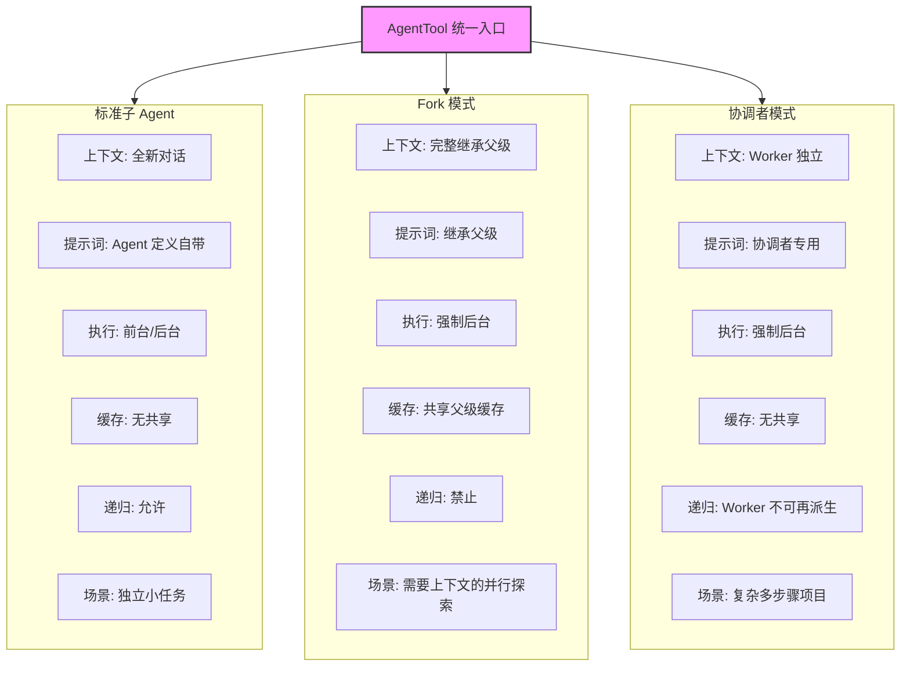
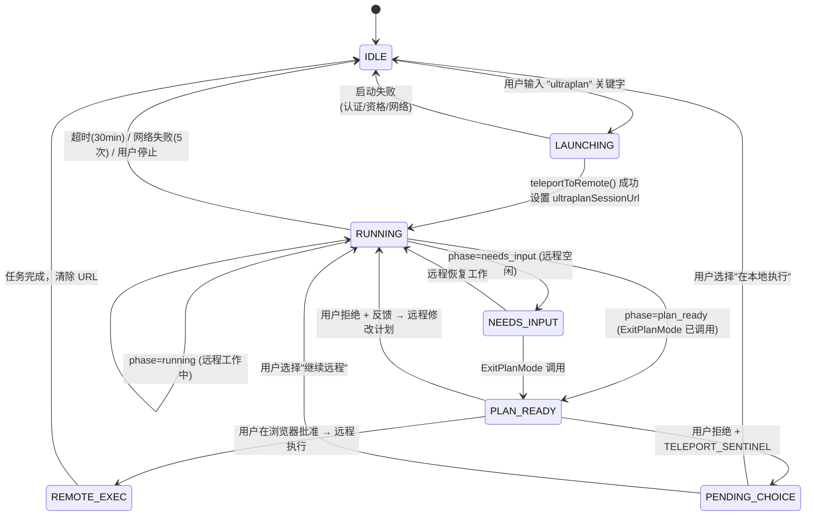

# 第20章：Agent 集群与多 Agent 编排

## 为什么需要多 Agent

单个 Agent Loop 的上下文窗口是有限资源。当任务规模超过单次对话所能承载的信息量——例如"调查这个 bug 的根因、修复它、跑测试、写 PR"——单 Agent 要么被迫在上下文中塞满中间结果，要么不断做压缩丢失细节。更本质的问题是：**单 Agent 无法并行**，而软件工程任务天然适合分治。

Claude Code 提供了三种递进的多 Agent 模式，从轻量到重量分别是：**子 Agent（Subagent）**、**Fork 模式** 和 **协调者模式（Coordinator Mode）**。它们共享同一个入口——`AgentTool`，但在上下文继承、执行模型和生命周期管理上有根本差异。本章将逐层解剖这三种模式，以及围绕它们构建的队友系统（Agent Swarms）和验证 Agent。

---

## 20.1 AgentTool：统一的 Agent 派生入口

所有 Agent 派生都通过同一个工具完成。`AgentTool` 在 `tools/AgentTool/AgentTool.tsx` 中定义，它的 `name` 是 `'Agent'`（第 226 行），别名为旧的 `'Task'`（第 228 行）。

### 输入 Schema 的动态组合

AgentTool 的输入 Schema 不是静态的——它根据 Feature Flag 和运行时条件动态组合：

```typescript
// tools/AgentTool/AgentTool.tsx:82-88
const baseInputSchema = lazySchema(() => z.object({
  description: z.string().describe('A short (3-5 word) description of the task'),
  prompt: z.string().describe('The task for the agent to perform'),
  subagent_type: z.string().optional(),
  model: z.enum(['sonnet', 'opus', 'haiku']).optional(),
  run_in_background: z.boolean().optional()
}));
```

基础 Schema 包含五个字段。当多 Agent 特性（Agent Swarms）启用时，还会合并 `name`、`team_name`、`mode` 字段（第 93-97 行）；`isolation` 字段支持 `'worktree'`（所有构建）或 `'remote'`（内部构建）；当后台任务被禁用或 Fork 模式启用时，`run_in_background` 字段会被 `.omit()` 移除（第 122-124 行）。

这种 Schema 动态组合有一个重要的设计意图：**模型看到的参数列表精确反映它当前可以使用的能力**。当 Fork 模式开启时，模型不会看到 `run_in_background`，因为 Fork 模式下所有 Agent 都自动后台化（第 557 行），模型无需也不应显式控制。

### AsyncLocalStorage 上下文隔离

当多个 Agent 在同一进程中并发运行时（例如用户按 Ctrl+B 将一个 Agent 放入后台后立即启动另一个），如何隔离它们的身份信息？答案是 `AsyncLocalStorage`。

```typescript
// utils/agentContext.ts:24
import { AsyncLocalStorage } from 'async_hooks'

// utils/agentContext.ts:93
const agentContextStorage = new AsyncLocalStorage<AgentContext>()

// utils/agentContext.ts:108-109
export function runWithAgentContext<T>(context: AgentContext, fn: () => T): T {
  return agentContextStorage.run(context, fn)
}
```

源码注释（`agentContext.ts` 第 17-21 行）直接解释了为什么不用 `AppState`：

> When agents are backgrounded (ctrl+b), multiple agents can run concurrently in the same process. AppState is a single shared state that would be overwritten, causing Agent A's events to incorrectly use Agent B's context. AsyncLocalStorage isolates each async execution chain, so concurrent agents don't interfere with each other.

`AgentContext` 是一个判别联合类型（discriminated union），通过 `agentType` 字段区分两种上下文：

| 上下文类型 | `agentType` 值 | 用途 | 关键字段 |
|:---:|:---:|:---|:---|
| `SubagentContext` | `'subagent'` | Agent 工具派生的子 Agent | `agentId`, `subagentName`, `isBuiltIn` |
| `TeammateAgentContext` | `'teammate'` | 队友 Agent（Swarm 成员） | `agentName`, `teamName`, `planModeRequired`, `isTeamLead` |

两种上下文都有 `invokingRequestId` 字段（第 43-49 行、第 77-83 行），用于追踪是谁派生了这个 Agent。`consumeInvokingRequestId()` 函数（第 163-178 行）实现了"稀疏边"语义：每次 spawn/resume 只在第一个 API 事件上发出一次 `invokingRequestId`，之后返回 `undefined`，避免重复标记。

---

## 20.2 三种 Agent 模式

### 模式一：标准子 Agent

这是最基本的模式。模型在调用 `Agent` 工具时指定 `subagent_type`，AgentTool 从已注册的 Agent 定义中查找匹配项，然后启动一个**全新的**对话。

路由逻辑在 `AgentTool.tsx` 第 322-356 行：

```typescript
// tools/AgentTool/AgentTool.tsx:322-323
const effectiveType = subagent_type
  ?? (isForkSubagentEnabled() ? undefined : GENERAL_PURPOSE_AGENT.agentType);
```

当 `subagent_type` 未指定且 Fork 模式关闭时，默认使用 `general-purpose` 类型。

内置 Agent 定义在 `builtInAgents.ts` 中注册（第 45-72 行），包括：

| Agent 类型 | 用途 | 工具限制 | 模型 |
|:---:|:---|:---|:---:|
| `general-purpose` | 通用任务：搜索、分析、多步骤操作 | 所有工具 | 默认 |
| `verification` | 验证实现正确性 | 禁止编辑工具 | 继承 |
| `Explore` | 代码探索 | - | - |
| `Plan` | 规划任务 | - | - |
| `claude-code-guide` | 使用指南 | - | - |

子 Agent 的关键特征是**上下文隔离**：它从零开始，只看到父 Agent 传入的 `prompt`。系统提示词也是独立生成的（第 518-534 行）。这意味着子 Agent 不知道父 Agent 的对话历史——它就像"一个刚走进房间的聪明同事"。

### 模式二：Fork 模式

Fork 模式是一个实验性特性，通过 `feature('FORK_SUBAGENT')` 构建时门控和运行时条件共同控制：

```typescript
// tools/AgentTool/forkSubagent.ts:32-39
export function isForkSubagentEnabled(): boolean {
  if (feature('FORK_SUBAGENT')) {
    if (isCoordinatorMode()) return false
    if (getIsNonInteractiveSession()) return false
    return true
  }
  return false
}
```

Fork 模式与标准子 Agent 的根本区别在于**上下文继承**。Fork 子进程继承父 Agent 的完整对话上下文和系统提示词：

```typescript
// tools/AgentTool/forkSubagent.ts:60-71
export const FORK_AGENT = {
  agentType: FORK_SUBAGENT_TYPE,
  tools: ['*'],
  maxTurns: 200,
  model: 'inherit',
  permissionMode: 'bubble',
  source: 'built-in',
  baseDir: 'built-in',
  getSystemPrompt: () => '',  // 未使用——继承父级的系统提示词
} satisfies BuiltInAgentDefinition
```

注意 `model: 'inherit'` 和 `getSystemPrompt: () => ''`——Fork 子进程使用父 Agent 的模型（保持上下文长度一致）和父 Agent 已渲染的系统提示词（保持字节完全一致以最大化提示词缓存命中）。

#### 提示词缓存共享

Fork 模式的核心价值在于**提示词缓存共享**。`buildForkedMessages()` 函数（`forkSubagent.ts` 第 107-164 行）构造的消息结构确保所有 Fork 子进程产生字节相同的 API 请求前缀：

1. 保留父 Agent 完整的 assistant 消息（所有 `tool_use` 块、thinking、text）
2. 为每个 `tool_use` 块构造相同的占位 `tool_result`（第 142-150 行，使用固定文本 `'Fork started — processing in background'`）
3. 只在最后追加一个 per-child 的指令文本块

```
[...历史消息, assistant(所有 tool_use 块), user(占位 tool_result..., 指令)]
```

只有最后一个文本块因 child 不同而不同，最大化缓存命中率。

#### 递归 Fork 防护

Fork 子进程的工具池中保留了 `Agent` 工具（为了缓存一致性），但在调用时会被拦截（第 332-334 行）：

```typescript
// tools/AgentTool/AgentTool.tsx:332-334
if (toolUseContext.options.querySource === `agent:builtin:${FORK_AGENT.agentType}`
    || isInForkChild(toolUseContext.messages)) {
  throw new Error('Fork is not available inside a forked worker.');
}
```

检测机制有两层：主检查通过 `querySource`（抗压缩——即使消息被 autocompact 重写也不会丢失），备用检查扫描消息中的 `<fork-boilerplate>` 标签（第 78-89 行）。

### 模式三：协调者模式（Coordinator Mode）

协调者模式通过环境变量 `CLAUDE_CODE_COORDINATOR_MODE` 激活：

```typescript
// coordinator/coordinatorMode.ts:36-41
export function isCoordinatorMode(): boolean {
  if (feature('COORDINATOR_MODE')) {
    return isEnvTruthy(process.env.CLAUDE_CODE_COORDINATOR_MODE)
  }
  return false
}
```

在这个模式下，主 Agent 变成一个**不直接编码的协调者**，它的工具集缩减为指挥工具：`Agent`（派生 Worker）、`SendMessage`（向 Worker 发送后续指令）、`TaskStop`（停止 Worker）等。Worker 拥有实际的编码工具。

协调者的系统提示词（`coordinatorMode.ts` 第 111-368 行）是一份详尽的编排规程，定义了四阶段工作流：

| 阶段 | 执行者 | 目的 |
|:---:|:---:|:---|
| Research | Worker（并行） | 调查代码库，定位问题 |
| Synthesis | **协调者** | 阅读结果，理解问题，编写实现规格 |
| Implementation | Worker | 按规格修改代码，提交 |
| Verification | Worker | 测试变更是否正确 |

提示词中最强调的原则是**"永远不要委托理解"**（第 256-259 行）：

> Never write "based on your findings" or "based on the research." These phrases delegate understanding to the worker instead of doing it yourself.

`getCoordinatorUserContext()` 函数（第 80-109 行）生成 Worker 工具上下文信息，包括 Worker 可用的工具列表和 MCP 服务器列表。当 Scratchpad 功能启用时，还会告知协调者可以使用一个共享目录进行跨 Worker 的知识持久化（第 104-106 行）。

### 三种模式对比



| 维度 | 标准子 Agent | Fork 模式 | 协调者模式 |
|:---:|:---:|:---:|:---:|
| 上下文继承 | 无（全新对话） | 完整继承 | 无（Worker 独立） |
| 系统提示词 | Agent 定义自带 | 继承父级 | 协调者专用提示词 |
| 模型选择 | 可覆盖 | 继承父级 | 不可覆盖 |
| 执行方式 | 前台/后台 | 强制后台 | 强制后台 |
| 缓存共享 | 无 | 共享父级缓存 | 无 |
| 工具池 | 独立组装 | 继承父级 | Worker 独立组装 |
| 递归派生 | 允许 | 禁止 | Worker 不可再派生 |
| 门控方式 | 始终可用 | 构建+运行时 | 构建+环境变量 |
| 适用场景 | 独立小任务 | 需要上下文的并行探索 | 复杂多步骤项目 |

---

## 20.3 队友 Agent（Agent Swarms）

队友系统是 Agent 编排的另一个维度。与子 Agent 的"父派生子"模型不同，队友系统创建一个**平面结构的团队**，团队中的 Agent 通过消息传递协作。

### TeamCreateTool：团队创建

`TeamCreateTool`（`tools/TeamCreateTool/TeamCreateTool.ts`）用于创建新团队：

```typescript
// tools/TeamCreateTool/TeamCreateTool.ts:37-49
const inputSchema = lazySchema(() =>
  z.strictObject({
    team_name: z.string().describe('Name for the new team to create.'),
    description: z.string().optional(),
    agent_type: z.string().optional()
      .describe('Type/role of the team lead'),
  }),
)
```

团队信息持久化到 `TeamFile` 中，包含团队名称、成员列表、Leader 信息等。团队名称需要唯一——如果冲突则自动生成一个 word slug（第 64-72 行）。

### TeammateAgentContext：队友上下文

队友使用 `TeammateAgentContext` 类型（`agentContext.ts` 第 60-85 行），包含丰富的团队协调信息：

```typescript
// utils/agentContext.ts:60-85
export type TeammateAgentContext = {
  agentId: string          // 完整 ID，如 "researcher@my-team"
  agentName: string        // 显示名称，如 "researcher"
  teamName: string         // 所属团队
  agentColor?: string      // UI 颜色
  planModeRequired: boolean // 是否需要计划审批
  parentSessionId: string  // Leader 的会话 ID
  isTeamLead: boolean      // 是否是 Leader
  agentType: 'teammate'
}
```

队友的 ID 格式是 `name@team-name`，这种格式使得在日志和通信中可以一眼看出 Agent 的身份和归属。

### 平面结构约束

队友系统有一个重要的架构约束：**队友不能派生其他队友**（第 272-274 行）：

```typescript
// tools/AgentTool/AgentTool.tsx:272-274
if (isTeammate() && teamName && name) {
  throw new Error('Teammates cannot spawn other teammates — the team roster is flat.');
}
```

这是刻意的设计——团队名册是一个扁平数组，嵌套的队友会导致名册中出现没有来源信息的条目，混淆 Leader 的协调逻辑。

同样，进程内队友（in-process teammate）不能派生后台 Agent（第 278-280 行），因为它们的生命周期绑定在 Leader 的进程上。

---

## 20.4 验证 Agent

验证 Agent 是内置 Agent 中设计最精致的一个。它的系统提示词（`built-in/verificationAgent.ts` 第 10-128 行）长达约 120 行，堪称一份"如何进行真正验证"的工程规范。

### 核心设计原则

验证 Agent 有两个明确声明的失败模式（第 12-13 行）：

1. **验证回避**（Verification avoidance）：面对检查时找理由不执行——阅读代码、叙述测试步骤、写 "PASS"，然后继续
2. **被前 80% 迷惑**：看到漂亮的 UI 或通过的测试套件就倾向于通过，没注意到一半按钮不起作用

### 严格的只读约束

验证 Agent 被明确禁止修改项目：

```typescript
// built-in/verificationAgent.ts:139-145
disallowedTools: [
  AGENT_TOOL_NAME,
  EXIT_PLAN_MODE_TOOL_NAME,
  FILE_EDIT_TOOL_NAME,
  FILE_WRITE_TOOL_NAME,
  NOTEBOOK_EDIT_TOOL_NAME,
],
```

但它**可以**在临时目录（`/tmp`）写入临时测试脚本——这个权限足够编写临时的测试工具但不会污染项目。

### VERDICT 判定

验证 Agent 的输出必须以严格格式的判定结尾（第 117-128 行）：

| 判定 | 含义 |
|:---:|:---|
| `VERDICT: PASS` | 验证通过 |
| `VERDICT: FAIL` | 发现问题，包含具体错误输出和复现步骤 |
| `VERDICT: PARTIAL` | 环境限制导致无法完全验证（非"不确定"） |

`PARTIAL` 仅用于环境限制（没有测试框架、工具不可用、服务器无法启动），不能用于"我不确定这是不是 bug"。

### 对抗性探测

验证 Agent 的提示词要求至少运行一个对抗性探测（第 63-69 行）：并发请求、边界值、幂等性、孤儿操作等。如果所有检查都只是"返回 200"或"测试套件通过"，说明只确认了快乐路径，不算真正的验证。

---

## 20.5 Agent 间通信

### SendMessageTool：消息路由

`SendMessageTool`（`tools/SendMessageTool/SendMessageTool.ts`）是 Agent 间通信的核心。它的 `to` 字段支持多种寻址方式：

```typescript
// tools/SendMessageTool/SendMessageTool.ts:69-76
to: z.string().describe(
  feature('UDS_INBOX')
    ? 'Recipient: teammate name, "*" for broadcast, "uds:<socket-path>" for a local peer, or "bridge:<session-id>" for a Remote Control peer'
    : 'Recipient: teammate name, or "*" for broadcast to all teammates',
),
```

消息类型是一个判别联合（第 47-65 行），支持：
- 纯文本消息
- 关闭请求（`shutdown_request`）
- 关闭响应（`shutdown_response`）
- 计划审批响应（`plan_approval_response`）

### 广播机制

当 `to` 为 `"*"` 时触发广播（`handleBroadcast`，第 191-266 行）：遍历团队文件中的所有成员（排除发送者自己），逐一写入邮箱。广播结果包含接收者列表，方便协调者跟踪。

### 邮箱系统

消息实际通过 `writeToMailbox()` 函数写入文件系统邮箱。每条消息包含：发送者名称、文本内容、摘要、时间戳和发送者颜色。这种基于文件系统的邮箱设计使得跨进程的队友（tmux 模式）可以通过共享文件系统通信。

### UDS_INBOX：Unix Domain Socket 扩展

当 `UDS_INBOX` Feature Flag 启用时，`SendMessageTool` 的寻址能力扩展到 Unix Domain Socket：`"uds:<socket-path>"` 可以向同一机器上的其他 Claude Code 实例发送消息，`"bridge:<session-id>"` 可以向 Remote Control 对等端发送消息。

这创建了一个超越单一团队边界的通信拓扑：

```
┌─────────────────────────────────────────────────────────────────┐
│                    Agent 间通信架构                              │
│                                                                 │
│  ┌──────────────────────────────────┐                          │
│  │        Team "my-team"            │                          │
│  │                                  │                          │
│  │  ┌─────────┐    MailBox    ┌─────────┐                     │
│  │  │ Leader  │◄────────────►│Teammate │                     │
│  │  │ (lead)  │   (文件系统)  │  (dev)  │                     │
│  │  └────┬────┘              └─────────┘                     │
│  │       │                                                    │
│  │       │ SendMessage(to: "tester")                         │
│  │       │                                                    │
│  │       ▼                                                    │
│  │  ┌─────────┐                                              │
│  │  │Teammate │                                              │
│  │  │ (tester)│                                              │
│  │  └─────────┘                                              │
│  └──────────────────────────────────┘                          │
│         │                                                      │
│         │ SendMessage(to: "uds:/tmp/other.sock")              │
│         ▼                                                      │
│  ┌──────────────┐                                              │
│  │ 其他 Claude  │    SendMessage(to: "bridge:<session>")       │
│  │ Code 实例    │──────────────────────────►  Remote Control   │
│  └──────────────┘                                              │
└─────────────────────────────────────────────────────────────────┘
```

### 协调者模式下的 Worker 结果回传

在协调者模式中，Worker 完成任务后的结果以 `<task-notification>` XML 格式作为**用户角色消息**注入协调者的对话中（`coordinatorMode.ts` 第 148-159 行）：

```xml
<task-notification>
  <task-id>{agentId}</task-id>
  <status>completed|failed|killed</status>
  <summary>{人类可读的状态摘要}</summary>
  <result>{Agent 的最终文本响应}</result>
  <usage>
    <total_tokens>N</total_tokens>
    <tool_uses>N</tool_uses>
    <duration_ms>N</duration_ms>
  </usage>
</task-notification>
```

协调者提示词明确要求（第 144 行）："它们看起来像用户消息但不是。通过 `<task-notification>` 开始标签区分它们。"这种设计避免了协调者把 Worker 结果当作用户输入来回应。

---

## 20.6 异步 Agent 的生命周期

当 `shouldRunAsync` 为 `true` 时（由 `run_in_background`、`background: true`、协调者模式、Fork 模式、助手模式等任一条件触发，第 567 行），Agent 进入异步生命周期：

1. **注册**：`registerAsyncAgent()` 创建后台任务记录，分配 `agentId`
2. **执行**：在 `runWithAgentContext()` 包裹下运行 `runAgent()`
3. **进度上报**：通过 `updateAsyncAgentProgress()` 和 `onProgress` 回调更新状态
4. **完成/失败**：调用 `completeAsyncAgent()` 或 `failAsyncAgent()`
5. **通知**：`enqueueAgentNotification()` 将结果注入调用者的消息流

关键的设计选择：后台 Agent 不与父 Agent 的 `abortController` 关联（第 694-696 行注释）——当用户按 ESC 取消主线程时，后台 Agent 继续运行。它们只能通过 `chat:killAgents` 显式终止。

### Worktree 隔离

当 `isolation: 'worktree'` 时，Agent 在临时 git worktree 中运行（第 590-593 行）：

```typescript
const slug = `agent-${earlyAgentId.slice(0, 8)}`;
worktreeInfo = await createAgentWorktree(slug);
```

Agent 完成后，如果 worktree 没有变更（与创建时的 HEAD commit 比较），则自动清理（第 666-679 行）。有变更的 worktree 会被保留，其路径和分支名返回给调用者。

---

## 20.7 工具池的独立组装

每个 Worker 的工具池是独立组装的，不继承父 Agent 的限制（第 573-577 行）：

```typescript
// tools/AgentTool/AgentTool.tsx:573-577
const workerPermissionContext = {
  ...appState.toolPermissionContext,
  mode: selectedAgent.permissionMode ?? 'acceptEdits'
};
const workerTools = assembleToolPool(workerPermissionContext, appState.mcp.tools);
```

唯一的例外是 Fork 模式：Fork 子进程使用父级的精确工具数组（`useExactTools: true`，第 631-633 行），因为工具定义的差异会破坏提示词缓存。

### MCP 服务器的等待与验证

Agent 定义可以声明所需的 MCP 服务器（`requiredMcpServers`）。AgentTool 在启动前会检查这些服务器是否可用（第 369-409 行），并在 MCP 服务器仍在连接中时等待最多 30 秒（第 379-391 行），带有提前退出逻辑——如果某个必需的服务器已经失败，就不再等待其他服务器了。

---

## 20.8 设计洞察

**为什么三种模式而非一种？** 这源于一个根本性的权衡：**上下文共享 vs. 执行隔离**。标准子 Agent 提供最大隔离但没有上下文；Fork 提供最大上下文共享但不能递归；协调者模式在中间——Worker 隔离但协调者保持全局视图。不存在一种通用方案能同时满足所有场景。

**平面团队结构的设计哲学**。禁止队友派生队友不仅是技术约束——它反映了一种组织原则：在一个有效的团队中，协调应该集中在一个节点（Leader），而不是形成任意深度的委托链。这与软件工程中"避免过深的调用栈"的直觉一致。

**验证 Agent 的"反模式清单"设计**。验证 Agent 的提示词显式列出了 LLM 作为验证者时的典型失败模式（第 53-61 行），并要求它"认出自己的合理化借口"。这种 meta-cognition 提示是对 LLM 固有弱点的工程补偿——不是期望模型不犯这些错误，而是让模型知道它倾向于犯这些错误。

---

## 用户能做什么

**利用多 Agent 模式提升工作效率：**

1. **善用子 Agent 做独立调查**。当需要在不干扰主对话上下文的情况下完成一个独立子任务（如"查找这个 API 的所有调用方"），让模型启动一个子 Agent 是最佳选择。子 Agent 有自己的上下文窗口，完成后返回摘要，不会污染主对话。

2. **理解协调者模式的四阶段流程**。如果你的组织启用了协调者模式（`CLAUDE_CODE_COORDINATOR_MODE=true`），了解其 Research → Synthesis → Implementation → Verification 的四阶段流程有助于更好地与之协作。特别注意：协调者不会直接编码，它只负责理解问题和分配任务。

3. **利用验证 Agent 进行质量把关**。当完成复杂变更后，可以显式要求运行验证 Agent。它的只读约束和对抗性探测设计使其成为可靠的"第二双眼睛"。

4. **注意 Agent 间通信的寻址方式**。如果使用队友系统，`SendMessageTool` 支持名称寻址（`"tester"`）、广播（`"*"`）和 UDS 寻址（`"uds:<path>"`）。理解这些寻址方式有助于设计更高效的多 Agent 工作流。

5. **Worktree 隔离保护主分支**。当 Agent 使用 `isolation: 'worktree'` 时，所有修改都在临时 git worktree 中进行。无变更的 worktree 会自动清理，有变更的则保留分支——这意味着你可以放心让 Agent 尝试实验性修改。

---

## 版本演化：Ultraplan — 远程多代理规划系统

> 以下分析基于 v2.1.88 完整源码（`restored-src/src/commands/ultraplan.tsx` 等 26 个文件）+ v2.1.91 bundle 逆向。Ultraplan 在 v2.1.88 源码中已有完整实现，v2.1.91 新增了 5 个遥测事件和 GrowthBook 驱动的提示词变体系统。

### 为什么需要 Ultraplan

本章前文描述的多 Agent 编排都是**本地的**——Agent 在用户终端中运行，占用终端的输入输出，上下文窗口与用户共享。Ultraplan 解决的问题是：**把计划阶段卸载到远程**，让用户终端保持可用。

| 维度 | 本地 Plan Mode | Ultraplan |
|------|---------------|-----------|
| 运行位置 | 本地终端 | CCR（Claude Code on the web）远程容器 |
| 模型 | 当前会话模型 | 强制 Opus 4.6（GrowthBook `tengu_ultraplan_model` 配置） |
| 探索方式 | 单 Agent 顺序探索 | 可选多 Agent 并行探索（视提示词变体） |
| 超时 | 无硬超时 | 30 分钟（GrowthBook `tengu_ultraplan_timeout_seconds`，默认 1800） |
| 用户终端 | 被阻塞 | 保持可用，可继续其他工作 |
| 结果交付 | 直接在会话中执行 | "远程执行并创建 PR"或"传送回本地终端执行" |
| 审批 | 终端对话框 | 浏览器 PlanModal |

### 架构总览

Ultraplan 由 5 个核心模块组成：

```
┌──────────────────────────────────────────────────────────────┐
│                    用户终端（本地）                           │
│                                                              │
│  PromptInput.tsx                processUserInput.ts           │
│  ┌─────────────┐              ┌──────────────────┐           │
│  │ 关键字检测   │─→ 彩虹高亮   │ "ultraplan" 替换  │           │
│  │ + 通知气泡   │              │ → /ultraplan 命令  │          │
│  └─────────────┘              └────────┬─────────┘           │
│                                        ↓                     │
│  commands/ultraplan.tsx ──────────────────────────            │
│  ┌─────────────────────────────────────────────┐             │
│  │ launchUltraplan()                           │             │
│  │  ├─ checkRemoteAgentEligibility()           │             │
│  │  ├─ buildUltraplanPrompt(blurb, seed, id)   │             │
│  │  ├─ teleportToRemote() ──→ CCR 会话创建     │             │
│  │  ├─ registerRemoteAgentTask()               │             │
│  │  └─ startDetachedPoll() ──→ 后台轮询        │             │
│  └───────────────────────────┬─────────────────┘             │
│                              ↓                               │
│  utils/ultraplan/ccrSession.ts                               │
│  ┌─────────────────────────────────────────────┐             │
│  │ pollForApprovedExitPlanMode()               │             │
│  │  ├─ 每 3 秒轮询远程会话事件                  │             │
│  │  ├─ ExitPlanModeScanner.ingest() 状态机     │             │
│  │  └─ 阶段检测: running → needs_input → ready │             │
│  └───────────────────────────┬─────────────────┘             │
│                              ↓                               │
│  任务系统 Pill 显示                                           │
│  ◇ ultraplan (运行中)                                        │
│  ◇ ultraplan needs your input (远程空闲)                      │
│  ◆ ultraplan ready (计划就绪)                                │
└──────────────────────────────────────────────────────────────┘
                               ↕ HTTP 轮询
┌──────────────────────────────────────────────────────────────┐
│                   CCR 远程容器                                │
│                                                              │
│  Opus 4.6 + plan mode 权限                                   │
│  ├─ 探索代码库（Glob/Grep/Read）                              │
│  ├─ 可选：Task 工具生成并行子代理                              │
│  ├─ 调用 ExitPlanMode 提交计划                                │
│  └─ 等待用户审批（批准/拒绝/传送回本地）                       │
└──────────────────────────────────────────────────────────────┘
```

### CCR 是什么——"远程工作中"的含义

架构图中的"CCR 远程容器"是 **Claude Code Remote**（Claude Code on the web）的缩写，本质上是 Anthropic 服务器上运行的一个完整 Claude Code 实例：

```
你的终端（本地 CLI 客户端）           Anthropic 云端（CCR 容器）
┌──────────────────────┐            ┌────────────────────────────┐
│ 只负责：              │            │ 运行着：                    │
│ · 打包上传代码库      │──HTTP──→   │ · 完整的 Claude Code 实例   │
│ · 显示任务 Pill       │            │ · Opus 4.6 模型（强制）     │
│ · 每 3 秒轮询状态     │←─轮询──    │ · 你的代码库副本（bundle）  │
│ · 接收最终计划        │            │ · Glob/Grep/Read 等工具    │
│                      │            │ · 可选：多个子代理并行探索   │
│ 你可以继续其他工作    │            │ · Plan mode 权限（只读）    │
└──────────────────────┘            └────────────────────────────┘
```

CCR 容器通过 `teleportToRemote()` 创建。启动时，你的代码库被打包上传（bundle），远程端获得完整的代码访问能力。远程 Agent Loop 向 Claude API 发请求，与你本地使用 Claude Code 时完全一致——区别在于它用的是 Opus 4.6 模型、运行在 Anthropic 基础设施上、且不占用你的终端。

### 用户能做什么

**触发方式**：

1. **关键字触发**——在提示词中自然写出 "ultraplan"：
   ```
   ultraplan 重构认证模块，需要支持 OAuth2 和 API key 两种方式
   ```
2. **Slash 命令**——显式调用 `/ultraplan <描述>`

**前提条件**（`checkRemoteAgentEligibility()` 检查）：
- 已通过 OAuth 登录 Claude Code
- 订阅级别支持远程 Agent（Pro/Max/Team/Enterprise）
- Feature Flag `ULTRAPLAN` 已对账户开启（GrowthBook 服务端控制）

**判断是否可用**：输入包含 "ultraplan" 的文字后，如果关键字出现彩虹高亮并弹出通知"This prompt will launch an ultraplan session in Claude Code on the web"，说明功能已开启。无反应则表示 feature flag 未对你的账户启用。

**使用流程**：

```
1. 输入包含 "ultraplan" 的提示词
2. 确认启动对话框
3. 终端显示 CCR URL，你可以继续其他工作
4. 任务栏 Pill 显示进度：
   ◇ ultraplan               → 远程探索代码库中
   ◇ ultraplan needs your input → 需要你在浏览器中操作
   ◆ ultraplan ready          → 计划就绪，等待审批
5. 在浏览器中审批计划：
   a. 批准 → 远程执行并创建 Pull Request
   b. 拒绝 + 反馈 → 远程根据反馈修改后重新提交
   c. 传送回本地 → 计划回到你的终端中执行
6. 如需中途停止，通过任务系统取消即可
```

**源码位置**：

| 文件 | 行数 | 职责 |
|------|------|------|
| `commands/ultraplan.tsx` | 470 | 主命令：启动、轮询、停止、错误处理 |
| `utils/ultraplan/ccrSession.ts` | 350 | 轮询状态机、ExitPlanModeScanner、阶段检测 |
| `utils/ultraplan/keyword.ts` | 128 | 关键字检测：触发规则、上下文排除 |
| `state/AppStateStore.ts` | — | 状态字段：`ultraplanSessionUrl`、`ultraplanPendingChoice` 等 |
| `tasks/RemoteAgentTask/` | — | 远程任务注册和生命周期管理 |
| `components/PromptInput/PromptInput.tsx` | — | 关键字彩虹高亮 + 通知气泡 |

### 关键字触发系统

用户不需要输入 `/ultraplan`——只要在提示词中自然地写出 "ultraplan" 即可触发。

```typescript
// restored-src/src/utils/ultraplan/keyword.ts
export function findUltraplanTriggerPositions(text: string): TriggerPosition[]
export function hasUltraplanKeyword(text: string): boolean
export function replaceUltraplanKeyword(text: string): string
```

**排除规则**——以下上下文中的 "ultraplan" 不会触发：

| 上下文 | 示例 | 原因 |
|--------|------|------|
| 引号/反引号中 | `` `ultraplan` `` | 代码引用 |
| 路径中 | `src/ultraplan/foo.ts` | 文件路径 |
| 标识符中 | `--ultraplan-mode` | CLI 参数 |
| 文件扩展名前 | `ultraplan.tsx` | 文件名 |
| 问号后 | `ultraplan?` | 询问功能而非触发 |
| `/` 开头 | `/ultraplan` | 走 slash 命令路径 |

触发后，`processUserInput.ts` 将关键字替换为 `/ultraplan {rewritten prompt}` 并路由到命令处理器。

### 状态机：生命周期管理

Ultraplan 使用 5 个 AppState 字段管理生命周期：

```typescript
// restored-src/src/state/AppStateStore.ts
ultraplanLaunching?: boolean         // 启动中（防止重复启动，~5秒窗口）
ultraplanSessionUrl?: string         // 活跃会话 URL（存在时禁用关键字触发）
ultraplanPendingChoice?: {           // 已审批的计划等待用户选择执行位置
  plan: string
  sessionId: string
  taskId: string
}
ultraplanLaunchPending?: {           // 启动前确认对话框状态
  blurb: string
}
isUltraplanMode?: boolean            // 远程端标志（通过 set_permission_mode 设置）
```

**状态转换图**：



### 轮询与阶段检测

`startDetachedPoll()` 以后台 async IIFE 运行，不阻塞终端：

```typescript
// restored-src/src/utils/ultraplan/ccrSession.ts

const POLL_INTERVAL_MS = 3000             // 每 3 秒轮询
const MAX_CONSECUTIVE_FAILURES = 5        // 连续 5 次网络错误后放弃
const ULTRAPLAN_TIMEOUT_MS = 30 * 60 * 1000  // 30 分钟超时
```

**ExitPlanModeScanner** 是纯无状态事件处理器，从远程会话事件流中提取信号：

```typescript
// 扫描结果类型
type ScanResult =
  | { kind: 'approved'; plan: string }    // 用户批准（远程执行）
  | { kind: 'teleport'; plan: string }    // 用户拒绝 + 传送标记（本地执行）
  | { kind: 'rejected'; id: string }      // 普通拒绝（修改后重新提交）
  | { kind: 'pending' }                   // ExitPlanMode 已调用，等待审批
  | { kind: 'terminated'; subtype: string } // 会话终止
  | { kind: 'unchanged' }                 // 无新信号
```

**阶段检测逻辑**：

```typescript
// 判断远程会话当前阶段
const quietIdle =
  (sessionStatus === 'idle' || sessionStatus === 'requires_action') &&
  newEvents.length === 0

const phase: UltraplanPhase = scanner.hasPendingPlan
  ? 'plan_ready'      // ExitPlanMode 已调用，等待浏览器审批
  : quietIdle
    ? 'needs_input'    // 远程空闲，可能需要用户输入
    : 'running'        // 正常工作中
```

### GrowthBook 驱动的提示词变体（v2.1.91 新增）

v2.1.91 引入了 `tengu_ultraplan_prompt_identifier` 事件，暴露了一个 **GrowthBook 控制的提示词变体系统**。从 bundle 中提取到至少 3 种提示词变体：

**变体 1: `simple_plan`（默认）** — 轻量单代理规划

```
You're running in a remote planning session.
Run a lightweight planning process, consistent with how you would
in regular plan mode:
- Explore the codebase directly with Glob, Grep, and Read.
- Do not spawn subagents.
When you've settled on an approach, call ExitPlanMode with the plan.
```

**变体 2: 多代理探索** — 使用 Task 工具生成并行子代理

```
Produce an exceptionally thorough implementation plan using
multi-agent exploration.
Instructions:
1. Use the Task tool to spawn parallel agents to explore different
   aspects of the codebase simultaneously:
   - One agent to understand the relevant existing code and architecture
   - One agent to find all files that will need modification
   - One agent to identify potential risks, edge cases, and dependencies
2. Synthesize their findings into a detailed, step-by-step plan.
3. Use the Task tool to spawn a critique agent to review the plan.
4. Incorporate the critique feedback, then call ExitPlanMode.
```

**变体切换机制**：

```typescript
// v2.1.91 bundle 逆向
function getPromptIdentifier(): string {
  // 从 GrowthBook 读取，默认 "simple_plan"
  let id = getFeatureValue('tengu_ultraplan_prompt_identifier', 'simple_plan')
  return isValidId(id) ? id : 'simple_plan'
}

function getTimeout(): number {
  // 从 GrowthBook 读取，默认 1800 秒 (30 分钟)
  return getFeatureValue('tengu_ultraplan_timeout_seconds', 1800) * 1000
}
```

这意味着 Anthropic 可以通过 GrowthBook A/B 测试不同的规划策略，而无需发版。`tengu_ultraplan_config` 事件记录每次启动时使用的具体配置组合。

### 计划传送协议

当用户在浏览器中拒绝计划但选择"传送回本地终端"时，浏览器在反馈中注入一个哨兵字符串：

```typescript
const ULTRAPLAN_TELEPORT_SENTINEL = '__ULTRAPLAN_TELEPORT_LOCAL__'
```

远程端的提示词明确指示模型识别此哨兵：

> If the feedback contains `__ULTRAPLAN_TELEPORT_LOCAL__`, DO NOT implement — the plan has been teleported to the user's local terminal. Respond only with "Plan teleported. Return to your terminal to continue."

本地端的 `ExitPlanModeScanner` 检测到哨兵后，提取计划文本并设置 `ultraplanPendingChoice`，弹出选择对话框让用户决定在本地执行还是继续远程。

### 错误处理矩阵

| 错误 | 原因码 | 发生时机 | 恢复策略 |
|------|--------|---------|---------|
| `UltraplanPollError` | `terminated` | 远程会话异常终止 | 通知用户 + 归档会话 |
| `UltraplanPollError` | `timeout_pending` | 30 分钟超时，计划已到 pending | 通知 + 归档 |
| `UltraplanPollError` | `timeout_no_plan` | 30 分钟超时，ExitPlanMode 从未调用 | 通知 + 归档 |
| `UltraplanPollError` | `network_or_unknown` | 连续 5 次网络错误 | 通知 + 归档 |
| `UltraplanPollError` | `stopped` | 用户手动停止 | 提前退出，kill 处理归档 |
| 启动错误 | `precondition` | 认证/订阅/资格不足 | 通知用户 |
| 启动错误 | `bundle_fail` | Bundle 创建失败 | 通知用户 |
| 启动错误 | `teleport_null` | 远程会话创建返回 null | 通知用户 |
| 启动错误 | `unexpected_error` | 异常 | 归档孤儿会话 + 清除 URL |

### 遥测事件全景

| 事件 | 来源版本 | 触发时机 | 关键元数据 |
|------|---------|---------|-----------|
| `tengu_ultraplan_keyword` | v2.1.88 | 用户输入中检测到关键字 | — |
| `tengu_ultraplan_launched` | v2.1.88 | CCR 会话创建成功 | `has_seed_plan`, `model`, `prompt_identifier` |
| `tengu_ultraplan_approved` | v2.1.88 | 计划被批准 | `duration_ms`, `plan_length`, `reject_count`, `execution_target` |
| `tengu_ultraplan_awaiting_input` | v2.1.88 | 阶段变为 needs_input | — |
| `tengu_ultraplan_failed` | v2.1.88 | 轮询错误 | `duration_ms`, `reason`, `reject_count` |
| `tengu_ultraplan_create_failed` | v2.1.88 | 启动失败 | `reason`, `precondition_errors` |
| `tengu_ultraplan_model` | v2.1.88 | GrowthBook 配置名 | 模型 ID（默认 Opus 4.6） |
| `tengu_ultraplan_config` | **v2.1.91** | 启动时记录配置组合 | 模型 + 超时 + 提示词变体 |
| `tengu_ultraplan_keyword` | **v2.1.91** | （复用）增强触发追踪 | — |
| `tengu_ultraplan_prompt_identifier` | **v2.1.91** | GrowthBook 配置名 | 提示词变体 ID |
| `tengu_ultraplan_stopped` | **v2.1.91** | 用户手动停止 | — |
| `tengu_ultraplan_timeout_seconds` | **v2.1.91** | GrowthBook 配置名 | 超时秒数（默认 1800） |

### 模式提炼：远程卸载模式（Remote Offloading Pattern）

Ultraplan 体现了一种可复用的架构模式——**远程卸载**：

```
本地终端                        远程容器
┌──────────┐                   ┌──────────────┐
│ 快速反馈  │───创建会话──→      │ 长时间运行    │
│ 继续可用  │                   │ 高算力模型    │
│          │←──轮询状态──       │ 多代理并行    │
│ Pill 显示 │                   │              │
│ ◇/◆ 状态 │←──计划就绪──      │ ExitPlanMode │
│          │                   │              │
│ 选择执行  │───批准/传送──→    │ 执行/停止     │
└──────────┘                   └──────────────┘
```

**核心设计决策**：

1. **异步分离**：`startDetachedPoll()` 以 async IIFE 启动，立即返回用户友好消息，不阻塞终端事件循环
2. **状态机驱动 UI**：三相（running/needs_input/plan_ready）映射到任务 Pill 的视觉状态（◇/◆），用户无需打开浏览器即可感知远程进度
3. **哨兵协议**：`__ULTRAPLAN_TELEPORT_LOCAL__` 利用工具结果文本作为进程间通信通道——简单但有效
4. **GrowthBook 驱动变体**：模型、超时、提示词变体均为远程可配的 feature flag，支持 A/B 测试而无需发版
5. **孤儿防护**：所有错误路径都执行 `archiveRemoteSession()` 归档，防止 CCR 会话泄漏

### 子代理增强（v2.1.91）

v2.1.91 还新增了多个子代理相关事件，与 Ultraplan 的多代理策略形成互补：

- `tengu_forked_agent_default_turns_exceeded` — 分叉代理超过默认回合限制，触发成本控制
- `tengu_subagent_lean_schema_applied` — 子代理使用精简 schema（减少上下文占用）
- `tengu_subagent_md_report_blocked` — 子代理尝试生成 CLAUDE.md 报告时被阻断（安全边界）
- `tengu_mcp_subagent_prompt` — MCP 子代理的提示词注入追踪
- `CLAUDE_CODE_AGENT_COST_STEER`（新环境变量）— 子代理成本引导机制
