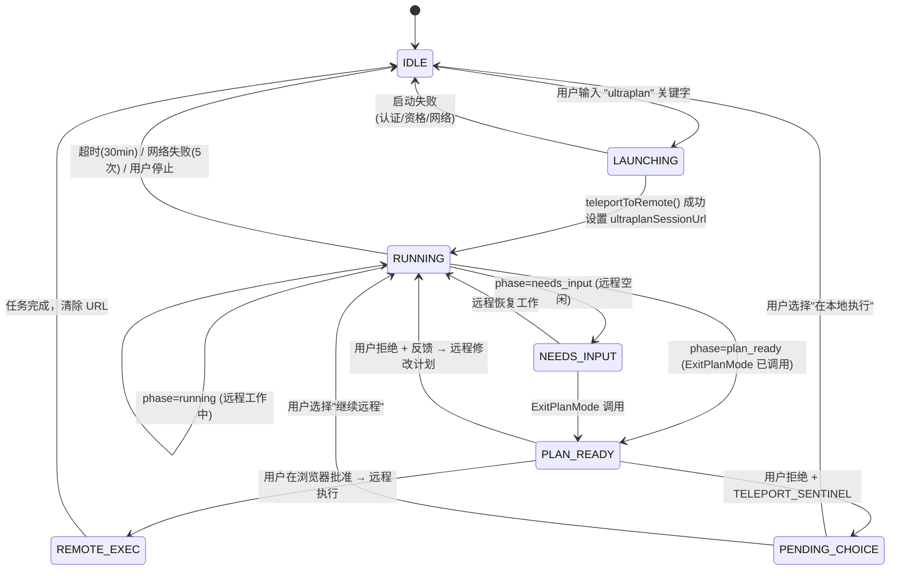

# 第20c章：Ultraplan — 远程多代理规划

> **定位**：本章分析 Claude Code 的远程规划能力——将计划阶段卸载到 CCR 远程容器执行。前置依赖：第20章。适用场景：想了解 CC 远程规划能力（CCR 架构、状态机、传送协议）的读者。

### 为什么需要 Ultraplan

本章前文描述的多 Agent 编排都是**本地的**——Agent 在用户终端中运行，占用终端的输入输出，上下文窗口与用户共享。Ultraplan 解决的问题是：**把计划阶段卸载到远程**，让用户终端保持可用。

| 维度 | 本地 Plan Mode | Ultraplan |
|------|---------------|-----------|
| 运行位置 | 本地终端 | CCR（Claude Code on the web）远程容器 |
| 模型 | 当前会话模型 | 强制 Opus 4.6（GrowthBook `tengu_ultraplan_model` 配置） |
| 探索方式 | 单 Agent 顺序探索 | 可选多 Agent 并行探索（视提示词变体） |
| 超时 | 无硬超时 | 30 分钟（GrowthBook `tengu_ultraplan_timeout_seconds`，默认 1800） |
| 用户终端 | 被阻塞 | 保持可用，可继续其他工作 |
| 结果交付 | 直接在会话中执行 | "远程执行并创建 PR"或"传送回本地终端执行" |
| 审批 | 终端对话框 | 浏览器 PlanModal |

### 架构总览

Ultraplan 由 5 个核心模块组成：

```
┌──────────────────────────────────────────────────────────────┐
│                    用户终端（本地）                           │
│                                                              │
│  PromptInput.tsx                processUserInput.ts           │
│  ┌─────────────┐              ┌──────────────────┐           │
│  │ 关键字检测   │─→ 彩虹高亮   │ "ultraplan" 替换  │           │
│  │ + 通知气泡   │              │ → /ultraplan 命令  │          │
│  └─────────────┘              └────────┬─────────┘           │
│                                        ↓                     │
│  commands/ultraplan.tsx ──────────────────────────            │
│  ┌─────────────────────────────────────────────┐             │
│  │ launchUltraplan()                           │             │
│  │  ├─ checkRemoteAgentEligibility()           │             │
│  │  ├─ buildUltraplanPrompt(blurb, seed, id)   │             │
│  │  ├─ teleportToRemote() ──→ CCR 会话创建     │             │
│  │  ├─ registerRemoteAgentTask()               │             │
│  │  └─ startDetachedPoll() ──→ 后台轮询        │             │
│  └───────────────────────────┬─────────────────┘             │
│                              ↓                               │
│  utils/ultraplan/ccrSession.ts                               │
│  ┌─────────────────────────────────────────────┐             │
│  │ pollForApprovedExitPlanMode()               │             │
│  │  ├─ 每 3 秒轮询远程会话事件                  │             │
│  │  ├─ ExitPlanModeScanner.ingest() 状态机     │             │
│  │  └─ 阶段检测: running → needs_input → ready │             │
│  └───────────────────────────┬─────────────────┘             │
│                              ↓                               │
│  任务系统 Pill 显示                                           │
│  ◇ ultraplan (运行中)                                        │
│  ◇ ultraplan needs your input (远程空闲)                      │
│  ◆ ultraplan ready (计划就绪)                                │
└──────────────────────────────────────────────────────────────┘
                               ↕ HTTP 轮询
┌──────────────────────────────────────────────────────────────┐
│                   CCR 远程容器                                │
│                                                              │
│  Opus 4.6 + plan mode 权限                                   │
│  ├─ 探索代码库（Glob/Grep/Read）                              │
│  ├─ 可选：Task 工具生成并行子代理                              │
│  ├─ 调用 ExitPlanMode 提交计划                                │
│  └─ 等待用户审批（批准/拒绝/传送回本地）                       │
└──────────────────────────────────────────────────────────────┘
```

### CCR 是什么——"远程工作中"的含义

架构图中的"CCR 远程容器"是 **Claude Code Remote**（Claude Code on the web）的缩写，本质上是 Anthropic 服务器上运行的一个完整 Claude Code 实例：

```
你的终端（本地 CLI 客户端）           Anthropic 云端（CCR 容器）
┌──────────────────────┐            ┌────────────────────────────┐
│ 只负责：              │            │ 运行着：                    │
│ · 打包上传代码库      │──HTTP──→   │ · 完整的 Claude Code 实例   │
│ · 显示任务 Pill       │            │ · Opus 4.6 模型（强制）     │
│ · 每 3 秒轮询状态     │←─轮询──    │ · 你的代码库副本（bundle）  │
│ · 接收最终计划        │            │ · Glob/Grep/Read 等工具    │
│                      │            │ · 可选：多个子代理并行探索   │
│ 你可以继续其他工作    │            │ · Plan mode 权限（只读）    │
└──────────────────────┘            └────────────────────────────┘
```

CCR 容器通过 `teleportToRemote()` 创建。启动时，你的代码库被打包上传（bundle），远程端获得完整的代码访问能力。远程 Agent Loop 向 Claude API 发请求，与你本地使用 Claude Code 时完全一致——区别在于它用的是 Opus 4.6 模型、运行在 Anthropic 基础设施上、且不占用你的终端。

### 用户能做什么

**触发方式**：

1. **关键字触发**——在提示词中自然写出 "ultraplan"：
   ```
   ultraplan 重构认证模块，需要支持 OAuth2 和 API key 两种方式
   ```
2. **Slash 命令**——显式调用 `/ultraplan <描述>`

**前提条件**（`checkRemoteAgentEligibility()` 检查）：
- 已通过 OAuth 登录 Claude Code
- 订阅级别支持远程 Agent（Pro/Max/Team/Enterprise）
- Feature Flag `ULTRAPLAN` 已对账户开启（GrowthBook 服务端控制）

**判断是否可用**：输入包含 "ultraplan" 的文字后，如果关键字出现彩虹高亮并弹出通知"This prompt will launch an ultraplan session in Claude Code on the web"，说明功能已开启。无反应则表示 feature flag 未对你的账户启用。

**使用流程**：

```
1. 输入包含 "ultraplan" 的提示词
2. 确认启动对话框
3. 终端显示 CCR URL，你可以继续其他工作
4. 任务栏 Pill 显示进度：
   ◇ ultraplan               → 远程探索代码库中
   ◇ ultraplan needs your input → 需要你在浏览器中操作
   ◆ ultraplan ready          → 计划就绪，等待审批
5. 在浏览器中审批计划：
   a. 批准 → 远程执行并创建 Pull Request
   b. 拒绝 + 反馈 → 远程根据反馈修改后重新提交
   c. 传送回本地 → 计划回到你的终端中执行
6. 如需中途停止，通过任务系统取消即可
```

**源码位置**：

| 文件 | 行数 | 职责 |
|------|------|------|
| `commands/ultraplan.tsx` | 470 | 主命令：启动、轮询、停止、错误处理 |
| `utils/ultraplan/ccrSession.ts` | 350 | 轮询状态机、ExitPlanModeScanner、阶段检测 |
| `utils/ultraplan/keyword.ts` | 128 | 关键字检测：触发规则、上下文排除 |
| `state/AppStateStore.ts` | — | 状态字段：`ultraplanSessionUrl`、`ultraplanPendingChoice` 等 |
| `tasks/RemoteAgentTask/` | — | 远程任务注册和生命周期管理 |
| `components/PromptInput/PromptInput.tsx` | — | 关键字彩虹高亮 + 通知气泡 |

### 关键字触发系统

用户不需要输入 `/ultraplan`——只要在提示词中自然地写出 "ultraplan" 即可触发。

```typescript
// restored-src/src/utils/ultraplan/keyword.ts
export function findUltraplanTriggerPositions(text: string): TriggerPosition[]
export function hasUltraplanKeyword(text: string): boolean
export function replaceUltraplanKeyword(text: string): string
```

**排除规则**——以下上下文中的 "ultraplan" 不会触发：

| 上下文 | 示例 | 原因 |
|--------|------|------|
| 引号/反引号中 | `` `ultraplan` `` | 代码引用 |
| 路径中 | `src/ultraplan/foo.ts` | 文件路径 |
| 标识符中 | `--ultraplan-mode` | CLI 参数 |
| 文件扩展名前 | `ultraplan.tsx` | 文件名 |
| 问号后 | `ultraplan?` | 询问功能而非触发 |
| `/` 开头 | `/ultraplan` | 走 slash 命令路径 |

触发后，`processUserInput.ts` 将关键字替换为 `/ultraplan {rewritten prompt}` 并路由到命令处理器。

### 状态机：生命周期管理

Ultraplan 使用 5 个 AppState 字段管理生命周期：

```typescript
// restored-src/src/state/AppStateStore.ts
ultraplanLaunching?: boolean         // 启动中（防止重复启动，~5秒窗口）
ultraplanSessionUrl?: string         // 活跃会话 URL（存在时禁用关键字触发）
ultraplanPendingChoice?: {           // 已审批的计划等待用户选择执行位置
  plan: string
  sessionId: string
  taskId: string
}
ultraplanLaunchPending?: {           // 启动前确认对话框状态
  blurb: string
}
isUltraplanMode?: boolean            // 远程端标志（通过 set_permission_mode 设置）
```

**状态转换图**：



### 轮询与阶段检测

`startDetachedPoll()` 以后台 async IIFE 运行，不阻塞终端：

```typescript
// restored-src/src/utils/ultraplan/ccrSession.ts

const POLL_INTERVAL_MS = 3000             // 每 3 秒轮询
const MAX_CONSECUTIVE_FAILURES = 5        // 连续 5 次网络错误后放弃
const ULTRAPLAN_TIMEOUT_MS = 30 * 60 * 1000  // 30 分钟超时
```

**ExitPlanModeScanner** 是纯无状态事件处理器，从远程会话事件流中提取信号：

```typescript
// 扫描结果类型
type ScanResult =
  | { kind: 'approved'; plan: string }    // 用户批准（远程执行）
  | { kind: 'teleport'; plan: string }    // 用户拒绝 + 传送标记（本地执行）
  | { kind: 'rejected'; id: string }      // 普通拒绝（修改后重新提交）
  | { kind: 'pending' }                   // ExitPlanMode 已调用，等待审批
  | { kind: 'terminated'; subtype: string } // 会话终止
  | { kind: 'unchanged' }                 // 无新信号
```

**阶段检测逻辑**：

```typescript
// 判断远程会话当前阶段
const quietIdle =
  (sessionStatus === 'idle' || sessionStatus === 'requires_action') &&
  newEvents.length === 0

const phase: UltraplanPhase = scanner.hasPendingPlan
  ? 'plan_ready'      // ExitPlanMode 已调用，等待浏览器审批
  : quietIdle
    ? 'needs_input'    // 远程空闲，可能需要用户输入
    : 'running'        // 正常工作中
```

### GrowthBook 驱动的提示词变体（v2.1.91 新增）

v2.1.91 引入了 `tengu_ultraplan_prompt_identifier` 事件，暴露了一个 **GrowthBook 控制的提示词变体系统**。从 bundle 中提取到至少 3 种提示词变体：

**变体 1: `simple_plan`（默认）** — 轻量单代理规划

```
You're running in a remote planning session.
Run a lightweight planning process, consistent with how you would
in regular plan mode:
- Explore the codebase directly with Glob, Grep, and Read.
- Do not spawn subagents.
When you've settled on an approach, call ExitPlanMode with the plan.
```

**变体 2: 多代理探索** — 使用 Task 工具生成并行子代理

```
Produce an exceptionally thorough implementation plan using
multi-agent exploration.
Instructions:
1. Use the Task tool to spawn parallel agents to explore different
   aspects of the codebase simultaneously:
   - One agent to understand the relevant existing code and architecture
   - One agent to find all files that will need modification
   - One agent to identify potential risks, edge cases, and dependencies
2. Synthesize their findings into a detailed, step-by-step plan.
3. Use the Task tool to spawn a critique agent to review the plan.
4. Incorporate the critique feedback, then call ExitPlanMode.
```

**变体切换机制**：

```typescript
// v2.1.91 bundle 逆向
function getPromptIdentifier(): string {
  // 从 GrowthBook 读取，默认 "simple_plan"
  let id = getFeatureValue('tengu_ultraplan_prompt_identifier', 'simple_plan')
  return isValidId(id) ? id : 'simple_plan'
}

function getTimeout(): number {
  // 从 GrowthBook 读取，默认 1800 秒 (30 分钟)
  return getFeatureValue('tengu_ultraplan_timeout_seconds', 1800) * 1000
}
```

这意味着 Anthropic 可以通过 GrowthBook A/B 测试不同的规划策略，而无需发版。`tengu_ultraplan_config` 事件记录每次启动时使用的具体配置组合。

### 计划传送协议

当用户在浏览器中拒绝计划但选择"传送回本地终端"时，浏览器在反馈中注入一个哨兵字符串：

```typescript
const ULTRAPLAN_TELEPORT_SENTINEL = '__ULTRAPLAN_TELEPORT_LOCAL__'
```

远程端的提示词明确指示模型识别此哨兵：

> If the feedback contains `__ULTRAPLAN_TELEPORT_LOCAL__`, DO NOT implement — the plan has been teleported to the user's local terminal. Respond only with "Plan teleported. Return to your terminal to continue."

本地端的 `ExitPlanModeScanner` 检测到哨兵后，提取计划文本并设置 `ultraplanPendingChoice`，弹出选择对话框让用户决定在本地执行还是继续远程。

### 错误处理矩阵

| 错误 | 原因码 | 发生时机 | 恢复策略 |
|------|--------|---------|---------|
| `UltraplanPollError` | `terminated` | 远程会话异常终止 | 通知用户 + 归档会话 |
| `UltraplanPollError` | `timeout_pending` | 30 分钟超时，计划已到 pending | 通知 + 归档 |
| `UltraplanPollError` | `timeout_no_plan` | 30 分钟超时，ExitPlanMode 从未调用 | 通知 + 归档 |
| `UltraplanPollError` | `network_or_unknown` | 连续 5 次网络错误 | 通知 + 归档 |
| `UltraplanPollError` | `stopped` | 用户手动停止 | 提前退出，kill 处理归档 |
| 启动错误 | `precondition` | 认证/订阅/资格不足 | 通知用户 |
| 启动错误 | `bundle_fail` | Bundle 创建失败 | 通知用户 |
| 启动错误 | `teleport_null` | 远程会话创建返回 null | 通知用户 |
| 启动错误 | `unexpected_error` | 异常 | 归档孤儿会话 + 清除 URL |

### 遥测事件全景

| 事件 | 来源版本 | 触发时机 | 关键元数据 |
|------|---------|---------|-----------|
| `tengu_ultraplan_keyword` | v2.1.88 | 用户输入中检测到关键字 | — |
| `tengu_ultraplan_launched` | v2.1.88 | CCR 会话创建成功 | `has_seed_plan`, `model`, `prompt_identifier` |
| `tengu_ultraplan_approved` | v2.1.88 | 计划被批准 | `duration_ms`, `plan_length`, `reject_count`, `execution_target` |
| `tengu_ultraplan_awaiting_input` | v2.1.88 | 阶段变为 needs_input | — |
| `tengu_ultraplan_failed` | v2.1.88 | 轮询错误 | `duration_ms`, `reason`, `reject_count` |
| `tengu_ultraplan_create_failed` | v2.1.88 | 启动失败 | `reason`, `precondition_errors` |
| `tengu_ultraplan_model` | v2.1.88 | GrowthBook 配置名 | 模型 ID（默认 Opus 4.6） |
| `tengu_ultraplan_config` | **v2.1.91** | 启动时记录配置组合 | 模型 + 超时 + 提示词变体 |
| `tengu_ultraplan_keyword` | **v2.1.91** | （复用）增强触发追踪 | — |
| `tengu_ultraplan_prompt_identifier` | **v2.1.91** | GrowthBook 配置名 | 提示词变体 ID |
| `tengu_ultraplan_stopped` | **v2.1.91** | 用户手动停止 | — |
| `tengu_ultraplan_timeout_seconds` | **v2.1.91** | GrowthBook 配置名 | 超时秒数（默认 1800） |

### 模式提炼：远程卸载模式（Remote Offloading Pattern）

Ultraplan 体现了一种可复用的架构模式——**远程卸载**：

```
本地终端                        远程容器
┌──────────┐                   ┌──────────────┐
│ 快速反馈  │───创建会话──→      │ 长时间运行    │
│ 继续可用  │                   │ 高算力模型    │
│          │←──轮询状态──       │ 多代理并行    │
│ Pill 显示 │                   │              │
│ ◇/◆ 状态 │←──计划就绪──      │ ExitPlanMode │
│          │                   │              │
│ 选择执行  │───批准/传送──→    │ 执行/停止     │
└──────────┘                   └──────────────┘
```

**核心设计决策**：

1. **异步分离**：`startDetachedPoll()` 以 async IIFE 启动，立即返回用户友好消息，不阻塞终端事件循环
2. **状态机驱动 UI**：三相（running/needs_input/plan_ready）映射到任务 Pill 的视觉状态（◇/◆），用户无需打开浏览器即可感知远程进度
3. **哨兵协议**：`__ULTRAPLAN_TELEPORT_LOCAL__` 利用工具结果文本作为进程间通信通道——简单但有效
4. **GrowthBook 驱动变体**：模型、超时、提示词变体均为远程可配的 feature flag，支持 A/B 测试而无需发版
5. **孤儿防护**：所有错误路径都执行 `archiveRemoteSession()` 归档，防止 CCR 会话泄漏

### 子代理增强（v2.1.91）

v2.1.91 还新增了多个子代理相关事件，与 Ultraplan 的多代理策略形成互补：

- `tengu_forked_agent_default_turns_exceeded` — 分叉代理超过默认回合限制，触发成本控制
- `tengu_subagent_lean_schema_applied` — 子代理使用精简 schema（减少上下文占用）
- `tengu_subagent_md_report_blocked` — 子代理尝试生成 CLAUDE.md 报告时被阻断（安全边界）
- `tengu_mcp_subagent_prompt` — MCP 子代理的提示词注入追踪
- `CLAUDE_CODE_AGENT_COST_STEER`（新环境变量）— 子代理成本引导机制
