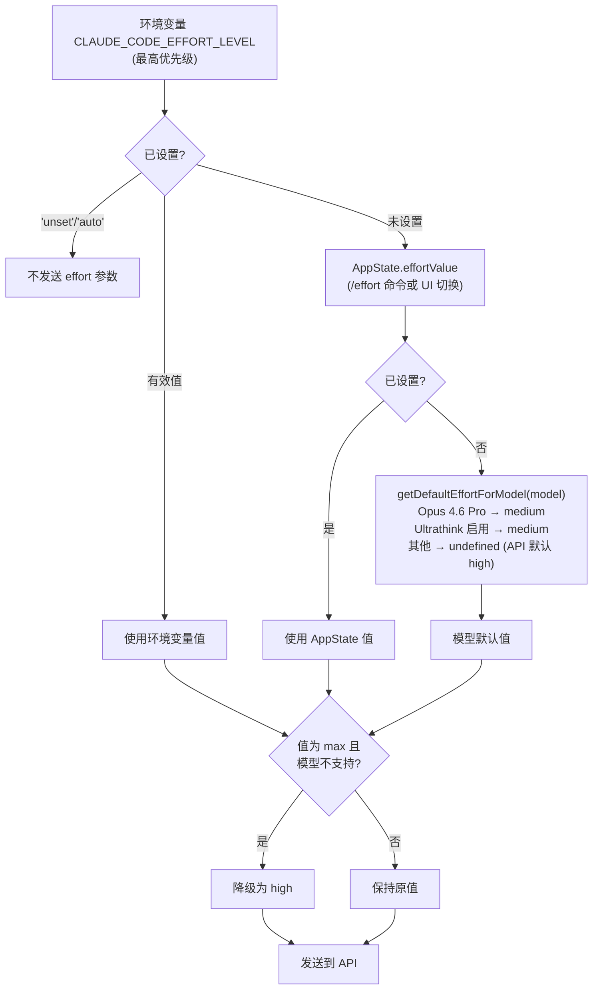

# 第21章：Effort、Fast Mode 与 Thinking

## 为什么需要分层的推理控制

模型的推理深度不是"越多越好"。更深的思考意味着更高的延迟、更多的 token 消耗和更低的吞吐量。对于"把变量名从 `foo` 改成 `bar`"这样的任务，让 Opus 4.6 做 10 秒的深度推理是浪费；对于"重构整个认证模块的错误处理"，快速浅层响应则会产出低质量代码。

Claude Code 通过三个独立但协作的机制控制推理深度：**Effort**（推理努力等级）、**Fast Mode**（加速模式）和 **Thinking**（思维链配置）。它们各自有不同的配置来源、优先级规则和模型兼容性要求，共同决定每次 API 调用的推理行为。本章将逐一解剖这三个机制，并分析它们如何在运行时协同工作。

---

## 21.1 Effort：推理努力等级

Effort 是 Claude API 的原生参数，控制模型在生成响应前投入多少"思考时间"。Claude Code 在此基础上构建了一套多层优先级链。

### 四个等级

```typescript
// utils/effort.ts:13-18
export const EFFORT_LEVELS = [
  'low',
  'medium',
  'high',
  'max',
] as const satisfies readonly EffortLevel[]
```

| 等级 | 描述（第 224-235 行） | 限制 |
|:---:|:---|:---|
| `low` | 快速、直接的实现，最小开销 | - |
| `medium` | 平衡的方式，标准实现和测试 | - |
| `high` | 全面的实现，包含广泛测试和文档 | - |
| `max` | 最深推理能力 | 仅 Opus 4.6 |

`max` 等级的模型限制在 `modelSupportsMaxEffort()` 中硬编码（第 53-65 行）：只有 `opus-4-6` 和内部模型支持。当其他模型尝试使用 `max` 时会被降级为 `high`（第 164 行）。

### 优先级链

Effort 的实际值由一个清晰的三层优先级链决定：

```typescript
// utils/effort.ts:152-167
export function resolveAppliedEffort(
  model: string,
  appStateEffortValue: EffortValue | undefined,
): EffortValue | undefined {
  const envOverride = getEffortEnvOverride()
  if (envOverride === null) {
    return undefined  // 环境变量设为 'unset'/'auto'：不发送 effort 参数
  }
  const resolved =
    envOverride ?? appStateEffortValue ?? getDefaultEffortForModel(model)
  if (resolved === 'max' && !modelSupportsMaxEffort(model)) {
    return 'high'
  }
  return resolved
}
```

优先级从高到低：



### 模型默认值的差异化

`getDefaultEffortForModel()` 函数（第 279-329 行）展示了精细的默认值策略：

```typescript
// utils/effort.ts:309-319
if (model.toLowerCase().includes('opus-4-6')) {
  if (isProSubscriber()) {
    return 'medium'
  }
  if (
    getOpusDefaultEffortConfig().enabled &&
    (isMaxSubscriber() || isTeamSubscriber())
  ) {
    return 'medium'
  }
}
```

Opus 4.6 的 Pro 订阅者默认 `medium`（而非 `high`）——这是一个经过 A/B 测试的决策（通过 GrowthBook 的 `tengu_grey_step2` 控制，第 268-276 行）。源码注释（第 307-308 行）带有明确警告：

> IMPORTANT: Do not change the default effort level without notifying the model launch DRI and research. Default effort is a sensitive setting that can greatly affect model quality and bashing.

当 Ultrathink 特性启用时，所有支持 effort 的模型默认也降为 `medium`（第 322-324 行），因为 Ultrathink 会在用户输入包含关键词时将 effort 提升到 `high`——`medium` 成为可被动态提升的基线。

### 数值型 Effort（内部专用）

除了四个字符串等级，内部用户还可以使用数值型 effort（第 198-216 行）：

```typescript
// utils/effort.ts:202-216
export function convertEffortValueToLevel(value: EffortValue): EffortLevel {
  if (typeof value === 'string') {
    return isEffortLevel(value) ? value : 'high'
  }
  if (process.env.USER_TYPE === 'ant' && typeof value === 'number') {
    if (value <= 50) return 'low'
    if (value <= 85) return 'medium'
    if (value <= 100) return 'high'
    return 'max'
  }
  return 'high'
}
```

数值型 effort 不可持久化到设置文件（`toPersistableEffort()` 函数，第 95-105 行，会过滤掉所有数值），它只存在于会话运行时——这是一个实验机制，不应意外泄漏到用户的 `settings.json` 中。

### Effort 持久化的边界

`toPersistableEffort()` 的过滤逻辑揭示了一个微妙的设计：`max` 等级对外部用户也不持久化（第 101 行），只在当前会话有效。这意味着用户通过 `/effort max` 设置的 max 等级在下次启动时会恢复为模型默认值——这是有意为之，避免用户忘记关闭 max 而长期消耗过多资源。

---

## 21.2 Fast Mode：Opus 4.6 加速

Fast Mode（内部代号 "Penguin Mode"）是一种让 Sonnet 级模型使用 Opus 4.6 作为"加速器"的模式——当用户的主模型不是 Opus 时，特定请求可以被路由到 Opus 4.6 以获得更高质量的响应。

### 可用性检查链

Fast Mode 的可用性经过层层检查：

```typescript
// utils/fastMode.ts:38-40
export function isFastModeEnabled(): boolean {
  return !isEnvTruthy(process.env.CLAUDE_CODE_DISABLE_FAST_MODE)
}
```

顶层开关之后，`getFastModeUnavailableReason()` 检查以下条件（第 72-140 行）：

1. **Statsig 远程关闭**（`tengu_penguins_off`）：最高优先级的远程开关
2. **非原生二进制**：可选检查，通过 GrowthBook 控制
3. **SDK 模式**：默认在 Agent SDK 中不可用，除非显式 opt-in
4. **非一方提供商**：Bedrock/Vertex/Foundry 不支持
5. **组织级禁用**：API 返回的组织状态

### 模型绑定

Fast Mode 硬绑定到 Opus 4.6：

```typescript
// utils/fastMode.ts:143-147
export const FAST_MODE_MODEL_DISPLAY = 'Opus 4.6'

export function getFastModeModel(): string {
  return 'opus' + (isOpus1mMergeEnabled() ? '[1m]' : '')
}
```

`isFastModeSupportedByModel()` 也只对 Opus 4.6 返回 `true`（第 167-176 行）——这意味着如果用户已经在使用 Opus 4.6 作为主模型，Fast Mode 就是它本身。

### 冷却状态机

Fast Mode 的运行时状态是一个精巧的状态机：

```typescript
// utils/fastMode.ts:183-186
export type FastModeRuntimeState =
  | { status: 'active' }
  | { status: 'cooldown'; resetAt: number; reason: CooldownReason }
```

```
┌─────────────────────────────────────────────────────────────┐
│               Fast Mode 冷却状态机                           │
│                                                             │
│   ┌──────────┐    triggerFastModeCooldown()   ┌──────────┐ │
│   │          │──────────────────────────────►│          │ │
│   │  active  │                               │ cooldown │ │
│   │          │◄──────────────────────────────│          │ │
│   └──────────┘    Date.now() >= resetAt      └──────────┘ │
│       │                                          │         │
│       │ handleFastModeRejectedByAPI()            │         │
│       │ handleFastModeOverageRejection()         │         │
│       ▼                                          │         │
│   ┌──────────┐                                   │         │
│   │ disabled │  (orgStatus = {status:'disabled'})│         │
│   │ (永久)   │◄──────────────────────────────────┘         │
│   └──────────┘  (如果 reason 非 out_of_credits)            │
│                                                             │
│   触发原因 (CooldownReason):                               │
│   • 'rate_limit'  — API 429 速率限制                       │
│   • 'overloaded'  — 服务过载                                │
│                                                             │
│   冷却过期自动恢复（检查时机：getFastModeRuntimeState()）    │
└─────────────────────────────────────────────────────────────┘
```

冷却触发时（`triggerFastModeCooldown()`，第 214-233 行），系统记录冷却结束时间戳和原因，发送分析事件，并通过信号（Signal）通知 UI：

```typescript
// utils/fastMode.ts:214-233
export function triggerFastModeCooldown(
  resetTimestamp: number,
  reason: CooldownReason,
): void {
  runtimeState = { status: 'cooldown', resetAt: resetTimestamp, reason }
  hasLoggedCooldownExpiry = false
  logEvent('tengu_fast_mode_fallback_triggered', {
    cooldown_duration_ms: cooldownDurationMs,
    cooldown_reason: reason,
  })
  cooldownTriggered.emit(resetTimestamp, reason)
}
```

冷却过期的检测是**惰性的**——不使用定时器，而是在每次调用 `getFastModeRuntimeState()` 时检查（第 199-212 行）。这避免了不必要的定时器资源消耗，冷却到期的 `cooldownExpired` 信号只在下次查询状态时才触发。

### 组织级状态预取

组织是否允许 Fast Mode 通过 API 预取确定。`prefetchFastModeStatus()` 函数（第 407-532 行）在启动时调用 `/api/claude_code_penguin_mode` 端点，结果缓存在 `orgStatus` 变量中。

预取有节流保护（30 秒最小间隔，第 383-384 行）和防抖机制（同一时刻只允许一个 inflight 请求，第 416-420 行）。认证失败时自动尝试 OAuth token 刷新（第 466-479 行）。

当网络请求失败时，内部用户默认允许（不阻塞内部开发），外部用户则回退到磁盘缓存的 `penguinModeOrgEnabled` 值（第 511-520 行）。

### 三态输出

`getFastModeState()` 函数将所有状态压缩为三个用户可见的状态：

```typescript
// utils/fastMode.ts:319-335
export function getFastModeState(
  model: ModelSetting,
  fastModeUserEnabled: boolean | undefined,
): 'off' | 'cooldown' | 'on' {
  const enabled =
    isFastModeEnabled() &&
    isFastModeAvailable() &&
    !!fastModeUserEnabled &&
    isFastModeSupportedByModel(model)
  if (enabled && isFastModeCooldown()) {
    return 'cooldown'
  }
  if (enabled) {
    return 'on'
  }
  return 'off'
}
```

这个三态在 UI 中映射为不同的视觉反馈——`on` 显示加速图标，`cooldown` 显示临时降级提示，`off` 则不显示。

---

## 21.3 Thinking 配置

Thinking（思维链/extended thinking）控制模型是否以及如何输出推理过程。

### 三种模式

```typescript
// utils/thinking.ts:10-13
export type ThinkingConfig =
  | { type: 'adaptive' }
  | { type: 'enabled'; budgetTokens: number }
  | { type: 'disabled' }
```

| 模式 | API 表现 | 适用条件 |
|:---:|:---|:---|
| `adaptive` | 模型自行决定是否思考和思考多少 | Opus 4.6、Sonnet 4.6 等新模型 |
| `enabled` | 固定 token 预算的思维链 | 不支持 adaptive 的旧 Claude 4 模型 |
| `disabled` | 不输出思维链 | API key 验证等低开销调用 |

### 模型兼容性分层

三个独立的能力检测函数处理不同级别的 Thinking 支持：

**`modelSupportsThinking()`**（第 90-110 行）：检测模型是否支持思维链。

```typescript
// utils/thinking.ts:105-109
if (provider === 'foundry' || provider === 'firstParty') {
  return !canonical.includes('claude-3-')  // 所有 Claude 4+ 支持
}
return canonical.includes('sonnet-4') || canonical.includes('opus-4')
```

一方和 Foundry 提供商：Claude 3 以外的所有模型都支持。三方提供商（Bedrock/Vertex）：只有 Sonnet 4+ 和 Opus 4+ 支持——这反映了三方部署的模型可用性差异。

**`modelSupportsAdaptiveThinking()`**（第 113-144 行）：检测模型是否支持 adaptive 模式。

```typescript
// utils/thinking.ts:119-123
if (canonical.includes('opus-4-6') || canonical.includes('sonnet-4-6')) {
  return true
}
```

只有 4.6 版本的模型明确支持 adaptive。对于未知模型字符串，一方和 Foundry 默认为 `true`（第 143 行），三方默认为 `false`——源码注释解释了原因（第 136-141 行）：

> Newer models (4.6+) are all trained on adaptive thinking and MUST have it enabled for model testing. DO NOT default to false for first party, otherwise we may silently degrade model quality.

**`shouldEnableThinkingByDefault()`**（第 146-162 行）：决定 Thinking 是否默认启用。

```typescript
// utils/thinking.ts:146-162
export function shouldEnableThinkingByDefault(): boolean {
  if (process.env.MAX_THINKING_TOKENS) {
    return parseInt(process.env.MAX_THINKING_TOKENS, 10) > 0
  }
  const { settings } = getSettingsWithErrors()
  if (settings.alwaysThinkingEnabled === false) {
    return false
  }
  return true
}
```

优先级：`MAX_THINKING_TOKENS` 环境变量 > settings 中的 `alwaysThinkingEnabled` > 默认启用。

### 三模式对比

```
┌─────────────────────────────────────────────────────────────────────┐
│                    Thinking 三模式对比                               │
├──────────────┬────────────────┬──────────────���───┬─────────────────┤
│              │ adaptive       │ enabled          │ disabled        │
├──────────────┼────────────────┼──────────────────┼─────────────────┤
│ 思考预算     │ 模型自行决定   │ 固定 budgetTokens│ 不思考          │
│ API 参数     │ {type:'adaptive│ {type:'enabled', │ 不传 thinking   │
│              │  '}            │  budget_tokens:N}│ 参数或禁用      │
│ 支持模型     │ Opus/Sonnet 4.6│ Claude 4 全系列  │ 所有模型        │
│ 默认状态     │ 4.6 模型首选   │ 旧 4 系列回退    │ 显式禁用时      │
│ 与 Effort    │ Effort 控制    │ budget 控制      │ 无关            │
│ 的交互       │ 思考深度       │ 思考上限         │                 │
│ 适用场景     │ 大多数对话     │ 需要精确控制     │ API 验证、      │
│              │                │ 思考预算时       │ 工具 Schema 等  │
└──────────────┴────────────────┴──────────────────┴─────────────────┘
```

### API 层的实际应用

在 `services/api/claude.ts`（第 1602-1622 行）中，ThinkingConfig 被转换为实际的 API 参数：

```typescript
// services/api/claude.ts:1604-1622（简化）
if (hasThinking && modelSupportsThinking(options.model)) {
  if (!isEnvTruthy(process.env.CLAUDE_CODE_DISABLE_ADAPTIVE_THINKING)
      && modelSupportsAdaptiveThinking(options.model)) {
    thinking = { type: 'adaptive' }
  } else {
    let thinkingBudget = getMaxThinkingTokensForModel(options.model)
    if (thinkingConfig.type === 'enabled' && thinkingConfig.budgetTokens !== undefined) {
      thinkingBudget = thinkingConfig.budgetTokens
    }
    thinking = { type: 'enabled', budget_tokens: thinkingBudget }
  }
}
```

决策逻辑是：优先 adaptive → 不支持 adaptive 时用固定预算 → 用户指定预算覆盖默认值。环境变量 `CLAUDE_CODE_DISABLE_ADAPTIVE_THINKING` 是最后的逃生出口，允许强制回退到固定预算模式。

---

## 21.4 Ultrathink：关键词触发的 Effort 提升

Ultrathink 是一个巧妙的交互设计：当用户在消息中包含 `ultrathink` 关键词时，自动将 Effort 从 `medium` 提升到 `high`。

### 门控机制

Ultrathink 通过双重门控：

```typescript
// utils/thinking.ts:19-24
export function isUltrathinkEnabled(): boolean {
  if (!feature('ULTRATHINK')) {
    return false
  }
  return getFeatureValue_CACHED_MAY_BE_STALE('tengu_turtle_carbon', true)
}
```

构建时 Feature Flag（`ULTRATHINK`）控制代码是否包含在构建产物中，GrowthBook 运行时 Flag（`tengu_turtle_carbon`）控制是否对当前用户启用。

### 关键词检测

```typescript
// utils/thinking.ts:29-31
export function hasUltrathinkKeyword(text: string): boolean {
  return /\bultrathink\b/i.test(text)
}
```

检测使用词边界匹配（`\b`），大小写不敏感。`findThinkingTriggerPositions()` 函数（第 36-58 行）进一步返回每个匹配的位置信息，供 UI 高亮显示。

注意源码中的一个细节（第 42-44 行注释）：每次调用都创建一个新的正则表达式字面量而不是复用共享实例，因为 `String.prototype.matchAll` 会从源正则的 `lastIndex` 复制状态——如果与 `hasUltrathinkKeyword` 的 `.test()` 共享实例，`lastIndex` 会在两次调用间泄漏。

### 附件注入

Ultrathink 的 Effort 提升通过附件系统实现（`utils/attachments.ts` 第 1446-1452 行）：

```typescript
// utils/attachments.ts:1446-1452
function getUltrathinkEffortAttachment(input: string | null): Attachment[] {
  if (!isUltrathinkEnabled() || !input || !hasUltrathinkKeyword(input)) {
    return []
  }
  logEvent('tengu_ultrathink', {})
  return [{ type: 'ultrathink_effort', level: 'high' }]
}
```

这个附件被转换为系统提醒消息注入对话中（`utils/messages.ts` 第 4170-4175 行）：

```typescript
case 'ultrathink_effort': {
  return wrapMessagesInSystemReminder([
    createUserMessage({
      content: `The user has requested reasoning effort level: ${attachment.level}. Apply this to the current turn.`,
      isMeta: true,
    }),
  ])
}
```

Ultrathink 不直接修改 `resolveAppliedEffort()` 的输出——它通过消息系统告知模型"用户请求了更高的推理努力"，让模型在 adaptive thinking 模式下自行调整。这是一个纯提示词级别的干预，不改变 API 参数。

### 与默认 Effort 的协同

Ultrathink 的设计与 Opus 4.6 的默认 `medium` effort 形成完美配合：

1. 默认 effort 为 `medium`（快速响应大多数请求）
2. 用户在需要深度推理时输入 `ultrathink`
3. 附件系统注入 effort 提升消息
4. 模型在 adaptive thinking 模式下增加推理深度

这种设计的优雅之处在于：用户获得了一个**语义化的控制接口**——不需要理解 effort 参数的技术细节，只需要在"需要更深入思考"时在消息中写上 `ultrathink`。

### 彩虹 UI

Ultrathink 激活时，UI 以彩虹色显示关键词（第 60-86 行）：

```typescript
// utils/thinking.ts:60-68
const RAINBOW_COLORS: Array<keyof Theme> = [
  'rainbow_red',
  'rainbow_orange',
  'rainbow_yellow',
  'rainbow_green',
  'rainbow_blue',
  'rainbow_indigo',
  'rainbow_violet',
]
```

`getRainbowColor()` 函数根据字符索引循环分配颜色，还有一组 shimmer 变体用于闪烁效果。这种视觉反馈让用户知道 Ultrathink 已被识别和激活。

---

## 21.5 三个机制的协同

Effort、Fast Mode 和 Thinking 不是孤立工作的。它们在 API 调用链路上的交互形成一个多层控制面板：

```
用户输入
  │
  ├─ 包含 "ultrathink"? ──► 注入 ultrathink_effort 附件
  │
  ▼
resolveAppliedEffort(model, appState.effortValue)
  │
  ├─ env CLAUDE_CODE_EFFORT_LEVEL ──► 直接使用
  ├─ appState.effortValue ──► /effort 命令设置
  └─ getDefaultEffortForModel() ──► Opus 4.6 Pro → 'medium'
  │
  ▼
Effort 值 ──► 发送到 API 的 effort 参数
  │
  ▼
Fast Mode 检查
  │
  ├─ getFastModeState() = 'on' ──► 路由到 Opus 4.6
  ├─ getFastModeState() = 'cooldown' ──► 使用原始模型
  └─ getFastModeState() = 'off' ──► 使用原始模型
  │
  ▼
Thinking 配置
  │
  ├─ modelSupportsAdaptiveThinking()? ──► { type: 'adaptive' }
  ├─ modelSupportsThinking()? ──► { type: 'enabled', budget_tokens: N }
  └─ 都不支持 ──► { type: 'disabled' }
  │
  ▼
API 调用: messages.create({
  model, effort, thinking, ...
})
```

关键的交互点：

- **Effort + Thinking**：当 Effort 为 `medium` 且 Thinking 为 `adaptive` 时，模型可能选择较少的推理。当 Ultrathink 将 Effort 提升到 `high` 时，adaptive thinking 也会相应增加推理深度。
- **Fast Mode + Effort**：Fast Mode 改变的是模型（路由到 Opus 4.6），而 Effort 改变的是同一模型的推理深度。两者正交。
- **Fast Mode + Thinking**：当 Fast Mode 将请求路由到 Opus 4.6 时，该模型支持 adaptive thinking，所以 Thinking 配置自动升级。

---

## 21.6 设计洞察

**"中等"作为默认值的哲学**。Opus 4.6 对 Pro 用户默认 `medium` effort，而非直觉上的 `high`，反映了一个深刻的权衡：大多数编程交互不需要最深的推理，而降低默认 effort 可以显著提升吞吐量和降低延迟。Ultrathink 机制则提供了一个**零摩擦的升级路径**——用户不需要离开对话流去调整设置，只需在句子中加一个词。

**惰性状态检查的模式**。Fast Mode 冷却的过期检测不使用定时器，而是在每次查询状态时惰性计算（第 199-212 行）。这种模式在 Claude Code 中多次出现——它避免了定时器的资源开销和竞态条件，代价是状态转换的时间精度取决于查询频率。对于 UI 驱动的系统，这个代价几乎为零。

**能力检测的三层结构**。`modelSupportsThinking` → `modelSupportsAdaptiveThinking` → `shouldEnableThinkingByDefault` 形成了从"能否使用"到"应否启用"的决策链。每一层都考虑了不同的因素（模型能力、提供商差异、用户偏好），且每一层都带有明确的"不要在不通知负责人的情况下修改"的警告注释。这种多层防护反映了推理配置对模型质量的敏感性——一个不经意的默认值变更可能导致整个用户群的体验退化。

**持久化的谨慎边界**。`max` effort 不对外部用户持久化、数值型 effort 不持久化、Fast Mode 的 `per-session opt-in` 选项——这些设计选择都遵循同一原则：**高开销的配置不应跨会话泄漏**。用户在一次会话中开启 `max` 是有意识的选择；但如果这个选择被静默地带入下一次会话，它可能成为一个被遗忘的资源消耗。

---

## 用户能做什么

**调优推理深度以匹配任务复杂度：**

1. **使用 `/effort` 命令调整推理等级**。对于简单的代码修改（重命名变量、添加注释），`/effort low` 能显著减少延迟。对于复杂的架构决策或 bug 调查，`/effort high` 或 `max`（仅 Opus 4.6）能获得更深入的分析。

2. **在消息中输入 `ultrathink` 触发深度推理**。当你在使用 Opus 4.6 且默认 effort 为 `medium` 时，在消息中加入 `ultrathink` 关键词即可临时提升到 `high` 级别推理——无需离开对话流调整设置。

3. **通过环境变量固定 Effort**。如果你的团队有统一的推理策略，可以在 `.env` 或启动脚本中设置 `CLAUDE_CODE_EFFORT_LEVEL=high`。设为 `unset` 或 `auto` 可以完全不发送 effort 参数，让 API 使用服务端默认值。

4. **理解 Fast Mode 的冷却机制**。当 Fast Mode（Opus 4.6 加速）因速率限制进入冷却时，系统会自动回退到原始模型。冷却是临时的，到期后自动恢复——无需手动干预。

5. **注意 Thinking 模式与模型的匹配**。Opus 4.6 和 Sonnet 4.6 支持 `adaptive` 思维模式（模型自行决定思考深度），旧版 Claude 4 模型使用固定预算模式。如果需要强制禁用 adaptive thinking，可以设置环境变量 `CLAUDE_CODE_DISABLE_ADAPTIVE_THINKING=true`。

6. **`max` effort 不会跨会话保留**。这是有意设计——避免忘记关闭 `max` 而长期消耗过多资源。每次新会话都会恢复为模型默认值。

---

## 版本演化：v2.1.91 变化

> 以下分析基于 v2.1.91 bundle 信号对比，结合 v2.1.88 源码推断。

### 代理成本控制

v2.1.91 新增环境变量 `CLAUDE_CODE_AGENT_COST_STEER`，暗示引入了子代理成本引导机制。结合新增的 `tengu_forked_agent_default_turns_exceeded` 事件，v2.1.91 在多代理场景下对成本进行了更精细的控制——不仅可以限制单个代理的 thinking 预算（本章已描述），还可以在整体层面引导代理的资源消耗。
