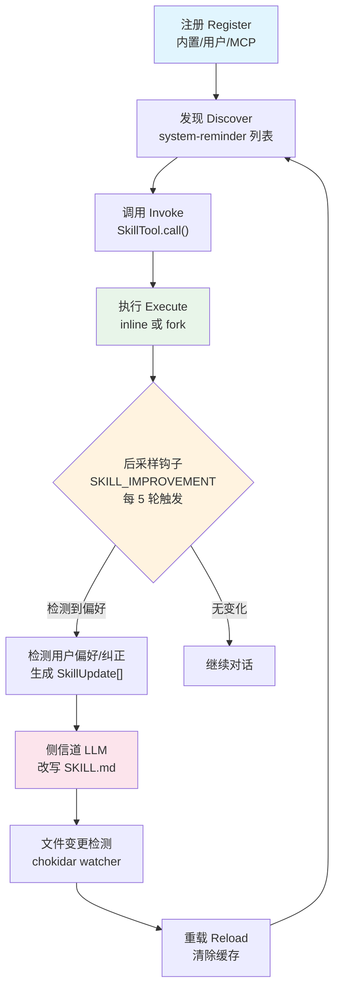

# 第22章：技能系统 -- 从内置到用户自定义

## 为什么这很重要

在前面的章节中，我们分析了 Claude Code 的工具系统、权限模型和上下文管理。但有一个关键的扩展层始终穿插在这些系统之间：**技能（Skill）系统**。

当用户输入 `/batch migrate from react to vue` 时，Claude Code 不是在执行一个"命令"——它在加载一段精心编写的提示词模板，将其注入上下文窗口，从而让模型按照预定义的流程行动。技能系统的本质是**可调用的提示词模板**——它将反复验证过的最佳实践编码为 Markdown 文件，通过 `Skill` 工具注入到对话流中。

这个设计哲学带来了一个深刻的工程含义：技能不是代码逻辑，而是**结构化的知识**。一个技能文件可以定义它需要哪些工具、使用哪个模型、以什么执行上下文运行，但它的核心始终是一段 Markdown 文本——由 LLM 解释并执行。

本章将从内置技能开始，逐层揭示技能的注册、发现、加载、执行和改进机制。

---

## 22.1 技能的本质：Command 类型与注册机制

### BundledSkillDefinition 结构

每个技能最终都被表示为一个 `Command` 对象。内置技能通过 `registerBundledSkill` 函数注册，其定义类型如下：

```typescript
// skills/bundledSkills.ts:15-41
export type BundledSkillDefinition = {
  name: string
  description: string
  aliases?: string[]
  whenToUse?: string
  argumentHint?: string
  allowedTools?: string[]
  model?: string
  disableModelInvocation?: boolean
  userInvocable?: boolean
  isEnabled?: () => boolean
  hooks?: HooksSettings
  context?: 'inline' | 'fork'
  agent?: string
  files?: Record<string, string>
  getPromptForCommand: (
    args: string,
    context: ToolUseContext,
  ) => Promise<ContentBlockParam[]>
}
```

这个类型揭示了技能的几个关键维度：

| 字段 | 用途 | 典型值 |
|------|------|--------|
| `name` | 技能的调用名，对应 `/name` 语法 | `"batch"`, `"simplify"` |
| `whenToUse` | 告诉模型**何时**应主动调用此技能 | 出现在 system-reminder 中 |
| `allowedTools` | 技能执行期间自动授权的工具列表 | `['Read', 'Grep', 'Glob']` |
| `context` | 执行上下文——`inline` 注入主对话流，`fork` 在子 agent 中运行 | `'fork'` |
| `disableModelInvocation` | 禁止模型主动调用，只允许用户显式输入 | `true`（batch） |
| `files` | 随技能附带的参考文件，首次调用时提取到磁盘 | verify 技能的验证脚本 |
| `getPromptForCommand` | **核心**：生成注入上下文的提示词内容 | 返回 `ContentBlockParam[]` |

注册流程本身很简单——`registerBundledSkill` 将定义转换为标准 `Command` 对象并推入内部数组：

```typescript
// skills/bundledSkills.ts:53-100
export function registerBundledSkill(definition: BundledSkillDefinition): void {
  const { files } = definition
  let skillRoot: string | undefined
  let getPromptForCommand = definition.getPromptForCommand

  if (files && Object.keys(files).length > 0) {
    skillRoot = getBundledSkillExtractDir(definition.name)
    let extractionPromise: Promise<string | null> | undefined
    const inner = definition.getPromptForCommand
    getPromptForCommand = async (args, ctx) => {
      extractionPromise ??= extractBundledSkillFiles(definition.name, files)
      const extractedDir = await extractionPromise
      const blocks = await inner(args, ctx)
      if (extractedDir === null) return blocks
      return prependBaseDir(blocks, extractedDir)
    }
  }

  const command: Command = {
    type: 'prompt',
    name: definition.name,
    // ... 字段映射 ...
    source: 'bundled',
    loadedFrom: 'bundled',
    getPromptForCommand,
  }
  bundledSkills.push(command)
}
```

注意第67行的 `extractionPromise ??= ...` 模式——这是一个"记忆化 Promise"。当多个并发调用者同时触发首次调用时，它们等待的是**同一个 Promise**，避免了竞态条件导致的重复文件写入。

### 文件提取的安全措施

内置技能的参考文件提取涉及安全敏感的文件系统操作。源码在 `safeWriteFile` 中使用了 `O_NOFOLLOW | O_EXCL` 标志组合（第176-184行），配合 0o600 权限模式。注释明确解释了威胁模型：

```typescript
// skills/bundledSkills.ts:169-175
// The per-process nonce in getBundledSkillsRoot() is the primary defense
// against pre-created symlinks/dirs. Explicit 0o700/0o600 modes keep the
// nonce subtree owner-only even on umask=0, so an attacker who learns the
// nonce via inotify on the predictable parent still can't write into it.
```

这是一个典型的**纵深防御**设计——per-process nonce 是主防线，`O_NOFOLLOW` 和 `O_EXCL` 是补充防线。

---

## 22.2 内置技能清单

所有内置技能的注册入口在 `skills/bundled/index.ts` 的 `initBundledSkills` 函数中。根据源码分析，内置技能分为两类：**无条件注册**和**按 Feature Flag 注册**。

### 表 22-1：内置技能清单

| 技能名称 | 注册条件 | 功能简述 | 执行模式 | 用户可调用 |
|----------|----------|----------|----------|-----------|
| `update-config` | 无条件 | 通过 settings.json 配置 Claude Code | inline | 是 |
| `keybindings` | 无条件 | 自定义键盘快捷键 | inline | 是 |
| `verify` | `USER_TYPE === 'ant'` | 通过运行应用验证代码变更 | inline | 是 |
| `debug` | 无条件 | 启用调试日志并诊断问题 | inline | 是（禁止模型调用） |
| `lorem-ipsum` | 无条件 | 开发测试用占位符 | inline | 是 |
| `skillify` | `USER_TYPE === 'ant'` | 将当前会话捕获为可复用技能 | inline | 是（禁止模型调用） |
| `remember` | `USER_TYPE === 'ant'` | 审查和整理 agent 记忆层 | inline | 是 |
| `simplify` | 无条件 | 审查变更代码的质量和效率 | inline | 是 |
| `batch` | 无条件 | 并行 worktree agent 执行大规模变更 | inline | 是（禁止模型调用） |
| `stuck` | `USER_TYPE === 'ant'` | 诊断冻结/缓慢的 Claude Code 会话 | inline | 是 |
| `dream` | `KAIROS \|\| KAIROS_DREAM` | autoDream 记忆整理 | inline | 是 |
| `hunter` | `REVIEW_ARTIFACT` | 审查工件 | inline | 是 |
| `loop` | `AGENT_TRIGGERS` | 定时循环执行提示词 | inline | 是 |
| `schedule` | `AGENT_TRIGGERS_REMOTE` | 创建远程定时 agent 触发器 | inline | 是 |
| `claude-api` | `BUILDING_CLAUDE_APPS` | 使用 Claude API 构建应用 | inline | 是 |
| `claude-in-chrome` | `shouldAutoEnableClaudeInChrome()` | Chrome 浏览器集成 | inline | 是 |
| `run-skill-generator` | `RUN_SKILL_GENERATOR` | 技能生成器 | inline | 是 |

**表 22-1：内置技能注册条件清单**

Feature Flag 门控的技能使用了 `require()` 动态导入模式，而非 ESM 的 `import()`。源码在第36-38行有对应的 eslint-disable 注释——这是因为 Bun 的构建时 tree-shaking 依赖静态分析，`feature()` 调用会被 Bun 在编译期求值为布尔常量，从而将整个 `require()` 分支在非匹配的构建配置中完全消除。

### 典型技能剖析：batch

`batch` 技能（`skills/bundled/batch.ts`）是理解技能工作原理的绝佳样本。它的提示词模板定义了一个三阶段流程：

1. **研究与计划阶段**：进入 Plan Mode，启动前台子 agent 研究代码库，分解为 5-30 个独立工作单元
2. **并行执行阶段**：为每个工作单元启动一个后台 `worktree` 隔离 agent
3. **进度追踪阶段**：维护状态表，汇总 PR 链接

```typescript
// skills/bundled/batch.ts:9-10
const MIN_AGENTS = 5
const MAX_AGENTS = 30
```

关键的工程决策在于 `disableModelInvocation: true`（第109行）——batch 技能**只能**由用户显式输入 `/batch` 触发，模型不能自主决定启动大规模并行重构。这是一个合理的安全边界——batch 操作会创建大量 worktree 和 PR，自主触发的风险太高。

### 典型技能剖析：simplify

`simplify` 技能展示了另一个常见模式——通过 `AgentTool` 启动**三个并行审查 agent**：

1. **代码复用审查**：搜索现有工具函数，标记重复实现
2. **代码质量审查**：检测冗余状态、参数膨胀、复制粘贴、不必要注释
3. **效率审查**：检测多余计算、缺失并发、热路径膨胀、内存泄漏

这三个 agent 并行运行，结果汇总后统一修复——技能提示词本身编码了"人类代码审查最佳实践"的知识。

### 典型技能剖析：skillify（会话→技能蒸馏器）

`skillify` 是技能系统中最具"元"特征的技能——它的职责是**将当前会话中的可重复流程提取为新的技能文件**。源码位于 `skills/bundled/skillify.ts`。

**门控**：`USER_TYPE === 'ant'`（第159行），仅 Anthropic 内部用户可用。`disableModelInvocation: true`（第177行），只能通过 `/skillify` 手动触发，模型不会自主调用。

```typescript
// skills/bundled/skillify.ts:158-162
export function registerSkillifySkill(): void {
  if (process.env.USER_TYPE !== 'ant') {
    return
  }
  // ...
}
```

**数据来源**：skillify 的提示词模板（第22-156行）在运行时动态注入两个上下文：

1. **Session Memory 摘要**：通过 `getSessionMemoryContent()` 获取当前会话的结构化摘要（详见第24章 Session Memory 部分）
2. **用户消息提取**：通过 `extractUserMessages()` 提取压缩边界之后的所有用户消息

```typescript
// skills/bundled/skillify.ts:179-194
async getPromptForCommand(args, context) {
  const sessionMemory =
    (await getSessionMemoryContent()) ?? 'No session memory available.'
  const userMessages = extractUserMessages(
    getMessagesAfterCompactBoundary(context.messages),
  )
  // ...
}
```

**四轮访谈结构**：skillify 的提示词定义了一个结构化的四轮访谈流程，全部通过 `AskUserQuestion` 工具进行（而非纯文本输出），确保用户有明确的选择项：

| 轮次 | 目标 | 关键决策 |
|------|------|---------|
| Round 1 | 高层确认 | 技能名称、描述、目标和成功标准 |
| Round 2 | 细节补充 | 步骤列表、参数定义、inline vs fork、存储位置 |
| Round 3 | 逐步细化 | 每步的成功标准、产出物、人工检查点、并行机会 |
| Round 4 | 最终确认 | 触发条件、触发短语、边界情况 |

提示词中特别强调了"关注用户纠正过你的地方"（`Pay special attention to places where the user corrected you during the session`）——这些纠正往往包含了最有价值的隐性知识，应该被编码为技能的硬规则。

**生成的 SKILL.md 格式**：skillify 生成的技能文件遵循标准的 frontmatter 格式，但有几个关键的标注规范：
- 每个步骤**必须**包含 `Success criteria`
- 可并行的步骤使用子编号（3a, 3b）
- 需要用户操作的步骤标注 `[human]`
- `allowed-tools` 使用最小权限模式（如 `Bash(gh:*)` 而非 `Bash`）

skillify 与 SKILL_IMPROVEMENT（22.8 节）形成互补：skillify 从零创建技能，SKILL_IMPROVEMENT 在使用中持续改进。这是一个"从实践中学习"的完整闭环。

---

## 22.3 用户自定义技能：loadSkillsDir.ts 的发现与加载

### 技能文件结构

用户自定义技能遵循目录格式：

```
.claude/skills/
  my-skill/
    SKILL.md        ← 主文件（包含 frontmatter + Markdown 正文）
    reference.ts    ← 可选的参考文件
```

`SKILL.md` 文件使用 YAML frontmatter 声明元数据：

```yaml
---
description: My custom skill
when_to_use: When the user asks for X
allowed-tools: Read, Grep, Bash
context: fork
model: opus
effort: high
arguments: [target, scope]
paths: src/components/**
---

# Skill prompt content here...
```

### 四层加载优先级

`getSkillDirCommands` 函数（`loadSkillsDir.ts:638`）从四个来源并行加载技能，优先级从高到低：

```typescript
// skills/loadSkillsDir.ts:679-713
const [
  managedSkills,      // 1. 策略管理的技能（企业部署）
  userSkills,         // 2. 用户全局技能 (~/.claude/skills/)
  projectSkillsNested,// 3. 项目技能 (.claude/skills/)
  additionalSkillsNested, // 4. --add-dir 附加目录
  legacyCommands,     // 5. 旧版 /commands/ 目录（已废弃）
] = await Promise.all([
  loadSkillsFromSkillsDir(managedSkillsDir, 'policySettings'),
  loadSkillsFromSkillsDir(userSkillsDir, 'userSettings'),
  // ... 项目和附加目录 ...
  loadSkillsFromCommandsDir(cwd),
])
```

每个来源都受独立的开关控制：

| 来源 | 开关条件 | 目录路径 |
|------|----------|----------|
| 策略管理 | `!CLAUDE_CODE_DISABLE_POLICY_SKILLS` | `<managed>/.claude/skills/` |
| 用户全局 | `isSettingSourceEnabled('userSettings') && !skillsLocked` | `~/.claude/skills/` |
| 项目本地 | `isSettingSourceEnabled('projectSettings') && !skillsLocked` | `.claude/skills/`（逐级向上） |
| --add-dir | 同上 | `<dir>/.claude/skills/` |
| 旧版 commands | `!skillsLocked` | `.claude/commands/` |

**表 22-2：技能加载来源及开关条件**

`skillsLocked` 标志来自 `isRestrictedToPluginOnly('skills')`——当企业策略限制仅允许插件技能时，所有本地技能加载被跳过。

### Frontmatter 解析

`parseSkillFrontmatterFields` 函数（第185-265行）是所有技能来源共享的解析入口。它处理的字段包括：

```typescript
// skills/loadSkillsDir.ts:185-206
export function parseSkillFrontmatterFields(
  frontmatter: FrontmatterData,
  markdownContent: string,
  resolvedName: string,
): {
  displayName: string | undefined
  description: string
  allowedTools: string[]
  argumentHint: string | undefined
  whenToUse: string | undefined
  model: ReturnType<typeof parseUserSpecifiedModel> | undefined
  disableModelInvocation: boolean
  hooks: HooksSettings | undefined
  executionContext: 'fork' | undefined
  agent: string | undefined
  effort: EffortValue | undefined
  shell: FrontmatterShell | undefined
  // ...
}
```

值得注意的是 `effort` 字段（第228-235行）——技能可以指定自己的"努力等级"，覆盖全局设置。无效的 effort 值会被静默忽略并记录调试日志，遵循宽容解析原则。

### 提示词执行时的变量替换

`createSkillCommand` 的 `getPromptForCommand` 方法（第344-399行）在技能被调用时执行以下处理链：

```
原始 Markdown
    │
    ▼
添加 "Base directory" 前缀（如果有 baseDir）
    │
    ▼
参数替换（$1, $2 或命名参数）
    │
    ▼
${CLAUDE_SKILL_DIR} → 技能目录路径
    │
    ▼
${CLAUDE_SESSION_ID} → 当前会话 ID
    │
    ▼
Shell 命令执行（!`command` 语法，MCP 技能跳过此步）
    │
    ▼
返回 ContentBlockParam[]
```

**图 22-1：技能提示词变量替换流程**

安全边界在第374行明确体现：

```typescript
// skills/loadSkillsDir.ts:372-376
// Security: MCP skills are remote and untrusted — never execute inline
// shell commands (!`…` / ```! … ```) from their markdown body.
if (loadedFrom !== 'mcp') {
  finalContent = await executeShellCommandsInPrompt(...)
}
```

MCP 来源的技能被视为**不受信任**，其 Markdown 中的 `!command` 语法不会被执行——这是防止远程提示注入导致任意命令执行的关键防线。

### 去重机制

加载完成后，通过 `realpath` 解析符号链接来检测重复文件：

```typescript
// skills/loadSkillsDir.ts:728-734
const fileIds = await Promise.all(
  allSkillsWithPaths.map(({ skill, filePath }) =>
    skill.type === 'prompt'
      ? getFileIdentity(filePath)
      : Promise.resolve(null),
  ),
)
```

源码注释（第107-117行）特别提到了使用 `realpath` 而非 inode 的原因——某些虚拟文件系统、容器环境或 NFS 挂载会报告不可靠的 inode 值（例如 inode 0 或 ExFAT 上的精度丢失问题）。

---

## 22.4 条件技能：路径过滤与动态激活

### paths frontmatter

技能可以通过 `paths` frontmatter 声明自己只在用户操作特定路径的文件时才激活：

```yaml
---
paths: src/components/**, src/hooks/**
---
```

在 `getSkillDirCommands` 中（第771-790行），带 `paths` 的技能不会立即出现在技能列表中：

```typescript
// skills/loadSkillsDir.ts:771-790
const unconditionalSkills: Command[] = []
const newConditionalSkills: Command[] = []
for (const skill of deduplicatedSkills) {
  if (
    skill.type === 'prompt' &&
    skill.paths &&
    skill.paths.length > 0 &&
    !activatedConditionalSkillNames.has(skill.name)
  ) {
    newConditionalSkills.push(skill)
  } else {
    unconditionalSkills.push(skill)
  }
}
for (const skill of newConditionalSkills) {
  conditionalSkills.set(skill.name, skill)
}
```

条件技能存储在 `conditionalSkills` Map 中，等待**文件操作触发激活**。当用户通过 Read/Write/Edit 等工具操作了匹配路径的文件时，`activateConditionalSkillsForPaths` 函数（第1001-1033行）使用 `ignore` 库进行 gitignore 风格的路径匹配，将匹配的技能从待激活 Map 移入活跃集合：

```typescript
// skills/loadSkillsDir.ts:1007-1033
for (const [name, skill] of conditionalSkills) {
  // ... 路径匹配逻辑 ...
  conditionalSkills.delete(name)
  activatedConditionalSkillNames.add(name)
}
```

一旦激活，技能名称被记录在 `activatedConditionalSkillNames` 中——这个 Set 在缓存清除时**不会被重置**（`clearSkillCaches` 只清除加载缓存，不清除激活状态），确保了"一旦触摸文件，技能在整个会话期间保持可用"的语义。

### 动态目录发现

除了条件技能，`discoverSkillDirsForPaths` 函数（第861-915行）还实现了**子目录级别的技能发现**。当用户操作深层嵌套的文件时，系统会从文件所在目录逐级向上走到 cwd，在每一级检查 `.claude/skills/` 目录是否存在。这使得 monorepo 中每个包可以有自己的技能集。

发现过程有两个安全检查：
1. **gitignore 检查**：`node_modules/pkg/.claude/skills/` 这样的路径会被跳过
2. **去重检查**：已检查过的路径记录在 `dynamicSkillDirs` Set 中，避免对不存在的目录重复 `stat()`

---

## 22.5 MCP 技能桥接：mcpSkillBuilders.ts

### 依赖环问题

MCP 技能（通过 MCP 服务器连接注入的技能）面临一个经典的工程问题：循环依赖。MCP 技能的加载需要 `loadSkillsDir.ts` 中的 `createSkillCommand` 和 `parseSkillFrontmatterFields` 函数，但 `loadSkillsDir.ts` 的导入链最终会触达 MCP 客户端代码，形成环路。

`mcpSkillBuilders.ts` 通过**一次性注册模式**打破了这个环：

```typescript
// skills/mcpSkillBuilders.ts:26-44
export type MCPSkillBuilders = {
  createSkillCommand: typeof createSkillCommand
  parseSkillFrontmatterFields: typeof parseSkillFrontmatterFields
}

let builders: MCPSkillBuilders | null = null

export function registerMCPSkillBuilders(b: MCPSkillBuilders): void {
  builders = b
}

export function getMCPSkillBuilders(): MCPSkillBuilders {
  if (!builders) {
    throw new Error(
      'MCP skill builders not registered — loadSkillsDir.ts has not been evaluated yet',
    )
  }
  return builders
}
```

源码注释（第9-23行）详细解释了为什么不能用动态 `import()`——Bun 的 bunfs 虚拟文件系统会导致模块路径解析失败，而字面量动态导入虽然在 bunfs 中有效，但会让 dependency-cruiser 检测到新的环路违规。

注册时机在 `loadSkillsDir.ts` 的模块初始化期——通过 `commands.ts` 的静态导入链，这段代码在启动早期就被执行，远早于任何 MCP 服务器建立连接。

---

## 22.6 技能搜索：EXPERIMENTAL_SKILL_SEARCH

### 远程技能发现

在 `SkillTool.ts` 的第108-116行，`EXPERIMENTAL_SKILL_SEARCH` flag 门控了远程技能搜索模块的加载：

```typescript
// tools/SkillTool/SkillTool.ts:108-116
const remoteSkillModules = feature('EXPERIMENTAL_SKILL_SEARCH')
  ? {
      ...(require('../../services/skillSearch/remoteSkillState.js') as ...),
      ...(require('../../services/skillSearch/remoteSkillLoader.js') as ...),
      ...(require('../../services/skillSearch/telemetry.js') as ...),
      ...(require('../../services/skillSearch/featureCheck.js') as ...),
    }
  : null
```

远程技能使用 `_canonical_<slug>` 命名前缀——在 `validateInput` 中（第378-396行），这类技能会绕过本地命令注册表直接查找：

```typescript
// tools/SkillTool/SkillTool.ts:381-395
const slug = remoteSkillModules!.stripCanonicalPrefix(normalizedCommandName)
if (slug !== null) {
  const meta = remoteSkillModules!.getDiscoveredRemoteSkill(slug)
  if (!meta) {
    return {
      result: false,
      message: `Remote skill ${slug} was not discovered in this session.`,
      errorCode: 6,
    }
  }
  return { result: true }
}
```

远程技能从 AKI/GCS 加载 SKILL.md 内容（带本地缓存），执行时**不进行** shell 命令替换和参数插值——它们被视为声明式的纯 Markdown。

在权限层面，远程技能获得自动授权（第488-504行），但这个授权被放置在 deny 规则检查**之后**——用户配置的 `Skill(_canonical_:*) deny` 规则仍然生效。

---

## 22.7 技能预算约束：1% 上下文窗口与三级截断

### 预算计算

技能列表占用上下文窗口的空间受到严格控制。核心常量在 `tools/SkillTool/prompt.ts` 中定义：

```typescript
// tools/SkillTool/prompt.ts:21-29
export const SKILL_BUDGET_CONTEXT_PERCENT = 0.01  // 1% of context window
export const CHARS_PER_TOKEN = 4
export const DEFAULT_CHAR_BUDGET = 8_000  // Fallback: 1% of 200k × 4
export const MAX_LISTING_DESC_CHARS = 250  // Per-entry hard cap
```

预算公式为：`contextWindowTokens × 4 × 0.01`。对于 200K token 的上下文窗口，这意味着 8,000 个字符——约 40 个技能的名称和描述。

### 三级截断级联

当技能列表超出预算时，`formatCommandsWithinBudget` 函数（第70-171行）执行三级截断级联：

```
┌──────────────────────────────────────────────┐
│          Level 1: 完整描述                      │
│   "- batch: Research and plan a large-scale   │
│    change, then execute it in parallel..."    │
│                                               │
│   如果总大小 ≤ budget → 输出                     │
└─────────────────────┬────────────────────────┘
                      │ 超出
                      ▼
┌──────────────────────────────────────────────┐
│          Level 2: 截短描述                      │
│   内置技能保留完整描述（永不截断）                   │
│   非内置技能描述截断到 maxDescLen                  │
│   maxDescLen = (剩余预算 - 名称开销) / 技能数     │
│                                               │
│   如果 maxDescLen ≥ 20 → 输出                   │
└─────────────────────┬────────────────────────┘
                      │ maxDescLen < 20
                      ▼
┌──────────────────────────────────────────────┐
│          Level 3: 仅名称                        │
│   内置技能保留完整描述                             │
│   非内置技能仅显示名称                             │
│   "- my-custom-skill"                         │
└──────────────────────────────────────────────┘
```

**图 22-2：三级截断级联策略**

这个设计的关键洞察是**内置技能永不截断**（第93-99行）。原因在于内置技能是经过验证的核心功能，它们的 `whenToUse` 描述对模型的匹配决策至关重要。用户自定义技能被截断后，模型仍然可以通过 `SkillTool` 的完整加载机制在调用时获取详细内容——列表只是用于**发现**，不是用于**执行**。

每个技能条目还受 `MAX_LISTING_DESC_CHARS = 250` 的硬上限约束——即使在 Level 1 模式下，超长的 `whenToUse` 也会被截断到 250 字符。源码注释解释了这一决策：

> The listing is for discovery only — the Skill tool loads full content on invoke, so verbose whenToUse strings waste turn-1 cache_creation tokens without improving match rate.

---

## 22.8 技能生命周期：从注册到改进

### 完整生命周期流程



**图 22-3：技能生命周期全流程**

### 阶段一：注册

- **内置技能**：`initBundledSkills()` 在启动时同步注册
- **用户技能**：`getSkillDirCommands()` 通过 `memoize` 缓存首次加载结果
- **MCP 技能**：MCP 服务器连接后通过 `getMCPSkillBuilders()` 注册

### 阶段二：发现

技能通过两种方式被模型发现：
1. **system-reminder 列表**：所有已加载技能的名称和描述被注入到 `<system-reminder>` 标签中
2. **Skill 工具描述**：`SkillTool.prompt` 中包含调用说明

### 阶段三：调用与执行

`SkillTool.call` 方法（第580-841行）处理调用逻辑，核心分支在第622行：

```typescript
// tools/SkillTool/SkillTool.ts:621-632
if (command?.type === 'prompt' && command.context === 'fork') {
  return executeForkedSkill(...)
}
// ... inline 执行路径 ...
```

- **inline 模式**：技能提示词注入主对话的消息流，模型在同一上下文中执行
- **fork 模式**：启动子 agent 在隔离上下文中执行，完成后将结果摘要返回

inline 模式通过 `contextModifier` 实现工具授权和模型覆盖的注入——它不修改全局状态，而是链式包装 `getAppState()` 函数。

### 阶段四：改进（SKILL_IMPROVEMENT）

`skillImprovement.ts` 实现了一个后采样钩子（post-sampling hook），在技能执行期间自动检测用户偏好和纠正。这个功能受双重门控保护：

```typescript
// utils/hooks/skillImprovement.ts:176-181
export function initSkillImprovement(): void {
  if (
    feature('SKILL_IMPROVEMENT') &&
    getFeatureValue_CACHED_MAY_BE_STALE('tengu_copper_panda', false)
  ) {
    registerPostSamplingHook(createSkillImprovementHook())
  }
}
```

`feature('SKILL_IMPROVEMENT')` 是构建时门控（仅 `ant` 构建包含此代码），`tengu_copper_panda` 是运行时 GrowthBook flag。双重门控意味着即使在内部构建中，这个功能也可以通过远程配置关闭。

**触发条件**：仅当当前会话中有**项目级技能**（`projectSettings:` 前缀）被调用时才运行（`findProjectSkill()` 检查）。每 5 轮用户消息（`TURN_BATCH_SIZE = 5`）触发一次分析：

```typescript
// utils/hooks/skillImprovement.ts:84-87
const userCount = count(context.messages, m => m.type === 'user')
if (userCount - lastAnalyzedCount < TURN_BATCH_SIZE) {
  return false
}
```

**检测提示词**：分析器关注三类信号——请求添加/修改/删除步骤（"can you also ask me X"）、偏好表达（"use a casual tone"）、纠正（"no, do X instead"）。同时明确忽略一次性对话和技能已有的行为。

**两阶段处理**：

1. **检测阶段**：将最近的对话片段（仅自上次检查以来的新消息，非完整历史）发送到小型快速模型（`getSmallFastModel()`），输出 `SkillUpdate[]` 数组存入 AppState
2. **应用阶段**：`applySkillImprovement`（第188行起）通过**独立的侧信道 LLM 调用**改写 `.claude/skills/<name>/SKILL.md` 文件。改写时使用 `temperatureOverride: 0` 确保确定性输出，且明确指示"保留 frontmatter 原样、不删除现有内容除非明确替换"

整个过程 fire-and-forget，不阻塞主对话。改写后的文件变化由阶段五的文件监视器检测并触发热重载。

**与 skillify 的互补关系**：skillify（22.2 节）从零创建技能——用户完成一个流程后手动调用 `/skillify`，通过四轮访谈生成 SKILL.md。SKILL_IMPROVEMENT 则在使用中持续改进——每次执行技能时自动检测偏好变化并更新定义。两者构成了技能生命周期的"创建→改进"闭环。

### 阶段五：变更检测与重载

`skillChangeDetector.ts` 使用 chokidar 文件监视器检测技能文件的变化：

```typescript
// utils/skills/skillChangeDetector.ts:27-28
const FILE_STABILITY_THRESHOLD_MS = 1000
const FILE_STABILITY_POLL_INTERVAL_MS = 500
```

当检测到变化时：
1. 等待 1 秒文件稳定阈值
2. 在 300ms 的防抖窗口内聚合多个变更事件
3. 清除技能缓存和命令缓存
4. 通过 `skillsChanged` 信号通知所有订阅者

特别值得注意的是第62行的平台适配：

```typescript
// utils/skills/skillChangeDetector.ts:62
const USE_POLLING = typeof Bun !== 'undefined'
```

Bun 的原生 `fs.watch()` 存在 `PathWatcherManager` 死锁问题（oven-sh/bun#27469）——当文件监视线程正在传递事件时关闭监视器会导致两个线程在 `__ulock_wait2` 上永远挂起。源码选择了使用 stat() 轮询作为临时方案，并标注了上游修复后的移除计划。

---

## 22.9 Skill 工具的权限模型

### 自动授权条件

并非所有技能调用都需要用户确认。`SkillTool.checkPermissions` 中（第529-538行），满足 `skillHasOnlySafeProperties` 条件的技能会被自动授权：

```typescript
// tools/SkillTool/SkillTool.ts:875-908
const SAFE_SKILL_PROPERTIES = new Set([
  'type', 'progressMessage', 'contentLength', 'model', 'effort',
  'source', 'name', 'description', 'isEnabled', 'isHidden',
  'aliases', 'argumentHint', 'whenToUse', 'paths', 'version',
  'disableModelInvocation', 'userInvocable', 'loadedFrom',
  // ...
])
```

这是一个**白名单模式**——只有声明了白名单内属性的技能才会被自动授权。如果未来有新属性被加入 `PromptCommand` 类型，它们默认**需要权限**，直到被显式添加到白名单。含有 `allowedTools`、`hooks` 等敏感字段的技能会触发用户确认对话。

### 权限规则匹配

权限检查支持精确匹配和前缀通配：

```typescript
// tools/SkillTool/SkillTool.ts:451-467
const ruleMatches = (ruleContent: string): boolean => {
  const normalizedRule = ruleContent.startsWith('/')
    ? ruleContent.substring(1)
    : ruleContent
  if (normalizedRule === commandName) return true
  if (normalizedRule.endsWith(':*')) {
    const prefix = normalizedRule.slice(0, -2)
    return commandName.startsWith(prefix)
  }
  return false
}
```

这意味着用户可以配置 `Skill(review:*) allow` 来一次性授权所有以 `review` 开头的技能。

---

## 模式提炼

从技能系统的设计中，可以提取以下可复用的模式：

**模式一：记忆化 Promise 模式**
- **解决的问题**：多个并发调用者同时触发首次初始化时的竞态条件
- **模式**：`extractionPromise ??= extractBundledSkillFiles(...)` —— 使用 `??=` 确保只创建一个 Promise，所有调用者等待同一个结果
- **前置条件**：初始化操作是幂等的且结果可复用

**模式二：白名单安全模型**
- **解决的问题**：新增属性默认安全——未知属性需要权限确认
- **模式**：`SAFE_SKILL_PROPERTIES` 白名单只包含已知安全的字段，新增字段自动进入"需要权限"路径
- **前置条件**：属性集合会随时间增长，安全性需要保守默认

**模式三：分层信任与能力降级**
- **解决的问题**：不同来源的扩展有不同的信任等级
- **模式**：内置技能（永不截断）> 用户本地技能（可截断、可执行 shell）> MCP 远程技能（禁止 shell、自动授权受 deny 约束）
- **前置条件**：系统接受来自多个信任域的输入

**模式四：预算感知的渐进降级**
- **解决的问题**：有限资源（上下文窗口）下展示可变数量的条目
- **模式**：三级截断级联（完整描述 → 截短描述 → 仅名称），高优先级条目永不截断
- **前置条件**：条目数量不可控，资源预算固定

---

## 用户能做什么

**创建和使用自定义技能提升工作效率：**

1. **创建自己的技能**。在 `.claude/skills/my-skill/SKILL.md` 中编写一个 Markdown 文件，通过 YAML frontmatter 声明元数据（描述、允许工具、执行上下文等），即可通过 `/my-skill` 或模型自动调用来使用。

2. **使用 `paths` frontmatter 实现条件激活**。如果某个技能只在操作特定目录时才需要（如 `paths: src/components/**`），它不会在所有对话中出现，而是在你操作匹配文件时自动激活——节省宝贵的上下文窗口空间。

3. **利用 `/skillify` 将会话捕获为技能**。如果你在一次对话中建立了一个有效的工作流程，使用 `/skillify` 可以将其自动转化为可复用的技能文件。

4. **理解 1% 预算限制**。技能列表在上下文窗口中只占 1%（约 8000 字符），超出后会触发截断。保持 `whenToUse` 描述简洁有助于在有限预算内展示更多技能。

5. **使用权限前缀通配符**。配置 `Skill(my-prefix:*) allow` 可以一次性授权所有以 `my-prefix` 开头的技能，减少确认对话框的打扰。

6. **注意 MCP 技能的安全限制**。远程 MCP 技能中的 shell 命令语法（`!command`）不会被执行——这是防止远程提示注入的安全防线。如果你的技能需要执行 shell 命令，请使用本地技能。

---

## 22.10 小结

技能系统是 Claude Code 将**最佳实践知识**编码为可执行流程的核心机制。它的设计遵循几个关键原则：

1. **提示词即代码**：技能不是传统的插件 API——它们是 Markdown 文本，由 LLM 解释执行。这使得创建和迭代技能的门槛极低。

2. **分层信任**：内置技能永不截断、MCP 技能禁止 shell 执行、远程技能自动授权但受 deny 规则约束——每个来源有不同的信任等级。

3. **自我改进**：`SKILL_IMPROVEMENT` 机制让技能在使用过程中根据用户反馈自动进化——这是一个"从使用中学习"的闭环。

4. **预算感知**：1% 上下文窗口的硬预算和三级截断级联确保技能发现不会挤占实际工作的上下文空间。

在下一章中，我们将从另一个角度审视 Claude Code 的扩展性——通过源码中 89 个 Feature Flag 背后尚未发布的功能管线，窥见这个系统的演进方向。

---

## 版本演化：v2.1.91 变化

> 以下分析基于 v2.1.91 bundle 信号对比。

v2.1.91 新增 `tengu_bridge_client_presence_enabled` 事件和 `CLAUDE_CODE_DISABLE_CLAUDE_API_SKILL` 环境变量。前者表明 IDE 桥接协议增加了客户端存在检测能力，后者提供了运行时禁用内置 Claude API 技能的控制开关——这在企业合规场景下可能用于限制特定技能的可用性。
