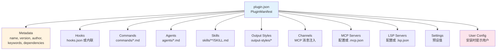
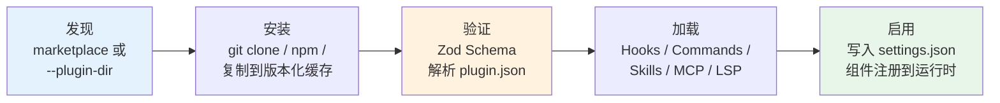
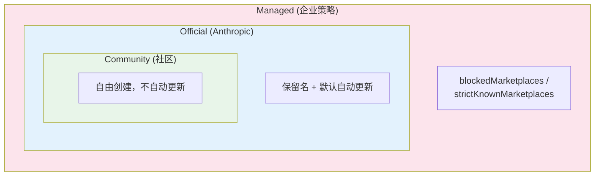

# 第22b章：插件系统 — 从打包到市场的扩展工程

## 为什么这很重要

第 22 章分析了技能系统（Skills）——Claude Code 如何让 Markdown 文件成为模型可执行的指令。但技能只是 Claude Code 扩展机制的冰山一角。当你想把一组技能、几个 Hook、一对 MCP 服务器和一套自定义命令打包成一个可分发的产品时，你需要的不是技能系统，而是**插件系统**。

插件（Plugin）是 Claude Code 扩展架构的顶层容器。它回答的不是"如何定义一个能力"，而是一系列更难的问题：**如何发现能力？如何信任它？如何安装、更新、卸载它？如何让一千个用户使用同一个插件而不互相干扰？**

这些问题的工程复杂度远超技能本身。Claude Code 用近 1700 行的 Zod Schema 定义插件清单格式，用 25 种 discriminated union 错误类型处理加载失败，用版本化缓存隔离不同插件版本，用安全存储分流敏感配置。这套基础设施使得一个闭源的 AI Agent 产品获得了类似开源生态的扩展能力——而这正是本章要分析的核心设计。

如果说第 22 章分析的是"插件里装了什么"，本章分析的是"插件这个容器本身是怎么设计的"。

## 源码分析

### 22b.1 插件清单：近 1700 行 Zod Schema 的设计

插件的一切始于 `plugin.json`——一个 JSON 清单文件，定义了插件的元数据和它提供的所有组件。这个清单的验证 Schema 占了 1681 行（`schemas.ts`），是 Claude Code 中最大的单个 Schema 定义。

清单的顶层结构由 11 个子 Schema 组合而成：

```typescript
// restored-src/src/utils/plugins/schemas.ts:884-898
export const PluginManifestSchema = lazySchema(() =>
  z.object({
    ...PluginManifestMetadataSchema().shape,
    ...PluginManifestHooksSchema().partial().shape,
    ...PluginManifestCommandsSchema().partial().shape,
    ...PluginManifestAgentsSchema().partial().shape,
    ...PluginManifestSkillsSchema().partial().shape,
    ...PluginManifestOutputStylesSchema().partial().shape,
    ...PluginManifestChannelsSchema().partial().shape,
    ...PluginManifestMcpServerSchema().partial().shape,
    ...PluginManifestLspServerSchema().partial().shape,
    ...PluginManifestSettingsSchema().partial().shape,
    ...PluginManifestUserConfigSchema().partial().shape,
  }),
)
```

除了 `MetadataSchema` 外，其余 10 个子 Schema 都用了 `.partial()`——意味着插件可以只提供其中任意子集。一个只有 Hook 的插件和一个提供完整工具链的插件共享同一个清单格式，只是填的字段不同。



这个设计有三个值得注意的地方。

**第一，路径安全验证。** 清单中所有文件路径都必须以 `./` 开头，并且不能包含 `..`。这防止插件通过路径遍历访问宿主系统的其他文件。

**第二，市场名称保留机制。** 清单验证对市场名称进行了多层过滤：

```typescript
// restored-src/src/utils/plugins/schemas.ts:19-28
export const ALLOWED_OFFICIAL_MARKETPLACE_NAMES = new Set([
  'claude-code-marketplace',
  'claude-code-plugins',
  'claude-plugins-official',
  'anthropic-marketplace',
  'anthropic-plugins',
  'agent-skills',
  'life-sciences',
  'knowledge-work-plugins',
])
```

验证链包括：不能有空格、不能包含路径分隔符、不能冒充官方名称、不能用保留名 `inline`（用于 `--plugin-dir` 会话插件）和 `builtin`（用于内置插件）。这些验证全部在 `MarketplaceNameSchema` 中完成（第 216-245 行），使用 Zod 的 `.refine()` 链式表达。

**第三，命令可以内联定义。** 除了从文件加载，命令还可以通过 `CommandMetadataSchema` 内联：

```typescript
// restored-src/src/utils/plugins/schemas.ts:385-416
export const CommandMetadataSchema = lazySchema(() =>
  z.object({
      source: RelativeCommandPath().optional(),
      content: z.string().optional(),
      description: z.string().optional(),
      argumentHint: z.string().optional(),
      // ...
  }),
)
```

`source`（文件路径）和 `content`（内联 Markdown）二选一。这让小型插件可以在 `plugin.json` 中直接嵌入命令内容，而不必创建额外的 Markdown 文件。

### 22b.2 生命周期：从发现到组件加载的 5 阶段

一个插件从磁盘上的文件到被 Claude Code 使用，经历 5 个阶段：



**发现阶段**有两个来源（按优先级）：

```typescript
// restored-src/src/utils/plugins/pluginLoader.ts:1-33
// Plugin Discovery Sources (in order of precedence):
// 1. Marketplace-based plugins (plugin@marketplace format in settings)
// 2. Session-only plugins (from --plugin-dir CLI flag or SDK plugins option)
```

**安装阶段**的关键设计是**版本化缓存**。每个插件被复制到 `~/.claude/plugins/cache/{marketplace}/{plugin}/{version}/` 目录，而不是直接在原始位置运行。这保证了：同一插件的不同版本互不干扰；卸载只需删除缓存目录；离线场景下可以从缓存启动。

**加载阶段**使用 `memoize` 确保每个组件只加载一次。`getPluginCommands()` 和 `getPluginSkills()` 都是 memoized 的异步工厂函数。这对 Agent 性能很重要——Hook 可能在每次工具调用时触发，如果每次都重新解析 Markdown 文件，延迟会累积。

组件加载的优先级也值得注意。在 `loadAllCommands()` 中，注册顺序为：

1. Bundled skills（编译时内置）
2. Built-in plugin skills（内置插件提供的技能）
3. Skill directory commands（用户本地 `~/.claude/skills/`）
4. Workflow commands
5. **Plugin commands**（市场安装的插件命令）
6. Plugin skills
7. Built-in commands

这个顺序意味着：用户本地的自定义技能优先于插件提供的同名命令——用户的定制永远不会被插件覆盖。

### 22b.3 信任模型：分层信任与安装前审计

插件系统面临一个 Agent 特有的信任难题：插件不只是被动的 UI 扩展——它可以通过 Hook 在工具执行前后注入命令，通过 MCP 服务器提供新工具，甚至通过 skills 影响模型的行为。

Claude Code 的应对策略是**分层信任**。

**第一层：持久化安全警告。** 插件管理界面中，`PluginTrustWarning` 组件始终可见：

```typescript
// restored-src/src/commands/plugin/PluginTrustWarning.tsx:1-31
// "Make sure you trust a plugin before installing, updating, or using it"
```

这不是一次性的弹窗确认，而是在 `/plugin` 管理界面中**持续显示**的警告。用户每次进入插件管理界面都会看到它——这比"安装时确认一次就再不提"的模式更安全，但又不至于像每次操作都弹窗那样干扰工作流。

**第二层：项目级信任。** `TrustDialog` 组件对项目目录执行安全审计，检查是否存在 MCP 服务器、Hook、bash 权限、API key helper、危险环境变量等。信任状态存储在项目配置的 `hasTrustDialogAccepted` 字段中，并且沿目录层级向上查找——如果父目录已被信任，子目录继承信任。

**第三层：敏感值隔离。** 插件选项中标记为 `sensitive: true` 的值不存储在 `settings.json` 中，而是存入安全存储（macOS 上是 keychain，其他平台是 `.credentials.json`）：

```typescript
// restored-src/src/utils/plugins/pluginOptionsStorage.ts:1-13
// Storage splits by `sensitive`:
//   - `sensitive: true`  → secureStorage (keychain on macOS, .credentials.json elsewhere)
//   - everything else    → settings.json `pluginConfigs[pluginId].options`
```

加载时两个来源合并，安全存储优先：

```typescript
// restored-src/src/utils/plugins/pluginOptionsStorage.ts:56-77
export const loadPluginOptions = memoize(
  (pluginId: string): PluginOptionValues => {
    // ...
    // secureStorage wins on collision — schema determines destination so
    // collision shouldn't happen, but if a user hand-edits settings.json we
    // trust the more secure source.
    return { ...nonSensitive, ...sensitive }
  },
)
```

源码注释揭示了一个实际考量：`memoize` 不仅是性能优化，还是安全必需——每次从 keychain 读取会触发 `security find-generic-password` 子进程（约 50-100ms），如果 Hook 在每次工具调用时都触发，不 memoize 会导致明显的延迟。

### 22b.4 市场系统：发现、安装和依赖解析

插件市场（Marketplace）是一个 JSON 清单，描述了一组可安装的插件。市场源支持 9 种类型：

```typescript
// restored-src/src/utils/plugins/schemas.ts:906-907
export const MarketplaceSourceSchema = lazySchema(() =>
  z.discriminatedUnion('source', [
    // url, github, git, npm, file, directory, hostPattern, pathPattern, settings
  ]),
)
```

这些类型覆盖了从"直接 URL"到"GitHub 仓库"到"npm 包"到"本地目录"的几乎所有分发方式。`hostPattern` 和 `pathPattern` 甚至支持根据用户的主机名或项目路径自动推荐市场——这是企业部署场景的设计。

市场加载使用**优雅降级**（graceful degradation）：

```typescript
// restored-src/src/utils/plugins/marketplaceHelpers.ts
loadMarketplacesWithGracefulDegradation() // 单个市场失败不影响其他市场
```

这个函数名本身就是一个设计声明：在多源系统中，任何单一来源的故障都不应该导致整个系统不可用。

**依赖解析**是另一个重要机制。插件可以在清单中声明依赖：

```typescript
// restored-src/src/utils/plugins/schemas.ts:313-318
dependencies: z
  .array(DependencyRefSchema())
  .optional()
  .describe(
    'Plugins that must be enabled for this plugin to function. Bare names (no "@marketplace") are resolved against the declaring plugin\'s own marketplace.',
  ),
```

裸名称（如 `my-dep`）自动解析到声明插件所在的市场——这避免了强制依赖来自同一市场的插件时冗余书写市场名。

**安装作用域**分为 4 级：

| 作用域 | 存储位置 | 可见范围 | 典型用途 |
|--------|---------|---------|---------|
| `user` | `~/.claude/plugins/` | 所有项目 | 个人常用工具 |
| `project` | `.claude/plugins/` | 项目所有协作者 | 团队标准工具 |
| `local` | `.claude-code.json` | 当前会话 | 临时测试 |
| `managed` | `managed-settings.json` | 受策略控制 | 企业统一管理 |

这四个作用域的设计与 Git 的配置层级（system → global → local）异曲同工，但增加了 `managed` 层用于企业策略控制。

### 22b.5 错误治理：25 种错误变体的类型安全处理

大多数插件系统用字符串匹配处理错误——"if error message contains 'not found'"。Claude Code 用了一种更严格的方式：**discriminated union**。

```typescript
// restored-src/src/types/plugin.ts:101-283
export type PluginError =
  | { type: 'path-not-found'; source: string; plugin?: string; path: string; component: PluginComponent }
  | { type: 'git-auth-failed'; source: string; plugin?: string; gitUrl: string; authType: 'ssh' | 'https' }
  | { type: 'git-timeout'; source: string; plugin?: string; gitUrl: string; operation: 'clone' | 'pull' }
  | { type: 'network-error'; source: string; plugin?: string; url: string; details?: string }
  | { type: 'manifest-parse-error'; source: string; plugin?: string; manifestPath: string; parseError: string }
  | { type: 'manifest-validation-error'; source: string; plugin?: string; manifestPath: string; validationErrors: string[] }
  // ... 还有 16 种更多变体
  | { type: 'marketplace-blocked-by-policy'; source: string; marketplace: string; blockedByBlocklist?: boolean; allowedSources: string[] }
  | { type: 'dependency-unsatisfied'; source: string; plugin: string; dependency: string; reason: 'not-enabled' | 'not-found' }
  | { type: 'generic-error'; source: string; plugin?: string; error: string }
```

25 种唯一错误类型（26 个 union 变体，其中 `lsp-config-invalid` 出现了两次），每一种都有特定于该错误的上下文字段。`git-auth-failed` 带有 `authType`（ssh 还是 https），`marketplace-blocked-by-policy` 带有 `allowedSources`（允许的来源列表），`dependency-unsatisfied` 带有 `reason`（未启用还是未找到）。

源码注释还透露了一个渐进策略：

```typescript
// restored-src/src/types/plugin.ts:86-99
// IMPLEMENTATION STATUS:
// Currently used in production (2 types):
// - generic-error: Used for various plugin loading failures
// - plugin-not-found: Used when plugin not found in marketplace
//
// Planned for future use (10 types - see TODOs in pluginLoader.ts):
// These unused types support UI formatting and provide a clear roadmap for
// improving error specificity.
```

先定义完整的类型，再逐步实现——这是一种"类型先行"的演进策略。定义好 22 种错误类型不需要全部立即实现，但一旦定义，新的错误处理代码就有了明确的目标类型，而不是不断添加新的 string case。

### 22b.6 自动更新与推荐：三种推荐来源

插件系统的"拉"（用户主动安装）和"推"（系统推荐安装）都有完整设计。

**自动更新**只对官方市场默认启用，但排除了部分市场：

```typescript
// restored-src/src/utils/plugins/schemas.ts:35
const NO_AUTO_UPDATE_OFFICIAL_MARKETPLACES = new Set(['knowledge-work-plugins'])
```

更新完成后通过通知系统提示用户执行 `/reload-plugins` 刷新（详见第 18 章 Hook 系统）。这里有一个精妙的竞态处理：更新可能在 REPL 挂载前完成，所以通知使用了 `pendingNotification` 队列缓冲。

**推荐系统**有三个来源：

1. **Claude Code Hint**：外部工具（如 SDK）通过 stderr 输出 `<claude-code-hint />` 标签，CC 解析后推荐对应插件
2. **LSP 检测**：编辑特定扩展名的文件时，如果系统上有对应的 LSP 二进制但未安装相关插件，自动推荐
3. **自定义推荐**：通过 `usePluginRecommendationBase` 提供的通用状态机实现

三种来源共享一个关键约束：**每个插件每次会话最多推荐一次**（show-once semantics）。这通过配置持久化实现——已推荐过的插件 ID 记录在配置文件中，跨会话不重复。推荐菜单还有 30 秒自动消失机制，区分用户主动取消和超时取消，用于不同的分析事件。

### 22b.7 命令迁移模式：从内置到插件的渐进演化

Claude Code 正在将内置命令逐步迁移为插件。`createMovedToPluginCommand` 工厂函数揭示了这个演化策略：

```typescript
// restored-src/src/commands/createMovedToPluginCommand.ts:22-65
export function createMovedToPluginCommand({
  name, description, progressMessage,
  pluginName, pluginCommand,
  getPromptWhileMarketplaceIsPrivate,
}: Options): Command {
  return {
    type: 'prompt',
    // ...
    async getPromptForCommand(args, context) {
      if (process.env.USER_TYPE === 'ant') {
        return [{ type: 'text', text: `This command has been moved to a plugin...` }]
      }
      return getPromptWhileMarketplaceIsPrivate(args, context)
    },
  }
}
```

这个函数解决了一个实际问题：**如何在市场尚未公开时迁移命令？** 答案是按用户类型分流——内部用户（`USER_TYPE === 'ant'`）看到安装插件的指示，外部用户看到原始的内联提示词。当市场公开后，`getPromptWhileMarketplaceIsPrivate` 参数和分流逻辑就可以移除。

已迁移的命令包括 `pr-comments`（PR 评论获取）和 `security-review`（安全审查）。迁移后的命令以 `pluginName:commandName` 格式命名，保持了命名空间隔离。

这个模式的深层意义在于：**Claude Code 正在把自己从一个功能齐全的单体应用演化为一个平台**。内置命令变成插件，意味着这些功能可以被社区替换、扩展或重新组合——而不需要 fork 整个项目。

### 22b.8 插件的 Agent 设计哲学意义

回到更高的视角。为什么一个 AI Agent 需要插件系统？

**传统软件的插件系统**（如 VS Code、Vim）解决的是"让用户自定义编辑器行为"——本质上是 UI 和功能的扩展。但 **AI Agent 的插件系统**解决的是一个完全不同的问题：**Agent 能力的运行时可组合性**。

Claude Code 的 Agent 在每次会话中能做什么，取决于它加载了哪些工具、技能和 Hook。插件系统让这个能力集合变成了动态可调的：

1. **能力的可卸载性**：用户可以禁用整个插件来关闭一组相关能力。这不是传统的"关闭一个功能"——而是让 Agent 在运行时丢掉某个维度的认知和行为能力。

2. **能力的来源多元化**：Agent 的能力不再只来自一个组织的开发团队，而是来自市场中的多个提供者。`createMovedToPluginCommand` 的存在证明了这个方向——连 Anthropic 自己的内置命令都在向插件迁移。

3. **能力边界的用户控制**：4 级安装作用域（user/project/local/managed）让不同的利益相关者控制不同层级的能力边界。企业管理员通过 `managed` 策略限制允许的市场和插件；项目负责人通过 `project` 作用域为团队统一配置；开发者通过 `user` 作用域满足个人偏好。

4. **信任作为能力的前置条件**：在传统插件系统中，信任检查是安装时的一次性确认。在 Agent 上下文中，信任的意义更重——一个被信任的插件可以通过 Hook 在**每次工具调用前后**执行命令（详见第 18 章），通过 MCP 服务器提供**新的工具**给模型使用。这就是为什么 Claude Code 的信任模型是分层的、持续的，而不是一次性的。

从这个角度看，`PluginManifest` 的 11 个子 Schema 不只是"定义了插件能提供什么"——它们定义了**Agent 能力的 11 个可插拔维度**。

### 22b.9 开源与闭源之间的第三条路

Claude Code 是一个闭源的商业产品。但它的插件系统创造了一种有趣的中间地带——**闭源核心 + 开放生态**。

**市场名称保留机制**（第 22b.1 节）揭示了这个策略的具体实现。8 个官方保留名保护了 Anthropic 的品牌命名空间，但 `MarketplaceNameSchema` 的验证逻辑**有意不拦截间接变体**：

```typescript
// restored-src/src/utils/plugins/schemas.ts:7-13
// This validation blocks direct impersonation attempts like "anthropic-official",
// "claude-marketplace", etc. Indirect variations (e.g., "my-claude-marketplace")
// are not blocked intentionally to avoid false positives on legitimate names.
```

这是一个经过权衡的设计：严格到足以防止冒充，但宽松到不压制社区使用 "claude" 一词构建自己的市场。

**自动更新的差异化策略**也反映了这个定位。官方市场默认启用自动更新，社区市场默认关闭——这给了官方市场一个分发优势，但没有阻止社区市场的存在。

**安装作用域的 `managed` 层**进一步揭示了商业考量。企业可以通过 `managed-settings.json`（只读策略文件）控制允许的市场和插件。这满足了企业客户"我的员工只能用经过审批的插件"的需求，同时保留了在审批范围内的扩展灵活性。



这个三层结构让 Claude Code 在商业和开放之间找到了平衡点：

- **对 Anthropic**：保持核心产品闭源，通过官方市场控制质量和安全
- **对社区**：提供完整的插件 API 和市场机制，允许第三方分发
- **对企业**：通过策略层提供治理能力，满足合规需求

对 Agent 生态构建者的启示是：**不需要开源你的核心来获得生态效应**。只需要开放扩展接口、提供分发基础设施（市场）、以及建立治理机制（信任 + 策略），社区就能围绕你的 Agent 构建价值。

但这个模式有一个固有风险：**生态依赖平台的善意**。如果平台方收紧插件 API、限制市场准入或改变分发规则，生态参与者没有 fork 的退路——这是闭源核心相对于开源基金会治理的本质劣势。Claude Code 目前通过开放的清单格式和多源市场机制降低了这个风险，但长期的生态健康仍然取决于平台方的治理承诺。

---

## 模式提炼

### 模式一：清单即契约（Manifest as Contract）

**解决的问题**：扩展系统如何在不引入运行时错误的情况下验证第三方贡献？

**代码模板**：用 Schema 验证库（如 Zod）定义完整的清单格式，每个字段带有类型、约束和描述。清单验证在加载阶段完成，验证失败产生结构化错误而非运行时异常。所有文件路径必须以 `./` 开头，不允许 `..` 遍历。

**前置条件**：扩展系统接受来自不可信来源的配置文件。

### 模式二：类型先行演进（Type-First Evolution）

**解决的问题**：如何在大型系统中渐进地改善错误处理，而不需要一次性重构所有错误站点？

**代码模板**：先定义完整的 discriminated union 错误类型（22 种），但只在少数站点实际使用（2 种），其余标记为"planned for future use"。新代码有了明确的目标类型，老代码可以逐步迁移。

**前置条件**：团队愿意容忍暂时未使用的类型定义，把它视为"类型路线图"而非"死代码"。

### 模式三：敏感值分流（Sensitive Value Shunting）

**解决的问题**：插件配置中的 API key、密码等敏感值如何安全存储？

**代码模板**：Schema 中每个配置字段标记 `sensitive: true/false`。存储时按标记分流——敏感值写入系统安全存储（如 macOS keychain），非敏感值写入普通配置文件。读取时合并两个来源，安全存储优先。使用 `memoize` 缓存避免重复的安全存储访问。

**前置条件**：目标平台提供安全存储 API（keychain、credential manager 等）。

### 模式四：闭源核心开放生态（Closed Core, Open Ecosystem）

**解决的问题**：闭源产品如何获得开源生态的扩展效应？

**核心做法**：开放扩展清单格式 + 多源市场发现 + 分层策略控制（详见 22b.9 的完整分析）。关键设计：保留品牌命名空间但不限制社区使用品牌词；官方市场有分发优势但不排斥第三方市场。

**风险**：生态健康依赖平台方的治理承诺，缺少 fork 退路。

**前置条件**：产品已有足够的用户基数使生态有吸引力。

---

## 用户能做什么

1. **构建自己的插件**：创建 `plugin.json`，在 `commands/`、`skills/`、`hooks/` 中放入组件文件，用 `claude plugin validate` 验证清单格式。从最小可用的单 Hook 插件开始，逐步添加组件。

2. **设计插件的信任边界**：如果你的插件需要 API key，在 `userConfig` 中标记 `sensitive: true`。不要在命令字符串中硬编码敏感值——使用 `${user_config.KEY}` 模板变量，让 Claude Code 的存储系统处理安全性。

3. **利用安装作用域管理团队工具**：把团队标准工具安装到 `project` 作用域（`.claude/plugins/`），个人偏好工具安装到 `user` 作用域。这样 `.claude/plugins/` 可以提交到 Git，团队成员自动获得统一工具集。

4. **为你的 Agent 设计插件系统时参考 Claude Code 的分层**：清单验证（防御第三方输入）+ 版本化缓存（隔离）+ 安全存储分流（保护敏感值）+ 策略层（企业治理）。这四层是最小可用的插件基础设施。

5. **考虑"命令迁移"策略**：如果你的 Agent 有内置功能计划开放给社区维护，参考 `createMovedToPluginCommand` 的分流模式——内部用户先迁移测试，外部用户保持现有体验，市场公开后统一切换。
