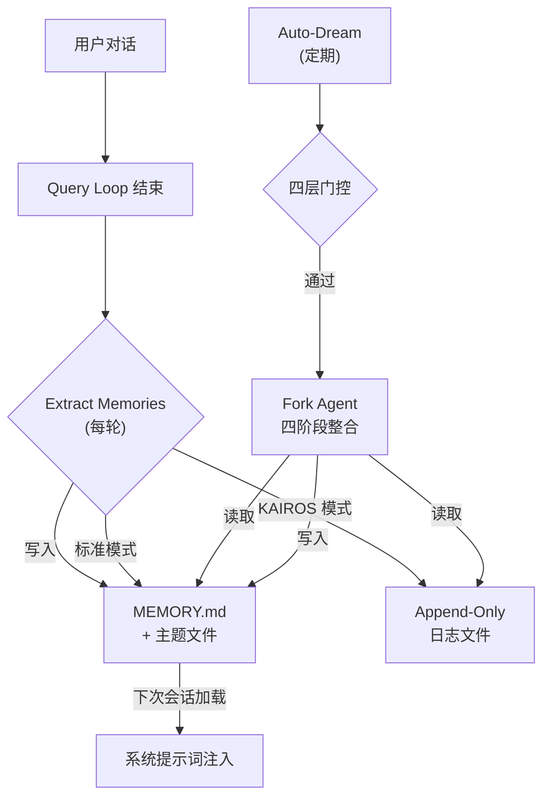

# 第24章：跨会话记忆 — 从遗忘到持久学习

## 为什么这很重要

一个没有记忆的 AI Agent 本质上是一个无状态函数：每次调用都从零开始，不知道用户是谁、上次做了什么、哪些决策已经做过。用户被迫在每个新会话中重复相同的上下文——"我是后端工程师"、"这个项目用 Bun 构建"、"不要用 mock 测试数据库"。这种重复不仅浪费时间，更破坏了人机协作的连续性。

Claude Code 对此的回答是一套**六层记忆架构**，从原始信号捕获到结构化知识蒸馏，从会话内摘要到跨会话持久化，构建了一个完整的"学习能力"。这六个子系统分工明确：

| 子系统 | 核心文件 | 频率 | 职责 |
|--------|---------|------|------|
| Memdir | `memdir/memdir.ts` | 每次会话加载 | MEMORY.md 索引 + 主题文件，注入系统提示词 |
| Extract Memories | `services/extractMemories/extractMemories.ts` | 每轮结束 | Fork agent 自动提取记忆 |
| Session Memory | `services/SessionMemory/sessionMemory.ts` | 定期触发 | 滚动会话摘要，用于压缩 |
| Transcript Persistence | `utils/sessionStorage.ts` | 每消息 | JSONL 会话记录存储与恢复 |
| Agent Memory | `tools/AgentTool/agentMemory.ts` | Agent 生命周期 | 子 Agent 持久化 + VCS 快照 |
| Auto-Dream | `services/autoDream/autoDream.ts` | 每日 | 夜间记忆整合与修剪 |

这些子系统在前面的章节中各有零散提及——第9章介绍了自动压缩，第10章讨论了压缩后的文件状态保留，第19章分析了 CLAUDE.md 加载，第20章覆盖了 fork agent 模式，第23章提到了 KAIROS 和 TEAMMEM feature flag。但记忆的**创建、生命周期、跨会话持久化**作为一个整体系统，从未被完整分析过。本章填补这个空白。

## 源码分析

### 24.1 Memdir 架构：MEMORY.md 索引与主题文件

Memdir 是整个记忆系统的存储层——所有记忆最终都以文件形式落入这个目录结构。

#### 路径解析

记忆目录的位置由 `paths.ts` 中的 `getAutoMemPath()` 决定，遵循三级优先链：

```typescript
// restored-src/src/memdir/paths.ts:223-235
export const getAutoMemPath = memoize(
  (): string => {
    const override = getAutoMemPathOverride() ?? getAutoMemPathSetting()
    if (override) {
      return override
    }
    const projectsDir = join(getMemoryBaseDir(), 'projects')
    return (
      join(projectsDir, sanitizePath(getAutoMemBase()), AUTO_MEM_DIRNAME) + sep
    ).normalize('NFC')
  },
  () => getProjectRoot(),
)
```

解析顺序：
1. `CLAUDE_COWORK_MEMORY_PATH_OVERRIDE` 环境变量（Cowork 空间级挂载）
2. `autoMemoryDirectory` 设置（仅限受信任来源：policy/flag/local/user settings，**排除** projectSettings 以防恶意仓库重定向写入路径）
3. 默认路径：`~/.claude/projects/<sanitized-git-root>/memory/`

值得注意的是，`getAutoMemBase()` 使用 `findCanonicalGitRoot()` 而非 `getProjectRoot()`，这意味着同一仓库的所有 worktree 共享同一个记忆目录。这是一个刻意的设计决策——记忆是关于项目的，不是关于工作目录的。

#### 索引与截断

`MEMORY.md` 是记忆系统的入口点——一个索引文件，每行指向一个主题文件。系统在每次会话开始时将其注入系统提示词。为了防止索引膨胀吞噬宝贵的上下文空间，`memdir.ts` 施加了双重截断：

```typescript
// restored-src/src/memdir/memdir.ts:34-38
export const ENTRYPOINT_NAME = 'MEMORY.md'
export const MAX_ENTRYPOINT_LINES = 200
export const MAX_ENTRYPOINT_BYTES = 25_000
```

截断逻辑是级联的：先按行截断（200 行，自然边界），再检查字节数（25KB），如果字节截断需要在行中间切断，则回退到最后一个换行符处。这种"先行后字节"的策略是经验驱动的——注释中提到 p97 分位时内容长度在限制内，但 p100 观测到 197KB 仍在 200 行以内，说明存在极长行的索引文件。

`truncateEntrypointContent()`（`memdir.ts:57-103`）执行级联截断后，会追加一条 WARNING 消息，告诉模型索引被截断了，并建议将详细内容移到主题文件中（截断函数的完整分析详见第19章）。这是一个巧妙的自修复机制——模型在下次整理记忆时会看到这个警告并据此行动。

#### 主题文件格式

每个记忆以独立的 Markdown 文件存储，使用 YAML frontmatter（前置元数据）标注元数据：

```markdown
---
name: 记忆名称
description: 一行描述（用于判断相关性）
type: user | feedback | project | reference
---

记忆内容...
```

四种类型形成了一个封闭的分类体系：
- **user**：用户角色、偏好、知识水平
- **feedback**：用户对 Agent 行为的纠正和指导
- **project**：正在进行的工作、目标、截止日期
- **reference**：外部系统的指针（Linear 项目、Grafana 面板）

`memoryScan.ts` 中的扫描器只读取每个文件的前 30 行来解析 frontmatter，避免在大量记忆文件时产生过多 IO：

```typescript
// restored-src/src/memdir/memoryScan.ts:21-22
const MAX_MEMORY_FILES = 200
const FRONTMATTER_MAX_LINES = 30
```

扫描结果按修改时间倒序排列，最多保留 200 个文件。这意味着最久未更新的记忆会被自然淘汰。

#### KAIROS 日志模式

当 KAIROS（长期运行的助手模式）激活时，记忆写入策略从"直接更新主题文件 + MEMORY.md"切换为"追加到每日日志文件"：

```typescript
// restored-src/src/memdir/paths.ts:246-251
export function getAutoMemDailyLogPath(date: Date = new Date()): string {
  const yyyy = date.getFullYear().toString()
  const mm = (date.getMonth() + 1).toString().padStart(2, '0')
  const dd = date.getDate().toString().padStart(2, '0')
  return join(getAutoMemPath(), 'logs', yyyy, mm, `${yyyy}-${mm}-${dd}.md`)
}
```

路径格式为 `memory/logs/YYYY/MM/YYYY-MM-DD.md`。这种 append-only 策略避免了在长期会话中频繁重写同一文件的问题——蒸馏交给夜间的 Auto-Dream 处理。

### 24.2 Extract Memories：自动记忆提取

Extract Memories 是记忆系统的"感知层"——在每轮查询结束时，一个 fork agent 静默地分析对话并提取值得持久化的信息。

#### 触发机制

提取在 `stopHooks.ts` 中触发，位于查询循环结束时（详见第4章关于 stop hooks 的讨论）：

```typescript
// restored-src/src/query/stopHooks.ts:141-156
if (
  feature('EXTRACT_MEMORIES') &&
  !toolUseContext.agentId &&
  isExtractModeActive()
) {
  void extractMemoriesModule!.executeExtractMemories(
    stopHookContext,
    toolUseContext.appendSystemMessage,
  )
}
if (!toolUseContext.agentId) {
  void executeAutoDream(stopHookContext, toolUseContext.appendSystemMessage)
}
```

两个关键约束：
1. **仅主 Agent**：`!toolUseContext.agentId` 排除了子 Agent 的 stop hooks
2. **Fire-and-forget**：`void` 前缀表明提取是异步执行的，不阻塞下一轮查询

#### 节流机制

并非每轮查询都会触发提取。`tengu_bramble_lintel` feature flag 控制频率（默认值 1，即每轮运行）：

```typescript
// restored-src/src/services/extractMemories/extractMemories.ts:377-385
if (!isTrailingRun) {
  turnsSinceLastExtraction++
  if (
    turnsSinceLastExtraction <
    (getFeatureValue_CACHED_MAY_BE_STALE('tengu_bramble_lintel', null) ?? 1)
  ) {
    return
  }
}
turnsSinceLastExtraction = 0
```

#### 与主 Agent 的互斥

当主 Agent 自己写了记忆文件（例如用户明确要求"记住这个"），fork agent 会跳过本轮提取：

```typescript
// restored-src/src/services/extractMemories/extractMemories.ts:121-148
function hasMemoryWritesSince(
  messages: Message[],
  sinceUuid: string | undefined,
): boolean {
  // ... 检查 assistant 消息中是否有 Edit/Write 工具调用目标在 autoMemPath 内
}
```

这避免了两个 agent 同时写入同一文件的冲突。当主 agent 写入时，cursor 直接前进到最新消息，确保这些消息不会被后续提取重复处理。

#### 权限隔离

fork agent 的权限被严格限制：

`createAutoMemCanUseTool()`（`extractMemories.ts:171-222`）实现了以下权限策略：

- **允许**：Read/Grep/Glob（只读工具，无限制）
- **允许**：Bash（仅 `isReadOnly` 通过的命令——`ls`、`find`、`grep`、`cat` 等）
- **允许**：Edit/Write（仅 `memoryDir` 内的路径，通过 `isAutoMemPath()` 验证）
- **拒绝**：所有其他工具（MCP、Agent、写入式 Bash 等）

这个权限函数同时被 Extract Memories 和 Auto-Dream 共享（详见 24.6 节）。

#### 提取提示词

提取 agent 收到的提示词（`prompts.ts`）明确指示了高效的操作策略：

```typescript
// restored-src/src/services/extractMemories/prompts.ts:39
`You have a limited turn budget. ${FILE_EDIT_TOOL_NAME} requires a prior
${FILE_READ_TOOL_NAME} of the same file, so the efficient strategy is:
turn 1 — issue all ${FILE_READ_TOOL_NAME} calls in parallel for every file
you might update; turn 2 — issue all ${FILE_WRITE_TOOL_NAME}/${FILE_EDIT_TOOL_NAME}
calls in parallel.`
```

同时明确禁止了调查行为——"Do not waste any turns attempting to investigate or verify that content further"。这是因为 fork agent 继承了主对话的完整上下文（包括 prompt cache），不需要额外的信息收集。最大轮次限制为 5（`maxTurns: 5`），防止 agent 陷入验证循环。

### 24.3 Session Memory：滚动会话摘要

Session Memory 解决的是一个不同的问题：**会话内**的信息保留。当上下文窗口接近饱和、自动压缩即将触发时（详见第9章），压缩器需要知道哪些信息是重要的。Session Memory 提供这个信号。

#### 触发条件

Session Memory 注册为 post-sampling hook（`registerPostSamplingHook`），在每次模型采样后运行。但实际提取受三重阈值保护：

```typescript
// restored-src/src/services/SessionMemory/sessionMemoryUtils.ts:32-36
export const DEFAULT_SESSION_MEMORY_CONFIG: SessionMemoryConfig = {
  minimumMessageTokensToInit: 10000,   // 首次触发：10K token
  minimumTokensBetweenUpdate: 5000,    // 更新间隔：5K token
  toolCallsBetweenUpdates: 3,          // 最低工具调用数：3
}
```

触发逻辑（`sessionMemory.ts:134-181`）需要满足：
1. **初始化阈值**：上下文窗口达到 10K token 时首次触发
2. **更新条件**：token 阈值（5K）**必须**满足，加上 (a) 工具调用数 ≥ 3，或 (b) 最后一个 assistant 轮次没有工具调用（自然对话断点）

这意味着 Session Memory 不会在短对话中触发，也不会在密集工具调用的中间打断工作流。

#### 摘要模板

摘要文件使用固定的章节结构（`prompts.ts:11-41`）：

```markdown
# Session Title
# Current State
# Task specification
# Files and Functions
# Workflow
# Errors & Corrections
# Codebase and System Documentation
# Learnings
# Key results
# Worklog
```

每个章节有大小限制（`MAX_SECTION_LENGTH = 2000` token），总文件不超过 12,000 token（详见第12章关于 token 预算策略的讨论）。超出预算时，提示词会要求 agent 主动压缩最不重要的部分。

#### 与自动压缩的关系

Session Memory 的初始化门控 `initSessionMemory()` 检查 `isAutoCompactEnabled()`——如果自动压缩被禁用，Session Memory 也不会运行。这是因为 Session Memory 的主要消费者就是压缩系统。摘要文件 `summary.md` 在压缩时被注入，为压缩器提供"什么是重要的"这个关键信号（详见第9章 `sessionMemoryCompact.ts`）。

#### 与 Extract Memories 的区别

| 维度 | Session Memory | Extract Memories |
|------|---------------|-----------------|
| 持久化范围 | 会话内 | 跨会话 |
| 存储位置 | `~/.claude/projects/<root>/<session-id>/session-memory/` | `~/.claude/projects/<root>/memory/` |
| 触发时机 | token 阈值 + 工具调用阈值 | 每轮查询结束 |
| 消费者 | 压缩系统 | 下次会话的系统提示词 |
| 内容结构 | 固定章节模板 | 自由格式主题文件 |

两者并行运行，互不干扰——Session Memory 关注"这次会话做了什么"，Extract Memories 关注"哪些信息值得跨会话保留"。

### 24.4 Transcript Persistence：JSONL 会话存储

`sessionStorage.ts`（5105 行，源码中最大的单文件之一）负责将完整的会话记录持久化为 JSONL（JSON Lines）格式。

#### 存储格式

每条消息序列化为一行 JSON，追加到会话文件中。存储路径为 `~/.claude/projects/<root>/<session-id>.jsonl`。JSONL 的选择是出于性能考虑——增量追加只需 `appendFile`，不需要解析和重写整个文件。

会话记录中除了标准的 user/assistant 消息外，还包含多种特殊条目：

| 条目类型 | 用途 |
|---------|------|
| `file_history_snapshot` | 文件历史快照，用于压缩后恢复文件状态（详见第10章） |
| `attribution_snapshot` | 归因快照，记录每个文件修改的来源 |
| `context_collapse_snapshot` | 压缩边界标记，记录压缩发生的位置和保留的消息 |
| `content_replacement` | 内容替换记录，用于 REPL 模式下的输出截断 |

#### 会话恢复

当用户通过 `claude --resume` 恢复会话时，`sessionStorage.ts` 从 JSONL 文件重建完整的消息链。恢复过程中：
1. 解析所有 JSONL 条目
2. 根据 `uuid`/`parentUuid` 重建消息树
3. 应用压缩边界标记（`context_collapse_snapshot`），恢复到压缩后的状态
4. 重建文件历史快照，确保模型对文件状态的理解与磁盘一致

这使得跨会话的"续写"成为可能——用户可以在一天结束时关闭终端，第二天恢复完全一样的对话上下文。

### 24.5 Agent Memory：子 Agent 持久化

子 Agent（详见第20章）有自己的记忆需求——一个反复执行代码审查的 agent 需要记住团队的代码风格偏好，一个测试 agent 需要记住项目的测试框架配置。

#### 三作用域模型

`agentMemory.ts` 定义了三个记忆作用域：

```typescript
// restored-src/src/tools/AgentTool/agentMemory.ts:12-13
export type AgentMemoryScope = 'user' | 'project' | 'local'
```

| 作用域 | 路径 | 可提交到 VCS | 用途 |
|-------|------|-------------|------|
| `user` | `~/.claude/agent-memory/<agentType>/` | 否 | 跨项目的用户级偏好 |
| `project` | `<cwd>/.claude/agent-memory/<agentType>/` | 是 | 团队共享的项目知识 |
| `local` | `<cwd>/.claude/agent-memory-local/<agentType>/` | 否 | 本机特定的项目配置 |

每个作用域独立维护自己的 `MEMORY.md` 索引和主题文件，使用与 Memdir 完全相同的 `buildMemoryPrompt()` 构建系统提示词内容。

#### VCS 快照同步

`agentMemorySnapshot.ts` 解决了一个实际问题：`project` 作用域的记忆应该可以通过 Git 在团队间共享，但 `.claude/agent-memory/` 在 `.gitignore` 中。解决方案是一个单独的快照目录：

```typescript
// restored-src/src/tools/AgentTool/agentMemorySnapshot.ts:31-33
export function getSnapshotDirForAgent(agentType: string): string {
  return join(getCwd(), '.claude', SNAPSHOT_BASE, agentType)
}
```

快照通过 `snapshot.json` 中的 `updatedAt` 时间戳追踪版本。当检测到快照比本地记忆更新时，提供三种策略：

```typescript
// restored-src/src/tools/AgentTool/agentMemorySnapshot.ts:98-144
export async function checkAgentMemorySnapshot(
  agentType: string,
  scope: AgentMemoryScope,
): Promise<{
  action: 'none' | 'initialize' | 'prompt-update'
  snapshotTimestamp?: string
}> {
  // 无快照 → 'none'
  // 无本地记忆 → 'initialize'（复制快照到本地）
  // 快照更新 → 'prompt-update'（提示模型合并）
}
```

`initialize` 直接复制文件；`prompt-update` 不自动覆盖，而是通过提示词告诉模型"有新的团队知识可用"，让模型决定如何合并。这避免了自动覆盖可能导致的本地定制丢失。

### 24.6 Auto-Dream：自动记忆整合

Auto-Dream 是记忆系统的"睡眠阶段"——一个后台整合任务，需要同时满足时间门控（默认 24 小时）和会话门控（默认 5 个新会话）才会触发。它综合整理分散的记忆片段，修剪过时信息，保持记忆系统的健康。

#### 四层门控系统

Auto-Dream 的触发需要通过四层检查，按开销从低到高排列（`autoDream.ts:95-191`）：

**第一层：Master Gate**

```typescript
// restored-src/src/services/autoDream/autoDream.ts:95-100
function isGateOpen(): boolean {
  if (getKairosActive()) return false  // KAIROS 模式用 disk-skill dream
  if (getIsRemoteMode()) return false
  if (!isAutoMemoryEnabled()) return false
  return isAutoDreamEnabled()
}
```

KAIROS 模式被排除是因为 KAIROS 有自己的 dream skill（通过 `/dream` 命令手动触发）。远程模式（CCR）被排除是因为持久存储不可靠。`isAutoDreamEnabled()` 检查用户设置和 `tengu_onyx_plover` feature flag（`config.ts:13-21`）。

**第二层：Time Gate**

```typescript
// restored-src/src/services/autoDream/autoDream.ts:131-141
let lastAt: number
try {
  lastAt = await readLastConsolidatedAt()
} catch { ... }
const hoursSince = (Date.now() - lastAt) / 3_600_000
if (!force && hoursSince < cfg.minHours) return
```

默认 `minHours = 24`，即距上次整合至少 24 小时。时间信息通过锁文件的 mtime 获取——一次 `stat` 系统调用。

**第三层：Session Gate**

```typescript
// restored-src/src/services/autoDream/autoDream.ts:153-171
let sessionIds: string[]
try {
  sessionIds = await listSessionsTouchedSince(lastAt)
} catch { ... }
const currentSession = getSessionId()
sessionIds = sessionIds.filter(id => id !== currentSession)
if (!force && sessionIds.length < cfg.minSessions) return
```

默认 `minSessions = 5`，即上次整合以来至少有 5 个新会话被修改。当前会话被排除（它的 mtime（modification time，文件修改时间）始终是最新的）。扫描有 10 分钟的冷却期（`SESSION_SCAN_INTERVAL_MS = 10 * 60 * 1000`），防止时间门控通过后每轮都重复扫描会话列表。

**第四层：Lock Gate**

通过三层检查后，还需要获取并发锁。如果另一个进程正在执行整合，当前进程会放弃。锁机制的实现细节见下一节。

#### PID（Process ID）锁机制

并发控制通过 `.consolidate-lock` 文件实现（`consolidationLock.ts`）：

```typescript
// restored-src/src/services/autoDream/consolidationLock.ts:16-19
const LOCK_FILE = '.consolidate-lock'
const HOLDER_STALE_MS = 60 * 60 * 1000  // 1 小时
```

这个锁文件承载了双重语义：
- **mtime** = `lastConsolidatedAt`（上次成功整合的时间戳）
- **文件内容** = 持有者的 PID

获取锁的流程：
1. `stat` + `readFile` 获取 mtime 和 PID
2. 如果 mtime 在 1 小时内且 PID 存活 → 被占用，返回 `null`
3. 如果 PID 已死或 mtime 过期 → 回收锁
4. 写入自己的 PID
5. 重新读取验证（防止两个进程同时回收时的竞态条件）

```typescript
// restored-src/src/services/autoDream/consolidationLock.ts:46-84
export async function tryAcquireConsolidationLock(): Promise<number | null> {
  // ... stat + readFile ...
  await writeFile(path, String(process.pid))
  // 双重检查：两个回收者都写 → 后写的赢得 PID
  let verify: string
  try {
    verify = await readFile(path, 'utf8')
  } catch { return null }
  if (parseInt(verify.trim(), 10) !== process.pid) return null
  return mtimeMs ?? 0
}
```

失败回滚通过 `rollbackConsolidationLock()` 将 mtime 恢复到获取前的值。如果 `priorMtime` 为 0（之前没有锁文件），则删除锁文件。这确保了失败的整合不会阻止下次重试。

#### 四阶段整合提示词

整合 agent 收到一个结构化的四阶段提示词（`consolidationPrompt.ts:10-65`）：

```
Phase 1 — Orient：ls 记忆目录、读 MEMORY.md、浏览主题文件
Phase 2 — Gather：搜索日志和会话记录寻找新信号
Phase 3 — Consolidate：合并到现有文件、消除矛盾、相对日期→绝对日期
Phase 4 — Prune & Index：保持 MEMORY.md 在 200 行 / 25KB 内
```

提示词中特别强调了"合并优于创建"（`Merging new signal into existing topic files rather than creating near-duplicates`）和"修正优于保留"（`if today's investigation disproves an old memory, fix it at the source`）。这防止了记忆文件的无限增长。

在自动触发场景下，prompt 还附加了额外的约束信息——`Tool constraints for this run` 和会话列表：

```typescript
// restored-src/src/services/autoDream/autoDream.ts:216-221
const extra = `
**Tool constraints for this run:** Bash is restricted to read-only commands...
Sessions since last consolidation (${sessionIds.length}):
${sessionIds.map(id => `- ${id}`).join('\n')}`
```

#### Fork Agent 约束

整合通过 `runForkedAgent` 执行（详见第20章 fork agent 模式），使用 24.2 节描述的 `createAutoMemCanUseTool` 权限函数。关键约束：

```typescript
// restored-src/src/services/autoDream/autoDream.ts:224-233
const result = await runForkedAgent({
  promptMessages: [createUserMessage({ content: prompt })],
  cacheSafeParams: createCacheSafeParams(context),
  canUseTool: createAutoMemCanUseTool(memoryRoot),
  querySource: 'auto_dream',
  forkLabel: 'auto_dream',
  skipTranscript: true,
  overrides: { abortController },
  onMessage: makeDreamProgressWatcher(taskId, setAppState),
})
```

- `cacheSafeParams: createCacheSafeParams(context)` — 继承父级的 prompt cache，大幅降低 token 成本
- `skipTranscript: true` — 不记录到会话历史（整合是后台操作，不应污染用户的对话记录）
- `onMessage` — 进度回调，捕获 Edit/Write 路径更新 DreamTask UI

#### 任务 UI 集成

`DreamTask.ts` 将 Auto-Dream 暴露在 Claude Code 的后台任务 UI 中（footer pill 和 Shift+Down 对话框）：

```typescript
// restored-src/src/tasks/DreamTask/DreamTask.ts:25-41
export type DreamTaskState = TaskStateBase & {
  type: 'dream'
  phase: DreamPhase               // 'starting' | 'updating'
  sessionsReviewing: number
  filesTouched: string[]
  turns: DreamTurn[]
  abortController?: AbortController
  priorMtime: number              // 用于 kill 时回滚锁
}
```

用户可以从 UI 中主动终止 dream 任务。`kill` 方法通过 `abortController.abort()` 中止 fork agent，然后回滚锁文件的 mtime，确保下次会话可以重试：

```typescript
// restored-src/src/tasks/DreamTask/DreamTask.ts:136-156
async kill(taskId, setAppState) {
  updateTaskState<DreamTaskState>(taskId, setAppState, task => {
    task.abortController?.abort()
    priorMtime = task.priorMtime
    return { ...task, status: 'killed', ... }
  })
  if (priorMtime !== undefined) {
    await rollbackConsolidationLock(priorMtime)
  }
}
```

#### Extract Memories vs Auto-Dream 的互补关系

两个子系统形成了一个**高频增量 + 低频全局**的互补架构：



| 维度 | Extract Memories | Auto-Dream |
|------|-----------------|------------|
| 频率 | 每轮（可通过 flag 节流） | 每日（24h + 5 个会话） |
| 输入 | 最近 N 条消息 | 整个记忆目录 + 会话记录 |
| 操作 | 创建/更新主题文件 | 合并、修剪、消除矛盾 |
| 类比 | 短期记忆→长期记忆的编码 | 睡眠中的记忆整合 |

在 KAIROS 模式下，这种互补更加明显：Extract Memories 只写 append-only 日志（原始信号流），Auto-Dream 在每日整合中将日志蒸馏为结构化的主题文件。标准模式下，Extract Memories 直接更新主题文件，Auto-Dream 负责周期性修剪和去重。

## 模式提炼

### 模式一：多层记忆架构

**解决的问题**：单一存储策略无法同时满足高频写入和高质量检索的需求。

**模式**：将记忆系统分为三层——原始信号层（日志/会话记录）、结构化知识层（主题文件）、索引层（MEMORY.md）。每层有独立的写入频率和质量要求。

```
原始信号 ──(每轮)──→ 结构化知识 ──(每日)──→ 索引
  (日志)                (主题文件)           (MEMORY.md)
  高频低质              中频中质              低频高质
```

**前置条件**：需要后台处理能力（fork agent），需要可预测的存储预算（截断机制）。

### 模式二：后台提取 via Fork Agent

**解决的问题**：记忆提取需要模型推理，但不能阻塞用户的交互循环。

**模式**：在查询循环结束时启动一个 fork agent，继承父对话的 prompt cache（降低成本），施加严格的权限隔离（只能写入记忆目录），设置工具调用和轮次上限（防止失控）。与主 agent 通过互斥检查（`hasMemoryWritesSince`）协调。

**前置条件**：prompt cache 机制可用，fork agent 基础设施就绪（详见第20章），记忆目录路径确定。

### 模式三：文件 mtime 即状态

**解决的问题**：Auto-Dream 需要持久化"上次整合时间"和"当前持有者"两个状态，但不想引入外部数据库。

**模式**：使用一个锁文件，其 mtime 即 `lastConsolidatedAt`，文件内容即持有者 PID。通过 `stat`/`utimes`/`writeFile` 实现读取、获取、回滚。PID 存活检测 + 1 小时过期提供了崩溃恢复。

**前置条件**：文件系统支持 mtime 精度至毫秒级，进程 PID 在合理时间窗口内不会被复用。

### 模式四：预算约束的记忆注入

**解决的问题**：记忆内容无限增长最终会挤压有用的上下文空间。

**模式**：施加多级截断——MEMORY.md 最多 200 行 / 25KB，主题文件通过 `MAX_MEMORY_FILES = 200` 限制数量，Session Memory 每节 2000 token 总量 12000 token。截断时追加警告消息，形成自修复闭环。

**前置条件**：确定的上下文预算（详见第12章），截断后仍能提供有意义的信息。

### 模式五：互补频率设计

**解决的问题**：单一频率的记忆处理要么信息丢失（太低频），要么噪音累积（太高频）。

**模式**：双频策略——高频增量提取（每轮/每 N 轮）捕获所有可能有价值的信号，低频全局整合（每日）修剪噪音、消除矛盾、合并重复。前者容忍误报（记住了不重要的东西），后者修复误报（删除不重要的记忆）。

**前置条件**：两个处理频率之间有足够的时间差（至少一个数量级），高频操作成本可控（继承 prompt cache）。

## 用户能做什么

### 管理 MEMORY.md

理解 200 行限制是关键。如果你的项目记忆索引超过 200 行，后面的条目会被截断。手动编辑 MEMORY.md，确保最重要的条目排在前面，将细节移到主题文件中。每个索引条目控制在一行 150 字符以内。

### 理解什么会被记住

四种类型各有最佳用途：
- **feedback** 是最有价值的类型——它直接改变 Agent 的行为。"不要用 mock 测试数据库"比"我们用 PostgreSQL"更有用
- **user** 帮助 Agent 调整沟通风格和建议深度
- **project** 有时效性，需要定期清理
- **reference** 是外部资源的快捷方式，保持简短

### 控制自动记忆

- `CLAUDE_CODE_DISABLE_AUTO_MEMORY=1` 完全禁用所有自动记忆功能
- `settings.json` 中设置 `autoMemoryEnabled: false` 按项目禁用
- `autoDreamEnabled: false` 只禁用夜间整合，保留即时提取

### 手动触发整合

不想等每日自动触发？使用 `/dream` 命令即时运行记忆整合。这在以下场景特别有用：
- 完成了一个大型重构后，需要更新项目上下文
- 团队成员切换后，需要整理个人偏好
- 发现记忆文件中有过时或矛盾的信息

### 用 CLAUDE.md 补充记忆

CLAUDE.md 和记忆系统是互补的：
- CLAUDE.md 存储**不应被修改的指令**——编码规范、架构约束、团队流程
- 记忆系统存储**可以演化的知识**——用户偏好、项目上下文、外部引用

如果某个信息不应该被 Auto-Dream 修剪或修改，把它放在 CLAUDE.md 中而不是记忆系统中。

---

## 版本演化：v2.1.91 记忆系统变化

> 以下分析基于 v2.1.91 bundle 信号对比，结合 v2.1.88 源码推断。

### 记忆功能开关

v2.1.91 新增 `tengu_memory_toggled` 事件，暗示引入了记忆功能的运行时开关——用户可以在会话中动态启用或禁用跨会话记忆。这与 v2.1.88 中记忆功能始终启用（如果 Feature Flag 开启）的行为不同。

### 无散文跳过优化

`tengu_extract_memories_skipped_no_prose` 事件表明 v2.1.91 在记忆提取前增加了内容检测：如果消息中没有散文内容（纯代码、工具结果、JSON 输出），则跳过记忆提取——避免对无意义内容执行昂贵的 LLM 提取操作。

这是一种**预算感知优化**：记忆提取需要额外的 API 调用，对纯技术交互（如批量文件读取、测试运行）执行提取不仅浪费成本，还可能产生低质量的记忆条目。

### 团队记忆

v2.1.91 新增 `tengu_team_mem_*` 系列事件（sync_pull、sync_push、push_suppressed、secret_skipped 等），表明团队记忆系统已从实验进入使用阶段。

团队记忆存储在 `~/.claude/projects/{project}/memory/team/`，与个人记忆独立。关键机制：
- **同步**：`sync_pull` / `sync_push` 事件表明团队记忆在成员间有同步机制
- **安全过滤**：`secret_skipped` 事件表明敏感内容（API key、密码等）不会写入共享记忆
- **写入抑制**：`push_suppressed` 事件表明存在写入限制（可能是频率或容量限制）
- **条目上限**：`entries_capped` 事件表明团队记忆有容量上限

详见第 20b 章 Teams 实现细节中的团队记忆安全防护分析。
