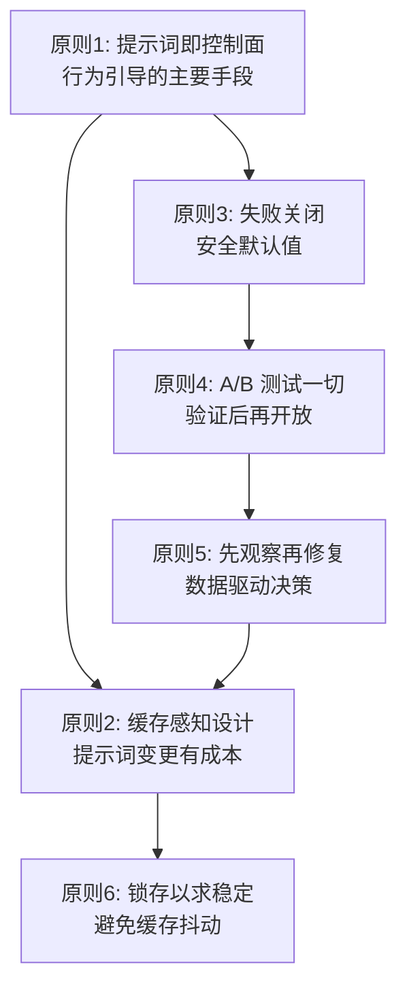

# 第25章：驾驭工程原则

## 为什么这很重要

在前六篇中，我们从源码层面剖析了 Claude Code 的每一个子系统——工具注册、Agent Loop、系统提示词、上下文压缩、提示词缓存、权限安全、技能系统。这些分析揭示了大量的实现细节，但如果只停留在"它是怎么做的"层面，就浪费了逆向工程最有价值的产出：**可复用的工程原则**。

本章从前 23 章的源码分析中提炼出 6 条驾驭工程（Harness Engineering）核心原则。每条原则都有明确的源码回溯、适用场景和反模式警示。这些原则的共同主题是：**在 AI Agent 系统中，控制行为的最佳方式不是编写更多代码，而是设计更好的约束**。

---

## 源码分析

### 25.1 原则一：提示词即控制面

**定义**：用系统提示词段落引导模型行为，而非用代码逻辑硬编码限制。

Claude Code 的行为引导绝大多数通过提示词实现，而非通过代码中的 if/else 分支。最典型的例子是极简主义指令：

```typescript
// restored-src/src/constants/prompts.ts:203
"Don't create helpers, utilities, or abstractions for one-time operations.
Don't design for hypothetical future requirements. The right amount of
complexity is what the task actually requires — no speculative abstractions,
but no half-finished implementations either. Three similar lines of code
is better than a premature abstraction."
```

这段文本不是代码注释——它是发送给模型的实际指令。Claude Code 没有在代码层面检测模型是否过度工程化（这在技术上几乎不可能），而是通过自然语言直接告诉模型"不要这么做"。

同样的模式贯穿整个系统提示词架构（详见第5章）。`systemPromptSections.ts` 将系统提示词组织为多个可组合的段落，每个段落都有明确的缓存范围（`scope: 'global'` 或 `null`）。这种设计使得行为调整只需修改文本，不需要改代码、改测试、走发布流程。

工具提示词是这一原则的精华体现（详见第8章）。BashTool 的 Git 安全协议——"绝不跳过 hooks、绝不 amend、优先指定文件 git add"——完全由提示词文本表达。如果某天团队决定允许 amend，只需删除一行提示词文本，无需触碰任何执行逻辑。

**适用边界**：用代码处理结构性约束（权限、token 预算），用提示词处理行为性约束（风格、策略、偏好）。

**反模式：行为硬编码**。为每种不希望的模型行为编写检测器和拦截器，最终得到一个庞大的规则引擎，永远追不上模型能力的变化速度。

---

### 25.2 原则二：缓存感知设计是刚需

**定义**：每次提示词变更都有以 `cache_creation` token 计量的成本，系统设计必须将缓存稳定性作为一等约束。

`SYSTEM_PROMPT_DYNAMIC_BOUNDARY` 标记（`restored-src/src/constants/prompts.ts:114-115`）将系统提示词分为两个区域：

```typescript
// restored-src/src/constants/prompts.ts:105-115
/**
 * Boundary marker separating static (cross-org cacheable) content
 * from dynamic content.
 * Everything BEFORE this marker in the system prompt array can use
 * scope: 'global'.
 * Everything AFTER contains user/session-specific content and should
 * not be cached.
 */
export const SYSTEM_PROMPT_DYNAMIC_BOUNDARY =
  '__SYSTEM_PROMPT_DYNAMIC_BOUNDARY__'
```

`splitSysPromptPrefix()`（`restored-src/src/utils/api.ts:321-435`）实现了三条代码路径来确保缓存断点放置正确：MCP 存在时的 tool-based 缓存、全局缓存+边界标记、默认 org 级别缓存。这个函数的复杂度完全来自缓存优化需求——如果不关心缓存，只需拼接字符串即可。

缓存中断检测系统（详见第14章）追踪近 20 个字段的前后状态变化（`restored-src/src/services/api/promptCacheBreakDetection.ts:28-69`），包括 `systemHash`、`toolsHash`、`cacheControlHash`、`perToolHashes`、`betas` 等。任何一个字段的变化都可能触发缓存失效。

Beta Header 锁存机制是极端案例：**一旦发送过某个 beta header，就永远继续发送，即使对应功能已关闭**——因为取消发送会改变请求签名，导致约 50-70K token 的缓存前缀失效。源码中的注释明确记录了锁存的原因：

```typescript
// restored-src/src/services/api/promptCacheBreakDetection.ts:47-48
/** AFK_MODE_BETA_HEADER presence — should NOT break cache anymore
 *  (sticky-on latched in claude.ts). Tracked to verify the fix. */
```

日期记忆化（`getSessionStartDate()`）是另一个例证：如果会话跨越午夜，模型看到的日期会"过期"——但这是有意为之，因为日期字符串变化会打断缓存前缀。

**反模式：提示词频繁变动**。Agent 列表曾内联在系统提示词中，占全球 `cache_creation` token 的 10.2%（详见第15章）。解决方案是将其移至 `system-reminder` 消息——这部分在缓存段之外，修改不影响缓存。

---

### 25.3 原则三：失败关闭，显式开放

**定义**：系统默认值应选择最安全的选项，只有在显式声明后才允许危险操作。

`buildTool()` 工厂函数为每个工具属性设置了防御性默认值：

```typescript
// restored-src/src/Tool.ts:748-761
/**
 * Defaults (fail-closed where it matters):
 * - `isConcurrencySafe` → `false` (assume not safe)
 * - `isReadOnly` → `false` (assume writes)
 * - `isDestructive` → `false`
 * - `checkPermissions` → `{ behavior: 'allow', updatedInput }`
 *   (defer to general permission system)
 * - `toAutoClassifierInput` → `''`
 *   (skip classifier — security-relevant tools must override)
 */
const TOOL_DEFAULTS = {
  isEnabled: () => true,
  isConcurrencySafe: (_input?: unknown) => false,
  isReadOnly: (_input?: unknown) => false,
  ...
}
```

这意味着新工具默认**不可并发执行**——`partitionToolCalls()`（`restored-src/src/services/tools/toolOrchestration.ts:91-116`）会将未声明 `isConcurrencySafe: true` 的工具放入串行队列。当 `isConcurrencySafe` 的调用抛出异常时，catch 块也返回 `false`——保守方向的兜底：

```typescript
// restored-src/src/services/tools/toolOrchestration.ts:98-108
const isConcurrencySafe = parsedInput?.success
  ? (() => {
      try {
        return Boolean(tool?.isConcurrencySafe(parsedInput.data))
      } catch {
        // If isConcurrencySafe throws, treat as not concurrency-safe
        // to be conservative
        return false
      }
    })()
  : false
```

权限系统遵循同样的原则（详见第16章）。权限模式从最严格到最宽松：`default` → `acceptEdits` → `plan` → `bypassPermissions` → `auto` → `dontAsk`。系统默认使用 `default`——用户必须主动选择更宽松的模式。

YOLO 分类器的拒绝追踪是另一种体现（`restored-src/src/utils/permissions/denialTracking.ts:12-15`）：`DENIAL_LIMITS` 设定连续 3 次或总计 20 次被分类器拒绝后，系统自动回退到用户手动确认——**在自动化决策不可靠时，回退到人类决策**（完整代码详见第27章模式二）。

**反模式：默认开放，出事再关**。工具默认可并发执行，某个有副作用的工具在并行执行中产生竞态条件——这种 bug 极难复现和诊断。

---

### 25.4 原则四：A/B 测试一切

**定义**：行为变更先在内部用户群体中验证，通过数据确认后再扩展到所有用户。

Claude Code 拥有 89 个 Feature Flag（详见第23章），其中相当一部分用于 A/B 测试。最值得关注的不是 flag 数量，而是门控模式。

`USER_TYPE === 'ant'` 门控是最直接的暂存机制（详见第7章）。源码中存在大量的 ant-only 段落，例如 Capybara v8 的过度注释缓解措施：

```typescript
// restored-src/src/constants/prompts.ts:205-213
...(process.env.USER_TYPE === 'ant'
  ? [
      `Default to writing no comments. Only add one when the WHY
       is non-obvious...`,
      // @[MODEL LAUNCH]: capy v8 thoroughness counterweight
      // (PR #24302) — un-gate once validated on external via A/B
      `Before reporting a task complete, verify it actually works...`,
    ]
  : []),
```

注释 `un-gate once validated on external via A/B` 清晰展示了这个流程：**先在内部验证，确认有效后通过 A/B 测试推广给外部用户**。

GrowthBook 集成提供了更精细的实验能力：`tengu_*` 前缀的 Feature Flag 通过远程配置服务器控制，支持按百分比灰度。`_CACHED_MAY_BE_STALE` 和 `_CACHED_WITH_REFRESH` 两种缓存策略的存在（详见第7章），体现了"缓存感知的 A/B 测试"——flag 值的切换不应导致缓存失效。

**反模式：Big Bang 发布**。直接将行为变更推送给所有用户。在 AI Agent 领域，行为变更的影响通常不是"崩溃"而是"不够好"或"太激进"——需要量化度量和对照组才能发现。

---

### 25.5 原则五：先观察再修复

**定义**：在尝试修复问题之前，先建立可观测性基础设施来理解问题的全貌。

缓存中断检测系统（`restored-src/src/services/api/promptCacheBreakDetection.ts`）是这一原则的典范。这个系统不修复任何问题——它的全部职责是**观察和报告**：

1. **调用前**：`recordPromptState()` 记录近 20 个字段的快照
2. **调用后**：`checkResponseForCacheBreak()` 对比前后状态，识别哪个字段变化
3. **生成解释**：翻译为人类可读原因——"system prompt changed"、"TTL likely expired"
4. **生成 Diff**：`createPatch()` 输出前后提示词状态对比

特别值得注意的是 `PreviousState` 中的注释风格（`restored-src/src/services/api/promptCacheBreakDetection.ts:36-37`）：

```typescript
/** Per-tool schema hash. Diffed to name which tool's description changed
 *  when toolSchemasChanged but added=removed=0 (77% of tool breaks per
 *  BQ 2026-03-22). AgentTool/SkillTool embed dynamic agent/command lists. */
perToolHashes: Record<string, number>
```

这里引用了具体的 BigQuery 查询日期和百分比数据（77%），说明团队在用数据驱动可观测性的粒度设计——不是随意追踪所有字段，而是基于生产数据发现"大多数工具 Schema 变化来自某个特定工具的描述变动"，然后有针对性地添加 per-tool 哈希。

YOLO 分类器的 `CLAUDE_CODE_DUMP_AUTO_MODE=1`（详见第17章）遵循同样模式：提供完整的输入/输出导出能力，让开发者精确理解"分类器为什么拒绝了这个操作"。

**反模式：凭直觉修复**。看到缓存命中率下降就回滚最近修改，但实际原因可能是 Beta Header 切换、TTL 过期、或 MCP 工具列表变化。

---

### 25.6 原则六：锁存（Latch）以求稳定

**定义**：一旦进入某个状态，就不再摇摆——状态抖动比次优状态更有害。

"锁存"（Latch）模式在 Claude Code 中有多处体现：

**Beta Header 锁存**（详见第13章）：`afkModeHeaderLatched`、`fastModeHeaderLatched`、`cacheEditingHeaderLatched`。会话中首次发送某个 Beta Header 后，后续所有请求继续发送，即使功能已关闭。原因：取消发送改变请求签名，导致缓存前缀失效。

**缓存 TTL 资格锁存**（详见第13章）：`should1hCacheTTL()` 在会话中只执行一次，结果被锁存。源码注释（`promptCacheBreakDetection.ts:50-51`）确认：

```typescript
/** Overage state flip — should NOT break cache anymore (eligibility is
 *  latched session-stable in should1hCacheTTL). Tracked to verify the fix. */
isUsingOverage: boolean
```

**自动压缩熔断器**（`restored-src/src/services/compact/autoCompact.ts:67-70`）：

```typescript
// Stop trying autocompact after this many consecutive failures.
// BQ 2026-03-10: 1,279 sessions had 50+ consecutive failures
// (up to 3,272) in a single session, wasting ~250K API calls/day globally.
const MAX_CONSECUTIVE_AUTOCOMPACT_FAILURES = 3
```

连续 3 次失败后锁存到"停止压缩"状态。注释中的 BigQuery 数据（1,279 个会话、250K API 调用/天）提供了充分的工程理由。

**反模式：状态抖动**。每次请求都重新计算配置，导致状态在不同值之间切换。在缓存系统中意味着缓存键不断变化，命中率趋近于零。

---

## 模式提炼

### 六条原则汇总表

| 原则 | 核心源码回溯 | 反模式 |
|------|-------------|--------|
| 提示词即控制面 | `prompts.ts:203` — "三行代码优于过早抽象" | 行为硬编码：为每种不希望的行为写检测器 |
| 缓存感知设计 | `prompts.ts:114` — 动态边界标记 | 提示词频繁变动：agent 列表内联占 10.2% cache_creation |
| 失败关闭 | `Tool.ts:748-761` — `isConcurrencySafe: false` | 默认开放：新工具直接可并发，出竞态再修 |
| A/B 测试一切 | `prompts.ts:210` — `un-gate once validated via A/B` | Big Bang 发布：变更直接推送所有用户 |
| 先观察再修复 | `promptCacheBreakDetection.ts:36` — 77% 数据驱动 | 凭直觉修复：不看数据直接回滚 |
| 锁存以求稳定 | `autoCompact.ts:68-70` — 250K API 调用/天的教训 | 状态抖动：每次请求重新计算所有状态 |

**表 25-1：驾驭工程六原则汇总**

### 原则间的关系



**图 25-1：六条驾驭工程原则的关系图**

从**提示词即控制面**出发：既然行为主要由提示词控制，提示词变更就需要**缓存感知设计**来控制成本，需要**锁存以求稳定**来防止抖动。行为的安全边界由**失败关闭**保障，从关闭到开放的过渡需要**A/B 测试**验证。出现问题时，**先观察再修复**确保理解全貌后再行动，观察结果反馈到缓存感知设计中。

### 模式：提示词驱动行为控制

- **解决的问题**：如何引导 AI 模型行为而不与模型能力迭代产生耦合
- **核心做法**：用自然语言提示词表达行为期望，用代码仅处理结构性约束
- **前置条件**：模型具备足够的指令跟随能力

### 模式：缓存前缀稳定化

- **解决的问题**：提示词缓存因微小变动频繁失效
- **核心做法**：静态/动态边界分离 + 日期记忆化 + Header 锁存 + Schema 缓存
- **前置条件**：使用支持前缀缓存的 API

### 模式：失败关闭默认值

- **解决的问题**：新增组件引入安全或并发风险
- **核心做法**：所有属性默认为最安全值，显式声明才能解锁
- **前置条件**：有明确的"安全"和"不安全"定义

---

## 用户能做什么

1. **将行为指令与代码逻辑分离**。创建行为配置文件（类似 CLAUDE.md），让行为调整不需要代码变更
2. **在引入提示词缓存前，先设计缓存边界**。区分跨用户共享内容和会话级内容
3. **审查你的默认值**。对每个配置项问：如果用户不设置它，系统的行为是最安全的还是最危险的？
4. **为关键行为变更设计灰度方案**。即使只有两个用户群体（内部/外部），也比全量发布安全
5. **在修复之前添加日志**。缓存命中率下降或模型行为异常时，先记录完整上下文，再尝试修复
6. **识别系统中的"锁存点"**。哪些状态在会话生命周期中不应该变化？提前设计稳定性机制
