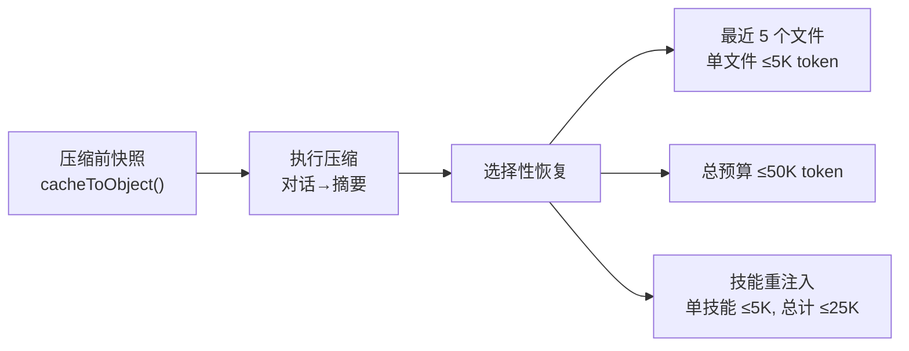
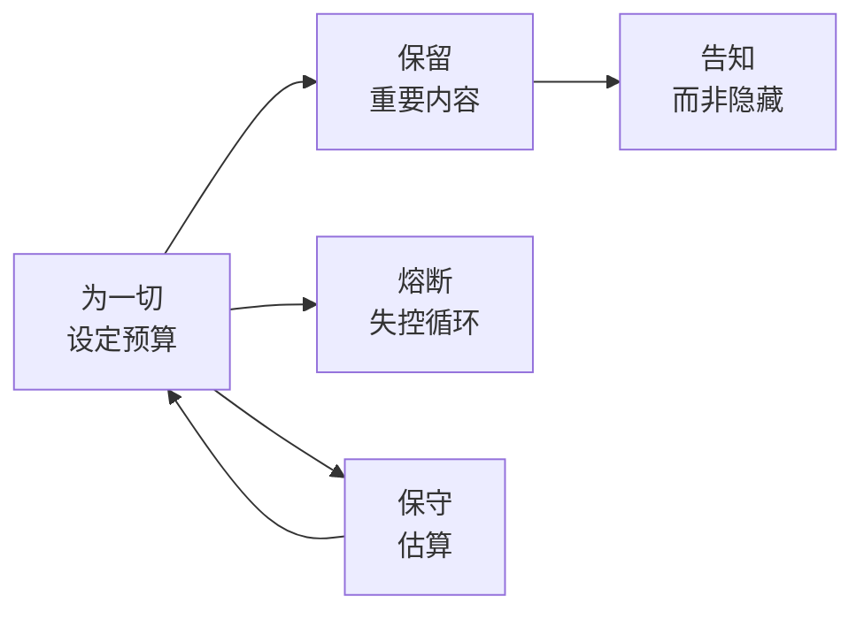

# 第26章：上下文管理作为核心能力

## 为什么这很重要

如果从 Claude Code 的整个代码库中挑出一个最被低估的子系统，那一定是上下文管理。权限系统引人注目，Agent Loop 是核心，提示词工程广为人知——但上下文管理才是决定一个 AI Agent 能否"持续有效工作"的关键基础设施。

200K token 的上下文窗口看似充裕，但在真实工作场景中消耗得比想象更快：系统提示词约 15-20K，每次工具调用结果 5-50K，几轮文件读取和代码搜索后就已经用掉一半。更关键的是，上下文窗口不仅是"容量"问题——它是"信息密度"问题。当窗口中充满过期的工具结果、冗余的文件内容和已解决的讨论时，模型的注意力被稀释，回答质量下降。

第三篇（第9-12章）分析的上下文管理系统揭示了 5 条核心原则，共同主题是：**上下文窗口是稀缺资源，必须像管理内存一样精心管理**。

---

## 源码分析

### 26.1 原则一：为一切设定预算

**定义**：每个进入上下文窗口的内容都必须有明确的 token 预算上限，没有例外。

Claude Code 的预算体系覆盖了上下文窗口中的每一个内容来源：

| 内容来源 | 预算限制 | 源码位置 |
|---------|---------|---------|
| 单个工具结果 | 50K 字符 | `restored-src/src/constants/toolLimits.ts:13` |
| 单条消息中的所有工具结果 | 200K 字符 | `restored-src/src/constants/toolLimits.ts:49` |
| 文件读取 | 默认 2000 行 + offset/limit 渐进读取 | 详见第8章 |
| 技能列表 | 上下文窗口的 1% | `restored-src/src/tools/SkillTool/prompt.ts:20-23` |
| 压缩后文件恢复 | 最多 5 个文件、单文件 5K token、总计 50K | `restored-src/src/services/compact/compact.ts:122` |
| 压缩后技能恢复 | 单技能 5K token、总计 25K token | 详见第10章 |
| Agent 描述列表 | 移至附件以控制主提示词大小 | 详见第15章 |

**表 26-1：Claude Code 的 token 预算体系**

注意设计的精细程度：不仅有"总预算"，还有"单项预算"。这两者的来源：

```typescript
// restored-src/src/constants/toolLimits.ts:13
export const DEFAULT_MAX_RESULT_SIZE_CHARS = 50_000

// restored-src/src/constants/toolLimits.ts:49
export const MAX_TOOL_RESULTS_PER_MESSAGE_CHARS = 200_000
```

`MAX_TOOL_RESULTS_PER_MESSAGE_CHARS = 200_000` 防止 N 个并行工具同时返回大结果导致上下文洪泛——即使每个工具结果在 50K 以内，10 个并行工具也能产出 500K 字符。单消息预算是对这种"合法但危险"组合的防护。

技能列表的 1% 预算尤其值得关注：

```typescript
// restored-src/src/tools/SkillTool/prompt.ts:20-23
// Skill listing gets 1% of the context window (in characters)
export const SKILL_BUDGET_CONTEXT_PERCENT = 0.01
export const CHARS_PER_TOKEN = 4
export const DEFAULT_CHAR_BUDGET = 8_000 // Fallback: 1% of 200k × 4
```

随着用户安装越来越多的技能，技能列表可能无限增长。Claude Code 的解决方案是三级截断级联：先截断描述（`MAX_LISTING_DESC_CHARS = 250`）、再截断低优先级技能、最后只保留内置技能的名称。这确保技能列表永远不会占据超过上下文窗口 1% 的空间——哪怕用户安装了 1000 个技能。

**反模式：无界内容注入**。将工具结果、文件内容或配置信息不加限制地注入上下文窗口，最终导致上下文被低信息密度内容填满。

---

### 26.2 原则二：保留重要内容

**定义**：压缩是必要的，但压缩后必须有选择性地恢复最关键的上下文。

自动压缩（详见第9章）将整个对话历史压缩为摘要，释放上下文空间。但压缩丢失了具体的代码内容、文件路径和精确行号引用。如果压缩后模型完全失去之前读过的文件内容，它就需要重新读取，浪费工具调用和用户等待时间。

Claude Code 的解决方案是**压缩后恢复**（详见第10章）：

```typescript
// restored-src/src/services/compact/compact.ts:122
export const POST_COMPACT_MAX_FILES_TO_RESTORE = 5
```

恢复策略的流程：



**图 26-1：压缩-恢复流程**

恢复策略的关键是**选择性**：不是恢复所有文件，而是最近 5 个；不是恢复完整文件内容，而是在 5K token 内截断；总量不超过 50K。这些数字反映了深思熟虑的权衡：**恢复太多等于没压缩，恢复太少等于压缩过度**。

技能恢复的设计同样精细。压缩后不重注入已发送技能的名称（`sentSkillNames`），因为模型仍持有 SkillTool 的 Schema——它知道技能系统存在，只是忘记了具体的技能内容。这节省了约 4K token。

**反模式：全量压缩或全量保留**。要么什么都不恢复（模型被迫从头开始），要么试图保留一切（压缩效果为零）。

---

### 26.3 原则三：告知而非隐藏

**定义**：当内容被截断或压缩时，必须告知模型发生了什么，让它能够主动获取完整信息。

Claude Code 在多个层面实践这一原则：

**工具结果截断通知**。当工具结果超过 50K 字符（`DEFAULT_MAX_RESULT_SIZE_CHARS`）时，完整结果写入磁盘（`restored-src/src/utils/toolResultStorage.ts`），模型收到预览消息，包含截断说明和完整内容的磁盘路径。模型因此知道：(1) 当前看到的不是全部，(2) 如何获取全部。

**缓存微压缩通知**（详见第11章）。当 `cache_edits` 删除旧工具结果时，`notifyCacheDeletion()` 告知模型"某些旧工具结果已被清理"。防止模型引用已不存在的内容。

**文件读取分页**。FileReadTool 默认读取 2000 行，通过 offset/limit 参数支持分页。工具描述中明确说明了这一行为——模型知道默认只看到前 2000 行，需要后面内容时可指定 offset。

**压缩摘要中的显式声明**。压缩提示词（详见第9章）要求摘要包含"进行到哪一步了"和"还需要做什么"——确保压缩后的模型知道自己处于任务的哪个阶段。压缩提示词中的 `<analysis>` 草稿块（`restored-src/src/services/compact/prompt.ts:31`）让模型先分析对话内容，再生成结构化摘要——分析块在格式化时被移除，不占用最终上下文空间。

**反模式：静默截断**。在模型不知情的情况下截断工具结果或删除上下文内容。模型可能基于不完整信息做出错误决策，或"编造"它记不清的内容——因为它不知道自己的信息是不完整的。

---

### 26.4 原则四：熔断（Circuit Breaker）失控循环

**定义**：当自动化流程连续失败时，必须有机制强制停止，而非无限重试。

自动压缩的熔断器是最直接的实现。`MAX_CONSECUTIVE_AUTOCOMPACT_FAILURES = 3`（`restored-src/src/services/compact/autoCompact.ts:70`）——连续 3 次失败后停止尝试。源码注释（详见第25章原则六中的完整代码引用）记录了这个数字的工程理由：BigQuery 数据显示 1,279 个会话出现过 50+ 次连续压缩失败（最高达 3,272 次），每天浪费约 250K 次 API 调用。

更广泛地看，Claude Code 在多个子系统中实现了类似的熔断机制：

| 子系统 | 熔断条件 | 熔断行为 | 源码位置 |
|--------|---------|---------|---------|
| 自动压缩 | 连续 3 次失败 | 停止压缩直到会话结束 | `autoCompact.ts:70` |
| YOLO 分类器 | 连续 3 次/总计 20 次拒绝 | 回退到用户手动确认 | `denialTracking.ts:12-15` |
| max_output_tokens 恢复 | 最多 3 次重试 | 停止重试，接受截断输出 | 详见第3章 |
| Prompt-too-long | 丢弃最旧轮次 → 丢弃 20% | 降级处理，不无限丢弃 | 详见第9章 |

**表 26-2：Claude Code 的熔断器一览**

每个熔断器遵循相同模式：**设定合理重试上限，超过后降级到安全但功能受限的状态，而非崩溃或无限循环**。

**反模式：无限重试**。"压缩失败了？再试。又失败了？换参数再试。"在 AI Agent 中尤其危险——每次重试消耗 API 调用（真金白银），且失败原因往往是系统性的（上下文大到无法在摘要 token 预算内压缩），重试不会改变结果。

---

### 26.5 原则五：保守估算

**定义**：在 token 计数和预算分配中，宁可高估消耗也不要低估——低估导致溢出，高估只是略微浪费空间。

Claude Code 的 token 估算在每个场景中都选择了保守方向（详见第12章）：

| 内容类型 | 估算策略 | 保守程度 | 原因 |
|---------|---------|---------|------|
| 普通文本 | 4 字节/token | 中等 | 英文实际约 3.5-4.5 |
| JSON 内容 | 2 字节/token | 高度保守 | 结构字符 token 化效率低 |
| 图片/文档 | 固定 2000 token | 高度保守 | 实际公式 width×height/750，但元数据不可用时用固定值 |
| 缓存 token | 从 API usage 获取 | 精确（当可用时） | 只有 API 返回的计数是权威的 |

**表 26-3：Token 估算策略对照表**

JSON 按 2 字节/token 估算是特别有意义的设计选择。JSON 结构字符（`{}`、`[]`、`""`、`:`、`,`）的 token 化效率远低于自然语言——100 字节的 JSON 可能消耗 40-50 个 token，而 100 字节英文只需 25-30 个 token。如果使用 4 字节/token 的通用估算，JSON 密集的工具结果会被严重低估，可能导致上下文溢出。

技能列表预算中同样体现了这一点（`restored-src/src/tools/SkillTool/prompt.ts:22`）：`CHARS_PER_TOKEN = 4` 用于将 token 预算转换为字符预算——用最保守的字符/token 比率来确保不会超支。

保守估算的收益远大于成本。高估 token 消耗的最坏结果是提前触发压缩——用户多等几秒。低估 token 消耗的最坏结果是 `prompt_too_long` 错误——API 调用失败，需要紧急丢弃上下文，可能丢失关键信息。

**反模式：精确计数的幻觉**。试图在客户端精确计算 token 数量。只有 API 服务端的 tokenizer 才能给出精确值——客户端的任何计数都是估算。既然是估算，就应该向安全方向偏移。

---

## 模式提炼

### 五条原则汇总表

| 原则 | 核心源码回溯 | 反模式 |
|------|-------------|--------|
| 为一切设定预算 | `toolLimits.ts:13,49` — 单项 50K、单消息 200K | 无界内容注入 |
| 保留重要内容 | `compact.ts:122` — 恢复最近 5 个文件 | 全量压缩或全量保留 |
| 告知而非隐藏 | `toolResultStorage.ts` — 截断时提供磁盘路径 | 静默截断 |
| 熔断失控循环 | `autoCompact.ts:70` — 连续 3 次失败后停止 | 无限重试 |
| 保守估算 | `SkillTool/prompt.ts:22` — `CHARS_PER_TOKEN = 4` | 精确计数的幻觉 |

**表 26-4：上下文管理五原则汇总**

### 原则间的关系



**图 26-2：五条上下文管理原则的关系图**

**为一切设定预算**是基础——定义每个内容来源的 token 上限。**保留重要内容**决定压缩后恢复什么，**告知而非隐藏**确保模型知道什么被截断了，**熔断失控循环**防止自动化流程超出预算，**保守估算**确保预算不被低估绕过。

### 模式：分层 Token 预算

- **解决的问题**：多个内容来源竞争有限的上下文空间
- **核心做法**：为每个来源设定独立预算 + 总量预算，截断级联处理超额
- **代码模板**：单项限制（50K）→ 聚合限制（200K/消息）→ 全局限制（上下文窗口 - 输出预留 - 缓冲）
- **前置条件**：能在注入前估算内容的 token 消耗

### 模式：压缩-恢复循环

- **解决的问题**：压缩丢失关键上下文
- **核心做法**：压缩前快照 → 压缩 → 选择性恢复最近/最重要的内容
- **前置条件**：能追踪哪些内容是"最近使用的"

### 模式：熔断器

- **解决的问题**：自动化流程在异常条件下无限循环
- **核心做法**：连续 N 次失败后停止，降级到安全状态
- **前置条件**：定义了"失败"的判定标准和降级后的行为

---

## 用户能做什么

1. **审计 Agent 的上下文消耗**。在真实场景中测量每个内容来源占用多少 token，找出最大消耗者
2. **为工具结果设定大小限制**。确保文件读取、数据库查询、API 调用的结果有字符/行数上限
3. **实现压缩后恢复**。如果你的 Agent 使用上下文压缩，设计恢复策略——让压缩后的模型不需要从零开始
4. **截断时告知模型**。告诉模型"这是截断的，完整版在哪里"——比静默截断后模型自己发现信息缺失好得多
5. **添加熔断器**。对任何可能循环执行的自动化流程设定重试上限。宁可降级也不要无限循环
