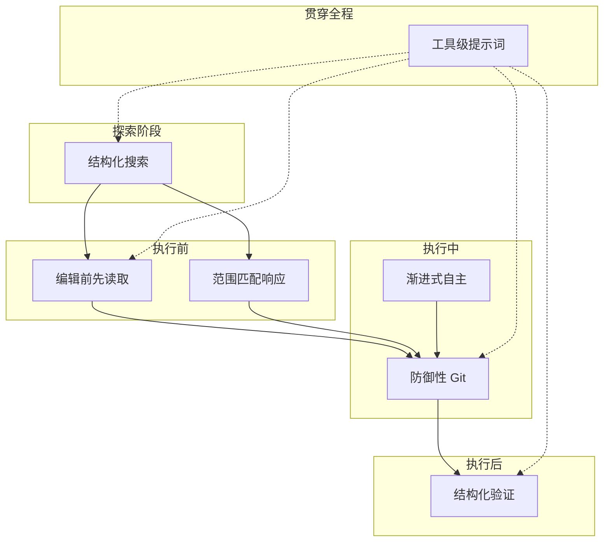

# 第27章：生产级 AI 编码模式

## 为什么这很重要

前两章提炼的是"原则"——关于如何思考驾驭工程和上下文管理的高层指导。本章不同：我们聚焦于 **7 个具体的、可直接复用的编码模式**。每个模式都从 Claude Code 的实际实现中提取，有明确的问题定义、实现方式和源码证据。

这些模式有一个共同特点：它们看起来简单到不值一提，但在生产环境中被反复验证为必要。"编辑前先读取"——谁会不读就编辑？但 Claude Code 用工具报错来强制执行，因为 AI 模型确实会跳过读取直接编辑。"防御性 Git"——当然不该 force push，但 Claude Code 用整段提示词来强调这一点，因为模型在压力下确实会选择最短路径。

---

## 源码分析

### 27.1 模式一：编辑前先读取（Read Before Edit）

**问题**：AI 模型可能在没有读取文件当前内容的情况下尝试编辑，导致编辑基于过时或错误的假设。

Claude Code 通过**双层保障**来强制这一点：

1. **提示词层**（软约束）：FileEditTool 的描述中明确写着"你必须在对话中至少使用过一次 Read 工具后才能编辑。如果你在未读取文件的情况下尝试编辑，该工具会报错"（详见第8章）
2. **代码层**（硬约束）：FileEditTool 的 `call()` 方法在执行编辑前检查当前对话是否包含对目标文件的 Read 调用。没有则返回错误

双层保障的设计意义在于：提示词是"软约束"——模型大多数时候会遵守，但在特定条件下（上下文过长导致指令被"遗忘"、多轮对话中注意力漂移）可能被忽略。代码层是"硬约束"——即使模型忽略提示词，工具本身也拒绝执行。

| 维度 | 描述 |
|------|------|
| **实现方式** | 提示词指令（软约束）+ 工具代码检查（硬约束） |
| **源码引用** | FileEditTool 提示词（详见第8章） |
| **适用场景** | 任何需要修改现有内容的工具 |
| **反模式** | 仅靠提示词指令，不在代码层强制执行 |

---

### 27.2 模式二：渐进式自主（Graduated Autonomy）

**问题**：AI Agent 需要在"每步都问用户"（效率低）和"什么都不问"（风险高）之间找到平衡。

Claude Code 设计了从最严格到最宽松的权限模式梯度（详见第16章）：

```
default → acceptEdits → plan → bypassPermissions → auto → dontAsk
  │           │           │           │               │       │
  │           │           │           │               │       └── 完全自主
  │           │           │           │               └── 分类器自动决策
  │           │           │           └── 跳过权限检查
  │           │           └── 仅计划不执行
  │           └── 自动接受编辑，其他仍确认
  └── 每步确认
```

关键设计不是模式本身，而是**带回退的自动化**。`auto` 模式使用 YOLO 分类器（详见第17章）自动做出权限决策，但有两个安全阀。拒绝追踪的实现非常简洁：

```typescript
// restored-src/src/utils/permissions/denialTracking.ts:12-15
export const DENIAL_LIMITS = {
  maxConsecutive: 3,
  maxTotal: 20,
} as const

// restored-src/src/utils/permissions/denialTracking.ts:40-44
export function shouldFallbackToPrompting(
  state: DenialTrackingState
): boolean {
  return (
    state.consecutiveDenials >= DENIAL_LIMITS.maxConsecutive ||
    state.totalDenials >= DENIAL_LIMITS.maxTotal
  )
}
```

当分类器连续 3 次或总计 20 次拒绝操作后，系统永久回退到用户手动确认。这意味着即使在最自主的模式下，系统也保留了回退到人类决策的能力。自主不是"全有或全无"，而是连续光谱，且光谱的每个位置都有安全网。

| 维度 | 描述 |
|------|------|
| **实现方式** | 多级权限模式 + 分类器自动决策 + 拒绝追踪回退 |
| **源码引用** | 权限模式（第16章）、YOLO 分类器（第17章）、`denialTracking.ts:12-44` |
| **适用场景** | 任何需要人机协作的 AI Agent 系统 |
| **反模式** | 二元权限：只有"手动"和"自动"，没有中间地带和安全回退 |

---

### 27.3 模式三：防御性 Git（Defensive Git）

**问题**：AI 模型在执行 Git 操作时可能选择"最短路径"，导致数据丢失或难以恢复的状态。

Claude Code 在 BashTool 提示词中嵌入了完整的 Git 安全协议（详见第8章），核心规则包括：

1. **绝不跳过 hooks**（`--no-verify`）：pre-commit hooks 是项目的质量门禁
2. **绝不 amend**（除非用户明确要求）：`git commit --amend` 修改前一个 commit，在 hook 失败后使用会覆盖用户之前的 commit
3. **优先指定文件**：`git add <specific-files>` 而非 `git add -A`，避免意外添加 `.env` 或凭证文件
4. **绝不 force push 到 main/master**：即使用户请求也先警告
5. **创建新 commit 而非 amend**：hook 失败后 commit 没有发生——此时 `--amend` 会修改**前一个** commit

第 5 条尤其重要。当 hook 失败时，模型的自然倾向是"修复问题，然后 amend"——但提示词显式解释因果关系：

> pre-commit hook 失败意味着 commit **没有发生** — 所以 `--amend` 会修改**前一个** commit，这可能毁掉之前的工作或丢失变更。应该修复问题、重新 stage、创建**新** commit。

这些规则的存在说明模型确实会犯这些错误。训练数据中大量的 Git 教程推荐用 amend 来"修复上一个 commit"——不区分 hook 失败和正常 commit 的场景。

| 维度 | 描述 |
|------|------|
| **实现方式** | 工具提示词中的显式安全协议，覆盖常见危险操作路径 |
| **源码引用** | BashTool 提示词的 Git Safety Protocol（详见第8章） |
| **适用场景** | 任何允许 AI 执行 Git 操作的系统 |
| **反模式** | 依赖模型的"常识"——模型的 Git 知识来自教程，不区分上下文 |

---

### 27.4 模式四：结构化验证（Structured Verification）

**问题**：AI 模型可能声称"测试通过"或"代码正确"而不实际运行验证。

Claude Code 在系统提示词中建立明确的验证链（详见第6章）：运行测试 → 检查输出 → 如实报告。这个看似简单的流程通过多个机制加固：

**可逆性意识**。操作按风险分级，模型被要求区分对待：

| 操作类型 | 示例 | 要求的模型行为 |
|---------|------|-------------|
| 可逆操作 | 编辑文件、创建文件、只读命令 | 直接执行 |
| 不可逆操作 | 删除文件、force push、发送消息 | 确认后执行 |
| 高风险操作 | `rm -rf`、DROP TABLE、杀进程 | 解释风险 + 确认 |

**范围约束**。模型被告知"对 X 的授权不延伸到 Y"——修复 bug 不等于授权修改测试用例或跳过测试。

**ant-only 的强化指令**。Capybara v8 针对模型的"声称完成但未验证"倾向添加了显式对策：

```typescript
// restored-src/src/constants/prompts.ts:211
// @[MODEL LAUNCH]: capy v8 thoroughness counterweight
`Before reporting a task complete, verify it actually works: run the
test, execute the script, check the output. Minimum complexity means
no gold-plating, not skipping the finish line. If you can't verify
(no test exists, can't run the code), say so explicitly rather than
claiming success.`
```

注释 `@[MODEL LAUNCH]` 标记说明这是模型版本相关的行为校正——当模型升级时团队会重新评估是否仍需要这段指令。

| 维度 | 描述 |
|------|------|
| **实现方式** | 验证链（运行→检查→报告）+ 可逆性分级 + 范围约束 |
| **源码引用** | 系统提示词验证指令（第6章）、`prompts.ts:211` |
| **适用场景** | 任何需要 AI 修改代码并验证正确性的场景 |
| **反模式** | 信任模型的自我报告，不要求展示实际测试输出 |

---

### 27.5 模式五：范围匹配响应（Scope-Matched Response）

**问题**：AI 模型倾向于"顺便"做额外的事——修复 bug 时顺便重构，添加功能时顺便更新文档——导致变更范围失控。

Claude Code 的系统提示词包含一系列极为具体的范围限制指令（详见第6章）。最关键的一组来自 `getSimpleDoingTasksSection()`：

```typescript
// restored-src/src/constants/prompts.ts:200-203
"Don't add features, refactor code, or make 'improvements' beyond what
 was asked. A bug fix doesn't need surrounding code cleaned up. A simple
 feature doesn't need extra configurability. Don't add docstrings,
 comments, or type annotations to code you didn't change."

"Don't add error handling, fallbacks, or validation for scenarios that
 can't happen. Trust internal code and framework guarantees."

"Don't create helpers, utilities, or abstractions for one-time operations.
 Don't design for hypothetical future requirements. ... Three similar
 lines of code is better than a premature abstraction."
```

注意这些指令的具体程度——不是抽象的"保持简洁"，而是可判定的规则："不要给你没修改的代码添加 docstring"、"三行重复优于过早抽象"。

另一个精妙的范围限制是"授权不延伸"。用户批准了一个 `git push`，模型可能将此理解为"用户授权所有 Git 操作"。提示词打破这种推理：授权的范围是被明确指定的，不超出它。

| 维度 | 描述 |
|------|------|
| **实现方式** | 系统提示词中的显式范围限制 + 最小复杂度原则 |
| **源码引用** | `prompts.ts:200-203`（极简主义指令组） |
| **适用场景** | 任何 AI 辅助编码场景 |
| **反模式** | 鼓励"全面性"——"请确保代码质量"给模型无限范围空间 |

---

### 27.6 模式六：工具级提示词优于通用指令（Tool-Level Prompts）

**问题**：通用系统提示词中的指令太多，模型难以在正确时机回忆正确的指令。

Claude Code 让每个工具携带自己的行为驾驭器（详见第8章），而非将所有行为指令塞入系统提示词：

| 位置 | 内容 |
|------|------|
| 系统提示词 | 通用行为指令、输出格式、安全原则 |
| BashTool 描述 | Git 安全协议、沙箱配置、后台任务说明 |
| FileEditTool 描述 | "编辑前先读取"、最小唯一 `old_string`、`replace_all` 用法 |
| FileReadTool 描述 | 默认行数、offset/limit 分页、PDF 页码范围 |
| GrepTool 描述 | ripgrep 语法、多行匹配、"始终使用 Grep 而非 grep" |
| AgentTool 描述 | fork 指引、隔离模式、"不要偷看 fork 输出" |
| SkillTool 描述 | 预算约束、三级截断级联、内置技能优先 |

工具级提示词的优势在于**时序对齐**：当模型决定调用 BashTool 时，BashTool 的描述（含 Git 安全协议）就在它的注意力焦点内。如果 Git 安全协议放在系统提示词中，模型需要在数万 token 的上下文中"回忆"——在长会话中这是不可靠的。

工具级提示词的另一个优势是**缓存效率**。工具描述作为 `tools` 参数的一部分，在 API 请求中的位置相对稳定。修改工具描述只影响工具列表的哈希，不影响系统提示词段——缓存中断检测中的 `perToolHashes`（`restored-src/src/services/api/promptCacheBreakDetection.ts:36-38`）正是为了精确追踪是哪个工具的描述变化了，而非让整个缓存前缀失效。

| 维度 | 描述 |
|------|------|
| **实现方式** | 行为指令跟随工具描述，在工具被调用时自然进入模型注意力 |
| **源码引用** | 各工具的 prompt 字段（详见第8章）、`promptCacheBreakDetection.ts:36-38` |
| **适用场景** | 任何提供多个工具的 AI Agent |
| **反模式** | 中心化指令库——所有指令放在系统提示词中，长会话中遵守率下降 |

---

### 27.7 模式七：结构化搜索优于 Shell 文本解析（Structured Search Over Shell Text）

**问题**：如果让模型直接消费 `grep`、`find`、`ls` 等 shell 原始输出，它就必须在每一轮自己解析 `path:line:text`、换行分隔路径、计数摘要和各种噪声前缀。搜索轮次一多，这种"让模型反复做字符串拆解"的方式会同时浪费上下文和推理预算。

Claude Code 的搜索设计已经部分体现了相反的方向：**搜索不是 Bash 的一种用法，而是独立的只读工具**（详见第8章）。`GrepTool` 和 `GlobTool` 底层都走专用实现而非 shell 管道，并且内部先产出结构化结果，再按模型可消费的最小形式序列化为 `tool_result`。

`GrepTool` 的内部输出包含搜索模式、文件列表、匹配内容、计数和分页信息：

```typescript
// 简化自 GrepTool 的 outputSchema
{
  mode: 'content' | 'files_with_matches' | 'count',
  numFiles,
  filenames,
  content,
  numLines,
  numMatches,
  appliedLimit,
  appliedOffset,
}
```

`GlobTool` 的内部输出同样是结构化对象，而不是直接把 `rg --files` 的 stdout 原样塞给模型：

```typescript
// 简化自 GlobTool 的 outputSchema
{
  durationMs,
  numFiles,
  filenames,
  truncated,
}
```

但更有意思的是下一步：Claude Code **没有**把这些对象完整 JSON 化回灌给模型，而是选择了"内部结构化，外部文本化"的折中设计。`GrepTool` 在 `files_with_matches` 模式下只返回文件路径列表，在 `count` 模式下返回 `path:count` 摘要，在 `content` 模式下才返回具体匹配行；`GlobTool` 只回传路径列表和一个截断提示。这说明它的真正优化目标不是"结构化本身"，而是**让 harness 拥有结构，模型只看到完成当前决策所需的最小信息**。

从驾驭工程的角度，这引出一个比 `grep`/`glob` 本身更重要的模式：**分阶段搜索协议**。理想的 agent-native 搜索不应让模型一上来就吞下大量匹配行，而应拆成三层：

1. **候选文件层**：先返回路径、稳定 ID、修改时间等轻量元数据，回答"值得看哪些文件"
2. **命中摘要层**：再返回每个文件的匹配次数、首个命中位置、首段摘要，回答"先展开哪几个文件"
3. **片段展开层**：最后只为选中的文件返回精确片段和行号，回答"具体看哪一段代码"

Claude Code 还没有把这三层彻底拆成独立工具，但现有实现已经具备两个关键前提：**专用搜索工具**和**结构化中间结果**。更进一步的证据是 `ToolSearchTool` 已经能够返回 `tool_reference` 这种 richer block，而不局限于纯文本。这表明在 Claude Code 这类 harness 中，"模型直接解析 shell 文本"并不是唯一选择，甚至不是最佳选择。

| 维度 | 描述 |
|------|------|
| **实现方式** | 专用 Grep/Glob 工具 + 结构化中间结果 + 文本化最小回传 |
| **源码引用** | `GrepTool.ts` / `GlobTool.ts` 的 `outputSchema` 与 `mapToolResultToToolResultBlockParam()`；`ToolSearchTool.ts` 的 `tool_reference` 返回 |
| **适用场景** | 大代码库探索、多轮搜索、子 Agent 勘探、需要严格控制上下文成本的系统 |
| **反模式** | 把搜索退化为 Bash `grep/find/cat` 文本管道，让模型在每一轮重新做字符串解析 |

---

## 模式提炼

### 七个模式汇总表

| 模式 | 实现方式 | 源码引用 |
|------|---------|---------|
| 编辑前先读取 | 提示词（软）+ 工具代码检查（硬） | FileEditTool（第8章） |
| 渐进式自主 | 多级权限 + 分类器 + 拒绝追踪回退 | `denialTracking.ts:12-44` |
| 防御性 Git | 工具提示词中的完整安全协议 | BashTool 提示词（第8章） |
| 结构化验证 | 运行→检查→报告 + 可逆性分级 | `prompts.ts:211` |
| 范围匹配响应 | 具体可判定的范围限制指令 | `prompts.ts:200-203` |
| 工具级提示词 | 行为指令附加到对应工具 | 各工具 prompt + `perToolHashes` |
| 结构化搜索 | 专用搜索工具 + 结构化中间结果 + 分阶段展开 | `GrepTool.ts`、`GlobTool.ts`、`ToolSearchTool.ts` |

**表 27-1：七个生产级模式汇总**

### 模式在工具执行生命周期中的位置



**图 27-1：七个模式在工具执行生命周期中的位置**

**结构化搜索**位于最前面的探索阶段——它决定模型看到什么搜索结果，以及这些结果以什么粒度进入上下文。**工具级提示词**贯穿全程——其他六个模式都通过工具提示词实现。**编辑前先读取**和**范围匹配响应**约束执行前的准备。**防御性 Git** 和**渐进式自主**控制执行过程中的安全边界。**结构化验证**确保执行后的正确性。

### 全局模式：双层约束

- **解决的问题**：单靠提示词无法 100% 保证模型遵守规则
- **核心做法**：对高风险行为，用提示词做"软约束"，用代码做"硬约束"
- **代码模板**：工具描述写明规则 → `call()` 方法检查前置条件 → 不满足时返回错误
- **前置条件**：能在代码层面检测前置条件是否满足

### 全局模式：安全梯度

- **解决的问题**：不同任务需要不同程度的自主性
- **核心做法**：多级模式，每级有明确安全网
- **前置条件**：能评估操作的风险等级

### 全局模式：分阶段搜索协议

- **解决的问题**：开放式代码库搜索会快速吞噬上下文，并迫使模型反复解析文本结果
- **核心做法**：先返回候选文件，再返回命中摘要，最后按需展开精确片段
- **前置条件**：搜索工具能返回分页、计数和稳定引用，而不是只有原始 stdout

---

## 用户能做什么

1. **对关键行为实施双层约束**。如果某个行为违反时会造成不可逆后果，不要只靠提示词——在工具代码中添加前置条件检查
2. **设计权限梯度而非二元开关**。为 Agent 提供至少 3 个自主级别：手动确认、分类器自动决策（带回退）、完全自主
3. **在 Git 操作提示词中显式说明因果关系**。"不要 amend"不够——要说明"hook 失败后 amend 会修改前一个 commit，导致变更丢失"
4. **要求模型展示验证输出**。不接受"测试通过了"的文字报告——要求展示实际测试输出
5. **用具体规则替代模糊指令**。将"保持代码质量"替换为"不要给未修改的代码添加注释"、"三行重复优于过早抽象"
6. **将行为指令附加到对应工具**。Git 安全规则放在 Bash 工具描述中，文件操作规则放在文件工具描述中——不要全堆在系统提示词里
7. **不要让模型反复解析 shell 搜索文本**。把搜索拆成"候选文件 → 命中摘要 → 精确片段"三步，比一上来返回大段 `grep` 输出更省上下文
