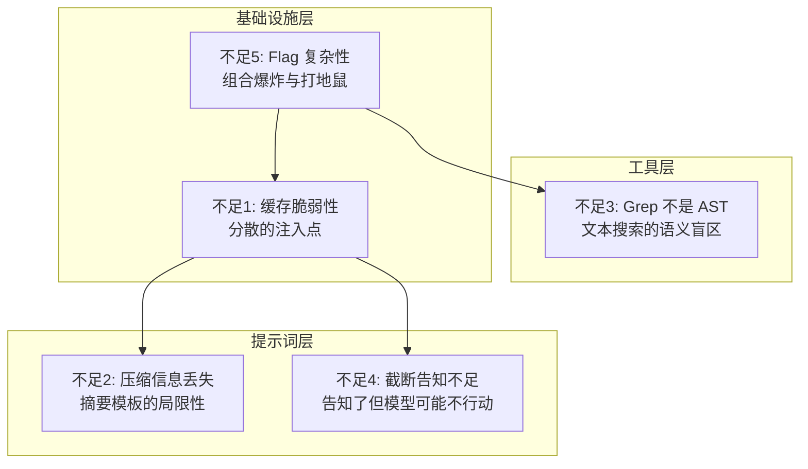

# 第28章：Claude Code 的不足之处（以及你能修复什么）

## 为什么这很重要

前三章提炼了 Claude Code 的优秀设计——驾驭工程原则、上下文管理策略、生产级编码模式。但一本严肃的技术分析不能只讲"它做对了什么"，还必须客观审视"它在哪里做得不够好"。

本章列出 5 个从源码中可观测到的设计不足。每个不足包含三部分：**问题描述**（它是什么）、**源码证据**（为什么说它是问题）、**改进建议**（可以怎么做）。

需要强调的是：这些分析完全基于工程设计层面，不涉及对 Anthropic 团队的能力评价。每一个"不足"都是在特定工程权衡下的合理选择——只是这些选择有可观测的代价。

---

## 源码分析

### 28.1 不足一：缓存脆弱性——分散的注入点制造缓存中断风险

#### 问题描述

Claude Code 的提示词缓存系统依赖核心假设：**`SYSTEM_PROMPT_DYNAMIC_BOUNDARY` 之前的内容在整个会话中保持不变**。但多个分散的注入点可以修改这个区域：

- `systemPromptSections.ts` 中的条件性段落：基于 Feature Flag 或运行时状态决定是否包含
- MCP 连接/断开事件：`DANGEROUS_uncachedSystemPromptSection()` 显式标记"会破坏缓存"
- 工具列表变化：MCP 服务器上下线导致 `tools` 参数哈希改变
- GrowthBook Flag 切换：远程配置变更导致序列化的工具 Schema 变动

#### 源码证据

缓存中断检测系统需要追踪近 20 个字段（`restored-src/src/services/api/promptCacheBreakDetection.ts:28-69`）就是直接证据——如果缓存是稳定的，不需要如此复杂的检测系统来解释"为什么中断了"。

`DANGEROUS_uncachedSystemPromptSection()` 的命名本身是警示标记——函数名中的 `DANGEROUS` 前缀说明团队清楚它会破坏缓存，但在某些场景下（MCP 状态变化）没有更好的替代方案。

Agent 列表曾内联在系统提示词中，占全球 `cache_creation` token 的 10.2%（详见第15章）。虽然后来被移至附件，但这说明即使是经验丰富的团队，也会无意中在缓存段内放入不稳定内容。

`splitSysPromptPrefix()`（`restored-src/src/utils/api.ts:321-435`）的三条代码路径——MCP tool-based、global+boundary、默认 org 级别——其复杂度完全来自处理"缓存段内可能出现的各种变动"。源码中的注释明确标记了引用关系：

```typescript
// restored-src/src/constants/prompts.ts:110-112
// WARNING: Do not remove or reorder this marker without updating
// cache logic in:
// - src/utils/api.ts (splitSysPromptPrefix)
// - src/services/api/claude.ts (buildSystemPromptBlocks)
```

这种跨文件的 `WARNING` 注释是架构脆弱性的信号——组件之间通过隐式约定耦合，而非显式接口。

#### 改进建议

**集中构建提示词**。将分散注入改为集中构建：

1. **构建阶段**：所有段落在一个中心函数中组装，组装完成后计算整体哈希
2. **不可变约束**：对缓存段内的内容实施编译期或运行时的不可变检查——任何会话中变化的内容强制放在缓存段之外
3. **变更审计**：提交前自动检测"是否在缓存段内添加了不稳定内容"

---

### 28.2 不足二：压缩信息丢失——9 段摘要模板无法保留所有推理链

#### 问题描述

自动压缩（详见第9章）使用结构化提示词模板要求模型生成对话摘要。压缩提示词（`restored-src/src/services/compact/prompt.ts`）要求 `<analysis>` 块中包含：

```typescript
// restored-src/src/services/compact/prompt.ts:31-44
"1. Chronologically analyze each message and section of the conversation.
    For each section thoroughly identify:
    - The user's explicit requests and intents
    - Your approach to addressing the user's requests
    - Key decisions, technical concepts and code patterns
    - Specific details like:
      - file names
      - full code snippets
      - function signatures
      ..."
```

这是精心设计的清单，但有一个根本限制：**模型的推理链和失败尝试在压缩中丢失**。

具体丢失的信息类型：

- **失败的方法**：模型尝试方法 A 但失败，转而使用方法 B 成功——压缩后只保留"使用方法 B 解决了问题"，方法 A 的失败经验丢失
- **决策上下文**：为什么选方法 B 而非方法 A 的推理被简化为结论
- **精确引用**：具体的文件路径和行号在摘要中可能被泛化——"修改了认证模块"而非"修改了 `auth/middleware.ts:42-67`"

#### 源码证据

压缩的 token 预算是 `MAX_OUTPUT_TOKENS_FOR_SUMMARY = 20_000`（`restored-src/src/services/compact/autoCompact.ts:30`）。压缩比可能高达 7:1 或更高——在这种压缩比下，信息丢失不可避免。

压缩后文件恢复机制（`POST_COMPACT_MAX_FILES_TO_RESTORE = 5`，`restored-src/src/services/compact/compact.ts:122`）部分缓解了问题，但只恢复文件内容，不恢复推理链。

`NO_TOOLS_PREAMBLE`（`restored-src/src/services/compact/prompt.ts:19-25`）的存在暗示了另一个压缩质量问题：模型在压缩时有时会尝试调用工具而非生成摘要文本（Sonnet 4.6 上发生率 2.79%），需要显式禁止。这意味着压缩任务本身对模型来说不是trivial的。

#### 改进建议

**结构化信息提取 + 分层压缩**：

1. **结构化提取**：压缩前用专门步骤提取结构化信息——文件修改列表、失败方法列表、决策图——存储为 JSON 而非自然语言摘要
2. **分层压缩**：对话分为"事实层"（文件修改、命令输出）和"推理层"（为什么这样做）。事实层用提取式压缩（直接提取），推理层用摘要式压缩（当前做法）
3. **失败记忆**：专门保留"已尝试但失败的方法"列表，防止压缩后模型重蹈覆辙

---

### 28.3 不足三：Grep 不是抽象语法树（AST）——文本搜索遗漏语义关系

#### 问题描述

Claude Code 的代码搜索完全基于 GrepTool（文本正则匹配）和 GlobTool（文件名模式匹配）。在大多数场景下工作良好，但无法覆盖**语义级别的代码关系**：

- **动态导入**：`require(variableName)` 中的变量是运行时值，文本搜索无法追踪
- **Re-export**：`export { default as Foo } from './bar'` 在搜索 `Foo` 定义时不被正确追踪
- **字符串引用**：工具名作为字符串注册（`name: 'Bash'`），搜索工具使用点需同时搜字符串和变量名
- **类型推断**：TypeScript 的类型推断意味着很多变量没有显式注解，搜索特定类型的使用位置不完整

#### 源码证据

Claude Code 自身的工具列表包含 40+ 个工具（详见第2章），但没有 AST 查询工具。系统提示词明确引导模型使用 Grep 而非 Bash 中的 grep（详见第8章）——但这只是将文本搜索从一个工具移到另一个，没有提升搜索的语义层次。

在 Claude Code 自身的代码库（1,902 个 TypeScript 文件）中，这些遗漏的影响是可观的。例如：Feature Flag 通过 `feature('KAIROS')` 调用使用——搜索字符串 `KAIROS` 可以找到使用点，但搜索函数 `feature` 的调用则会返回所有 89 个 flag 的结果，噪音巨大。没有 AST 查询，无法表达"找到 `feature()` 调用中参数值为 `KAIROS` 的位置"。

#### 改进建议

**添加 LSP（Language Server Protocol）集成**：

1. **类型查找**：通过 TypeScript Language Server 查询变量的推断类型
2. **跳转到定义**：处理 re-export、类型别名、动态导入的完整链路
3. **查找引用**：找到符号的所有使用位置，包括通过类型推断间接使用的
4. **调用层次**：查询函数的调用者和被调用者，建立调用图

LSP 集成的基础设施在源码中已有迹象——Feature Flag 分析（详见第23章）中可以观察到部分 LSP 相关的实验性代码路径，但尚未广泛启用。Grep + LSP 的组合将比纯 Grep 或纯 LSP 更强大：Grep 负责快速的全文搜索和模式匹配，LSP 负责精确的语义查询。

---

### 28.4 不足四：截断告知不等于行动——大结果写入磁盘但模型可能不会重新读取

#### 问题描述

当工具结果超过 50K 字符（`DEFAULT_MAX_RESULT_SIZE_CHARS`，`restored-src/src/constants/toolLimits.ts:13`）时，处理策略是：完整结果写入磁盘，返回预览消息（详见第12章）。

问题在于：**模型可能不会重新读取**。模型基于预览做判断——如果预览看起来"足够"（例如搜索结果的前 50K 字符已包含一些相关结果），模型可能不去读完整内容。但关键信息可能恰好在截断点之后。

#### 源码证据

`restored-src/src/utils/toolResultStorage.ts` 实现了大结果持久化逻辑。截断时模型收到：

```
[Result truncated. Full output saved to /tmp/claude-tool-result-xxx.txt]
[Showing first 50000 characters of N total]
```

这遵循了第25章"告知而非隐藏"原则——模型被告知截断发生了。但"告知"和"确保模型行动"是两件事。

问题的根源是**注意力经济**：模型在每一步都要决定下一步做什么。读取完整的截断文件意味着多一次工具调用、多等几秒——如果模型判断预览"足够好"，它会跳过这步。但这个判断本身可能是错的，因为模型**看不到**截断点之后的内容。

#### 改进建议

**智能预览 + 主动建议**：

1. **结构化预览**：不只截取前 N 字符，而是提取摘要——搜索结果的匹配总数、文件分布、前后 N 个匹配的上下文
2. **相关性提示**：在预览中添加"结果共 M 个匹配，当前只显示前 K 个。如果你在找特定文件或模式，建议查看完整内容"
3. **自动分页**：截断时不只保存到磁盘等模型来读——将结果分页，在预览中展示分页信息让模型按需继续

---

### 28.5 不足五：Feature Flag 复杂性——89 个 Flag 的涌现行为

#### 问题描述

Claude Code 有 89 个 Feature Flag（详见第23章），通过两种机制控制：

1. **构建时**：`feature()` 函数编译时求值，dead code elimination 移除未启用分支
2. **运行时**：GrowthBook `tengu_*` 前缀的 flag 通过 API 获取

问题在于 flag 之间的**交互效应**。89 个二值 flag 理论上产生 2^89 种组合。即使只有 10% 的 flag 之间存在交互，组合空间也是巨大的。

#### 源码证据

以下是源码中可观察到的 flag 交互示例：

| Flag A | Flag B | 交互关系 |
|--------|--------|---------|
| `KAIROS` | `PROACTIVE` | 助手模式和主动工作模式有重叠的唤醒机制 |
| `COORDINATOR_MODE` | `TEAMMEM` | 都涉及多 agent 通信，使用不同消息传递机制 |
| `BRIDGE_MODE` | `DAEMON` | 桥接模式需守护进程支持，但生命周期管理独立 |
| `FAST_MODE` | `ULTRATHINK` | 加速输出和深度思考在 effort 配置中可能冲突 |

**表 28-1：Feature Flag 交互示例**

锁存机制（详见第25章原则六）是对 flag 交互复杂性的缓解——固定某些状态来减少运行时组合。但锁存本身也增加理解难度：系统当前行为不仅取决于 flag 当前值，还取决于**会话历史中 flag 值的变化序列**。

工具 Schema 缓存（`getToolSchemaCache()`，详见第15章）是另一个缓解措施——每会话计算一次工具列表，防止会话中途 flag 切换导致 Schema 变动。但这意味着会话中途切换的 flag 不会影响工具列表——既是特性也是限制。

`promptCacheBreakDetection.ts` 中每个 flag 相关的锁存字段都带有 `Tracked to verify the fix` 注释：

```typescript
// restored-src/src/services/api/promptCacheBreakDetection.ts:47-55
/** AFK_MODE_BETA_HEADER presence — should NOT break cache anymore
 *  (sticky-on latched in claude.ts). Tracked to verify the fix. */
autoModeActive: boolean
/** Overage state flip — should NOT break cache anymore (eligibility is
 *  latched session-stable in should1hCacheTTL). Tracked to verify the fix. */
isUsingOverage: boolean
/** Cache-editing beta header presence — should NOT break cache anymore
 *  (sticky-on latched in claude.ts). Tracked to verify the fix. */
cachedMCEnabled: boolean
```

三个字段、三次 `should NOT break cache anymore`、三次 `Tracked to verify the fix`——说明这些 flag 的状态变化**曾经**导致缓存中断，团队逐个修复后添加追踪来验证修复是否有效。这是典型的"打地鼠"模式——没有系统性解决 flag 交互问题，而是逐个修复暴露出来的案例。

#### 改进建议

**Flag 依赖图 + 互斥约束**：

1. **显式依赖声明**：每个 flag 声明依赖的其他 flag（`KAIROS_DREAM` 依赖 `KAIROS`），构建工具编译时验证依赖关系
2. **互斥约束**：声明不能同时启用的 flag 组合
3. **组合测试**：对关键 flag 组合进行自动化测试，至少覆盖所有两两组合
4. **Flag 状态可视化**：调试模式下输出所有 flag 值和锁存状态，帮助诊断行为异常

---

## 模式提炼

### 五个不足汇总表

| 不足 | 源码证据 | 改进建议 |
|------|---------|---------|
| 缓存脆弱性 | `promptCacheBreakDetection.ts` 追踪 18 个字段 | 集中构建 + 不可变约束 |
| 压缩信息丢失 | `compact/prompt.ts` 压缩比 7:1+ | 结构化提取 + 分层压缩 |
| Grep 不是 AST | 40+ 工具中无 AST 查询工具 | LSP 集成 |
| 截断告知不足 | `toolResultStorage.ts` 预览不保证被读取 | 智能预览 + 自动分页 |
| Flag 复杂性 | 3 个 `Tracked to verify the fix` 注释 | Flag 依赖图 + 互斥约束 |

**表 28-2：五个不足汇总**

### 三层防御与五个不足的关系



**图 28-1：五个不足在三层防御中的分布**

基础设施层的两个不足（缓存脆弱性、Flag 复杂性）最深层——影响系统整体行为，修复成本最高。提示词层的两个不足（压缩信息丢失、静默截断）更容易缓解——改进压缩模板或预览格式不需要大规模重构。工具层的不足（Grep 不是 AST）介于两者之间——添加 LSP 工具需要新的外部依赖，但不改变核心架构。

### 反模式：分散注入

- **问题**：多个独立注入点修改同一共享状态，状态变化不可预测
- **识别信号**：需要复杂检测系统来解释"为什么状态变了"
- **解决方向**：集中构建 + 不可变约束

### 反模式：有损压缩不可逆

- **问题**：压缩后丢失的信息无法恢复
- **识别信号**：压缩后模型重复之前已尝试过的失败方法
- **解决方向**：结构化提取关键信息，分层存储

---

## 用户能做什么

### 你可以直接行动的

1. **缓存脆弱性**：通过 CLAUDE.md 控制你能控制的变量——保持项目 CLAUDE.md 稳定，避免频繁修改。监控 API 账单中的 `cache_creation` token 消耗
2. **静默截断**：在 CLAUDE.md 中添加指令："当工具结果被截断时，始终使用 Read 工具查看完整内容"。不能保证 100% 遵守，但提高概率
3. **Grep 的局限**：通过 MCP 服务器（详见第22章）添加 LSP 能力。社区已有 TypeScript LSP 和 Python LSP 的 MCP 集成

### 需要关注但无法直接修复的

4. **压缩信息丢失**：长会话中如果模型"忘记"了之前尝试过的方法，手动提醒。关键技术决策可记录在 CLAUDE.md 中（不会被压缩）
5. **Feature Flag 复杂性**：内部架构问题，但了解它有助于理解为什么 Claude Code 的行为有时"不一致"——可能是 flag 交互导致

---

### 不足是权衡的另一面

| 不足 | 权衡的另一面 |
|------|-------------|
| 缓存脆弱性 | 提示词的灵活组合能力 |
| 压缩信息丢失 | 能在 200K 窗口中持续工作数百轮 |
| Grep 不是 AST | 零外部依赖、跨语言通用 |
| 截断告知不足 | 防止上下文被单个大结果淹没 |
| Flag 复杂性 | 快速迭代和 A/B 测试能力 |

**表 28-3：五个不足与其对应的工程权衡**

理解这些权衡比单纯批评不足更有价值。在你自己的 AI Agent 系统中，你可能面临同样的选择——而 Claude Code 的经验可以帮助你预见每种选择的长期代价。
