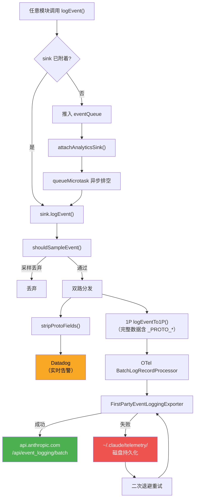
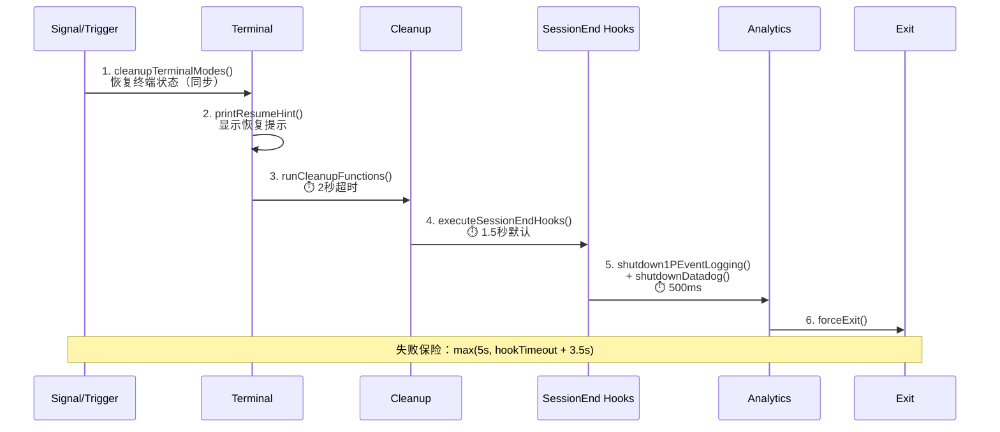

# 第29章：可观测性工程 — 从 logEvent 到生产级遥测

## 为什么这很重要

CLI 工具的可观测性（Observability）面临一组独特约束：没有常驻服务端，代码运行在用户设备上，网络随时可能中断，而且用户对隐私高度敏感。传统 Web 服务可以在服务端埋点、收集到中心化日志，但 Claude Code 必须在客户端完成从事件采集、PII 过滤、批量投递到故障重试的全链路。

Claude Code 为此构建了一套 5 层遥测（Telemetry）体系：

| 层级 | 职责 | 关键文件 |
|------|------|---------|
| **事件入口** | `logEvent()` 队列-附着模式 | `services/analytics/index.ts` |
| **路由分发** | 双路分发（Datadog + 1P） | `services/analytics/sink.ts` |
| **PII 安全** | 类型系统级保护 + 运行时过滤 | `services/analytics/metadata.ts` |
| **投递韧性** | OTel 批处理 + 磁盘持久化重试 | `services/analytics/firstPartyEventLoggingExporter.ts` |
| **远程控制** | Feature Flag 熔断（Kill Switch） | `services/analytics/sinkKillswitch.ts` |

本章将完整分析这套体系，从一个 `logEvent()` 调用出发，追踪事件如何流经采样（Sampling）、PII 过滤、双路分发、批量投递、故障重试，最终到达 Datadog 仪表盘或 Anthropic 内部数据湖。

---

## 源码分析

### 29.1 遥测管线架构：从 logEvent() 到数据湖

Claude Code 的遥测管线采用**队列-附着（Queue-Attach）模式**：事件在应用启动的最早期就可以产生，而遥测后端可能还未初始化。解决方案是先将事件缓存到队列，在后端就绪后异步排空。

```typescript
// restored-src/src/services/analytics/index.ts:80-84
// Event queue for events logged before sink is attached
const eventQueue: QueuedEvent[] = []

// Sink - initialized during app startup
let sink: AnalyticsSink | null = null
```

`logEvent()` 函数是全局入口——整个代码库通过这个函数记录事件。当 sink 尚未附着时，事件被推入队列：

```typescript
// restored-src/src/services/analytics/index.ts:133-144
export function logEvent(
  eventName: string,
  metadata: LogEventMetadata,
): void {
  if (sink === null) {
    eventQueue.push({ eventName, metadata, async: false })
    return
  }
  sink.logEvent(eventName, metadata)
}
```

当 `attachAnalyticsSink()` 被调用时，队列通过 `queueMicrotask()` 异步排空，避免阻塞启动路径：

```typescript
// restored-src/src/services/analytics/index.ts:101-122
if (eventQueue.length > 0) {
  const queuedEvents = [...eventQueue]
  eventQueue.length = 0
  // ... ant-only 日志记录（省略）
  queueMicrotask(() => {
    for (const event of queuedEvents) {
      if (event.async) {
        void sink!.logEventAsync(event.eventName, event.metadata)
      } else {
        sink!.logEvent(event.eventName, event.metadata)
      }
    }
  })
}
```

这个设计有一个重要特性：`index.ts` **没有任何依赖**（注释明确写着 "This module has NO dependencies to avoid import cycles"）。这意味着任何模块都可以安全地导入 `logEvent`，不会触发循环导入。

Sink 的实际实现在 `sink.ts` 中，负责双路分发：

```typescript
// restored-src/src/services/analytics/sink.ts:48-72
function logEventImpl(eventName: string, metadata: LogEventMetadata): void {
  const sampleResult = shouldSampleEvent(eventName)
  if (sampleResult === 0) {
    return
  }
  const metadataWithSampleRate =
    sampleResult !== null
      ? { ...metadata, sample_rate: sampleResult }
      : metadata
  if (shouldTrackDatadog()) {
    void trackDatadogEvent(eventName, stripProtoFields(metadataWithSampleRate))
  }
  logEventTo1P(eventName, metadataWithSampleRate)
}
```

注意两个关键细节：

1. **采样在分发前执行**——`shouldSampleEvent()` 基于 GrowthBook 远程配置决定是否丢弃事件，采样率附加到元数据中供下游校准。
2. **Datadog 收到的是 `stripProtoFields()` 处理后的数据**——所有 `_PROTO_*` 前缀的 PII 字段被剥离；而 1P 通道收到完整数据。

下面的 Mermaid 图展示了事件从产生到最终存储的完整路径：



远程熔断机制通过 `sinkKillswitch.ts` 实现，使用一个刻意混淆的 GrowthBook 配置名：

```typescript
// restored-src/src/services/analytics/sinkKillswitch.ts:4
const SINK_KILLSWITCH_CONFIG_NAME = 'tengu_frond_boric'
```

配置值是一个 `{ datadog?: boolean, firstParty?: boolean }` 对象，设为 `true` 即关闭对应通道。这种设计允许 Anthropic 在不发布新版本的情况下远程关闭遥测——例如当某个事件类型意外携带敏感数据时，可以在几分钟内止血。关于 Feature Flag 的详细机制，详见第23章。

### 29.2 PII 安全架构：类型系统级保护

Claude Code 的 PII 保护不是靠代码审查和文档约定，而是通过 TypeScript 的类型系统**在编译时**强制执行。核心是两个 `never` 类型标记：

```typescript
// restored-src/src/services/analytics/index.ts:19
export type AnalyticsMetadata_I_VERIFIED_THIS_IS_NOT_CODE_OR_FILEPATHS = never

// restored-src/src/services/analytics/index.ts:33
export type AnalyticsMetadata_I_VERIFIED_THIS_IS_PII_TAGGED = never
```

为什么用 `never` 类型？因为 `never` 不能持有任何值——它只能通过 `as` 强制转换来赋值。这意味着每次开发者想在遥测事件中记录字符串时，都必须写出 `myString as AnalyticsMetadata_I_VERIFIED_THIS_IS_NOT_CODE_OR_FILEPATHS`。这个冗长的类型名本身就是一个检查清单："我验证了这不是代码或文件路径"。

回顾 29.1 节展示的 `logEvent()` 签名，其 metadata 参数类型是 `{ [key: string]: boolean | number | undefined }`——注意**不接受 string**。源码注释明确写道："intentionally no strings unless AnalyticsMetadata_I_VERIFIED_THIS_IS_NOT_CODE_OR_FILEPATHS, to avoid accidentally logging code/filepaths"。要传递字符串，必须用上述标记类型强制转换。

对于确实需要记录 PII 数据（如技能名、MCP 服务器名）的场景，使用 `_PROTO_` 前缀字段：

```typescript
// restored-src/src/services/analytics/firstPartyEventLoggingExporter.ts:719-724
const {
  _PROTO_skill_name,
  _PROTO_plugin_name,
  _PROTO_marketplace_name,
  ...rest
} = formatted.additional
const additionalMetadata = stripProtoFields(rest)
```

`_PROTO_*` 字段的路由逻辑：
- **Datadog**：`sink.ts` 在分发前调用 `stripProtoFields()` 剥离所有 `_PROTO_*` 字段，Datadog 永远看不到 PII
- **1P Exporter**：解构已知的 `_PROTO_*` 字段提升为 proto 顶层字段（存入 BigQuery 特权列），然后对剩余字段再次执行 `stripProtoFields()` 防止未识别的新字段泄漏

MCP 工具名的处理展示了分级披露策略：

```typescript
// restored-src/src/services/analytics/metadata.ts:70-77
export function sanitizeToolNameForAnalytics(
  toolName: string,
): AnalyticsMetadata_I_VERIFIED_THIS_IS_NOT_CODE_OR_FILEPATHS {
  if (toolName.startsWith('mcp__')) {
    return 'mcp_tool' as AnalyticsMetadata_I_VERIFIED_THIS_IS_NOT_CODE_OR_FILEPATHS
  }
  return toolName as AnalyticsMetadata_I_VERIFIED_THIS_IS_NOT_CODE_OR_FILEPATHS
}
```

MCP 工具名格式为 `mcp__<server>__<tool>`，其中服务器名可能暴露用户配置信息（PII-medium）。默认情况下，所有 MCP 工具都被替换为 `'mcp_tool'`。但有三种例外情况允许记录详细名称：

1. Cowork 模式（`entrypoint=local-agent`）——无 ZDR 概念
2. `claudeai-proxy` 类型的 MCP 服务器——来自 claude.ai 官方列表
3. URL 匹配官方 MCP 注册表的服务器

文件扩展名的处理同样谨慎——超过 10 个字符的扩展名被替换为 `'other'`，因为过长的"扩展名"可能是哈希文件名（如 `key-hash-abcd-123-456`）。

### 29.3 1P 事件投递：OpenTelemetry + 磁盘持久化重试

1P（First Party）通道是 Claude Code 遥测的核心——它将事件投递到 Anthropic 自建的 `/api/event_logging/batch` 端点，存入 BigQuery 供离线分析。

架构基于 OpenTelemetry SDK：

```typescript
// restored-src/src/services/analytics/firstPartyEventLogger.ts:362-389
const eventLoggingExporter = new FirstPartyEventLoggingExporter({
  maxBatchSize: maxExportBatchSize,
  skipAuth: batchConfig.skipAuth,
  maxAttempts: batchConfig.maxAttempts,
  path: batchConfig.path,
  baseUrl: batchConfig.baseUrl,
  isKilled: () => isSinkKilled('firstParty'),
})
firstPartyEventLoggerProvider = new LoggerProvider({
  resource,
  processors: [
    new BatchLogRecordProcessor(eventLoggingExporter, {
      scheduledDelayMillis,
      maxExportBatchSize,
      maxQueueSize,
    }),
  ],
})
```

OTel 的 `BatchLogRecordProcessor` 在满足以下任一条件时触发导出：
- 时间间隔到达（默认 10 秒，可通过 `tengu_1p_event_batch_config` 远程配置）
- 批次大小达到上限（默认 200 事件）
- 队列满（默认 8192 事件）

但真正的工程挑战在自定义的 `FirstPartyEventLoggingExporter`（806 行）。这个 Exporter 在 OTel 标准导出之上叠加了 CLI 工具所需的韧性层：

**批次分片 + 批间延迟**：大批量事件被切分为多个小批次（每批最多 `maxBatchSize` 个），批次之间插入 100ms 延迟：

```typescript
// restored-src/src/services/analytics/firstPartyEventLoggingExporter.ts:379-421
private async sendEventsInBatches(
  events: FirstPartyEventLoggingEvent[],
): Promise<FirstPartyEventLoggingEvent[]> {
  const batches: FirstPartyEventLoggingEvent[][] = []
  for (let i = 0; i < events.length; i += this.maxBatchSize) {
    batches.push(events.slice(i, i + this.maxBatchSize))
  }
  // ...
  for (let i = 0; i < batches.length; i++) {
    const batch = batches[i]!
    try {
      await this.sendBatchWithRetry({ events: batch })
    } catch (error) {
      // 第一个批次失败时，短路所有后续批次
      for (let j = i; j < batches.length; j++) {
        failedBatchEvents.push(...batches[j]!)
      }
      break
    }
    if (i < batches.length - 1 && this.batchDelayMs > 0) {
      await sleep(this.batchDelayMs)
    }
  }
  return failedBatchEvents
}
```

注意短路逻辑：第一个批次失败时，假设端点不可用，立即将所有剩余批次标记为失败，避免无谓的网络请求。

**二次退避（Quadratic Backoff）重试**：失败事件使用二次退避（与 Statsig SDK 策略一致）：

```typescript
// restored-src/src/services/analytics/firstPartyEventLoggingExporter.ts:451-455
// Quadratic backoff (matching Statsig SDK): base * attempts²
const delay = Math.min(
  this.baseBackoffDelayMs * this.attempts * this.attempts,
  this.maxBackoffDelayMs,
)
```

默认参数：`baseBackoffDelayMs=500`，`maxBackoffDelayMs=30000`，`maxAttempts=8`。8 次导出尝试之间最多产生 7 次退避延迟：500ms → 2s → 4.5s → 8s → 12.5s → 18s → 24.5s（第 8 次尝试失败后事件被丢弃，不再退避）。

**401 降级重试**：认证失败时，自动以无认证方式重试，而不是直接放弃：

```typescript
// restored-src/src/services/analytics/firstPartyEventLoggingExporter.ts:593-611
if (
  useAuth &&
  axios.isAxiosError(error) &&
  error.response?.status === 401
) {
  // 401 auth error, retrying without auth
  const response = await axios.post(this.endpoint, payload, {
    timeout: this.timeout,
    headers: baseHeaders,
  })
  this.logSuccess(payload.events.length, false, response.data)
  return
}
```

这个设计处理了 OAuth token 过期但无法静默刷新的场景——遥测数据仍然可以通过无认证通道送达，只是在服务端缺少用户身份关联。

**磁盘持久化**：导出失败的事件被追加写入 JSONL 文件：

```typescript
// restored-src/src/services/analytics/firstPartyEventLoggingExporter.ts:44-46
function getStorageDir(): string {
  return path.join(getClaudeConfigHomeDir(), 'telemetry')
}
```

文件路径格式为 `~/.claude/telemetry/1p_failed_events.<sessionId>.<batchUUID>.json`。使用 `appendFile` 追加写入。由于每个会话使用独立的 session ID + batch UUID 命名文件，实际上不存在多进程并发写入同一文件的场景。

**启动时自动重传**：Exporter 构造函数中调用 `retryPreviousBatches()`，扫描同一会话 ID 下其他 batch UUID 的失败文件并在后台重传：

```typescript
// restored-src/src/services/analytics/firstPartyEventLoggingExporter.ts:137-138
// Retry any failed events from previous runs of this session (in background)
void this.retryPreviousBatches()
```

**运行时热重载**：当 GrowthBook 配置刷新时，`reinitialize1PEventLoggingIfConfigChanged()` 可以重建整条管线而不丢失事件——通过先 null logger（新事件暂停）→ `forceFlush()` 旧 provider → 初始化新 provider → 旧 provider 后台 shutdown 的序列实现。

| 特性 | 1P Exporter | 标准 OTel HTTP Exporter |
|------|-------------|----------------------|
| 批次分片 | 按 maxBatchSize 切分，批间 100ms 延迟 | 无（单批次发送） |
| 失败处理 | 磁盘持久化 + 二次退避 + 短路 | 有限重试后丢弃（内存中，无持久化） |
| 认证 | OAuth → 401 降级无认证 | 固定 header |
| 跨会话恢复 | 启动时扫描并重传上次失败 | 无 |
| 远程控制 | killswitch + GrowthBook 热配置 | 无 |
| PII 处理 | `_PROTO_*` 提升 + `stripProtoFields()` | 无 |

### 29.4 Datadog 集成：策展式事件允许列表

Datadog 通道用于**实时告警**，与 1P 通道的离线分析形成互补。它的核心设计特征是策展式允许列表：

```typescript
// restored-src/src/services/analytics/datadog.ts:19-64（摘录）
const DATADOG_ALLOWED_EVENTS = new Set([
  'chrome_bridge_connection_succeeded',
  'chrome_bridge_connection_failed',
  // ... chrome_bridge_* 事件
  'tengu_api_error',
  'tengu_api_success',
  'tengu_cancel',
  'tengu_exit',
  'tengu_init',
  'tengu_started',
  'tengu_tool_use_error',
  'tengu_tool_use_success',
  'tengu_uncaught_exception',
  'tengu_unhandled_rejection',
  // ... 共约 38 个事件
])
```

只有列表内的事件才会发送到 Datadog——这限制了外部服务的数据暴露面。配合 `stripProtoFields()` 的 PII 剥离，Datadog 只看到安全的、有限的操作性数据。

Datadog 使用公开的客户端 token（`pubbbf48e6d78dae54bceaa4acf463299bf`），批量刷新间隔 15 秒，批次上限 100 条，网络超时 5 秒。

标签体系（TAG_FIELDS）覆盖了关键维度：`arch`、`platform`、`model`、`userType`、`toolName`、`subscriptionType` 等。注意 MCP 工具在 Datadog 层面被进一步压缩为 `'mcp'`（而非 `'mcp_tool'`），以降低基数。

用户分桶（User Bucket）设计值得注意：

```typescript
// restored-src/src/services/analytics/datadog.ts:295-298
const getUserBucket = memoize((): number => {
  const userId = getOrCreateUserID()
  const hash = createHash('sha256').update(userId).digest('hex')
  return parseInt(hash.slice(0, 8), 16) % NUM_USER_BUCKETS
})
```

将用户 ID 哈希后分配到 30 个桶中。这允许通过计数唯一桶来近似唯一用户数，同时避免直接记录用户 ID 带来的基数（Cardinality）爆炸和隐私问题。

### 29.5 API 调用可观测性：从请求到重试

API 调用是 Claude Code 最关键的操作路径——Agent Loop 的每次迭代（详见第3章）都会触发至少一次 API 调用，产生完整的遥测事件链。`services/api/logging.ts` 实现了**三事件模型**：

1. **`tengu_api_query`**：请求发出时记录，包含模型名、token 预算、缓存配置
2. **`tengu_api_success`**：请求成功时记录，包含性能指标
3. **`tengu_api_error`**：请求失败时记录，包含错误类型和状态码

性能指标尤其值得关注：

- **TTFT（Time to First Token）**：从请求发出到收到第一个 token 的耗时，衡量模型启动延迟
- **TTLT（Time to Last Token）**：从请求发出到收到最后一个 token 的耗时，衡量整体响应时间
- **总耗时**：包含网络往返
- **每次重试的独立时间戳**

重试遥测通过 `services/api/withRetry.ts` 实现。每次重试都作为独立事件记录（`tengu_api_retry`），携带重试原因、退避时间、HTTP 状态码。

429/529 状态码有差异化处理：
- **429（Rate Limited）**：标准退避，Fast Mode 下触发 30 分钟冷却（详见第21章）
- **529（Overloaded）**：服务端过载，退避策略更激进
- **后台请求**：快速放弃，不阻塞用户前台操作

网关指纹检测是一个防御性设计——当用户通过代理网关（如 LiteLLM、Helicone、Portkey、Cloudflare、Kong）访问 API 时，Claude Code 会检测并记录网关类型。这帮助 Anthropic 区分自身 API 问题和第三方代理引入的问题。

### 29.6 工具执行遥测

工具执行通过 `services/tools/toolExecution.ts` 记录四种事件：

- **`tengu_tool_use_success`**：工具成功执行
- **`tengu_tool_use_error`**：工具执行出错
- **`tengu_tool_use_cancelled`**：用户取消
- **`tengu_tool_use_rejected_in_prompt`**：权限被拒绝

每个事件携带执行耗时、结果大小（字节）、文件扩展名（经过安全过滤）。对于 MCP 工具，遵循 29.2 节描述的分级披露策略。

工具执行的完整生命周期（validateInput → checkPermissions → call → postToolUse hooks）已在第4章详细分析，此处不重复。

### 29.7 缓存效率追踪

缓存中断检测系统（`promptCacheBreakDetection.ts`）是遥测与缓存优化的交汇点。它在每次 API 调用前快照 `PreviousState`（包含 systemHash、toolsHash、cacheControlHash 等 15+ 字段），在收到响应后对比实际缓存命中情况。

当检测到缓存中断（`cache_read_input_tokens` 下降超过 2000 token）时，生成 `tengu_prompt_cache_break` 事件，携带 20+ 字段的中断上下文。2000 token 的噪声过滤阈值防止了微小波动的误报。

此系统的详细设计已在第14章深入分析，此处仅指出其在遥测体系中的位置：它是 Claude Code"先观察再修复"理念的典范实践（详见第25章）。

### 29.8 调试与诊断三通道

Claude Code 提供三个独立的调试/诊断通道，各有不同的适用场景和 PII 策略：

| 通道 | 文件 | 触发方式 | PII 策略 | 输出位置 | 适用场景 |
|------|------|---------|---------|---------|---------|
| **Debug Log** | `utils/debug.ts` | `--debug` 或 `/debug` | 可能包含 PII | `~/.claude/debug/<session>.log` | 开发者调试，ant 默认开启 |
| **Diagnostic Log** | `utils/diagLogs.ts` | `CLAUDE_CODE_DIAGNOSTICS_FILE` 环境变量 | **严禁 PII** | 容器环境指定路径 | 容器监控，via session-ingress |
| **Error Log** | `utils/errorLogSink.ts` | 自动（ant-only 文件输出） | 错误信息（受控） | `~/.claude/errors/<date>.jsonl` | 错误回溯分析 |

**Debug Log** (`utils/debug.ts`) 支持多种启用方式：

```typescript
// restored-src/src/utils/debug.ts:44-57
export const isDebugMode = memoize((): boolean => {
  return (
    runtimeDebugEnabled ||
    isEnvTruthy(process.env.DEBUG) ||
    isEnvTruthy(process.env.DEBUG_SDK) ||
    process.argv.includes('--debug') ||
    process.argv.includes('-d') ||
    isDebugToStdErr() ||
    process.argv.some(arg => arg.startsWith('--debug=')) ||
    getDebugFilePath() !== null
  )
})
```

Ant 用户（Anthropic 内部）默认写入调试日志，外部用户需要显式启用。`/debug` 命令支持运行时开启（`enableDebugLogging()`），无需重启会话。日志文件自动创建 `latest` 符号链接指向最新的日志文件，方便快速访问。

日志级别系统支持 5 级过滤（verbose → debug → info → warn → error），通过 `CLAUDE_CODE_DEBUG_LOG_LEVEL` 环境变量控制。`--debug=pattern` 语法支持过滤特定模块的日志。

**Diagnostic Log** (`utils/diagLogs.ts`) 是 PII 安全的容器诊断通道——设计用于被容器环境管理器读取并发送到 session-ingress 服务：

```typescript
// restored-src/src/utils/diagLogs.ts:27-31
export function logForDiagnosticsNoPII(
  level: DiagnosticLogLevel,
  event: string,
  data?: Record<string, unknown>,
): void {
```

函数名中的 `NoPII` 后缀是刻意的命名约定——它既提醒调用者，也方便代码审查。输出格式是 JSONL（每行一个 JSON 对象），包含时间戳、级别、事件名、数据。同步写入（`appendFileSync`），因为它经常在关闭路径上被调用。

`withDiagnosticsTiming()` 包装函数自动为异步操作生成 `_started` 和 `_completed` 事件对，附带 `duration_ms`。

### 29.9 分布式追踪：OpenTelemetry + Perfetto

Claude Code 的追踪系统分为两层：基于 OTel 的结构化追踪，和基于 Perfetto 的可视化追踪。

**OTel 追踪** (`utils/telemetry/sessionTracing.ts`) 使用三级 span 层次：

1. **Interaction Span**：包装一次用户请求→Claude 响应周期
2. **LLM Request Span**：一次 API 调用
3. **Tool Span**：一次工具执行（含子 span：blocked_on_user、tool.execution、hook）

Span 上下文通过 `AsyncLocalStorage` 传播，确保在异步调用链中正确关联父子关系。Agent 层级（主 agent → 子 agent）通过父子 span 关系表达。

一个重要的工程细节是**孤儿 span 清理**：

```typescript
// restored-src/src/utils/telemetry/sessionTracing.ts:79
const SPAN_TTL_MS = 30 * 60 * 1000 // 30 minutes
```

每 60 秒扫描一次活跃 span，超过 30 分钟未结束的 span 被强制关闭并从注册表中移除。这处理了异常中断（如 stream 被取消、工具执行中出现未捕获异常）导致的 span 泄漏。`activeSpans` 使用 `WeakRef` 允许 GC 回收已不可达的 span 上下文。

Feature Gate 控制（`ENHANCED_TELEMETRY_BETA`）使追踪默认关闭，通过环境变量或 GrowthBook 按用户群体灰度（Gradual Rollout）启用。

**Perfetto 追踪** (`utils/telemetry/perfettoTracing.ts`) 是 ant-only 的可视化追踪——生成 Chrome Trace Event 格式的 JSON 文件，可在 ui.perfetto.dev 中分析：

```typescript
// restored-src/src/utils/telemetry/perfettoTracing.ts:16
// Enable via CLAUDE_CODE_PERFETTO_TRACE=1 or CLAUDE_CODE_PERFETTO_TRACE=<path>
```

追踪文件包含：
- Agent 层级关系（使用进程 ID 区分不同 agent）
- API 请求详情（TTFT、TTLT、缓存命中率、speculative 标志）
- 工具执行详情（名称、耗时、token 使用）
- 用户输入等待时间

事件数组有上限保护（`MAX_EVENTS = 100_000`），达到上限时淘汰最旧的一半——这防止长时间运行的会话（如 cron 驱动的会话）无限增长内存。元数据事件（进程/线程名）不受淘汰影响，因为 Perfetto UI 需要它们来标注轨道。

### 29.10 崩溃恢复与优雅关闭

`utils/gracefulShutdown.ts`（529 行）实现了 Claude Code 的优雅关闭序列——这是遥测数据"最后一英里"投递的关键。

关闭的触发源包括：SIGINT（Ctrl+C）、SIGTERM、SIGHUP、以及 macOS 特有的**孤儿进程检测**：

```typescript
// restored-src/src/utils/gracefulShutdown.ts:281-296
if (process.stdin.isTTY) {
  orphanCheckInterval = setInterval(() => {
    if (getIsScrollDraining()) return
    if (!process.stdout.writable || !process.stdin.readable) {
      clearInterval(orphanCheckInterval)
      void gracefulShutdown(129)
    }
  }, 30_000)
  orphanCheckInterval.unref()
}
```

macOS 在终端关闭时不一定发送 SIGHUP，而是撤销 TTY 文件描述符。每 30 秒检测一次 stdout/stdin 是否仍可用。

关闭序列采用**级联超时**设计：



关键设计决策：

1. **终端模式恢复最先执行**——在任何异步操作之前，同步恢复终端状态。如果清理过程中被 SIGKILL，至少终端不会处于损坏状态。
2. **清理函数有独立超时**（2 秒）——通过 `Promise.race` 实现，防止 MCP 连接挂起。
3. **SessionEnd hooks 有预算**（默认 1.5 秒）——用户可配置 `CLAUDE_CODE_SESSIONEND_HOOKS_TIMEOUT_MS`。
4. **Analytics flush 限时 500ms**——之前是无限制的，导致 1P Exporter 等待所有 pending 的 axios POST（每个 10 秒超时），可能吃掉整个失败保险预算。
5. **失败保险计时器**动态计算：`max(5000, sessionEndTimeoutMs + 3500)`，确保给 hook 预算足够时间。

`forceExit()` 处理了极端情况——当 `process.exit()` 因 dead terminal（EIO 错误）抛出时，回退到 `SIGKILL`：

```typescript
// restored-src/src/utils/gracefulShutdown.ts:213-222
try {
  process.exit(exitCode)
} catch (e) {
  if ((process.env.NODE_ENV as string) === 'test') {
    throw e
  }
  process.kill(process.pid, 'SIGKILL')
}
```

未捕获异常和未处理的 Promise rejection 通过双通道记录——既写入 PII-free 诊断日志，也发送到 analytics：

```typescript
// restored-src/src/utils/gracefulShutdown.ts:301-310
process.on('uncaughtException', error => {
  logForDiagnosticsNoPII('error', 'uncaught_exception', {
    error_name: error.name,
    error_message: error.message.slice(0, 2000),
  })
  logEvent('tengu_uncaught_exception', {
    error_name:
      error.name as AnalyticsMetadata_I_VERIFIED_THIS_IS_NOT_CODE_OR_FILEPATHS,
  })
})
```

注意 `error.name`（如 "TypeError"）被判定为非敏感信息，可以安全记录。错误消息截断到 2000 字符，防止长堆栈占用过多存储。

### 29.11 成本追踪与用量可视化

`cost-tracker.ts` 管理 Claude Code 的运行时成本核算——追踪 USD 成本、token 用量（输入/输出/缓存创建/缓存读取）、代码行变更，并在会话间持久化。

成本状态包含完整的资源消耗快照：

```typescript
// restored-src/src/cost-tracker.ts:71-80
type StoredCostState = {
  totalCostUSD: number
  totalAPIDuration: number
  totalAPIDurationWithoutRetries: number
  totalToolDuration: number
  totalLinesAdded: number
  totalLinesRemoved: number
  lastDuration: number | undefined
  modelUsage: { [modelName: string]: ModelUsage } | undefined
}
```

成本状态存储在项目配置（`.claude.state`）中，键为 `lastSessionId`。只有 session ID 匹配时才恢复上次的成本数据，防止不同会话的数据串扰。每次 API 调用成功后，`addToTotalSessionCost()` 累加 token 用量并通过 `logEvent` 记录到遥测管线，使成本数据同时可用于本地展示和远程分析。

`/cost` 命令的输出对订阅者和非订阅者有差异化展示——订阅者看到更详细的用量分类，非订阅者侧重于帮助理解消耗模式。

---

## 模式提炼

### 模式 1：类型系统级 PII 保护

**问题**：遥测事件可能意外包含敏感数据（文件路径、代码片段、用户配置）。代码审查和文档约定无法可靠防范。

**解法**：使用 `never` 类型标记强制开发者显式声明数据安全性。

```typescript
// 模式模板
type PII_VERIFIED = never
function logEvent(data: { [k: string]: number | boolean | undefined }): void
// 要传递字符串，必须：
logEvent({ name: value as PII_VERIFIED })
```

**前置条件**：使用 TypeScript 或类似的强类型系统。类型标记的名称必须足够描述性，使 `as` 转换本身成为一次审查。

### 模式 2：双路遥测投递

**问题**：单一遥测通道无法同时满足实时告警（低延迟、低成本）和离线分析（完整数据、高可靠）。

**解法**：将遥测分发到两个通道——实时通道使用允许列表和 PII 剥离，离线通道保留完整数据。

**前置条件**：两个通道有不同的安全级别和 SLA。允许列表需要持续维护。

### 模式 3：磁盘持久化重试

**问题**：CLI 工具运行在用户设备上，网络不可靠，进程可能随时终止。内存中的重试队列会随进程退出丢失。

**解法**：失败事件追加写入磁盘文件（JSONL 格式，每会话独立文件），启动时扫描并重传上次会话的失败事件。

**前置条件**：文件系统可用且有写入权限。事件不包含需要加密存储的敏感数据（PII 已在写入前过滤）。

### 模式 4：策展式事件允许列表

**问题**：向外部服务（Datadog）发送事件需要控制数据暴露面。新增事件类型可能意外携带敏感信息。

**解法**：使用 `Set` 定义明确的允许列表。不在列表中的事件静默丢弃。新事件必须显式加入列表，这创造了一个审查点。

**前置条件**：允许列表需要随功能迭代更新，否则新事件永远不会到达外部服务。

### 模式 5：级联超时优雅关闭

**问题**：进程退出时需要完成多项清理任务（终端恢复、会话保存、hook 执行、遥测刷新），但任一步骤可能挂起。

**解法**：每层独立超时 + 整体失败保险。优先级：终端恢复（同步、最先）→ 数据持久化 → hooks → 遥测。失败保险超时 = max(硬下限, hook 预算 + 余量)。

**前置条件**：清理任务之间的优先级已明确定义。最关键的操作（终端恢复）必须是同步的。

---

## 用户能做什么

### 调试日志

- **启动时开启**：`claude --debug` 或 `claude -d`
- **运行时开启**：在对话中输入 `/debug`
- **过滤特定模块**：`claude --debug=api` 只看 API 相关日志
- **输出到 stderr**：`claude --debug-to-stderr` 或 `claude -d2e`（便于管道处理）
- **指定输出文件**：`claude --debug-file=/path/to/log`

日志位于 `~/.claude/debug/` 目录，`latest` 符号链接指向最新文件。

### 性能分析

- **Perfetto 追踪**（ant-only）：`CLAUDE_CODE_PERFETTO_TRACE=1 claude`
- 追踪文件位于 `~/.claude/traces/trace-<session-id>.json`
- 在 [ui.perfetto.dev](https://ui.perfetto.dev) 打开查看可视化时间线

### 成本查看

- 在对话中输入 `/cost` 查看当前会话的 token 用量和成本
- 成本数据在会话间持久化——恢复会话时自动加载上次的累计值

### 隐私控制

- Claude Code 的遥测遵循标准的选择退出（opt-out）机制
- 第三方 API 提供商（Bedrock、Vertex）的调用不产生遥测
- 可观测性数据不包含用户代码内容或文件路径（由类型系统保证）
