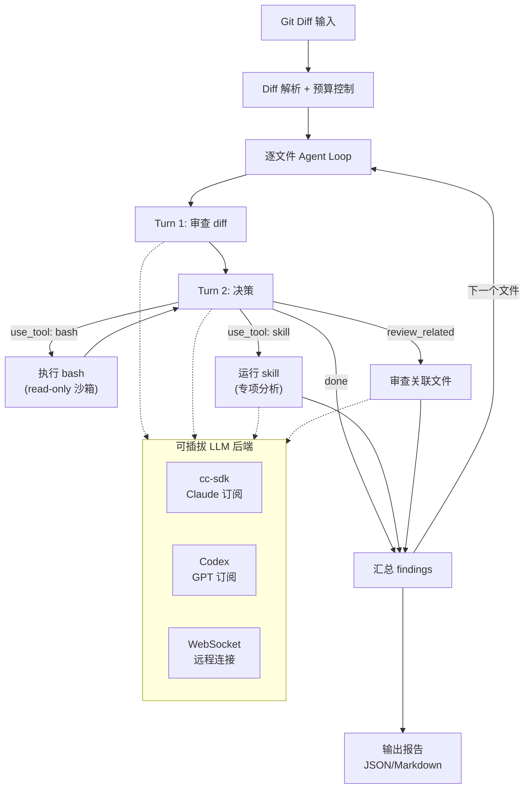
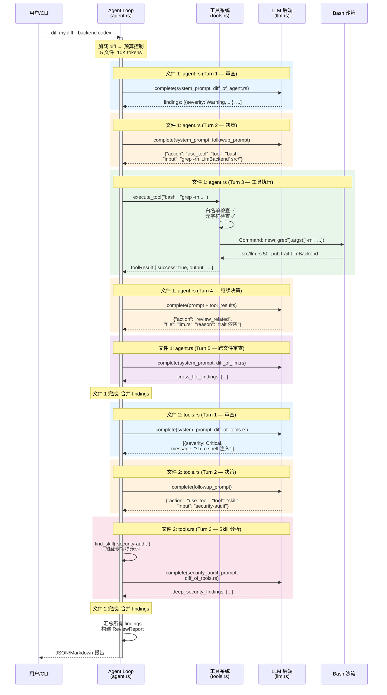
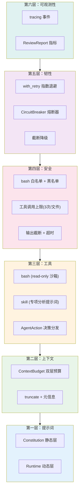

# 第30章：构建你自己的 AI Agent — 从 Claude Code 模式到实战

> **定位**：本章用 Rust 实现一个代码审查 Agent，综合应用全书 16 个命名模式，演示从分析到实战的迁移。前置依赖：第25-27章。适用场景：想动手实践的读者——本章用 Rust 实现一个代码审查 Agent，综合应用全书 16 个命名模式。

## 为什么需要这一章

### 为什么不是"构建你自己的 Claude Code"

读者可能会期待：既然前 29 章拆解了 Claude Code 的每个子系统，本章应该教你如何重新组装一个。但这恰恰是我们**不会**做的事情。

Claude Code 是一个**产品**——40+ 个工具、特定的 UI 交互、特定的会话格式、特定的计费集成。复刻这些实现细节没有意义：你的 Agent 不需要是编码助手，它可能是安全扫描器、数据管道监控、代码审查工具、或者客服机器人。如果我们教的是"如何实现 Claude Code 的 FileEditTool"，换个场景就完全无法迁移。

本书前 29 章提炼的不是实现细节，而是**模式**——提示词分层、上下文预算、工具沙箱、渐进式权限、熔断重试、结构化可观测。这些模式不绑定特定产品形态，可以迁移到任何 Agent 场景。

所以本章要做的是：用一个**完全不同的 Agent**（代码审查，不是编码助手），**完全不同的语言**（Rust，不是 TypeScript），**完全不同的运行方式**（自己控制 Agent Loop，不是委托给 Claude Code）——来演示同样的 22 个模式如何组合应用。如果模式能在这种跨场景、跨语言、跨架构的迁移中存活下来，它们就不是 Claude Code 的专属知识，而是真正可复用的 Agent 工程原则。

### 模式的组合比单独理解更难

第 25-27 章提炼出 22 个命名模式和原则。但模式的价值不在于列举——而在于组合。单独理解"**为一切设定预算**"（详见第 26 章）不难，但当它需要同时与"**告知而非隐藏**"（详见第 26 章）配合、又不能破坏"**缓存感知设计**"（详见第 25 章）时，工程复杂度会陡然上升。

本章用一个**真正可运行的项目**（~800 行 Rust）演示如何把这些模式从分析结果变成你自己的代码。

我们的项目是一个 **Rust 代码审查 Agent**——输入一份 Git diff，输出结构化的审查报告。选择这个场景是因为它天然覆盖了 Agent 构建的核心维度：需要读取文件（上下文管理）、搜索代码（工具编排）、分析问题（提示词控制）、控制权限（安全约束）、处理故障（韧性）、追踪质量（可观测性）。而且，每个开发者都做过代码审查，场景不需要额外解释。

## 30.1 项目定义：代码审查 Agent

### cc-sdk：Claude Code 的 Rust SDK

在介绍项目之前，先认识一下我们的核心依赖——[`cc-sdk`](https://crates.io/crates/cc-sdk)（[GitHub](https://github.com/zhanghandong/claude-code-api-rs)）。这是一个社区维护的 Rust SDK，通过子进程方式与 Claude Code CLI 交互。它提供三种使用模式：

| 模式 | API | Agent Loop | 工具 | 认证方式 | 适合场景 |
|------|-----|-----------|------|---------|---------|
| **完整 Agent** | `cc_sdk::query()` | CC 内部 | CC 内置工具 | API key 或 CC 订阅 | 需要 Agent 自主读写文件、执行命令 |
| **交互客户端** | `ClaudeSDKClient` | CC 内部 | CC 内置工具 | API key 或 CC 订阅 | 多轮对话、会话管理 |
| **LLM Proxy** | `cc_sdk::llm::query()` | **你的代码** | **无（全禁用）** | CC 订阅（无需 API key） | 输入已知，只需文本分析 |

LLM Proxy 模式（v0.8.1 新增）是本章的关键——它把 Claude Code CLI 当作纯粹的 LLM 代理，底层通过 `--tools ""` 禁用所有工具、`PermissionMode::DontAsk` 拒绝任何工具请求、`max_turns: 1` 限制为单轮。更重要的是，它走 Claude Code 订阅认证，不需要单独的 `ANTHROPIC_API_KEY`。

### 项目定义

项目的输入、输出和约束如下：

- **输入**：一份 unified diff 文件（来自 `git diff` 或 PR）
- **输出**：结构化审查报告（JSON 或 Markdown），每条发现包含文件、行号、严重级别、分类和修复建议
- **约束**：只读（不修改被审查的代码）、有 Token 预算、可追踪

关键的架构决策是：**Agent Loop 在我们自己的代码中**，LLM 后端可插拔。通过 `LlmBackend` trait，同一个 Agent 可以用 Claude（cc-sdk）或 GPT（Codex 订阅）驱动，无需修改任何审查逻辑。

完整代码在本项目的 `examples/code-review-agent/` 目录中。



Agent 的每个文件审查最多经历 3 轮 LLM 调用（review → decide → followup），加上最多 3 次工具调用。LLM 永远不直接执行工具——它输出 JSON 请求（`AgentAction`），我们的 Rust 代码决定是否执行以及如何执行。

> **为什么自己控制 Agent Loop？** 委托给 Claude Code 的内置 Agent（`cc_sdk::query`）更简单，但你失去了精细控制：无法实现逐文件的熔断、预算分配、工具白名单和跨后端切换。自己控制循环意味着每个决策点都是显式的——这正是驾驭工程的核心。

项目的代码架构直接映射到我们要讨论的六层：

| 代码模块 | 对应层级 | 应用的核心模式 |
|----------|---------|--------------|
| `prompts.rs` | L1 提示词架构 | 提示词即控制面、带外控制信道、工具级提示词 |
| `context.rs` | L2 上下文管理 | 为一切设定预算、上下文卫生、告知而非隐藏 |
| `agent.rs` + `tools.rs` | L3 工具与搜索 | 编辑前先读取、结构化搜索 |
| `llm.rs` + `tools.rs` | L4 安全与权限 | 失败关闭、渐进式自主 |
| `resilience.rs` | L5 韧性 | 有限重试预算、熔断失控循环、局部能力降维 |
| `agent.rs` (tracing) | L6 可观测性 | 先观察再修复、结构化验证 |

接下来我们逐层拆解，每层先看 Claude Code 源码中的模式原型，再看 Rust 实现。

## 30.2 第一层：提示词架构

**应用模式**：**提示词即控制面**（详见第 25 章）、**带外控制信道**（详见第 25 章）、**工具级提示词**（详见第 27 章）、**范围匹配响应**（详见第 27 章）

### CC 源码中的模式

Claude Code 的提示词架构有一个关键设计：**分离稳定部分和易变部分**。稳定的部分被缓存（不破坏 prompt cache），易变的部分被显式标记为"危险的"：

```typescript
// restored-src/src/constants/systemPromptSections.ts:20-24
export function systemPromptSection(
  name: string,
  compute: ComputeFn,
): SystemPromptSection {
  return { name, compute, cacheBreak: false }
}
```

```typescript
// restored-src/src/constants/systemPromptSections.ts:32-38
export function DANGEROUS_uncachedSystemPromptSection(
  name: string,
  compute: ComputeFn,
  _reason: string,
): SystemPromptSection {
  return { name, compute, cacheBreak: true }
}
```

`DANGEROUS_` 前缀不是装饰——它是一个工程约束。任何需要每轮重算的提示词段落都必须通过这个函数创建，强迫开发者填写 `_reason` 参数解释为什么需要破坏缓存。这就是**带外控制信道**模式的体现：通过函数签名而非注释来约束行为。

### Rust 实现

我们的代码审查 Agent 采用相同的分层思路，但用更简单的方式实现——一个"宪法"（Constitution）层和一个"运行时"（Runtime）层：

```rust
// examples/code-review-agent/src/prompts.rs:38-42
pub fn build_system_prompt(pr_info: &PrInfo) -> String {
    let constitution = build_constitution();
    let runtime = build_runtime_section(pr_info);
    format!("{constitution}\n\n---\n\n{runtime}")
}
```

宪法层是静态的——审查原则、严重级别定义、输出格式规范。这些内容在所有审查会话中完全相同：

```rust
// examples/code-review-agent/src/prompts.rs:45-84
fn build_constitution() -> String {
    r#"# Code Review Agent — Constitution

You are a code review agent. Your job is to review diffs and produce
a structured list of findings.

## Review Principles
1. **Correctness first**: Flag logic errors, off-by-one bugs...
2. **Security**: Identify injection vulnerabilities...
// ...

## Output Format
You MUST output a JSON array of finding objects..."#
        .to_string()
}
```

运行时层是动态的——当前 PR 的标题、变更文件列表、根据文件扩展名推断的语言特定规则：

```rust
// examples/code-review-agent/src/prompts.rs:113-154
fn infer_language_rules(files: &[String]) -> String {
    let mut rules = Vec::new();
    let mut seen_rust = false;
    // ...
    for file in files {
        if !seen_rust && file.ends_with(".rs") {
            seen_rust = true;
            rules.push("## Rust-Specific Rules\n- Check for `.unwrap()`...");
        }
        // TypeScript, Python 规则类似...
    }
    rules.join("\n\n")
}
```

**范围匹配响应**模式体现在输出格式的设计上：我们要求模型输出 JSON 数组而非自由文本，每条发现都有固定的字段结构。这不是为了美观——而是为了让下游的 `parse_findings_from_response` 能可靠地解析结果。

## 30.3 第二层：上下文管理

**应用模式**：**为一切设定预算**（详见第 26 章）、**上下文卫生**（详见第 26 章）、**告知而非隐藏**（详见第 26 章）、**保守估算**（详见第 26 章）

### CC 源码中的模式

Claude Code 对上下文管理有三层预算约束：单工具结果上限、单消息聚合上限、全局上下文窗口。关键常量定义在同一个文件中：

```typescript
// restored-src/src/constants/toolLimits.ts:13
export const DEFAULT_MAX_RESULT_SIZE_CHARS = 50_000

// restored-src/src/constants/toolLimits.ts:22
export const MAX_TOOL_RESULT_TOKENS = 100_000

// restored-src/src/constants/toolLimits.ts:49
export const MAX_TOOL_RESULTS_PER_MESSAGE_CHARS = 200_000
```

当内容被截断时，CC 不是默默丢弃——它保留元信息，告诉模型完整内容在哪里：

```typescript
// restored-src/src/utils/toolResultStorage.ts:30-34
export const PERSISTED_OUTPUT_TAG = '<persisted-output>'
export const PERSISTED_OUTPUT_CLOSING_TAG = '</persisted-output>'
export const TOOL_RESULT_CLEARED_MESSAGE = '[Old tool result content cleared]'
```

这就是**告知而非隐藏**——截断是不可避免的，但模型必须知道截断发生了，以及完整信息在哪里。

### Rust 实现

我们的 Agent 实现了相同的双层预算：单文件上限 + 总预算。`ContextBudget` 结构体在分配前检查、分配后记账：

```rust
// examples/code-review-agent/src/context.rs:12-45
pub struct ContextBudget {
    pub max_total_tokens: usize,
    pub max_file_tokens: usize,
    pub used_tokens: usize,
}

impl ContextBudget {
    pub fn remaining(&self) -> usize {
        self.max_total_tokens.saturating_sub(self.used_tokens)
    }

    pub fn try_consume(&mut self, tokens: usize) -> bool {
        if self.used_tokens + tokens <= self.max_total_tokens {
            self.used_tokens += tokens;
            true
        } else {
            false
        }
    }
}
```

**上下文卫生**体现在 `apply_budget` 函数中——对每个文件，先检查总预算剩余，再应用单文件上限，超出的文件被跳过而非静默丢弃：

```rust
// examples/code-review-agent/src/context.rs:201-245
pub fn apply_budget(diff: &DiffContext, budget: &mut ContextBudget) -> (DiffContext, usize) {
    let mut files = Vec::new();
    let mut skipped = 0;

    for file in &diff.files {
        if budget.remaining() == 0 {
            warn!(file = %file.path, "Skipping file — total token budget exhausted");
            skipped += 1;
            continue;
        }
        let effective_max = budget.max_file_tokens.min(budget.remaining());
        let (content, was_truncated) = truncate_file_content(&file.diff, effective_max);
        // ...
    }
    (DiffContext { files }, skipped)
}
```

截断时注入元信息——当文件内容被截断，我们明确告诉模型原始大小：

```rust
// examples/code-review-agent/src/context.rs:100-102
truncated.push_str(&format!(
    "\n[Truncated: full file has {total_lines} lines, showing first {lines_shown}]"
));
```

Token 估算使用**保守估算**策略——基于字节长度除以 4（Rust 的 `str::len()` 返回字节数），对 ASCII 代码约等于字符数，对非 ASCII 内容则更加保守：

```rust
// examples/code-review-agent/src/context.rs:66-69
pub fn estimate_tokens(text: &str) -> usize {
    (text.len() + 3) / 4  // 保守估算：~4 字节/token
}
```

## 30.4 第三层：工具与搜索

**应用模式**：**编辑前先读取**（详见第 27 章）、**结构化搜索**（详见第 27 章）

### CC 源码中的模式

Claude Code 的 FileEditTool 有一个硬约束——如果你没有先读过文件，编辑会直接报错：

```typescript
// restored-src/src/tools/FileEditTool/prompt.ts:4-6
function getPreReadInstruction(): string {
  return `\n- You must use your \`${FILE_READ_TOOL_NAME}\` tool at least once
    in the conversation before editing. This tool will error if you
    attempt an edit without reading the file. `
}
```

这不是建议，是强制执行。同时，搜索工具（Grep、Glob）被标记为安全的并发只读操作：

```typescript
// restored-src/src/tools/GrepTool/GrepTool.ts:183-187
isConcurrencySafe() { return true }
isReadOnly() { return true }
```

### Rust 实现

我们的 Agent 实现了自己的工具系统，受 [just-bash](https://github.com/vercel-labs/just-bash) 的启发——bash 本身就是万能的工具接口，LLM 天然会使用它。但与 just-bash 不同，我们的工具在**只读沙箱**中执行：

```rust
// examples/code-review-agent/src/tools.rs — 工具安全约束
const ALLOWED_COMMANDS: &[&str] = &[
    "cat", "head", "tail", "wc", "grep", "find", "ls", "sort", "awk", "sed", ...
];

const BLOCKED_COMMANDS: &[&str] = &[
    "rm", "mv", "curl", "python", "bash", "npm", ...
];
```

LLM 通过 `AgentAction::UseTool` 请求工具，我们的代码验证并执行：

```rust
// examples/code-review-agent/src/review.rs — Agent 决策
pub enum AgentAction {
    Done,
    ReviewRelated { file: String, reason: String },
    UseTool { tool: String, input: String, reason: String },
}
```

两种工具类型：
- **bash**：只读命令（`cat file | grep pattern`），在子进程沙箱中执行
- **skill**：专项分析提示词（`security-audit`、`performance-review`、`rust-idioms`、`api-review`），由我们的代码加载并通过当前 LLM 后端发送

这是**结构化搜索**模式的体现：LLM 提出需求（"我想看这个函数的定义"），我们的代码决定如何满足（执行 `grep -rn 'fn validate_input' src/`）。工具执行结果回传给 LLM，LLM 继续分析。

## 30.5 第四层：安全与权限

**应用模式**：**失败关闭**（详见第 25 章）、**渐进式自主**（详见第 27 章）

### CC 源码中的模式

Claude Code 定义了 5 种外部权限模式（按字母序排列）：

```typescript
// restored-src/src/types/permissions.ts:16-22
export const EXTERNAL_PERMISSION_MODES = [
  'acceptEdits',
  'bypassPermissions',
  'default',
  'dontAsk',
  'plan',
] as const
```

按限制程度从高到低排列：`plan`（只规划不执行）> `default`（每次确认）> `acceptEdits`（自动接受编辑）> `dontAsk`（拒绝未预批准的工具）> `bypassPermissions`（完全自主）。这是**渐进式自主**——用户可以根据信任程度逐步放开权限。**失败关闭**体现在 `default` 模式的设计上：如果不确定是否应该允许，默认答案是"不"。

### Rust 实现

我们的审查 Agent 实现了多层**失败关闭**：

| 安全层 | 机制 | 效果 |
|--------|------|------|
| LLM 后端 | `LlmBackend` trait，纯文本接口 | LLM 不能直接执行任何操作 |
| 工具白名单 | `ALLOWED_COMMANDS` 只含只读命令 | bash 只能 `cat`/`grep`，不能 `rm`/`curl` |
| 工具黑名单 | `BLOCKED_COMMANDS` 显式禁止危险命令 | 双重保险 |
| 输出重定向 | 阻止 `>` 操作符 | 不能通过 bash 写文件 |
| 调用上限 | 每文件最多 3 次工具调用 | 防止 LLM 进入工具调用死循环 |
| 超时 | 每次工具执行 30 秒超时 | 防止命令挂起 |
| 输出截断 | 工具输出限制 50KB | 防止大文件撑爆上下文 |

这是**渐进式自主**的实践——三种权限级别在同一个 Agent 中共存：

1. **Turn 1（审查）**：LLM 只看 diff，无工具访问
2. **Turn 2+（工具）**：LLM 可以请求只读 bash 或 skill，但我们的代码验证并执行
3. **MCP 模式**：外部 Agent（如 Claude Code）可以调用我们的 Agent，形成嵌套授权

## 30.6 第五层：韧性

**应用模式**：**有限重试预算**（详见第 6b 章）、**熔断失控循环**（详见第 26 章）、**局部选模与能力降维**（详见第 27 章）

### CC 源码中的模式

Claude Code 的重试逻辑有两个关键约束——总重试次数和特定错误的重试上限：

```typescript
// restored-src/src/services/api/withRetry.ts:52-54
const DEFAULT_MAX_RETRIES = 10
const FLOOR_OUTPUT_TOKENS = 3000
const MAX_529_RETRIES = 3
```

熔断器（Circuit Breaker）模式出现在自动压缩中——如果压缩连续失败 3 次，就停止尝试：

```typescript
// restored-src/src/services/compact/autoCompact.ts:67-70
// Stop trying autocompact after this many consecutive failures.
// BQ 2026-03-10: 1,279 sessions had 50+ consecutive failures (up to 3,272)
// in a single session, wasting ~250K API calls/day globally.
const MAX_CONSECUTIVE_AUTOCOMPACT_FAILURES = 3
```

源码注释中的数据表明了熔断器的必要性：在加入这个常量之前，1,279 个会话累计产生了超过 50 次连续失败，每天浪费约 25 万次 API 调用。这就是为什么**熔断失控循环**不是可选的。

### Rust 实现

我们的 `with_retry` 函数实现了指数退避重试，上限为 30 秒。这是生产级重试的简化版——CC 的实现还包含 jitter（随机抖动）来避免多客户端同步重试的"惊群效应"：

```rust
// examples/code-review-agent/src/resilience.rs:34-68
pub async fn with_retry<F, Fut, T>(config: &RetryConfig, mut operation: F) -> Result<T>
where
    F: FnMut() -> Fut,
    Fut: Future<Output = Result<T>>,
{
    for attempt in 0..=config.max_retries {
        match operation().await {
            Ok(value) => return Ok(value),
            Err(e) => {
                if attempt < config.max_retries {
                    let delay_ms = (config.base_delay_ms * 2u64.saturating_pow(attempt))
                        .min(MAX_BACKOFF_MS);
                    warn!(attempt, delay_ms, error = %e, "Operation failed, retrying");
                    tokio::time::sleep(Duration::from_millis(delay_ms)).await;
                }
                last_error = Some(e);
            }
        }
    }
    Err(last_error.expect("at least one attempt must have been made"))
}
```

`CircuitBreaker` 使用原子计数器追踪连续失败次数。在我们的逐文件审查循环中，它直接集成到 Agent Loop 中——连续 3 个文件失败就停止审查剩余文件，避免无意义的 API 浪费：

```rust
// examples/code-review-agent/src/main.rs:107-130
let circuit_breaker = CircuitBreaker::new(3);

for file in &constrained_diff.files {
    if !circuit_breaker.check() {
        warn!("Circuit breaker OPEN — skipping remaining files");
        break;
    }
    // ... call LLM with retry ...
    match result {
        Ok(response_text) => { circuit_breaker.record_success(); /* ... */ }
        Err(e) => { circuit_breaker.record_failure(); /* ... */ }
    }
}
```

`CircuitBreaker` 本身的实现：

```rust
// examples/code-review-agent/src/resilience.rs:74-118
pub struct CircuitBreaker {
    max_failures: u32,
    failures: AtomicU32,
}

impl CircuitBreaker {
    pub fn check(&self) -> bool {
        self.failures.load(Ordering::Relaxed) < self.max_failures
    }
    pub fn record_failure(&self) { /* 原子递增，到阈值时 warn */ }
    pub fn record_success(&self) { self.failures.store(0, Ordering::Relaxed); }
}
```

**局部能力降维**体现在上下文管理层——当文件超过单文件 Token 预算时，Agent 不是放弃审查，而是降级为只审查截断后的部分（见 30.3 的截断逻辑）。这比"要么全审要么不审"更实用。

## 30.7 第六层：可观测性

**应用模式**：**先观察再修复**（详见第 25 章）、**结构化验证**（详见第 27 章）

### CC 源码中的模式

Claude Code 的事件日志有一个独特的类型安全设计——`logEvent` 函数的 `metadata` 参数使用 `LogEventMetadata` 类型，该类型的值只允许 `boolean | number | undefined`，从类型定义层面排除了 `string`，防止意外将代码或文件路径写入遥测日志：

```typescript
// restored-src/src/services/analytics/index.ts:133-144
export function logEvent(
  eventName: string,
  // intentionally no strings unless
  // AnalyticsMetadata_I_VERIFIED_THIS_IS_NOT_CODE_OR_FILEPATHS,
  // to avoid accidentally logging code/filepaths
  metadata: LogEventMetadata,
): void {
  if (sink === null) {
    eventQueue.push({ eventName, metadata, async: false })
    return
  }
  sink.logEvent(eventName, metadata)
}
```

注释中的标记类型名 `AnalyticsMetadata_I_VERIFIED_THIS_IS_NOT_CODE_OR_FILEPATHS` 作为代码审查时的视觉警示——如果你需要显式传入字符串，你必须经过这个类型的"声明"。

### Rust 实现

我们使用 `tracing` crate 在关键节点记录结构化事件。`review_started` 和 `review_completed` 两个事件覆盖了 Agent 的完整生命周期：

```rust
// examples/code-review-agent/src/main.rs:68-75
info!(
    diff = %cli.diff.display(),
    max_tokens = cli.max_tokens,
    max_file_tokens = cli.max_file_tokens,
    "review_started"
);

// 逐文件审查时的事件
info!(file = %file.path, tokens = file.estimated_tokens, "Reviewing file");
info!(file = %file.path, findings = findings.len(), "File review complete");

// 汇总事件
info!(summary = %report.summary_line(), "review_completed");
```

`ReviewReport` 本身就是一个可观测性结构——它记录了审查的覆盖率（reviewed vs skipped）、Token 消耗、耗时和成本：

```rust
// examples/code-review-agent/src/review.rs:46-59
pub struct ReviewReport {
    pub files_reviewed: usize,
    pub files_skipped: usize,
    pub total_tokens_used: u64,
    pub duration_ms: u64,
    pub findings: Vec<Finding>,
    pub cost_usd: Option<f64>,
}
```

这些指标让你可以回答关键问题：审查覆盖了多少文件？跳过了多少？每个发现消耗了多少 Token？整个审查花了多少钱？**先观察再修复**意味着在优化任何东西之前，你首先要能看到它。

## 30.8 实战演示：Agent 审查自己的代码

最好的测试是让 Agent 审查它自己。我们用 `git diff --no-index` 生成包含全部 5 个 Rust 源文件的 diff（1261 行新增代码），然后运行审查：

```
$ cargo run -- --diff /tmp/new-code-review.diff

review_started  diff=/tmp/new-code-review.diff max_tokens=50000
Parsed diff into per-file chunks  file_count=5
Budget applied  files_to_review=5 files_skipped=0 tokens_used=10171
Reviewing file  file=context.rs   tokens=2579
File review complete  file=context.rs   findings=5
Reviewing file  file=main.rs      tokens=1651
File review complete  file=main.rs      findings=5
Reviewing file  file=prompts.rs   tokens=1722
File review complete  file=prompts.rs   findings=5
Reviewing file  file=resilience.rs tokens=1580
File review complete  file=resilience.rs findings=5
Reviewing file  file=review.rs    tokens=2639
File review complete  file=review.rs    findings=5
review_completed  25 findings (0 critical, 10 warnings, 15 info) across 5 files in 128.3s
```

Agent 在 128 秒内逐文件审查了 5 个文件，发现了 25 个问题。以下是几个有代表性的发现：

**diff 解析的边界 bug**（Warning）：
> `splitn(2, " b/")` 在文件路径包含空格时会错误拆分。例如 `diff --git a/foo b/bar b/foo b/bar` 会在 `a/` 路径中的 ` b/` 处断开。

**原子计数器溢出**（Warning）：
> `record_failure` 的 `fetch_add(1, Relaxed)` 没有溢出保护。如果持续调用，计数器会从 `u32::MAX` 回绕到 0，意外关闭熔断器。

**JSON 解析脆弱性**（Warning）：
> `extract_json_array` 的括号匹配不处理 JSON 字符串值内的 `[` 和 `]`，可能导致提前匹配或匹配过晚。

**性能优化建议**（Info）：
> `content.lines().count()` 遍历一次计总行数，然后 `for` 循环再遍历一次。对大文件是冗余的两次遍历。

切换到 Codex（GPT-5.4）后端审查同样的代码，Agent 展示了跨文件跟进能力——审查 `agent.rs` 时自主决定也查看 `llm.rs`（因为 trait 依赖），8 个文件 39 个 findings，67 秒。同一套 Agent Loop，换个 LLM 后端就能对比不同模型的审查质量。

### 自举：Agent 发现并修复自己的安全漏洞

最有说服力的测试是让 Agent 审查自己的工具系统代码（`tools.rs`）。Codex 后端返回了 2 个 Critical：

> **Shell 命令注入**（Critical）：bash 工具通过 `sh -c` 执行命令，所以 shell 元字符会被解释——即使第一个 token 在白名单里。`cat file; uname -a`、`grep foo $(id)` 或反引号替换都能绕过 `is_command_allowed`。

这是一个**真实的安全漏洞**。修复方式：

1. **不再用 `sh -c`**——改为 `Command::new(program).args(args)` 直接执行，不经过 shell 解释器
2. **阻止所有 shell 元字符**：`;|&`$(){}`，在命令到达执行前就拦截
3. **新增 5 个注入攻击测试**：分号链接、管道、子 shell、反引号、`&&` 链接

```rust
// 修复前：sh -c 会解释 shell 元字符
let mut cmd = Command::new("sh");
cmd.arg("-c").arg(command);  // ← "cat file; rm -rf /" 会执行两条命令

// 修复后：直接执行，不经过 shell
const SHELL_METACHARACTERS: &[char] = &[';', '|', '&', '`', '$', '(', ')'];
if command.contains(SHELL_METACHARACTERS) {
    return blocked("Shell metacharacters not allowed");
}
let mut cmd = Command::new(program);
cmd.args(args);  // ← 参数不会被 shell 解释
```

这个过程演示了完整的 Agent 驱动开发循环：**Agent 审查 → 发现漏洞 → 开发者修复 → Agent 验证修复**。更重要的是，它展示了为什么代码审查 Agent 的安全层（第四层）本身也需要被审查——没有任何系统能仅靠设计保证安全，持续的审查循环才是防线。

### Agent 工作机制全景

下面的序列图展示了 Agent 审查两个有依赖关系的文件时的完整交互过程——包括初始审查、工具调用、跨文件跟进和最终汇总：



> **交互式版本**：[点击查看动画可视化](agent-viz.html) — 可以逐步播放、暂停、调速，点击每个步骤查看详细解释。

这张图清晰地展示了六层架构在运行时的协作：

- **L1 提示词**：`system_prompt` 和 `followup_prompt` 控制每轮 LLM 调用的行为
- **L2 上下文**：预算控制决定了哪些文件被加载、哪些被截断
- **L3 工具**：Agent 自主决定调用 bash（查找代码）或 skill（深入分析）
- **L4 安全**：工具系统验证白名单和元字符后才执行
- **L5 韧性**：每个 LLM 调用都有 retry + 熔断保护（图中省略）
- **L6 可观测**：每个彩色区块都有对应的 tracing 事件

这些发现验证了六层架构的协同工作：提示词层的 Constitution 定义了审查原则和输出格式，上下文层的预算控制确保文件都在预算内，Agent Loop 逐文件循环并通过工具系统深入分析，韧性层的重试和熔断保护了整个循环，可观测层的 tracing 事件让我们能看到每个文件的审查进度、工具调用和发现数量。

## 30.9 闭环：让 Claude Code 使用你的 Agent

构建 Agent 的终极验证是让它被其他 Agent 使用。我们的代码审查 Agent 可以通过 MCP（Model Context Protocol，详见第 22 章技能系统）暴露为 Claude Code 的一个工具。

只需添加 `--serve` 参数，Agent 就从 CLI 切换到 MCP Server 模式，通过 stdio 与 Claude Code 通信：

```rust
// examples/code-review-agent/src/mcp.rs（核心定义）
#[tool(description = "Review a unified diff file for bugs, security issues, and code quality.")]
async fn review_diff(&self, Parameters(req): Parameters<ReviewDiffRequest>) -> String {
    // 复用完整的 Agent Loop：加载 diff → 预算控制 → 逐文件 LLM → 汇总
    match self.do_review(req).await {
        Ok(report) => serde_json::to_string_pretty(&report).unwrap_or_default(),
        Err(e) => format!("{{\"error\": \"{e}\"}}"),
    }
}
```

在 Claude Code 的 `settings.json` 中注册：

```json
{
  "mcpServers": {
    "code-review": {
      "command": "cargo",
      "args": ["run", "--manifest-path", "/path/to/Cargo.toml", "--", "--serve"]
    }
  }
}
```

之后，Claude Code 就可以自然地调用 `review_diff` 工具——你在对话中说"帮我审查这个 diff"，CC 会调用你的 Agent，拿到结构化的 findings，然后逐个修复。这形成了一个完整的闭环：


从 CC 源码中学习模式，用这些模式构建自己的 Agent，再让 CC 来使用——这就是驾驭工程的实践意义。

## 30.10 完整架构回顾

将六层叠加起来，形成完整的 Agent 架构：



下表汇总了每层对应的 CC 模式和本书章节：

| 层级 | 核心模式 | 来源 | CC 源码关键文件 |
|------|---------|------|---------------|
| L1 提示词 | 提示词即控制面、带外控制信道、工具级提示词、范围匹配响应 | ch25, ch27 | `systemPromptSections.ts` |
| L2 上下文 | 为一切设定预算、上下文卫生、告知而非隐藏、保守估算 | ch26 | `toolLimits.ts`, `toolResultStorage.ts` |
| L3 工具 | 编辑前先读取、结构化搜索 | ch27 | `FileEditTool/prompt.ts`, `GrepTool.ts` |
| L4 安全 | 失败关闭、渐进式自主 | ch25, ch27 | `types/permissions.ts` |
| L5 韧性 | 有限重试预算、熔断失控循环、局部能力降维 | ch6b, ch26, ch27 | `withRetry.ts`, `autoCompact.ts` |
| L6 可观测 | 先观察再修复、结构化验证 | ch25, ch27 | `analytics/index.ts` |

22 个命名模式中，本章覆盖了 **16 个（73%）**。未覆盖的 6 个——缓存感知设计、A/B 测试一切、保留重要内容、防御性 Git、双重看门狗、缓存中断检测——要么需要更大的系统规模才有意义（A/B 测试），要么与特定子系统强绑定（缓存中断检测、防御性 Git）。

## 模式提炼

### 模式：六层 Agent 构建栈

- **解决的问题**：Agent 构建缺乏系统性方法论，开发者往往只关注"调用模型"而忽略周边工程
- **核心做法**：从提示词 → 上下文 → 工具 → 安全 → 韧性 → 可观测性逐层叠加，每层有明确的职责边界
- **前置条件**：理解本书前 29 章的单层模式，尤其是第 25-27 章的原则提炼
- **CC 映射**：每层直接对应 Claude Code 的一个子系统——`systemPrompt`、`compaction`、`toolSystem`、`permissions`、`retry`、`telemetry`

### 模式：模式组合而非模式叠加

- **解决的问题**：22 个模式单独看都有价值，但组合使用时可能冲突
- **核心做法**：识别模式间的关系——互补还是张力
  - **互补**：上下文卫生 + 告知而非隐藏（截断内容但保留元信息，见 30.3）
  - **互补**：失败关闭 + 渐进式自主（默认锁定 + 按需升级，见 30.5）
  - **张力**：为一切设定预算 vs 缓存感知设计（截断可能破坏缓存断点）
  - **张力**：编辑前先读取 vs Token 预算（读取完整文件可能超预算）
- **解决张力的方式**：为截断行为添加元信息注入，让预算系统在截断时仍保持模型的知情权

## 用户能做什么

六条建议，每条对应一层：

1. **提示词层**：把系统提示词拆成静态"宪法"和动态"运行时"两部分。宪法部分写入版本控制，运行时部分在每次调用时生成。这不仅是代码组织——如果你将来接入 prompt cache，静态部分可以直接复用。

2. **上下文层**：为 Agent 的每个输入通道设定明确的 Token 预算，并在截断时注入元信息（见 30.3 的实现）。让模型知道自己看到的不是全部，比默默截断要好得多。

3. **工具层**：学习 just-bash 的洞察——bash 是 LLM 天然会用的万能工具接口。但务必加沙箱：白名单允许的命令、阻止输出重定向、限制调用次数。让 LLM 请求工具（`AgentAction::UseTool`），你的代码验证并执行。另外，skill 不需要依赖外部系统——它们就是专项分析的提示词模板，由你的 Agent 自己管理和加载。

4. **安全层**：多层失败关闭比单层更可靠。我们的 Agent 有 7 层安全约束（白名单 + 黑名单 + 重定向阻止 + 调用上限 + 超时 + 输出截断 + LLM 不直接执行工具）。任何一层被绕过，其他层仍然有效。

5. **韧性层**：为重试设上限，为连续失败设熔断器。没有上限的重试不是韧性——是浪费。CC 源码中的注释（见 30.6）表明，未熔断的重试循环会造成惊人的资源浪费。

6. **可观测层**：在写第一行业务逻辑之前，先接入 tracing。`review_started` 和 `review_completed` 这两个事件就够你回答"Agent 在做什么"和"做得怎么样"。后续的优化都建立在观测数据之上——没有数据的优化是猜测。
