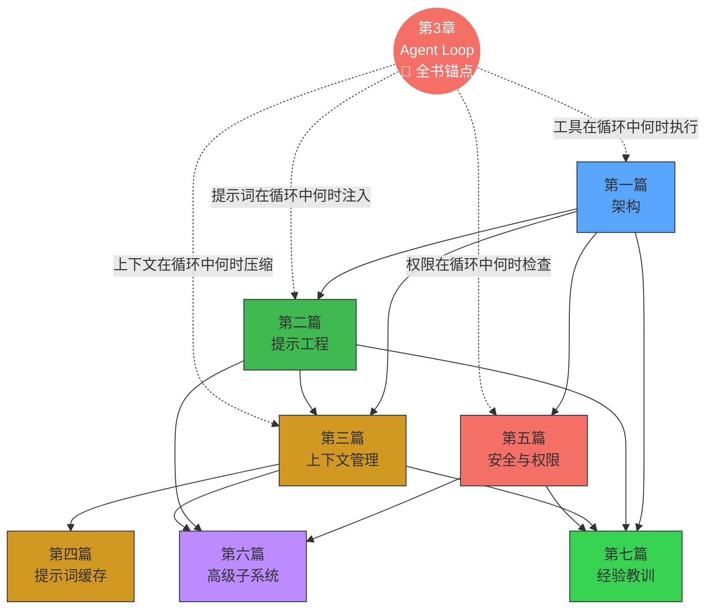

# 前言

  

  <a href="./en/">Read in English (Preview)</a>

《驾驭工程》，中文别名《马书》。

我认为，Claude Code 源码最佳的“食用”姿势应该是转化为一本书，供自己系统学习。对我来说，看书学习比直接看源码更舒服，也更容易形成完整的认知框架。

所以，我让 Claude Code 从泄露出来的 TypeScript 源码里提取出一本书。现在这本书已经开源，大家可以在线阅读：

- 仓库地址：<https://github.com/ZhangHanDong/harness-engineering-from-cc-to-ai-coding>
- 在线阅读：<https://zhanghandong.github.io/harness-engineering-from-cc-to-ai-coding/>

如果你想一边读书、一边更直观地理解 Claude Code 的内部机制，那么配合这个可视化网站一起看会更佳：

- 可视化机制站点：<https://ccunpacked.dev>

为了尽可能保证 AI 写作质量，这本书的提取过程并不是“把源码丢给模型直接生成”那么简单，而是按一条比较严格的工程流程推进的：

1. 先根据源码把 `DESIGN.md` 聊清楚，也就是先把整本书的大纲和设计定下来。
2. 然后为每一章编写 spec，基于我开源的 `agent-spec` 来约束章节目标、边界和验收标准。
3. 接着再做 plan，把具体执行步骤拆开。
4. 最后再叠加我自己的技术写作 skill，才让 AI 开始正式写作。

这本书并不是为了出版，而是为了让我能更系统地学习 Claude Code。我对它的基本判断是：AI 肯定写不得十全十美，但只要把初始版本开源出来，大家就可以一边阅读、一边讨论、一边逐步完善它，把它共建成一本真正有价值的公版书。

不过，客观地说，现在这个初始版本其实已经写得还不错了。欢迎大家交流和贡献。这里不单独建交流群，相关讨论就放在 GitHub Discussions：

- Discussions：<https://github.com/ZhangHanDong/harness-engineering-from-cc-to-ai-coding/discussions>

---

## 阅读准备

### 前置知识

本书假设读者具备以下基础，不需要精通，能读懂即可：

- **TypeScript / JavaScript**：书中源码均为 TypeScript。你需要能读懂 `async/await`、接口定义、泛型等基本语法，但不需要会写。
- **CLI 开发概念**：进程、环境变量、stdin/stdout、子进程通信。如果你用过终端工具（git、npm、cargo），这些概念就已经熟悉了。
- **LLM API 基础**：了解 messages API（system/user/assistant 角色）、tool_use（函数调用）、streaming（流式响应）。如果你调用过任何 LLM API，就够了。

不需要：React / Ink 经验、Bun 运行时知识、Claude Code 的使用经验。

### 推荐阅读路径

全书 30 章按 7 篇组织，但你不必从头读到尾。以下三条路径适合不同目标的读者：

**路径 A：Agent 构建者**（如果你想构建自己的 AI Agent）

> 第1章（技术栈）→ 第3章（Agent Loop）→ 第5章（系统提示词）→ 第9章（自动压缩）→ 第20章（Agent 派生）→ 第25-27章（模式提炼）→ 第30章（实战）

这条路径覆盖从架构到循环到提示词到上下文管理到多 Agent，最后在第 30 章用 Rust 实现一个完整的代码审查 Agent。

**路径 B：安全工程师**（如果你关注 AI Agent 的安全边界）

> 第16章（权限系统）→ 第17章（YOLO 分类器）→ 第18章（Hooks）→ 第19章（CLAUDE.md）→ 第4章（工具编排）→ 第25章（失败关闭原则）

这条路径聚焦纵深防御——从权限模型到自动分类到用户拦截点，理解 Claude Code 如何在自主性和安全性之间取得平衡。

**路径 C：性能优化**（如果你关注 LLM 应用的成本和延迟）

> 第9章（自动压缩）→ 第11章（微压缩）→ 第12章（Token 预算）→ 第13章（缓存架构）→ 第14章（缓存中断检测）→ 第15章（缓存优化）→ 第21章（Effort/Thinking）

这条路径从上下文管理到提示词缓存到推理控制，理解 Claude Code 如何将 API 成本降低 90%。

> **关于章节编号**：部分章节带有字母后缀（如 ch06b、ch20b、ch20c、ch22b），这些是对主章节的深化扩展。例如 ch20b（Teams）和 ch20c（Ultraplan）是 ch20（Agent 派生）的专题深入。

### 全书知识地图

第 3 章（Agent Loop）是全书的锚点——它定义了用户输入到模型响应的完整循环，其他篇章各自分析循环中某个阶段的深层机制。

### 阅读标记说明

本书使用以下标记惯例：

- **源码引用**：格式为 `restored-src/src/路径/文件.ts:行号`，指向 Claude Code v2.1.88 的还原源码。
- **证据分级**：
  - "v2.1.88 源码证据"——有完整源码和行号引用，最高可信度
  - "v2.1.91/v2.1.92 bundle 逆向"——基于 bundle 字符串信号推断，v2.1.89 起 Anthropic 移除了 source map
  - "推断"——仅从事件名或变量名推测，无直接源码证据
- **Mermaid 图表**：书中的流程图、架构图使用 Mermaid 语法渲染，在线阅读时可直接显示。
- **交互式可视化**：部分章节提供 D3.js 交互动画链接（标记为"点击查看"），需要在浏览器中打开。每个动画旁边也保留了静态 Mermaid 图作为替代。
